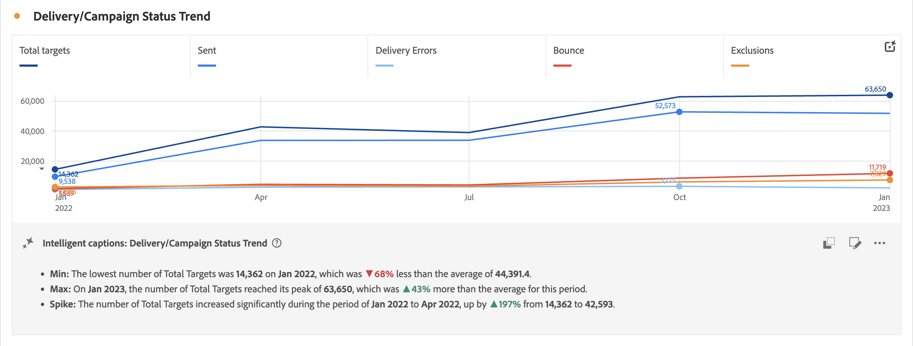

# Intelligente bijschriften {#intelligent-captions}

<!-- markdownlint-disable MD034 -->

>[!CONTEXTUALHELP]
>id="workspace_intelligentcaptions_area"
>title="Intelligente bijschriften: gebied"
>abstract="Inzichten in de vorm van natuurlijke talen genereren om u te helpen gegevens voor deze visualisatie eenvoudiger te begrijpen en te interpreteren."

<!-- markdownlint-enable MD034 -->

<!-- markdownlint-disable MD034 -->

>[!CONTEXTUALHELP]
>id="workspace_intelligentcaptions_bar"
>title="Intelligente bijschriften: balk"
>abstract="Inzichten in de vorm van natuurlijke talen genereren om u te helpen gegevens voor deze visualisatie eenvoudiger te begrijpen en te interpreteren."

<!-- markdownlint-enable MD034 -->

<!-- markdownlint-disable MD034 -->

>[!CONTEXTUALHELP]
>id="workspace_intelligentcaptions_donut"
>title="Intelligente bijschriften: Donut"
>abstract="Inzichten in de vorm van natuurlijke talen genereren om u te helpen gegevens voor deze visualisatie eenvoudiger te begrijpen en te interpreteren."

<!-- markdownlint-enable MD034 -->

<!-- markdownlint-disable MD034 -->

>[!CONTEXTUALHELP]
>id="workspace_intelligentcaptions_horizontalbar"
>title="Intelligente bijschriften: horizontale balk"
>abstract="Inzichten in de vorm van natuurlijke talen genereren om u te helpen gegevens voor deze visualisatie eenvoudiger te begrijpen en te interpreteren."

<!-- markdownlint-enable MD034 -->

<!-- markdownlint-disable MD034 -->

>[!CONTEXTUALHELP]
>id="workspace_intelligentcaptions_line"
>title="Intelligente bijschriften: Lijn"
>abstract="Inzichten in de vorm van natuurlijke talen genereren om u te helpen gegevens voor deze visualisatie eenvoudiger te begrijpen en te interpreteren."

<!-- markdownlint-enable MD034 -->

<!-- markdownlint-disable MD034 -->

>[!CONTEXTUALHELP]
>id="workspace_intelligentcaptions_fallout"
>title="Intelligente bijschriften: Uitvallen"
>abstract="Inzichten in de vorm van natuurlijke talen genereren om u te helpen gegevens voor deze visualisatie eenvoudiger te begrijpen en te interpreteren."

<!-- markdownlint-enable MD034 -->

<!-- markdownlint-disable MD034 -->

>[!CONTEXTUALHELP]
>id="workspace_intelligentcaptions_flow"
>title="Intelligente bijschriften: Stroom"
>abstract="Inzichten in de vorm van natuurlijke talen genereren om u te helpen gegevens voor deze visualisatie eenvoudiger te begrijpen en te interpreteren."

<!-- markdownlint-enable MD034 -->

Intelligente bijschriften maken gebruik van geavanceerde Machine Learning en Generative AI om waardevolle natuurlijke taalinzichten te bieden voor Workspace-visualisaties. De aanvankelijke versie verstrekt auto-geproduceerde inzichten voor de [ visualisatie van de Lijn ](line.md). Er volgen nog andere visualisaties.

Intelligente bijschriften zijn gericht op:

* Analysten, die verhalen nodig hebben om met andere gebruikers te delen. De analisten hebben deze inzichten nodig om context aan hun gebruikers te kunnen verstrekken.
* Zakelijke gebruikers, die snel op hoog niveau willen ontdekken.

## Intelligente bijschriften starten {#launch}

Om auto-geproduceerde titels voor een lijnvisualisatie te lanceren, selecteer  **[!UICONTROL Intelligent captions]** bij het hoogste recht van de visualisatie.

Inzichten in natuurlijke talen worden nu gegenereerd.

Houd er rekening mee dat:

* U hebt minimaal drie gegevenspunten nodig om bijschriften te kunnen genereren. Anders krijgt u mogelijk een fout zoals **[!UICONTROL Not enough data to analyze]** .

* Bijschriften worden telkens gegenereerd wanneer de onderliggende geselecteerde gegevens veranderen in de tabel die de visualisatie beïnvloedt.

* Als de tabel meerdere metriek bevat, worden alleen bijschriften gegenereerd voor de eerste metrische waarde of voor de metrische waarde die momenteel door de gebruiker is geselecteerd.

* Als u het project op een specifiek punt opslaat en het later opnieuw laadt, worden de bijschriften automatisch bijgewerkt met nieuwe gegevens. Hetzelfde geldt voor geplande projecten en PDF-bestanden die uit een project worden geëxporteerd.

Hier is een voorbeeld van hoe intelligente bijschriften eruit zouden kunnen zien:

## Handelingen

U kunt de volgende handelingen uitvoeren op intelligente bijschriften:

### Kopiëren naar klembord {#copy}

U kunt de bijschriften naar een klembord kopiëren en ze in een PowerPoint of andere gereedschappen plakken. Selecteer  bij het hoogste recht van de dialoog van titels.

### Weergave bewerken {#edit}

U kunt de weergave van bijschriften bewerken, zoals een bepaalde categorie inzichten verbergen of verbergen.

1. Selecteer  in de Intelligente dialoog van titels.

1. Wissel tussen  om een specifiek inzicht (als **[!UICONTROL Min]**) te tonen, of  om een specifiek inzicht (als **[!UICONTROL Spike]**) te verbergen.

    uit

1. Selecteer **[!UICONTROL Apply]** .

### Feedback geven

U kunt feedback geven over de gegenereerde intelligente bijschriften.

1. Selecteer  in de Intelligente dialoog van titels.

1. Selecteer  **[!UICONTROL Good response]**,  **[!UICONTROL Bad response]**, of  **[!UICONTROL Report]**.

1. Geef in het dialoogvenster **[!UICONTROL Thank you for your feedback]** uw feedback op en selecteer **[!UICONTROL Submit]** om de feedback te verzenden.

### Exporteren {#export}

U kunt intelligente titels als deel van een PDF uitvoeren, zolang het project met de intelligente geproduceerde titels wordt bewaard.

### Uitschakelen {#toggle}

Als u liever geen intelligente bijschriften wilt weergeven, schakelt u de functie uit.

1. Ga naar [ de voorkeur van Visualisaties ](/help/analysis-workspace/user-preferences.md#visualizations-preferences).
1. Schakel **[!UICONTROL Show intelligent captions]** uit.

   

1. Selecteer **[!UICONTROL Save]** om de voorkeur op te slaan.

## Intelligente bijschriften in mobiele scoreborden

De intelligente titels zijn ook beschikbaar in Customer Journey Analytics [ mobiele scorecards ](https://experienceleague.adobe.com/en/docs/analytics-platform/using/cja-dashboards/manage-scorecard#captions).

## Toegang tot functies

De volgende parameters regelen de toegang tot intelligente bijschriften:

* **toegang van de Oplossing**: De Intelligente eigenschap van titels is beschikbaar in Customer Journey Analytics, maar niet in Adobe Analytics.

* **Contractuele toegang**: Als u geen Intelligente titels kunt gebruiken, gelieve de beheerder van uw organisatie of de Vertegenwoordiger van de Rekening van de Adobe te contacteren. Voordat u Intelligente bijschriften kunt gebruiken in uw organisatie, moet u akkoord gaan met bepaalde juridische voorwaarden die betrekking hebben op GenAI.

* **Toestemmingen**: In [!UICONTROL Adobe Admin Console], bepaalt de [!UICONTROL Reporting Tools] **[!UICONTROL Intelligent Captions]** toestemming toegang. Admin van het a [ productprofiel ](https://helpx.adobe.com/enterprise/using/manage-product-profiles.html) moet deze stappen in [!UICONTROL Admin Console] volgen:
   1. Navigeer naar **[!UICONTROL Admin Console]** > **[!UICONTROL Products and services]** > **[!UICONTROL Customer Journey Analytics]** > **[!UICONTROL Product Profiles]** .
   1. Selecteer de titel van het productprofiel waarvoor u toegang tot de Intelligente bijschriften wilt verlenen.
   1. Selecteer **[!UICONTROL Permissions]** in het specifieke productprofiel.
   1. Selecteer  om uit te geven **[!UICONTROL Reporting Tools]**.
   1. Selecteer  om **Intelligente Bijschriften** aan **[!UICONTROL Included permission items]** toe te voegen.

       toe

   1. Selecteer **[!UICONTROL Save]** om de machtigingen op te slaan.

Zie [ controle van de Toegang ](/help/technotes/access-control.md#access-control) voor meer informatie.
