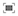

# De visualisatie van het canvas voor een reis configureren

{{release-limited-testing}}

Met de reiscanvasvisualisatie kunt u uitgebreide inzichten analyseren en verkrijgen over de reizen die u aan uw gebruikers en klanten biedt.

## Overzicht van het reiscanvas

Zie [ Overzicht van het canvas van de Reis ](/help/analysis-workspace/visualizations/journey-canvas/journey-canvas.md) om meer over het canvas van de Reis te leren, die omvatten:

* Belangrijkste kenmerken

* Potentiële inzichten

* Verschillen tussen het canvas van de Reis en Fallout

* Details over het analyseren van Journey Optimizer-reizen

* En meer

## Beginnen met het maken van een reis canvasvisualisatie

1. Voeg een leeg paneel aan uw project toe, selecteer het [!UICONTROL **pictogram Visualisaties**] in het linkerspoor, dan sleep het [!UICONTROL **canvas van de Reis**] visualisatie in het paneel.

   of

   Voeg een visualisatie van het canvas van de Reis op om het even welke die manieren toe in [ worden beschreven visualisaties aan een paneel ](/help/analysis-workspace/visualizations/freeform-analysis-visualizations.md#add-visualizations-to-a-panel) sectie in [ Overzicht van Visualisaties ](/help/analysis-workspace/visualizations/freeform-analysis-visualizations.md) toevoegen.

1. Geef de volgende basisinformatie op:

   | Veld | Functie |
   |---------|----------|
   | [!UICONTROL **Primaire metrisch**] | De primaire metrische waarde beïnvloedt de volgende aspecten van de visualisatie van het canvas van de Reis:  <ul><li>Definieert hoe mensen door de reis bewegen.</li><li>Het totale aantal dat op elke knoop wordt getoond.
Bijvoorbeeld, als Mensen primaire metrisch is, toont elke knoop het aantal mensen die die knoop in de reis bereikten.
</li><li>Het percentage dat op elk knooppunt wordt weergegeven. (Nadat de visualisatie is opgebouwd, kunt u kiezen of het percentage van het totaal of van het beginknooppunt wordt weergegeven.)</li>
Bijvoorbeeld, als Mensen primaire metrisch is, toont elke knoop het percentage mensen die die knoop in de reis (of het percentage van het totaal of van de beginnende knoop) bereikten.
</li><li>Wanneer een afmeting aan visualisatie wordt toegevoegd, worden de hoogste 3 knopen van visualisatie toegevoegd, die op primaire metrisch wordt gebaseerd.</li></ul> |
   | [!UICONTROL **Secundaire metrische**] | Secundaire metrisch is facultatief. Wanneer één wordt geselecteerd, wordt de volgende informatie getoond op elke knoop onder primaire metrisch: <ul><li>Het totale getal
Bijvoorbeeld, als Sessies secundaire metrisch is, toont elke knoop het aantal zittingen die die knoop in de reis bereikten.
</li><li>Het percentage (nadat de visualisatie is opgebouwd, kunt u kiezen om het percentage van het totaal of van het beginknooppunt weer te geven.)</li>
Bijvoorbeeld, als Sessies secundaire metrisch is, toont elke knoop het percentage zittingen die die knoop in de reis (of het percentage van het totaal of van de beginnende knoop) bereikten.
</li></ul> |
   | [!UICONTROL **reis van Journey Optimizer**]<!-- name? --> | Selecteer de reis van Journey Optimizer die u als basis voor uw analyse in het canvas van de Reis wilt gebruiken. (U kunt deze optie ook leeg laten als u een leeg canvas wilt maken waaruit u de analyse in Analysis Workspace wilt opbouwen.)
 
Wanneer u een Journey Optimizer-reis analyseert op het canvas Journey, wordt de reis weergegeven met dezelfde volgorde, volgorde en structuur als in Journey Optimizer. Voor meer informatie, zie [ reizen van Journey Optimizer ](/help/analysis-workspace/visualizations/journey-canvas/journey-canvas.md#analyze-journey-optimizer-journeys) in [ overzicht van het canvas van de Reis ](/help/analysis-workspace/visualizations/journey-canvas/journey-canvas.md) analyseren.

**Nota**: Deze optie toont slechts wanneer het gegeven van Journey Optimizer in de zelfde gegevensmening wordt ontdekt die in het paneel van Analysis Workspace wordt geselecteerd waar u de visualisatie toevoegt. Voor informatie over het veranderen van de gegevensmening over een paneel in Analysis Workspace, zie [ overzicht van Analysis Workspace ](/help/analysis-workspace/home.md).
 |

1. (Facultatief) selecteer [!UICONTROL **tonen geavanceerde montages**], dan specificeer de volgende informatie:

   | Veld | Functie |
   |---------|----------|
   | [!UICONTROL **de container van het canvas van de Reis**] | Kies de container waarop u zich gedurende de hele reis wilt concentreren. De container die u kiest bepaalt de statistieken die in de visualisatie worden getoond. (Als uw containernamen afwijken van de onderstaande standaardnamen, zijn deze aangepast in de gegevensweergave.)<ul><li>**Sessies:** Beperkt de statistieken van visualisatie om binnen één enkele bepaalde zitting voor een bepaalde persoon te vallen. Dit betekent dat de aantallen en de percentages die op elke knoop verschijnen (die op de primaire en secundaire metriek gebaseerd zijn) binnen één enkele zitting voor elke persoon moeten voorkomen.</li><li>**Mensen:** staat de statistieken van visualisatie toe om veelvoudige zittingen voor een bepaalde persoon te overspannen. Dit betekent dat de aantallen en de percentages die op elke knoop verschijnen (die op de primaire en secundaire metriek gebaseerd zijn) over om het even welk aantal zittingen kunnen voorkomen, zolang de zittingen aan de zelfde persoon behoren. Dit is de standaardinstelling.</li></ul> |

1. Selecteer [!UICONTROL **Bouwstijl**].

   Als u Journey Optimizer hebt en u een Journey Optimizer-reis hebt geselecteerd, wordt de reis weergegeven met dezelfde volgorde, volgorde en structuur als in Journey Optimizer.

   <!-- add screen shot -->

   Als u geen Journey Optimizer hebt of als u geen Journey Optimizer-reis hebt geselecteerd, wordt een leeg canvas weergegeven waar u kunt beginnen met het vullen van de reis.

   <!-- add screen shot -->

1. Of u een nieuwe analyse van een leeg canvas creeert of u een reis van Journey Optimizer analyseert, kunt u de reis vormen zoals die in [ wordt beschreven vormt visualiseringsmontages ](#configure-visualization-settings).

## Visualisatie-instellingen configureren

Er zijn verschillende configuratieopties beschikbaar in de koptekst van het canvas Journey.

Instellingen configureren voor de visualisatie van het canvas Reis:

1. In Analysis Workspace, open een bestaande visualisatie van het canvas van de Reis, of [ beginnen bouwend nieuwe ](#begin-building-a-journey-canvas-visualization).

   De opties die u toestaan om de het canvasvisualisatie van de Reis te vormen zijn beschikbaar in de kopbal:

   

1. Vorm om het even welke volgende montages die over de bovenkant van visualisatie worden getoond:

   | Instelling | Functie |
   |---------|----------|
   | [!UICONTROL **Type van Knoop**] | Staat u toe om te vormen welke knooptypes in visualisatie worden getoond. Als u een knooppunttype wilt verbergen in de visualisatie, selecteert u de (x) naast het knooppunttype of heft u de selectie van dit type op in het keuzemenu. Als u een verborgen knooppunttype wilt weergeven, selecteert u dit in het keuzemenu. 
Afhankelijk van de inhoud van uw visualisatie, omvatten de mogelijke knooptypes:
<ul><li>[!UICONTROL **Gelezen segment**]</li><li>[!UICONTROL **Eind**]</li><li>[!UICONTROL **Dimension**]</li><li>[!UICONTROL **Metrisch**]</li></ul>
**Nota**: Overweeg het volgende wanneer het gebruiken van dit gebied:
<ul><li>Deze optie wordt alleen weergegeven wanneer Journey Optimizer-gegevens worden gedetecteerd in dezelfde gegevensweergave die is geselecteerd in het Analysis Workspace-deelvenster waar u de visualisatie toevoegt. Voor informatie over het veranderen van de gegevensmening over een paneel in Analysis Workspace, zie [ overzicht van Analysis Workspace ](/help/analysis-workspace/home.md).</li><li>Nadat u een Journey Optimizer-reis in het canvas Reis hebt aangepast, is deze optie niet meer beschikbaar. Voor meer informatie, zie [ Visuele verschillen na het wijzigen van een reis in het canvas van de Reis ](/help/analysis-workspace/visualizations/journey-canvas/journey-canvas.md#visual-differences-after-modifying-a-journey-in-journey-canvas)</li><li>Nodes worden niet verwijderd van de reis wanneer u ze verbergt. Voor informatie over hoe te om een knoop te schrappen, zie [ knopen van de Schrapping ](#delete-nodes).</li></ul>
 |
   | [!UICONTROL **Procentuele waarde**] | Kies een van de volgende opties: <ul><li>[!UICONTROL **Percentage van totaal**]: Het percentage van alle mensen inbegrepen in de gegevensmening binnen de de datumwaaier van het paneel.</li><li>[!UICONTROL **Percentage van beginknoop**]: Het percentage van alle mensen inbegrepen in de gegevensmening binnen de de datumwaaier van het paneel die ook aan de criteria van de beginnende knoop van de reis voldoen. (Deze optie is alleen beschikbaar voor reizen met één startknooppunt; deze optie is uitgeschakeld voor reizen met meerdere startknooppunten. Een beginknooppunt wordt gedefinieerd als elk knooppunt dat geen verbinding heeft die erin komt.)</li></ul> |
   | [!UICONTROL **montages van de Pijl**] | De pijlen tussen knooppunten op het canvas Journey kunnen aangepaste namen, Journey Optimizer-labels en Journey Optimizer-voorwaarden bevatten. Kies een van de volgende opties om te bepalen welke opties worden weergegeven:<ul><li>[!UICONTROL **niets**]: Geen douanenamen, de etiketten van Journey Optimizer, of de voorwaarden van Journey Optimizer worden getoond op pijlen in het canvas van de Reis. </li><li>[!UICONTROL **Voorwaarde**]: Om het even welke voorwaardelabels die in Journey Optimizer worden gevormd worden getoond op pijlen in het canvas van de Reis. Aangepaste namen of andere Journey Optimizer-labels worden niet weergegeven.</li><li>[!UICONTROL **Alle etiketten**]: Als een pijl een douanenaam, een etiket, of een voorwaarde bevat, wordt het getoond op de pijl in het canvas van de Reis. Per pijl wordt slechts één naam, label of voorwaarde weergegeven, in de volgende volgorde van voorkeur: <ol><li>Een douanenaam die van het canvas van de Reis wordt toegevoegd (zoals die in [ wordt beschreven noemt een knoop of pijl ](#rename-a-node-or-arrow))</li><li>Een Journey Optimizer-label</li><li>Een Journey Optimizer-voorwaarde</li></ol></li></ul>
**Nota**: Deze optie toont slechts wanneer het gegeven van Journey Optimizer in de zelfde gegevensmening wordt ontdekt die in het paneel van Analysis Workspace wordt geselecteerd waar u de visualisatie toevoegt. Voor informatie over het veranderen van de gegevensmening over een paneel in Analysis Workspace, zie [ overzicht van Analysis Workspace ](/help/analysis-workspace/home.md).
 |
   | [!UICONTROL **toon reserve**] | Geef de opvalgegevens voor elk knooppunt weer. Dit toont het aantal en het percentage mensen die de reis na een bepaald knooppunt hebben verlaten. 
Mensen die uit de reis vielen, hadden misschien andere acties op de locatie uitgevoerd, maar ze voldeden nooit aan de criteria die door het volgende knooppunt in de reis worden gedefinieerd.
 |
   | **controles van het Gezoem** | De volgende zoomknoppen zijn beschikbaar in de rechterbovenhoek van het canvas:<ul><li>**Gezoem binnen** : Vergroot specifieke gebieden van visualisatie.
U kunt ook muisbesturingselementen gebruiken, zoals vastzetten op een trackpad.
</li><li>**Gezoem uit** : Verkleint visualisatie om meer ruimte op het canvas toe te staan.
U kunt ook muisbesturingselementen gebruiken, zoals vastzetten op een trackpad.
</li><li>**het scherm van de Passendheid** : Past huidige gezoem en pan montages aan om het scherm met volledige visualisatie te vullen.</li></ul>
Als u wilt pannen over het canvas nadat u hebt in- of uitgezoomd, klikt u met de muis en sleept u naar de gewenste locatie.
 |

1. Ga met [ verder voeg knopen ](#add-nodes) toe.

## Knooppunten toevoegen

De knopen in een het canvasvisualisatie van de Reis vertegenwoordigen de gebeurtenissen of de acties van een gebruikersreis.

U maakt knooppunten door Workspace-componenten van de linkerrails naar het canvas te slepen, door Reader toe te staan de bovenste volgende of vorige knooppunten te kiezen op basis van bestaande knooppunten of door bestaande knooppunten te dupliceren.

### Componenten slepen vanaf de linkerspoorstaaf

1. In Analysis Workspace, open een bestaande visualisatie van het canvas van de Reis, of [ beginnen bouwend nieuwe ](#begin-building-a-journey-canvas-visualization).

1. Sleep metriek, dimensies, afmetingsitems, filters of datumbereiken van de linkerspoorstaaf naar het canvas. De metriek die op a [ afgeleid gebied ](/help/data-views/derived-fields/derived-fields.md) gebaseerd zijn wordt gesteund. Nochtans, worden de berekende metriek, evenals om het even welke metriek of dimensies die op a [ summiere dataset ](/help/data-views/summary-data.md) gebaseerd zijn niet gesteund.

   U kunt meerdere componenten in de linkertrack selecteren door Shift ingedrukt te houden of door Command (in Mac) of Ctrl (in Windows) ingedrukt te houden.

   De visualisatie wordt als volgt bijgewerkt, afhankelijk van het componenttype en het gebied van het canvas waar u het plaatst:

   | Componenttype | Plaatsing van onderdeel | Visualisatie-updates nadat het knooppunt is toegevoegd |
   |---------|----------|----------|
   | Metrisch | Leeg gebied van canvas | De knoop toont waar de component werd gelaten vallen, los van om het even welke bestaande knopen. |
   | Metrisch | Een bestaand knooppunt | De component wordt automatisch gecombineerd met het bestaande knooppunt. (Zie [ knopen ](#combine-nodes) voor meer informatie combineren.)
 |
   | Metrisch | Een pijl tussen 2 bestaande knooppunten | De knoop toont tussen de twee bestaande knopen waar de component werd gelaten vallen en met beide bestaande knopen verbonden. (Zie [ verbind knopen ](#connect-nodes) voor meer informatie.)
 |
   | Dimension | Leeg gebied van canvas | Er worden 3 knooppunten gemaakt voor de bovenste 3 dimensieitems waar de component is neergezet, zonder verbinding met bestaande knooppunten. (**Nota:** als slechts 1 of 2 knopen tonen, betekent het dat het gegeven voor slechts 1 of 2 van de afmetingspunten beschikbaar is. Als er geen knooppunten worden weergegeven, betekent dit dat er geen gegevens beschikbaar zijn voor de dimensie-items. In dit geval, probeer toevoegend het aan een verschillend punt van de reis, pas de de datumwaaier van de visualisatie aan, of kies een verschillende afmeting.)
Houd Shift ingedrukt wanneer u de dimensie op het canvas neerzet om deze toe te voegen als één knooppunt met 3 dimensie-items.

 |
   | Dimension | Een bestaand knooppunt | Een mislukking wordt automatisch toegepast op de knoop met top 5 getoonde afmetingspunten.<!--what happens if you hold Shift?-->
Om de mislukking in een nieuwe vrije lijstvisualisatie te bekijken, selecteer [!UICONTROL **Open in een vrije vormlijst**] verbinding op de knoop.
 |
   | Dimension | Een pijl die 2 bestaande knopen verbindt | Er worden 3 knooppunten gemaakt voor de bovenste 3 dimensiepunten die de eerste gebeurtenis na het eerste knooppunt volgen (van personen/sessies die uiteindelijk het tweede knooppunt bereiken). De knopen tonen tussen de twee bestaande knopen waar de component werd gelaten vallen en elke knoop wordt verbonden met beide bestaande knopen. (**Nota:** als slechts 1 of 2 knopen tonen, betekent het dat het gegeven voor slechts 1 of 2 van de afmetingspunten beschikbaar is. Als er geen knooppunten worden weergegeven, betekent dit dat er geen gegevens beschikbaar zijn voor de dimensie-items. In dit geval, probeer toevoegend het aan een verschillend punt van de reis, pas de de datumwaaier van de visualisatie aan, of kies een verschillende afmeting.)
Houd Shift ingedrukt wanneer u de dimensie op het canvas neerzet om deze toe te voegen als één knooppunt met 3 dimensie-items. (Zie [ verbind knopen ](#connect-nodes) voor meer informatie.)
 |
   | Dimension-item | Leeg gebied van canvas | De knoop toont waar de component werd gelaten vallen, los van om het even welke bestaande knopen. |
   | Dimension-item | Een bestaand knooppunt | De component wordt automatisch gecombineerd met het bestaande knooppunt. |
   | Dimension-item | Een pijl die 2 bestaande knopen verbindt | De knoop toont tussen de twee bestaande knopen waar de component werd gelaten vallen en met beide bestaande knopen verbonden. (Zie [ verbind knopen ](#connect-nodes) voor meer informatie.)
 |
   | Filter | Leeg gebied van canvas | Het knooppunt geeft aan waar de component is neergezet zonder verbinding met andere knooppunten.
Het aantal en het percentage dat op de knoop verschijnen omvatten het totaal van primaire metrisch, gefilterd door de filter u selecteerde.
 
Als Personen bijvoorbeeld is geselecteerd als de primaire metrische waarde voor de rit, worden bij het toevoegen van een filter Vandaag aan een leeg gebied van het canvas alle personen weergegeven die vandaag een gebeurtenis hebben gehad.
 |
   | Filter | Een bestaand knooppunt | Past het filter op de bestaande knoop toe. |
   | Filter | Een pijl die 2 knooppunten verbindt | De knoop toont tussen de twee bestaande knopen waar de component werd gelaten vallen en met beide bestaande knopen verbonden. (Zie [ verbind knopen ](#connect-nodes) voor meer informatie.)

Hiermee past u het filter toe op het punt op het pad waar de component is neergezet.
 |
   | Datumbereik | Leeg gebied van canvas | De knoop toont waar de component werd gelaten vallen, losgemaakt van een andere knopen.
Het aantal en het percentage dat op de knoop verschijnen omvatten het totaal van primaire metrisch, gefilterd door de datumwaaier u selecteerde.
 
Als Personen bijvoorbeeld is geselecteerd als de primaire metrische waarde voor de rit, worden bij het toevoegen van een datumbereik van Deze maand aan een leeg gebied van het canvas alle personen weergegeven die een gebeurtenis hebben gehad tijdens de huidige maand.
 |
   | Datumbereik | Een bestaand knooppunt | Past het datumbereik toe op het bestaande knooppunt. |
   | Datumbereik | Een pijl die 2 knooppunten verbindt | De knoop toont tussen de twee bestaande knopen waar de component werd gelaten vallen en met beide bestaande knopen verbonden. (Zie [ verbind knopen ](#connect-nodes) voor meer informatie.)

Past het datumbereik toe op het punt op het pad waar de component is neergezet.
 |
   | Meerdere componenten | Een leeg gebied van het canvas | **als geen van de componenten afmetingen zijn:**
Elke component wordt weergegeven als een afzonderlijk knooppunt waar de componenten zijn neergezet, zonder verbinding met bestaande knooppunten.

Houd de Shift-toets ingedrukt wanneer u de componenten op het canvas neerzet om ze als één gecombineerd knooppunt toe te voegen. 

**als om het even welke componenten u toevoegt dimensies zijn:**

Elke component wordt weergegeven als een afzonderlijk knooppunt waar de componenten zijn neergezet, zonder verbinding met bestaande knooppunten.

Er kan slechts één dimensie tegelijk worden toegevoegd. Wanneer de afmeting wordt toegevoegd, worden 3 knopen gecreeerd voor top 3 afmetingspunten waar de component werd gelaten vallen.

Houd de Shift-toets ingedrukt wanneer u de componenten op het canvas neerzet om ze als één gecombineerd knooppunt toe te voegen. De top 3 afmetingspunten worden gecombineerd met elke knoop. (Zie [ knopen ](#combine-nodes) voor meer informatie combineren.)
 |
   | Meerdere componenten | Een bestaand knooppunt | Alle componenten worden gecombineerd met het bestaande knooppunt.
Als om het even welke componenten u toevoegt afmetingen zijn, dan worden de top 3 afmetingspunten gecombineerd met de knoop.
 
Er kan slechts één dimensie tegelijk worden toegevoegd.
 |
   | Meerdere componenten | Een pijl die 2 bestaande knopen verbindt | **als geen van de componenten afmetingen zijn:**
Elke component wordt weergegeven als een afzonderlijk knooppunt waar de componenten zijn neergezet en elk knooppunt is verbonden met beide bestaande knooppunten. (Zie [ verbind knopen ](#connect-nodes) voor meer informatie.)

Houd de Shift-toets ingedrukt wanneer u de componenten op het canvas neerzet om ze als één gecombineerd knooppunt toe te voegen. (Componenten moeten van hetzelfde type zijn om te worden gecombineerd in één knooppunt.) (Zie [ knopen ](#combine-nodes) voor meer informatie combineren.)

**als om het even welke componenten u toevoegt dimensies zijn:**

Elke component wordt weergegeven als een afzonderlijk knooppunt waar de componenten zijn neergezet en elk knooppunt is verbonden met beide bestaande knooppunten.

Er kan slechts één dimensie tegelijk worden toegevoegd. Wanneer de dimensie wordt toegevoegd, worden 3 knopen gecreeerd voor top 3 punten van de dimensie die de eerste gebeurtenis na de eerste knoop volgen (van mensen/zittingen die uiteindelijk de tweede knoop bereiken). Elk knooppunt is verbonden met beide bestaande knooppunten. (Zie [ verbind knopen ](#connect-nodes) voor meer informatie.)

Houd de Shift-toets ingedrukt wanneer u de componenten op het canvas neerzet om ze als één gecombineerd knooppunt toe te voegen. De top 3 afmetingspunten worden gecombineerd met elke knoop, en elke knoop wordt verbonden met beide bestaande knopen. (Zie [ knopen ](#combine-nodes) voor meer informatie combineren.)
 |

   De knopen tonen als rechthoekig vakje met de volgende informatie:

   * Componentnaam

   * Het componenttype (zoals metrisch of afmeting)

   * Primaire metrische statistieken (totaal en percentage)

   * Secundaire statistieken (totaal en percentage)

1. Herhaal dit proces om door te gaan met het toevoegen van knooppunten om uw reis uit te bouwen.

1. Blijf de reis aanpassen zoals beschreven in de onderstaande secties. U kunt knooppunten verbinden, knooppunten hernoemen, storingen toepassen, publiek maken, tijdbeperkingen toevoegen en nog veel meer.

### Bovenste knooppunten weergeven op basis van bestaande knooppunten

>[!AVAILABILITY]
>
>Deze functie is nog niet beschikbaar.

U kunt de bovenste knooppunten automatisch weergeven op basis van de knooppunten die zich al op het canvas bevinden. U kunt de bovenste knooppunten toevoegen aan het canvas Journey of deze weergeven in een vrije-vormtabel.

Deze optie is beschikbaar voor de volgende objecten op het canvas:

* Afzonderlijke knooppunten

* De pijl tussen knooppunten

#### Bovenste knooppunten weergeven na een bestaand knooppunt

U kunt een knoop selecteren en de hoogste afmetingspunten tonen die na het in de reis komen. U kunt de top 3 afmetingspunten aan het canvas van de Reis als afzonderlijke knopen toevoegen, of u kunt alle hoogste afmetingspunten in een vrije vormlijst bekijken.

1. Klik de knoop met de rechtermuisknop aan waar u de hoogste afmetingspunten wilt tonen die na het in de reis komen.

   De knoop kan geen bestaande knopen hebben die uit het in de reis gaan.

1. Selecteer [!UICONTROL **tonen hoogste knopen na deze knoop**].

1. Selecteer waar u de dimensie-items wilt weergeven:

   * [!UICONTROL **in het canvas van de Reis**]: Voegt top 3 knopen aan het canvas toe die na deze knoop in de reis komen. Elk knooppunt wordt verbonden met het knooppunt dat u hebt geselecteerd als een afzonderlijke vertakking op het canvas.

   * [!UICONTROL **in een lijst Freeform**]: Creeert een vrije lijstvisualisatie die alle hoogste afmetingspunten toont die na deze knoop in de reis komen.

1. Selecteer de gewenste afmeting in de lijst met afmetingen.

   Afhankelijk van wat u in de vorige stap koos, worden top 3 afmetingspunten toegevoegd aan het canvas als 3 afzonderlijke knopen, of alle hoogste afmetingspunten worden getoond in een vrije vormlijst.

#### Bovenste knooppunten weergeven vóór een bestaand knooppunt

U kunt een knoop selecteren en de hoogste afmetingspunten tonen die vóór het in de reis komen. U kunt de top 3 afmetingspunten aan het canvas van de Reis als afzonderlijke knopen toevoegen, of u kunt alle hoogste afmetingspunten in een vrije vormlijst bekijken.

1. Klik de knoop met de rechtermuisknop aan waar u de hoogste afmetingspunten wilt tonen die vóór het in de reis komen.

   Deze knoop kan geen bestaande knopen hebben die in het in de reis komen.

1. Selecteer [!UICONTROL **tonen hoogste knopen vóór deze knoop**].

1. Selecteer waar u de dimensie-items wilt weergeven:

   * [!UICONTROL **in het canvas van de Reis**]: Voegt top 3 knopen aan het canvas toe die vóór deze knoop in de reis komen. Elk knooppunt wordt verbonden met het knooppunt dat u hebt geselecteerd als een afzonderlijke vertakking op het canvas.

   * [!UICONTROL **in een lijst Freeform**]: Creeert een vrije lijstvisualisatie die alle hoogste afmetingspunten toont die vóór deze knoop in de reis komen.

1. Selecteer de gewenste afmeting in de lijst met afmetingen.

   Afhankelijk van wat u in de vorige stap koos, worden top 3 afmetingspunten toegevoegd aan het canvas als 3 afzonderlijke knopen, of alle hoogste afmetingspunten worden getoond in een vrije vormlijst.

#### Bovenste knooppunten tussen bestaande knooppunten weergeven

U kunt een pijl selecteren en de bovenste dimensie-items tonen die tussen twee bestaande knooppunten in de reis komen. U kunt de top 3 afmetingspunten aan het canvas van de Reis als afzonderlijke knopen toevoegen, of u kunt alle hoogste afmetingspunten in een vrije vormlijst bekijken.

1. Klik met de rechtermuisknop op de pijl tussen de twee knooppunten waar u de bovenste dimensie-items wilt weergeven.

1. Selecteer [!UICONTROL **tonen hoogste knopen tussen deze knopen**].

1. Selecteer waar u de dimensie-items wilt weergeven:

   * [!UICONTROL **in het canvas van de Reis**]: Voegt top 3 knopen aan het canvas toe die tussen de 2 bestaande knopen komen. Elk knooppunt wordt verbonden met de omringende knooppunten als een afzonderlijke vertakking op het canvas.

   * [!UICONTROL **in een lijst Freeform**]: Creeert een vrije lijstvisualisatie die alle hoogste afmetingspunten toont die tussen de 2 bestaande knopen komen.

1. Selecteer de gewenste afmeting in de lijst met afmetingen.

   Afhankelijk van wat u in de vorige stap koos, worden top 3 afmetingspunten toegevoegd aan het canvas als 3 afzonderlijke knopen, of alle hoogste afmetingspunten worden getoond in een vrije vormlijst.

### Dubbele knooppunten

>[!AVAILABILITY]
>
>Deze functie is nog niet beschikbaar.

De optie om te dupliceren is beschikbaar voor de volgende objecten op het canvas:

* Meerdere knooppunten

Om knooppunten te dupliceren:

1. Selecteer meerdere knooppunten die u wilt dupliceren.

1. Klik met de rechtermuisknop op een van de geselecteerde knooppunten en selecteer vervolgens [!UICONTROL **Dupliceren**] .

## De reis ontwerpen

De volgorde van knooppunten en de verbindingen tussen knooppunten zijn van invloed op de gegevens van het canvas Journey. De reizen zouden de opeenvolging van gebeurtenissen visueel en nauwkeurig moeten weerspiegelen die u wilt melden.

Nadat knooppunten aan het canvas zijn toegevoegd, kunt u deze opnieuw rangschikken, combineren, verbinden en tijdbeperkingen toevoegen.

### Knoppen opnieuw rangschikken

De reizen in het canvas van de Reis bestaan uit een flexibele grafiek van knopen en pijlen die om het even welke combinatie gebeurtenissen, afmetingspunten, en filters vertegenwoordigen.

U kunt knooppunten naar het canvas slepen om de gebeurtenissen en omstandigheden van de rit opnieuw te rangschikken. U kunt meerdere knooppunten selecteren door Command (in Mac) of Ctrl (in Windows) ingedrukt te houden.

Terwijl u de volgorde van knooppunten in de rit wijzigt, worden de gegevens dienovereenkomstig bijgewerkt.

### Knooppunten combineren

Een gecombineerd knooppunt in het canvas Journey is een enkel punt in de gebruikersreis (knooppunt) dat 2 of meer componenten bevat die via logica bij elkaar zijn gevoegd.

#### Gecombineerde knooppunten maken

U kunt een van de volgende handelingen uitvoeren om een gecombineerde knooppunten te maken in het canvas Journey:

* Sleep vanaf de linkerrails één component naar een knooppunt op het canvas.

* Sleep vanuit de linkerrails meerdere componenten tegelijk naar een knooppunt op het canvas.

* Sleep vanuit de linkerrails meerdere componenten tegelijk naar een leeg gebied van het canvas terwijl u de Shift-toets ingedrukt houdt.

* Voor het canvas, selecteer de knopen die u wilt combineren, klik één van de geselecteerde knopen met de rechtermuisknop aan, dan selecteren **combineren**.<!--Is there a limit on how many you can combine? -->

#### Logica bij het combineren van knooppunten

De logica die op knopen wordt toegepast wanneer zij worden gecombineerd verschilt afhankelijk van welke componententypes u, als volgt combineert:

>[!TIP]
>
>U kunt de logica van een gecombineerde knoop bekijken door de knoop met de rechtermuisknop aan te klikken, dan selecterend [!UICONTROL **creeer filter van knoop**]. De logica wordt getoond in de [!UICONTROL **sectie van de Definitie**].

| Te combineren componenttypen | Gebruikte logica (operator) |
|---------|----------|
| Metrisch + metrisch | Samengevoegd met OR |
| DIMENSION + DIMENSION | Samengevoegd met OR |
| Filter + Filter | Deelnemen met AND |
| Dimension + Metrisch, Datumbereik of Filter | Deelnemen met AND |
| Datumbereik + Metrisch, Filter of Dimension | Deelnemen met AND |
| Filter + Metrisch, Datumbereik of Dimension | Deelnemen met AND |

### Verbindingsknooppunten

U kunt knooppunten verbinden die zich al op het canvas bevinden, of u kunt een knooppunt verbinden wanneer u het aan het canvas toevoegt.

#### Pijlen tussen knooppunten

De knopen worden verbonden door een pijl. Zowel de richting van de pijl als de breedte hebben betekenis:

* **Richting**: Wijst op de opeenvolging van gebeurtenissen van de reis

* **Breedte**: Wijst op percentagevolume van één knoop aan een andere

#### Logica wanneer knooppunten worden aangesloten

Wanneer u knopen in het canvas van de Reis verbindt, worden zij verbonden gebruikend de exploitant THEN. Dit is ook gekend als [ opeenvolgend filtreren ](/help/components/filters/seg-sequential-build.md).

Knooppunten worden verbonden als een &quot;uiteindelijk pad&quot;, wat betekent dat bezoekers worden geteld zolang ze uiteindelijk van de ene naar de andere node gaan, ongeacht gebeurtenissen die zich tussen de twee knooppunten voordoen.

U kunt de logica van verbonden knopen bekijken door de knoop met de rechtermuisknop aan te klikken, dan selecterend [!UICONTROL **creeer filter van knoop**]. De logica wordt getoond in de [!UICONTROL **sectie van de Definitie**].

#### Bestaande knooppunten verbinden

De reizen kunnen niet circulair zijn, die terug naar eerder verbonden knopen herhalen.

Om knopen in het canvas van de Reis te verbinden:

1. Houd de muisaanwijzer op het canvas boven het knooppunt dat als eerste voorkomt in de reisvolgorde dat u wilt verbinden met een ander knooppunt.

   Er worden 4 blauwe stippen weergegeven aan elke kant van het geselecteerde knooppunt.

1. Sleep een van de vier blauwe stippen naar een van de vier zijden van het knooppunt waarmee u verbinding wilt maken.

   Er verschijnt een pijl die de twee knooppunten verbindt. Zie [ Pijlen tussen knopen ](#arrows-between-nodes) voor meer informatie.

#### Verbind knopen wanneer het toevoegen van een knoop

Wanneer u een knooppunt aan het canvas toevoegt, kunt u het tussen twee verbonden knooppunten plaatsen. De knoop wordt toegevoegd aan de stroom van de reis tussen de 2 bestaande knopen.

Voor meer informatie, zie [ knopen ](#add-nodes) toevoegen.

### Tijdsbeperking toevoegen tussen knooppunten

>[!AVAILABILITY]
>
>Deze functie is nog niet beschikbaar.

U kunt een tijdbeperking instellen tussen knooppunten. Wanneer er een tijdbeperking is, worden mensen geacht uit de reis te zijn gevallen als ze de vastgestelde reis volgen maar langer duren dan de toegewezen tijdsperiode om tussen de knooppunten te bewegen.

De optie om een tijdbeperking toe te voegen is beschikbaar voor de volgende objecten op het canvas:

* De pijl tussen knooppunten

Een tijdbeperking toevoegen:

1. Klik de pijl tussen 2 knopen met de rechtermuisknop aan, dan selecteren [!UICONTROL **tijdbeperking**] toevoegen.

<!-- 

from Travis: You can set time to be within X amount of time or after X amount of time (those are the only two options I think, but we can check with Brandon). 
1. Choose from the following options: 

-->

## Knooppunten of pijlen beheren

### De kleur van een knooppunt of pijl wijzigen

>[!AVAILABILITY]
>
>Deze functie is nog niet beschikbaar.

U kunt een reis visueel aanpassen door de kleur van om het even welke knoop of pijl op het canvas te veranderen. U kunt bijvoorbeeld de kleuren aanpassen om een ongewenste of ongewenste gebeurtenis aan te geven.

De optie om de kleur te wijzigen is beschikbaar voor de volgende objecten op het canvas:

* Afzonderlijke knooppunten

* De pijl tussen knooppunten

De kleur van een knooppunt of pijl wijzigen:

1. Klik met de rechtermuisknop op het knooppunt of de pijl waarvan u de kleur wilt wijzigen.

1. Selecteer [!UICONTROL **kleur van de Verandering**]. <!--make sure "color" isn't capitalized. It is in the req doc-->

1. Selecteer de gewenste kleur.

   De volgende kleuren zijn beschikbaar: <!--look into this interaction and color list-->

### De naam van een knooppunt of pijl wijzigen

>[!AVAILABILITY]
>
>Deze functie is nog niet beschikbaar.

Wanneer u een component naar het canvas Journey sleept, wordt een knooppunt gemaakt met dezelfde naam als de componentnaam. U kunt de naam van het knooppunt wijzigen zodat deze beter overeenkomt met de stap van de rit die het knooppunt vertegenwoordigt.

De optie om de naam te wijzigen is beschikbaar voor de volgende objecten op het canvas:

* Afzonderlijke knooppunten

* De pijl tussen knooppunten

Een knooppunt hernoemen:

1. Klik met de rechtermuisknop op het knooppunt waarvan u de naam wilt wijzigen.

1. Selecteer [!UICONTROL **anders noemen**].

1. Geef een nieuwe naam op en druk op Enter.<!--is that right?-->

### Een uitsplitsing toepassen

De optie om een indeling toe te passen op uw gegevens is beschikbaar voor de volgende objecten op het canvas:

* Afzonderlijke knooppunten

* Meerdere knooppunten

* De pijl tussen knooppunten

* Meerdere pijlen tussen knooppunten

Houd rekening met het volgende wanneer u een indeling toepast:

* Uitsplitsingen worden toegepast op de primaire metrische waarde. De secundaire metrische waarde wordt niet beïnvloed.

* Het toepassen van een uitsplitsing verandert de reis niet. In plaats daarvan toont het gewoon een uitsplitsing van de gegevens voor het knooppunt waar het wordt toegepast.

* Als een knooppunt al een uitsplitsing heeft, wordt de bestaande uitsplitsing vervangen door een nieuwe uitsplitsing.

* De uitsplitsingsgegevens worden bijgewerkt als wijzigingen op een eerder tijdstip in de reis worden aangebracht.

#### Een uitsplitsing toepassen op een of meer knooppunten of pijlen

>[!AVAILABILITY]
>
>Deze functie is nog niet beschikbaar.

1. Selecteer een of meer knooppunten waarop u een splitsing wilt toepassen en klik vervolgens met de rechtermuisknop op een van de geselecteerde knooppunten.

   of

   Selecteer een of meer pijlen tussen twee knooppunten waarop u de splitsing wilt toepassen en klik vervolgens met de rechtermuisknop op een van de geselecteerde pijlen.

1. Selecteer [!UICONTROL **Uitsplitsing**].

<!-- 1. Choose where you want to view the breakdown:

        * [!UICONTROL **In Journey canvas**]

        * [!UICONTROL **In a freeform table**]

-->

#### Een uitsplitsing toepassen op een afzonderlijk knooppunt

U kunt een afmeting van de linkerspoorstaaf naar de knoop op het canvas slepen waar u de breuk wilt toepassen.

Voor meer informatie, zie [ knopen ](#add-nodes) toevoegen.

### Een publiek maken

De optie om een publiek te maken is beschikbaar voor de volgende objecten op het canvas:

* Afzonderlijke knooppunten

* Meerdere knooppunten

* De pijl tussen knooppunten

* Meerdere pijlen tussen knooppunten

Wanneer u een publiek van veelvoudige knopen of pijlen creeert, worden zij aangesloten bij de exploitant OR.

Een publiek maken:

1. Selecteer een of meer knooppunten waar u een publiek wilt maken en klik vervolgens met de rechtermuisknop op een van de geselecteerde knooppunten.

   of

   Selecteer een of meer pijlen tussen twee knooppunten waar u een publiek wilt maken en klik vervolgens met de rechtermuisknop op een van de geselecteerde pijlen.

1. Selecteer [!UICONTROL **tot publiek**] leiden.

<!-- 1. Choose where you want to create the audience:

        * [!UICONTROL **In Journey canvas**]

        * [!UICONTROL **In a freeform table**]

-->

1. Ga verder creërend en het publiceren van het publiek zoals die in [ wordt beschreven creëren en publiceer publiek ](/help/components/audiences/publish.md).

### Tendelgegevens weergeven

>[!AVAILABILITY]
>
>Deze functie is nog niet beschikbaar.

U kunt de trendgegevens weergeven in een lijngrafiek voor objecten op het canvas Reis. <!--, with some prebuilt anomaly detection data (this is the definition in Fallout) -->

De optie voor trendmatige ontwikkeling is beschikbaar voor de volgende objecten op het canvas:

* Afzonderlijke knooppunten

* Meerdere knooppunten

* De pijlen tussen knooppunten

* Meerdere pijlen tussen knooppunten

De trendgegevens bekijken:

1. Selecteer één of meerdere knopen waarvoor u trendgegevens wilt bekijken, dan klik één van de geselecteerde knopen met de rechtermuisknop aan.

   of

   Selecteer een of meer pijlen tussen twee knooppunten waarvoor u trendgegevens wilt weergeven en klik vervolgens met de rechtermuisknop op een van de geselecteerde pijlen.

1. Selecteer [!UICONTROL **Trend**].

### Een filter maken op basis van een knooppunt of pijl

U kunt een nieuw filter creëren dat op een knoop of een pijl binnen een reis wordt gebaseerd. Nadat het filter is gemaakt, kunt u het overal in Analysis Workspace gebruiken.

De filters die van het canvas van de Reis worden gecreeerd gebruiken [ opeenvolgend het filtreren ](/help/components/filters/seg-sequential-build.md). Dit betekent dat het filter de operator THEN gebruikt om de volgorde van gebeurtenissen (de reis) die door mensen zijn verlopen, te koppelen en naar het geselecteerde knooppunt of de geselecteerde pijl te leiden. Alle gebeurtenissen die overeenkomen met het geselecteerde knooppunt of de geselecteerde pijl worden opgenomen in het filter.

Als u een filter maakt op basis van een knooppunt met daarin meerdere paden, worden alle paden opgenomen in het filter. Afzonderlijke paden worden verbonden met de operator OR.

Een filter maken:

1. Klik op het canvas met de rechtermuisknop op het knooppunt of de pijl die u wilt gebruiken om het filter te maken.

1. Selecteer [!UICONTROL **creeer filter van knoop**] of [!UICONTROL **creeer filter van pijl**].

   De construcder voor filters wordt weergegeven. In de [!UICONTROL **sectie van de Definitie**], wordt de filterdefinitie gecreeerd gebaseerd op de knoop of de pijl u en zijn context binnen de reis selecteerde.

1. Geef een titel op voor het filter en breng eventuele andere wijzigingen aan. Voor meer informatie over het creëren van een filter, zie [ de bouwer van de Filter ](/help/components/filters/filter-builder.md).

1. Selecteer [!UICONTROL **sparen**] om de filter te bewaren.

### Knooppunten verwijderen

U kunt een of meer knooppunten tegelijk binnen een reis verwijderen. Wanneer u een knoop schrapt die tussen 2 knopen binnen de reis wordt verbonden, worden de 2 resterende knopen direct verbonden.

Om knopen in het canvas van de Reis te schrappen:

1. Selecteer een of meer knooppunten die u wilt verwijderen en klik met de rechtermuisknop op een van de geselecteerde knooppunten.

1. Selecteer [!UICONTROL **Schrapping**].

### Pijlen tussen knooppunten verwijderen

U kunt een of meer pijlen tegelijk binnen een rit verwijderen. Wanneer u een pijl tussen twee knooppunten verwijdert, hebben de knooppunten geen verbinding meer. Als de pijl deel uitmaakte van een langer pad, wordt de verbinding met het pad verbroken.

Als u pijlen wilt verwijderen tussen knooppunten in het canvas Reis:

1. Selecteer een of meer pijlen tussen twee knooppunten die u wilt verwijderen en klik met de rechtermuisknop op een van de geselecteerde pijlen.

1. Selecteer [!UICONTROL **Schrapping**].

<!-- Delete this after I decide I don't want to do it this way. Will probably use sections like I hav above.

### Manage existing nodes

1. In Analysis Workspace, open an existing Journey canvas visualization, or [begin building a new one](#begin-building-a-journey-canvas-visualization).

1. Right-click an **individual node** on the canvas, then select any of the following options:
   
   | Option | Function | 
   |---------|----------|
   | [!UICONTROL **Create segment**] | B1 |
   | [!UICONTROL **Publish audience**] | B2 |
   | [!UICONTROL **Trend**] | B3 | 
   | [!UICONTROL **Breakdown**] | B2 |
   | [!UICONTROL **Get top next ...**] | B2 |
   | [!UICONTROL **Change color**] | B2 |
   | [!UICONTROL **Rename**] | B2 |
   | [!UICONTROL **Delete**] | B2 |

1. Select **multiple nodes** on the canvas, right-click one of the selected nodes, then select any of the following options:

   | Option | Function | 
   |---------|----------|
   | [!UICONTROL **Combine**] | B1 |
   | [!UICONTROL **Delete**] | B2 |
   | [!UICONTROL **Duplicate**] | B3 | 
   | [!UICONTROL **Trend**] | B2 |
   | [!UICONTROL **Breakdown**] | B2 |
   | [!UICONTROL **Create segment**] | B2 |
   | [!UICONTROL **Publish audience**] | B2 |

   -->

## Een reis openen vanuit Journey Optimizer

Open in Journey Optimizer de reis die u wilt analyseren in Journey canvas.

1. Selecteer [!UICONTROL **Analyseren in CJA**]. <!-- ?? -->
