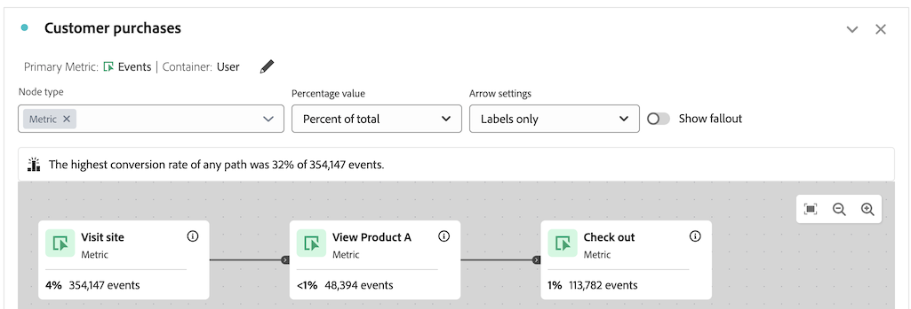

# Problemen met reiscanvas oplossen

{{release-limited-testing}}

Met de reiscanvasvisualisatie kunt u uitgebreide inzichten analyseren en verkrijgen over de reizen die u aan uw gebruikers en klanten biedt.

Meer over het canvas van de Reis leren, zie {het overzicht van het 0} canvas van de Reis ](/help/analysis-workspace/visualizations/journey-canvas/journey-canvas.md) en [ vormen een visualisatie van het canvas van de Reis ](/help/analysis-workspace/visualizations/journey-canvas/configure-journey-canvas.md).[

De volgende informatie kan u helpen onbedoelde resultaten problemen oplossen u zou kunnen zien, zoals knopen die later in de reis komen die een hoger percentage of aantaltelling dan knopen tonen die vroeger in de reis komen.

## Knooppunten met een hoger percentage of een hogere waarde dan vorige knooppunten

Het is mogelijk in het canvas van de Reis voor knopen die later op de reis komen om een hoger percentage of aantaltelling te tonen dan knopen die vroeger in de reis komen.

Met andere woorden, in tegenstelling tot in de visualisaties van de Uitval, die altijd trechter-vormig zijn (met deelname die met elke stap vermindert), kunnen de visualisaties van het canvas van de Reis aan recentere stappen van de reis dan in vorige stappen meer deelnemen.

Dit kan in de volgende scenario&#39;s voorkomen:

* Wanneer het gebruiken van primaire metrisch buiten Mensen of Zittingen

* Wanneer meerdere paden samenkomen in één knooppunt

### De reis gebruikt een primaire metrisch buiten Mensen of Zitting

Omdat het canvas van de Reizen u toestaat om het even welke metrisch als primaire metrisch te gebruiken, kan dit in knopen resulteren die later in de reis komen om een hoger percentage of aantaltelling te tonen dan knopen die vroeger in de reis komen.

De reis die in de volgende scenario&#39;s wordt gebruikt wordt gevormd met de volgende montages:

* **[!UICONTROL Person]** wordt ingesteld als de container

* **[!UICONTROL Event]** is ingesteld als primaire metrisch

#### Scenario 1 - gebruiker A volgt de weg in de eerste zitting, toen slechts recentere knopen in een verdere zitting

Veronderstel dat gebruiker A de plaats bezoekt en de weg van de reis volgt (Node 1: Bezoek plaats > Node 2: Bekijk Product A > Node 3: Controle). In dit scenario, wordt een gebeurtenis geteld op elke knoop van de reis.

Stel nu dat gebruiker A de site opnieuw bezoekt in een latere sessie. Omdat de Gebruiker A reeds aan de vereisten van de reis door de reisweg in een vorige zitting te volgen voldeed, betekent dit dat om het even welke tijdGebruiker A controle uit-zelfs als Gebruiker A niet de weg van de reis in hun huidige zitting-een gebeurtenis op de derde knoop van de reis, &quot;Controle heeft gevolgd.&quot; Dit resulteert in een hoger percentage en een hoger aantal op de knoop van de &quot;Controle uit&quot;dan op de voorafgaande knoop, &quot;Product A van de Mening.&quot;

In dit voorbeeld speelt de containerinstelling van de reis een kritieke rol bij het bepalen of de gebeurtenis op het derde knooppunt (&quot;Uitchecken&quot;) wordt geteld in de volgende sessie.

Als de Zitting als container (in plaats van Persoon) was geplaatst, dan zou de gebeurtenis die slechts op de derde knoop in het verdere bezoek plaatsvond niet in de reis geteld hebben, omdat de statistieken die in de reis worden getoond tot één bepaalde zitting voor een bepaalde persoon zouden worden beperkt. Om meer over container te leren plaatsend, zie [ beginnen met de bouw van een visualisatie van het canvas van de Reis ](/help/analysis-workspace/visualizations/journey-canvas/configure-journey-canvas.md#begin-building-a-journey-canvas-visualization) in het artikel [ vormt een visualisatie van het canvas van de Reis ](/help/analysis-workspace/visualizations/journey-canvas/configure-journey-canvas.md)

<!-- The time allotted for users to move along the path is determined by the container setting. Because "Person" is selected as the container setting in this example, people who followed the journey's path in one session (moving from Node 1 to Node 2 and to Node 3) met the criteria of the journey. On any subsequent visits to the site, any event they have that matches any node on the journey is counted on that node. -->

#### Scenario 2 - gebruiker B valt uit de reis

Veronderstel dat Gebruiker B de plaats bezoekt en niet de weg van de reis volgt (bezoeken de plaats, bekijkt Product B, en dan controles uit), wordt een gebeurtenis geteld voor de beginknoop van de reis, &quot;de plaats van het Bezoek,&quot;maar een gebeurtenis wordt niet geteld voor de resterende knopen, en Gebruiker B valt uit de reis. Hoewel Gebruiker B gecontroleerd, wordt een gebeurtenis niet geteld op de derde knoop, &quot;Controle uit,&quot;omdat Gebruiker B niet de weg van de reis door Product A te bekijken volgde.

Dit is omdat de gebeurtenissen voor elke knoop slechts worden geteld wanneer de mensen de &quot;uiteindelijke weg van de reis volgen,&quot;zo betekent het dat de gebeurtenissen worden geteld zolang de persoon uiteindelijk van één knoop aan andere, ongeacht om het even welke gebeurtenissen zich tussen de 2 knopen voordoet.

### De reis heeft veelvoudige wegen die in één enkele knoop samenkomen

Met het canvas Reis kunt u meerdere beginknooppunten in één rit opnemen, wat resulteert in meerdere paden. Deze wegen kunnen in een gemeenschappelijke knoop samenkomen, resulterend in knopen die later in de reis komen die een hoger percentage of aantaltelling tonen dan knopen die vroeger in de reis komen.

 samenkomen

<!--

The journey used in the following scenarios is configured with the following settings:

* **[!UICONTROL Person]** is set as the container

* **[!UICONTROL Event]** is set as the primary metric

#### Scenario 

When a journey contains multiple paths that converge into a single node, the two paths are combined into the single node using the OR operator. This can result in the

-->

### Reispercentages

Hoewel de getallen op elk knooppunt van een rit constant blijven, ongeacht wat er in het veld **[!UICONTROL Percentage value]** is geselecteerd, kunnen de percentages zelf worden gewijzigd.

In de volgende secties ziet u hoe de percentages voor dezelfde rit kunnen worden gewijzigd, afhankelijk van de volgende opties die u in het veld **[!UICONTROL Percentage value]** hebt geselecteerd:

+++Percentage van beginknooppunt

De knooppunten in deze rit bevatten de volgende statistieken wanneer het veld **[!UICONTROL Percentage value]** is ingesteld op **[!UICONTROL Percent of start node]** :

| Knooppunt | Statistieken |
|---------|----------|
| Knooppunt 1 - &quot;Bezoek site&quot; | In deze reis waren er 354.147 evenementen op de site binnen het bereik van de rapporteringsdatum, zoals getoond in het beginknooppunt van de reis, &quot;Visit site&quot;. |
| Knooppunt 2 - &quot;Product A bekijken&quot; | Van het totale aantal gebeurtenissen in het beginknooppunt, stemden 14% (48.394) ervan overeen met de criteria van het tweede knooppunt van de reis, &quot;Product A bekijken&quot;. |
| Knooppunt 3 - &quot;Uitchecken&quot; | Van het totale aantal gebeurtenissen dat in het beginknooppunt wordt getoond, voldeed 32% (113.782) van deze gebeurtenissen aan de criteria van het derde knooppunt van de reis, &quot;Check out.&quot; |

+++

+++Percentage van vorige node

De knooppunten in deze rit bevatten de volgende statistieken wanneer het veld **[!UICONTROL Percentage value]** is ingesteld op **[!UICONTROL Percent of previous node]** :

| Knooppunt | Statistieken |
|---------|----------|
| Knooppunt 1 - &quot;Bezoek site&quot; | In deze reis waren er 354.147 evenementen op de site binnen het bereik van de rapporteringsdatum, zoals getoond in het beginknooppunt van de reis, &quot;Visit site&quot;. |
| Knooppunt 2 - &quot;Product A bekijken&quot; | Van het totale aantal gebeurtenissen dat in het vorige knooppunt werd getoond, voldeed 14% (48.394) van deze gebeurtenissen aan de criteria van het tweede knooppunt van de reis, &quot;Product A bekijken&quot;. |
| Knooppunt 3 - &quot;Uitchecken&quot; | Van het totale aantal gebeurtenissen dat in het vorige knooppunt werd weergegeven, voldeed meer dan 100% (113.782) aan de criteria van het derde knooppunt van de reis, &quot;Check out.&quot; |

+++

+++ % van totaal

De knooppunten in deze rit bevatten de volgende statistieken wanneer het veld **[!UICONTROL Percentage value]** is ingesteld op **[!UICONTROL Percent of total]** :

| Knooppunt | Statistieken |
|---------|----------|
| Knooppunt 1 - &quot;Bezoek site&quot; | In deze reis waren er 354.147 evenementen op de site binnen het bereik van de rapporteringsdatum, zoals getoond in het beginknooppunt van de reis, &quot;Visit site&quot;. |
| Knooppunt 2 - &quot;Product A bekijken&quot; | Van het totale aantal gebeurtenissen, kwam minder dan 1% (48.394) van hen overeen met de criteria van het tweede knooppunt van de reis, &quot;Product A bekijken&quot;. |
| Knooppunt 3 - &quot;Uitchecken&quot; | Van het totale aantal gebeurtenissen, kwam 1% (113.782) van hen overeen met de criteria van het derde knooppunt van de reis, &quot;Check out.&quot; |

+++

## Verenigbaarheid tussen de metrische en primaire metrische container

U kunt de container van het canvas van de Reis vormen om Persoon (die metrische Mensen) of Zitting (die metrische Sessies gebruikt) te zijn.

Zorg ervoor u primaire metrisch kiest die met container metrisch compatibel is die momenteel wordt geselecteerd. De meeste metriek zijn compatibel met de containermetriek die beschikbaar zijn. Sommige combinaties van containermeetgegevens en primaire meetwaarden moeten echter worden vermeden.

Bijvoorbeeld, kan het gebruiken van Persoon als container met Zitting als primaire metrisch in onbedoelde resultaten resulteren.

<!--

## Percentages that exceed 100%

The following configurations can result in nodes that show percentages that exceed 100%:

* When the **[!UICONTROL Percentage value]** field is set to **[!UICONTROL Percent of total]** or **[!UICONTROL Percent of start node]**, and a primary metric is selected that results in less data for the start node than on subsequent nodes.

  For example, if Revenue is selected as the primary metric, and no revenue is being realized on the primary metric, then on any node where revenue is being realized will show as exceeding 100%. 

-->
