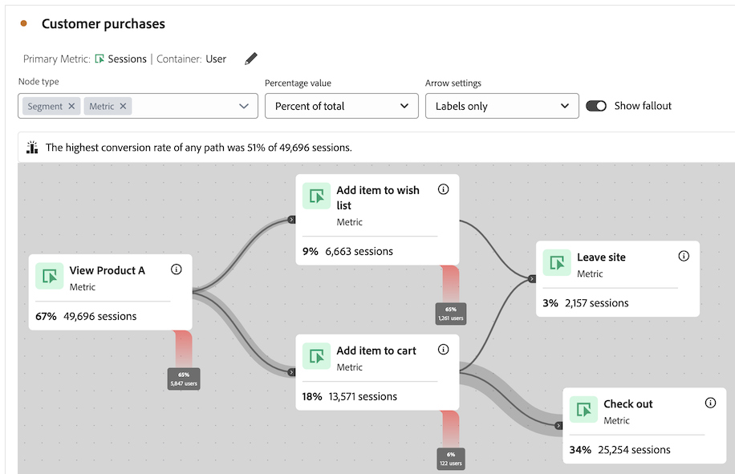
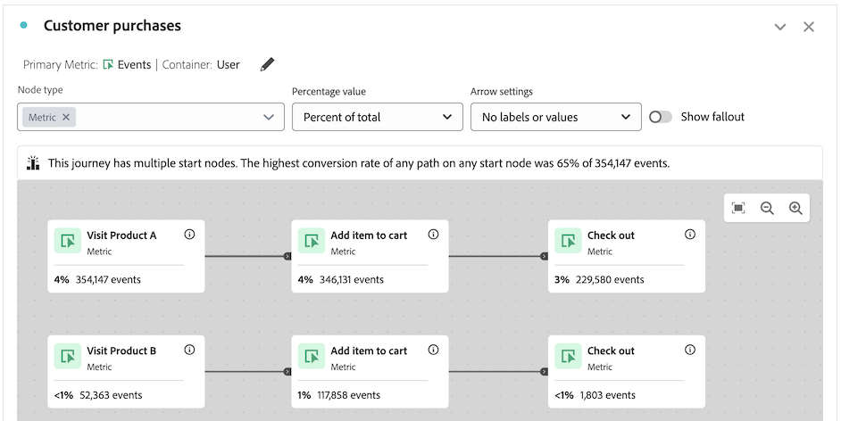

# Overzicht van het reiscanvas {#journey-canvas-overview}

<!-- markdownlint-disable MD034 -->

>[!CONTEXTUALHELP]
>id="cja_journeycanvas_button"
>title="Reiscanvas"
>abstract="Toont hoe mensen door of uit een reeks aanraakpunten te werk gaan. Wordt gebruikt voor reizen met meerdere toegangspunten en -paden, of voor het analyseren van reizen die in Journey Optimizer worden gemaakt."

<!-- markdownlint-enable MD034 -->

<!-- markdownlint-disable MD034 -->

>[!CONTEXTUALHELP]
>id="cja_journeycanvas_panel"
>title="Reiscanvas"
>abstract="Analyseer hoe mensen door of uit een bepaalde reis te werk gaan. Analyseert gebruikersreizen door een flexibele grafiek van knopen en pijlen te creëren die om het even welke combinatie gebeurtenissen, afmetingspunten, en filters vertegenwoordigen. Sleep knooppunten op het canvas om de gebeurtenissen en omstandigheden van de rit opnieuw te rangschikken. Net als u worden de gegevens dienovereenkomstig bijgewerkt.    Klanten met toegang tot Adobe Journey Optimizer kunnen bestaande reizen van Journey Optimizer analyseren"

<!-- markdownlint-enable MD034 -->

<!-- markdownlint-disable MD034 -->

>[!CONTEXTUALHELP]
>id="journeycanvas_button"
>title="Reiscanvas"
>abstract="Toont hoe mensen door of uit een reeks aanraakpunten te werk gaan. Wordt gebruikt voor reizen met meerdere toegangspunten en -paden, of voor het analyseren van reizen die in Journey Optimizer worden gemaakt."

<!-- markdownlint-enable MD034 -->

<!-- markdownlint-disable MD034 -->

>[!CONTEXTUALHELP]
>id="journeycanvas_panel"
>title="Reiscanvas"
>abstract="Analyseer hoe mensen door of uit een bepaalde reis te werk gaan. Analyseert gebruikersreizen door een flexibele grafiek van knopen en pijlen te creëren die om het even welke combinatie gebeurtenissen, afmetingspunten, en filters vertegenwoordigen. Sleep knooppunten op het canvas om de gebeurtenissen en omstandigheden van de rit opnieuw te rangschikken. Net als u worden de gegevens dienovereenkomstig bijgewerkt.    Klanten met toegang tot Adobe Journey Optimizer kunnen bestaande reizen van Journey Optimizer analyseren"

<!-- markdownlint-enable MD034 -->

>[!BEGINSHADEBOX]

_dit artikel documenteert de visualisatie van het canvas van de Reis in_  _**Customer Journey Analytics**.  er is geen gelijkwaardige visualisatie in **Adobe Analytics**._

>[!ENDSHADEBOX]

Met de reiscanvasvisualisatie kunt u uitgebreide inzichten analyseren en verkrijgen over de reizen die u aan uw gebruikers en klanten biedt. Het stelt je in staat om een reis helemaal vanaf het begin te definiëren of een reis vanuit Journey Optimizer te bekijken, dan te zien hoe mensen de reis hebben verlaten (verlaten) of doorgezet (doorheen).

U kunt [ analyses van gebruikersreizen ](/help/analysis-workspace/visualizations/journey-canvas/configure-journey-canvas.md) bouwen door om het even welke combinatie gebeurtenissen, afmetingspunten, filters, en datumwaaiers te gebruiken om reisknopen tot stand te brengen. Verbind de knopen om de stroom van de reis tot stand te brengen, en veelvoudige wegen en beslissingspunten te omvatten. Sleep knooppunten op het canvas om de gebeurtenissen en omstandigheden van de rit opnieuw te rangschikken. Gegevens worden in real-time bijgewerkt wanneer u wijzigingen aanbrengt.

[ Knooppunten worden verbonden ](/help/analysis-workspace/visualizations/journey-canvas/configure-journey-canvas.md#logic-when-connecting-nodes) als &quot;uiteindelijke weg,&quot;zo betekent het dat de bezoekers worden geteld zolang zij uiteindelijk van één knoop aan andere, ongeacht om het even welke gebeurtenissen zich tussen de 2 knopen voordoen. De tijd die gebruikers wordt toegewezen om langs het pad te bewegen, wordt bepaald door de containerinstelling.

## Belangrijkste kenmerken

De belangrijkste kenmerken van de visualisatie van het canvas Journey zijn:

* Een diepgaande analyse van de uitval en de doorslag die de meest complexe gebruikersreizen mogelijk maakt.

* Een canvas voor het toewijzen en visualiseren van de verschillende ingangspunten, knooppunten en paden van een gebruikersreis.

* Interacties voor slepen en neerzetten om componenten aan het canvas toe te voegen en bestaande knooppunten te verplaatsen.

* De optie om analyses van gebruikersreizen binnen het canvas van de Reis te bouwen of hen tot stand te brengen automatisch gebaseerd op de reizen van Journey Optimizer.

## Potentiële inzichten

Reiscanvas biedt actioneerbare inzichten voor de meest complexe reizen.

### Pad met de hoogste conversiesnelheid {#conversion-rate-caption}

Het belangrijkste inzicht in het canvas Journey wordt weergegeven als een bijschrift boven aan het canvas zelf.

Dit bijschrift geeft een overzicht van alle paden op de reis met de hoogste omrekeningskoers.

Wanneer de reis veelvoudige beginknopen bevat, kijkt de titel als dit:

Wanneer de reis één enkele beginknoop bevat, kijkt de titel als dit:

Houd rekening met het volgende wanneer u dit bijschrift interpreteert:

* A _weg_ wordt bepaald als beginknoop die door pijlen aan een eindknoop, met om het even welk aantal knopen wordt verbonden tussen hen.

* De berekening van de omrekeningskoers is afhankelijk van het type transport (het aantal start- en eindknooppunten in de rit en of de paden elkaar snijden).

  In de volgende tabel wordt beschreven hoe de omrekeningskoersen worden berekend op basis van het soort transport:

  | Soort reis | Omrekeningskoers | Voorbeeld |
  |---------|----------|---------|
  | **Één enkele beginknoop en één enkele eindknoop** | Conversiesnelheid wordt berekend door het getal van het eindknooppunt te delen door dat van het beginknooppunt. |  samenkomen |
  | **Één enkele beginknoop en veelvoudige eindknopen** | Conversiesnelheid wordt berekend door het eindknooppunt met het hoogste getal te zoeken en dat getal te delen door dat van het beginknooppunt. |  samenkomen |
  | **Veelvoudige standalone wegen, met elk weg die één enkele beginknoop en één enkele eindknoop** bevatten | Conversiesnelheid wordt berekend door het getal van het eindknooppunt te delen door dat van het beginknooppunt. Het pad met de hoogste conversiesnelheid wordt in het bijschrift beschreven. |  samenkomen |
  | **Veelvoudige beginknopen die op om het even welk punt in de reis in een gemeenschappelijke knoop** samenkomen | Conversiesnelheid wordt berekend door het eindknooppunt met het hoogste getal te zoeken en dat getal te delen door dat van het beginknooppunt met het laagste getal. |  samenkomen |

### Doorvallen, uitvallen en meer

Hier volgen enkele voorbeelden van andere inzichten die Journey canvas kan helpen bieden. U kunt kiezen of deze inzichten gebaseerd zijn op alle mensen in de gegevensweergave, op alle mensen die de reis begonnen, of op alle mensen uit het vorige knooppunt van de reis.

#### Fallthrough

* Het aantal en het percentage personen dat de reis heeft voltooid (aangekomen bij het eindknooppunt)

* Het aantal en het percentage personen dat op een bepaald knooppunt van de reis aankwam

* De meest voorkomende stap die voor of na een bepaald knooppunt van de reis is gezet

#### Fallout

* De knooppunten van de reis waar mensen het meest uit de reis vielen (nooit bij een van de directe volgende knooppunten aankwamen)

#### Aanvullende gegevens voor elk knooppunt

* Voeg een afbraakdimensie op om het even welk knooppunt van de reis toe om extra gegevens voor die specifieke knoop te bekijken

## Kiezen tussen de visualisaties voor het canvas, Fallout of Flow

De visualisatie van het canvas van de Reis heeft gelijkenissen met de [ visualisatie van de Uitval ](/help/analysis-workspace/visualizations/fallout/fallout-flow.md) en de [ visualisatie van de Stroom ](/help/analysis-workspace/visualizations/c-flow/flow.md), maar met belangrijke verschillen.

### De verschillen begrijpen

<!-- Information in this snippet is shared between Journey canvas, Fallout, and Flow visualization docs -->

{{journey-visualization-comparisons}}

### Wanneer gebruikt u het canvas Reisweg

Reiscanvas is essentieel voor:

* Fallout-analyse met ritten met meerdere toegangspunten en -paden.

* Niet-lineaire ritten met meerdere ingangspunten en paden, met een vooraf gedefinieerde reeks pagina&#39;s.

* Verkennende, ad-hocanalyse die op een vooraf bepaalde reis gebaseerd is.

* Analyse die primaire metrisch behalve Zitting, Persoon, of Voorkomen vereist.

* Een grondiger analyse van de reizen die van oorsprong zijn uit Adobe Journey Optimizer.

Gebruik [ de lijst hierboven ](#understand-the-differences) om de verschillen tussen het canvas van de Reis, Vallout, en de visualisaties van de Stroom te begrijpen.

## Journey Optimizer-reizen analyseren

>[!NOTE]
>
>Als uw organisatie geen toegang tot Journey Optimizer heeft, kunt u nog [ analyses op het canvas van de Reis ](#build-analyses-in-customer-journey-analytics) bouwen.

Het analyseren van Journey Optimizer-reizen op het canvas Journey biedt diepgaande, activeerbare inzichten over hoe mensen met een reis omgaan.

Wanneer u een Journey Optimizer-reis analyseert in het canvas Journey, wordt de reis weergegeven met dezelfde volgorde, volgorde en structuur als in Journey Optimizer. Als u significante veranderingen in een reis binnen het canvas van de Reis aanbrengt, [ worden de veranderingen niet meer gesynchroniseerd van Journey Optimizer ](#synchronization-between-journey-optimizer-and-journey-canvas).

### Voordelen van het analyseren van Journey Optimizer-reizen met Reiscanvas

Reiscanvas biedt een diepgaande, diepgaande analyse die niet mogelijk is in Journey Optimizer.

Het gebruik van het canvas Journey voor het analyseren van reizen die in Journey Optimizer zijn gemaakt, biedt verschillende voordelen:

* Maak gebeurtenissen met behulp van Customers Journey Analytics, maateenheden, filters of datumbereiken.

  In Journey Optimizer moet een technische gebruiker een gebeurtenis maken voordat deze aan een reis kan worden toegevoegd.

* Creeer publiek dat op een douaneknoop wordt gebaseerd die u creeert (lanceert de het publieksbouwer van de Customer Journey Analytics).

  In Journey Optimizer kunt u alleen een publiek maken voor vooraf gedefinieerde activiteiten.

* Analyseren van fallthrough en fallout

* Gebeurtenissen indelen met elke dimensie

* Gebeurtenissen combineren

* Connect-gebeurtenissen

* Gebeurtenissen hernoemen en verwijderen

* Veel meer

### Synchronisatie tussen Journey Optimizer en Reiscanvas

Nadat u een analyse hebt gemaakt van een Journey Optimizer-reis in het canvas Journey, worden gegevens in slechts één richting gesynchroniseerd, van Journey Optimizer tot het canvas Journey. Dit betekent dat veranderingen die zijn aangebracht in een reis op het canvas Journey nooit worden weerspiegeld in Journey Optimizer.

Voorts veranderingen die aan een reis in de synchronisatie van Journey Optimizer aan het canvas van de Reis [ worden aangebracht slechts als de reis niet beduidend in het canvas van de Reis ](#differences-after-modifying-a-journey-in-journey-canvas) is gewijzigd. Nadat u een reis in het canvas van de Reis wijzigt, worden om het even welke veranderingen u aan de reis in Journey Optimizer aanbrengt niet weerspiegeld in het canvas van de Reis. Om de veranderingen te zien die in het canvas van de Reis worden weerspiegeld, kunt u de reis in het canvas van de Reis schrappen en [ opnieuw creëren ](/help/analysis-workspace/visualizations/journey-canvas/configure-journey-canvas.md).

### Verschillen na het wijzigen van een reis in het canvas van de Reis {#differences-after-modifying}

Nadat u een reis van Journey Optimizer in het canvas van de Reis wijzigt, kunnen de veranderingen in gegevensverwerking, beschikbare eigenschappen, en synchronisatiegedrag voorkomen.

Als u een belangrijke wijziging aanbrengt in een Journey Optimizer-reis in het canvas Journey, kunnen wijzigingen optreden in gegevensverwerking, beschikbare functies en synchronisatiegedrag. Een belangrijke wijziging omvat een van de volgende elementen:

* Een knooppunt toevoegen of verwijderen

* Een pijl toevoegen of verwijderen tussen knooppunten

* De componenten op een knooppunt wijzigen

Als u andere wijzigingen aanbrengt aan een Journey Optimizer-reis in het canvas Reis, zoals het slepen van een knooppunt of het toevoegen van een afbraak, zijn de verschillen die in de volgende secties worden beschreven, niet van toepassing.

>[!NOTE]
>
>Als u de oorspronkelijke staat van de reis wilt herstellen, drukt u op Ctrl+z nadat u de eerste wijziging in het canvas Reis hebt aangebracht. Of, kunt u schrappen en [ opnieuw creëren de reis in het canvas van de Reis ](/help/analysis-workspace/visualizations/journey-canvas/configure-journey-canvas.md)

#### Verschillen in gegevensverwerking

Nadat u een reis van Journey Optimizer in het canvas van de Reis wijzigt, zou u veranderingen in uw gegevens kunnen opmerken als uw reis metriek bevat die niet-standaard attributiemodellen hebben.

Dit komt omdat u, in tegenstelling tot Journey Optimizer, met het canvas Journey meerdere dimensies kunt toepassen binnen één reis. Dit vermogen betekent dat [ metrische attributie ](/help/data-views/component-settings/attribution.md) niet wordt gesteund.

#### Verschillen in functies

Nadat u een reis van Journey Optimizer in het canvas van de Reis wijzigt, de opties die in de [!UICONTROL **montages van de Pijl**] drop-down gebiedsverandering beschikbaar zijn, afhankelijk van uw wijzigingen. Voor meer informatie, zie [ montages ](/help/analysis-workspace/visualizations/journey-canvas/configure-journey-canvas.md) vormen.

Het [!UICONTROL **type van Knoop**] gebied is beschikbaar slechts in Journey Optimizer. Het is niet beschikbaar als u een Journey Optimizer-reis weergeeft op het canvas Journey, ongeacht of u de reis wijzigt op het canvas Journey.

#### Synchronisatieverschillen

Wijzigingen die in Journey Optimizer tijdens een reis worden aangebracht, worden alleen doorgevoerd in het canvas Journey als de reis ongewijzigd blijft op het canvas Journey.

Nadat u een Journey Optimizer-reis in het canvas Journey hebt aangepast, worden wijzigingen die u aanbrengt in de reis in Journey Optimizer niet meer doorgevoerd in het canvas Journey. Om de veranderingen te zien die in het canvas van de Reis worden weerspiegeld, kunt u de reis in het canvas van de Reis schrappen en [ opnieuw creëren ](/help/analysis-workspace/visualizations/journey-canvas/configure-journey-canvas.md).

### Terminologische verschillen tussen Journey Optimizer en Customer Journey Analytics

Bepaalde termen die één ding betekenen in Journey Optimizer, betekenen iets anders in de Customer Journey Analytics. Wanneer u het canvas Reis gebruikt, worden de termen Customer Journey Analytics gebruikt.

| Term | Reiscanvas | Journey Optimizer |
|---------|----------|---------|
| **Gebeurtenis** | Één van verscheidene standaardmetriek die in Customer Journey Analytics beschikbaar is. Deze metrische tellingen dingen zoals opbrengst, abonnementen, of geproduceerde lood. | De categorie van activiteit die een gepersonaliseerde reis, zoals een online aankoop teweegbrengt. |

### Een Journey Optimizer-reis analyseren in het canvas Journey

Voor informatie over het analyseren van een reis van Journey Optimizer in het canvas van de Reis, zie [ een visualisatie van het canvas van de Reis vormen ](/help/analysis-workspace/visualizations/journey-canvas/configure-journey-canvas.md).

## Analyses maken in Reis canvas

U kunt analyses maken op het canvas Journey die zijn gebaseerd op alle afmetingen of maatstaven die beschikbaar zijn in Analysis Workspace. Of je kunt reizen analyseren die gemaakt zijn in Journey Optimizer. Voor meer informatie, zie [ een visualisatie van het canvas van de Reis vormen ](/help/analysis-workspace/visualizations/journey-canvas/configure-journey-canvas.md).
