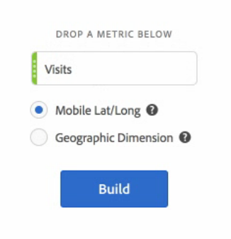
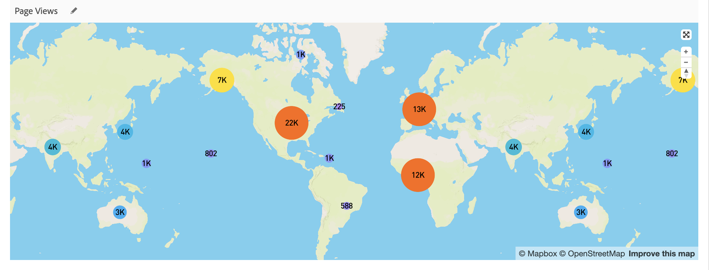

# Kaart

## Overzicht {#section_19F740FAF08D47B1AF1EF239A74FC75C}

Visualisatie op de kaart in Analysis Workspace

* Hiermee kunt u een visuele kaart van elke metrische waarde (inclusief berekende metriek) maken.
* Is nuttig om metrische gegevens over verschillende geografische gebieden te identificeren en te vergelijken.
* Biedt ondersteuning voor twee gegevensbronnen: breedtegraad/lengtegraad van mobiel gebruik of geografische afmeting voor webgebruik.
* Ondersteuning voor PDF-export.
* Gebruikt WebGL voor beeldvertoning. Als uw grafische stuurprogramma&#39;s geen ondersteuning bieden voor WebGL-rendering, moet u de stuurprogramma&#39;s mogelijk bijwerken.

## Een kaartvisualisatie maken {#section_61BBFA3A7BFD48DA8D305A69D9416299}

1. Sleep **[!UICONTROL Map]** vanuit de lijst met visualisaties naar een deelvenster voor vrije vorm:

   

1. Sleep in metrische vorm vanuit de lijst met metriek (inclusief berekende metriek).
1. Geef de gegevensbron op waaruit u wilt tekenen. (Dit dialoogvenster wordt alleen weergegeven als u locatie-tracking hebt ingeschakeld voor gegevens van mobiele apps.)

1. Klik op **[!UICONTROL Build]**.

   De eerste weergave die je zult zien is een World View met een bubble map, vergelijkbaar met deze.

   

1. U kunt nu

   * **Hiermee** zoomt u in op deze kaart om bepaalde gebieden te vergroten door te dubbelklikken op de kaart of door het schuifwiel te gebruiken. De kaart zoomt naar waar u de cursor hebt geplaatst. Via zoominteractie wordt de vereiste afmeting (land > land > plaats) automatisch bijgewerkt op basis van het zoomniveau.
   * **** Vergelijkt of meer kaartvisualisaties in het zelfde project door hen naast elkaar te plaatsen.
   * **Vergelijking** van de periode-overperiode (zoals jaar-overjaar) weergeven:

      * Negatieve getallen tonen: Als u bijvoorbeeld een metrische waarde uitzet die elk jaar wordt overschreden, kan de kaart -33% weergeven ten opzichte van New York.
      * Met metrics van het type percentage, wordt het gemiddelde van de geclusterde percentages getoond.
      * Een groen/rood kleurenschema: Positief/negatief
   * **Roteer de kaart in 2D of 3D door de**   [!UICONTROL Ctrl] toets ingedrukt te houden en de kaart te verplaatsen.

   * **Schakel** over naar een andere weergave, zoals de warmtekaart, met de   instellingen die hieronder worden beschreven. De bellenweergave is de standaardinstelling.

1. **Sla** het project op om alle kaartinstellingen op te slaan (coördinaten, zoomen, roteren).
1. De vrije-vormlijst, onder visualisatie, kan worden bevolkt door in plaatsdimensies en metriek van de linkerspoorstaaf te slepen:

   

## Visualisatie-instellingen toewijzen {#section_5F89C620A6AA42BC8E0955478B3A427E}

Er zijn twee sets instellingen voor Kaart:

Met het **moersleutelpictogram** rechtsboven wordt het eerste dialoogvenster weergegeven waarin u de metrische waarde en de gegevensbron kunt wijzigen:

Als u op **tandwielpictogram** klikt, worden de volgende visualisatie-instellingen weergegeven:

| Instelling | Beschrijving |
|--- |--- |
| Luchtbellen | Hiermee worden gebeurtenissen geplakt met behulp van bellen. Een bubbelgrafiek is een multi-variabelegrafiek die een kruis tussen een spreidplot en een proportioneel gebiedsgrafiek is. Dit is de standaardweergave. |
| Heatmap | Hiermee worden gebeurtenissen geplakt met een heatmap. Een heatmap is een grafische voorstelling van gegevens waarbij de afzonderlijke waarden in een matrix als kleuren worden weergegeven. |
| Stijlen: Kleurthema | Hiermee geeft u het kleurenschema voor de warmtekaart en luchtbellen weer. U kunt kiezen uit Koraal, Rode tinten, Groene tinten of Vervagen. Standaard is Coral. |
| Stijlen: Type kaart | U kunt kiezen uit Standaard, Streets, Helder, Licht, Donker en Satelliet. |
| Clusterstraal | Hiermee groepeert u gegevenspunten die binnen het opgegeven aantal pixels liggen. De standaardwaarde is 50. |
| Aangepaste maximale waarde | Hiermee kunt u de drempelwaarde voor de maximale waarde voor de kaart wijzigen. Als u deze waarde aanpast, wordt de schaal voor de waarden voor luchtbellen/heatmap (kleur en grootte) aangepast ten opzichte van de aangepaste maximale waarde die is ingesteld. |
