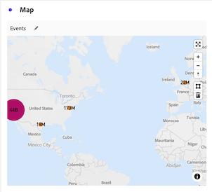

# Kaart {#map}

<!-- markdownlint-disable MD034 -->

>[!CONTEXTUALHELP]
>id="workspace_map_button"
>title="Kaart"
>abstract="Deze visualisatie vertegenwoordigt metriek door hen op een kaart te bedekken. Dit is handig voor het identificeren van gegevens in verschillende geografische gebieden."

<!-- markdownlint-enable MD034 -->

<!-- markdownlint-disable MD034 -->

>[!CONTEXTUALHELP]
>id="workspace_map_bubbles"
>title="Luchtbellen"
>abstract="Plot gebeurtenissen using bubbles."

<!-- markdownlint-enable MD034 -->

<!-- markdownlint-disable MD034 -->

>[!CONTEXTUALHELP]
>id="workspace_map_heatmap"
>title="Heatmap"
>abstract="Plotten met behulp van een warmtekaart."

<!-- markdownlint-enable MD034 -->

{{release-limited-testing}}

>[!BEGINSHADEBOX]

_dit artikel documenteert de visualisatie van de Kaart in_  _&#x200B;**Customer Journey Analytics**._ _zie [ Kaart ](https://experienceleague.adobe.com/nl/docs/analytics/analyze/analysis-workspace/visualizations/map-visualization) voor_  _&#x200B;**Adobe Analytics** versie van dit artikel._

>[!ENDSHADEBOX]

De  **[!UICONTROL Map]** visualisatie in Analysis Workspace staat u toe om een visuele kaart van om het even welke metrisch (met inbegrip van berekende metriek) te bouwen. Het is nuttig om metrische gegevens over verschillende geografische gebieden te identificeren en te vergelijken.

## Vereisten

### Contextlabels toevoegen in gegevensweergaven

In de montages van de gegevensmeningen van Customer Journey Analytics, kunnen de beheerders [ contextetiketten ](/help/data-views/component-settings/overview.md) aan een afmeting toevoegen of metrisch en de diensten van Customer Journey Analytics zoals [!UICONTROL map] visualization kunnen deze etiketten voor hun doeleinden gebruiken.

#### Vereiste contextlabels voor breedte- en lengtegraad in de kaartvisualisatie

Contextlabels zijn vereist om de kaartvisualisatie te laten functioneren. Als de volgende contextlabels ontbreken, werkt de visualisatie van de kaart niet, omdat er geen breedte- en lengtegegevens zijn waarmee kan worden gewerkt.

* [!UICONTROL Geo: Latitude]
* [!UICONTROL Geo: Longitude]

U voegt als volgt contextlabels toe:

1. Selecteer in Customer Journey Analytics **[!UICONTROL Data Management]** > **[!UICONTROL Data views]** .

1. Selecteer op de pagina met gegevensweergaven de gegevensweergave die de gegevens bevat die u wilt analyseren in de kaartvisualisatie.

1. Selecteer de tab **[!UICONTROL Components]** .

1. (Voorwaardelijk) als u het Web SDK gebruikt en breedtegraad en lengtegraad hebt gevormd om in uw gegevensstroom te worden bevolkt, of als u de Verbinding van Analytics Source gebruikt om gebeurtenisgegevens te bevolken, dan zouden de breedtegraad en lengtegebieden reeds in uw schema beschikbaar moeten zijn en met de correcte contextetiketten worden bevolkt.

   Zoek deze **[!UICONTROL Latitude]** - en **[!UICONTROL Longitude]** schemavelden (in **[!UICONTROL Event datasets]** > **[!UICONTROL placeContext]** > **[!UICONTROL geo]** > **[!UICONTROL _schema]** ) en sleep deze naar de gegevensweergave als afmetingen, als ze nog niet aanwezig zijn.

   Wanneer deze schemagebieden als afmetingen in uw gegevensmening bestaan, worden hun contextetiketten automatisch toegepast, en de kaartvisualisatie gebruikt hen zonder enige extra configuratie.

    toe

1. (Voorwaardelijk) Als u douaneafmetingen hebt die u voor breedte en lengtegegevens wilt gebruiken, kunt u de contextetiketten op de douanegebieden vormen:

   1. Selecteer in de sectie **[!UICONTROL Dimensions]** de dimensie die de lengtegegevens bevat.

   1. Ga naar de sectie **[!UICONTROL Component settings]** in de rechtertrack in het veld **[!UICONTROL Context labels]** en typ `Longitude` en selecteer deze in het keuzemenu.

      

   1. Herhaal dit proces om het contextlabel **[!UICONTROL Latitude]** toe te voegen aan de dimensie die de breedtegegevens bevat.

   1. (Optioneel) Deze afmetingen zijn standaard nauwkeurig tot het niveau van de stad of postcode in de kaartvisualisatie en geven 2 decimalen weer in Workspace-rapporten. U kunt deze aanpassen om precies te zijn binnen één meter in de kaartvisualisatie en om 5 decimalen weer te geven in Workspace-rapporten. Voor meer informatie over hoe te om het precisieniveau aan te passen, zie [ nauwkeurige plaatsen voor afmetingen ](#configure-precise-locations-for-dimensions) vormen.

1. Selecteer **[!UICONTROL Save and continue]** > **[!UICONTROL Save and finish]** .

#### Vereiste contextlabels voor geosjablonen

Adobe verstrekt verscheidene [ pre-gebouwde malplaatjes ](/help/analysis-workspace/templates/use-templates.md#web-audience) die de kaartvisualisatie gebruiken. Als u elke sjabloon wilt gebruiken, moet u het bijbehorende contextlabel toevoegen aan een dimensie in de gegevensweergave.

Hieronder vindt u de sjablonen en het vereiste contextlabel. Als deze labels niet aanwezig zijn, werken de sjablonen niet, omdat er geen geo-gegevens zijn om mee te werken.

| Sjabloonnaam | Vereist contextlabel |
|---------|----------|
| Geo | [!UICONTROL Geo: Geo Country] |
| Geo-gebieden | [!UICONTROL Geo: Geo Region] |
| Geosteden | [!UICONTROL Geo: Geo City] |
| Geo VS-staten | [!UICONTROL Geo: Geo State] |
| Geo US DMA | [!UICONTROL Geo: Geo Dma] |

U voegt als volgt contextlabels toe:

1. Selecteer in Customer Journey Analytics **[!UICONTROL Data Management]** > **[!UICONTROL Data views]** .

1. Voor de de meningspagina van Gegevens, selecteer de gegevensmening die gegevens bevat die u met vooraf gebouwde malplaatjes wilt analyseren die de kaartvisualisatie gebruiken. In deze gegevensweergave kiest u vijf dimensies, één met de landgegevens, één met de regiogegevens, één met de stadsgegevens, één met de staatsgegevens en één met de DMA-gegevens. Vervolgens labelt u die afmetingen met het bijbehorende contextlabel.

1. Selecteer de tab **[!UICONTROL Components]** .

1. (Voorwaardelijk) als u het Web SDK gebruikt en u geo gebieden hebt gevormd om in uw gegevensstroom worden bevolkt, of als u de Verbinding van Analytics Source gebruikt om gebeurtenisgegevens te bevolken, dan zouden de geo gebieden reeds in uw schema beschikbaar moeten zijn en met de correcte contextetiketten worden bevolkt.

   Zoek de desbetreffende schemavelden, zoals **[!UICONTROL City]** , **[!UICONTROL Postal code]** , **[!UICONTROL State or province]** (in **[!UICONTROL Event datasets]** > **[!UICONTROL placeContext]** > **[!UICONTROL geo]** ) en sleep deze naar de gegevensweergave als afmetingen, als deze nog niet aanwezig zijn.

   Wanneer deze schemagebieden als afmetingen in uw gegevensmening bestaan, worden hun contextetiketten automatisch toegepast, en de geo malplaatjes gebruiken hen zonder enige extra configuratie.

    toe

1. (Voorwaardelijk) Als u douaneafmetingen hebt die u voor geo gegevens wilt gebruiken, kunt u de contextetiketten op de douanegebieden vormen:

   1. Selecteer de dimensie die de landgegevens bevat.

   1. Ga naar de sectie **[!UICONTROL Component settings]** in de rechtertrack in het veld **[!UICONTROL Context labels]** en typ `Geo Country` en selecteer deze in het keuzemenu.

      

   1. Herhaal dit proces om het contextlabel **[!UICONTROL Geo: Geo Region]** , **[!UICONTROL Geo: Geo City]** , **[!UICONTROL Geo: Geo State]** en **[!UICONTROL Geo: Dma]** toe te voegen aan elke dimensie die de corresponderende gegevens bevat.

1. Selecteer **[!UICONTROL Save and continue]** > **[!UICONTROL Save and finish]** .

### Grafische stuurprogramma&#39;s moeten WebGL-rendering ondersteunen

De kaartvisualisatie gebruikt WebGL voor grafiekvertoning. Als uw grafische stuurprogramma&#39;s geen ondersteuning bieden voor WebGL-rendering, moet u de stuurprogramma&#39;s mogelijk bijwerken.

## Kaartvisualisatie in Customer Journey Analytics versus Adobe Analytics

De kaartvisualisatie in Customer Journey Analytics verschilt op de volgende manieren van de kaartvisualisatie in Adobe Analytics:

| Functie | Customer Journey Analytics | Adobe Analytics |
|---------|----------|---------|
| Gegevensbron | Gebruik om het even welk segment beschikbaar in uw gegevensmening als gegevensbron. | Verstrekt de volgende opties: <ul><li>Mobiel lang/lang</li><li>De geografische Dimension   vertegenwoordigt geo segmentatiegegevens over bezoekersplaats die op het IP van de bezoeker adres wordt gebaseerd. </li></ul> |
| Precisie | Voor datasets met diepe precisie, kunt u de afmetingen in uw gegevensmening vormen om tot 5 decimale plaatsen te tonen. Hierdoor kan de kaartvisualisatie nauwkeurig zijn binnen één meter. 
Voor meer informatie, zie [ nauwkeurige plaatsen voor afmetingen ](#configure-precise-locations-for-dimensions) vormen.
 | Gegevens zijn nauwkeurig tot het niveau [!UICONTROL Country] , [!UICONTROL Region] en [!UICONTROL City] . (Het gaat niet naar het niveau van DMA of van het Postcode.) |
| Een segment maken op basis van een selectie | Maak een segment op basis van een specifiek gebied dat u selecteert in de kaartvisualisatie. 
Voor meer informatie, zie [ een segment van de kaartvisualisatie ](#create-a-segment-from-the-map-visualization) creëren.
 | Creeer een segment dat op de gegevens wordt gebaseerd die in de kaartvisualisatie in het algemeen worden gemeld. |
| Een publiek maken op basis van een selectie | Maak een publiek op basis van een specifiek gebied dat u selecteert in de kaartvisualisatie. 
Voor meer informatie, zie [ een publiek van de kaartvisualisatie ](#create-an-audience-from-the-map-visualization) creëren. | Kan geen publiek maken op basis van de kaartvisualisatie. |
| Een trend maken op basis van een selectie | Creeer een trended visualisatie van de lijngrafiek die op een specifiek gebied wordt gebaseerd dat u in de kaartvisualisatie selecteert. 
Voor meer informatie, zie [ een trended lijngrafiek van de kaartvisualisatie ](#create-a-trended-line-chart-from-the-map-visualization) creëren. <!-- is this correct? --> | Kan geen trend creëren van de kaartvisualisatie. |
| Een uitsplitsing toevoegen uit een selectie | Verdeel een specifiek afmeting punt, metrisch, segment, of datumwaaier binnen een specifiek gebied dat u in de kaartvisualisatie selecteert. 
Voor meer informatie, zie [ een uitsplitsing van de kaartvisualisatie ](#add-a-breakdown-from-the-map-visualization) toevoegen. | Kan geen uitsplitsing toevoegen uit de kaartvisualisatie. |

## Beginnen met het maken van een kaart {#begin-building-map}

<!-- markdownlint-disable MD034 -->

>[!CONTEXTUALHELP]
>id="workspace_map_panel"
>title="De kaartvisualisatie configureren"
>abstract="Kies metrische of berekende metrisch die als basis voor uw kaartvisualisatie wordt gebruikt. U kunt ook een segment toevoegen als u de focus wilt richten op een specifieke subset van de gegevens.
U kunt deze gegevens op elk gewenst moment bijwerken nadat de visualisatie is gerenderd.
"

<!-- markdownlint-enable MD034 -->

1. Selecteer het [!UICONTROL **pictogram van Visualisaties**] in het linkerspoor, dan sleep de **[!UICONTROL Map]** visualisatie  in een paneel dat een vrije vormlijst bevat.

   of

   Voeg een kaartvisualisatie op om het even welke die manieren toe in [ worden beschreven visualisaties aan een paneel ](/help/analysis-workspace/visualizations/freeform-analysis-visualizations.md#add-visualizations-to-a-panel) sectie in [ Overzicht van Visualisaties ](/help/analysis-workspace/visualizations/freeform-analysis-visualizations.md) toevoegen.

   {width="50%"}

1. Specificeer de volgende basisinformatie om de kaartvisualisatie te vormen:

   * **[!UICONTROL Add metric]**: In de metrische drop-down lijst, selecteer metrisch of berekend metrisch. (U kunt ook een metrische waarde slepen vanaf de linkerspoorstaaf.)

     >[!IMPORTANT]
     >
     >Als u metrisch kiest die [ toegepaste attributie ](/help/data-views/component-settings/attribution.md#attribution-models) heeft, wordt de zelfde attributie toegepast op de breedte en lengteparen binnen de huidige viewport van de kaartvisualisatie.
     >

     <!-- Only choose metrics that use Last Touch as the [attribution model](/help/data-views/component-settings/attribution.md#attribution-models) (this is the default attribution model for all metrics). Choosing a metric that has an attribution model other than Last Touch results in inaccurate map data, because attribution is applied to the latitude and longitude pairs. -->

   * **[!UICONTROL Add segment]**: (Optioneel) Selecteer een segment in de vervolgkeuzelijst Segment. Of sleep in een segment uit de lijst met segmenten.

   U kunt deze informatie bijwerken nadat de visualisatie wordt gebouwd door het uitgeven pictogram  in de visualisatiekop uit.

1. Selecteer **[!UICONTROL Build]** .

   Er wordt een &#39;world map visualization&#39; met bubbels gegenereerd.

   

1. Ga met [ Mening een kaartvisualisatie ](#view-a-map-visualization) voort en [ vorm visualisatie montages ](#configure-visualization-settings).

## Een kaart visualiseren

1. Als u niet reeds hebt, bouw een kaartvisualisatie zoals die in [ wordt beschreven Begin bouwend een kaartvisualisatie ](#begin-building-a-map-visualization).

1. Voer een of meer van de volgende handelingen uit in de kaartvisualisatie in Analysis Workspace:

   * **Gezoem binnen**: U kunt binnen op de kaart zoemen om bepaalde gebieden op om het even welke volgende manieren te vergroten:

      * Dubbelklik met de muis op de kaart.

      * Gebruik het muiswieltje of een vergelijkbare actie op het trackpad.

      * Selecteer het plusteken  op de kaartvisualisatie.

     De kaart zoomt dienovereenkomstig in. De vereiste afmeting (land > land > plaats) wordt automatisch bijgewerkt op basis van het zoomniveau.

   * **Gezoem uit**: U kunt uit op de kaart zoemen om grotere gebieden op om het even welke volgende manieren te bekijken:

      * Houd Shift ingedrukt en dubbelklik met de muis op de kaart.

      * Gebruik het muiswieltje of een vergelijkbare actie op het trackpad.

      * Selecteer het minteken  op de kaartvisualisatie.

     De kaart zoomt dienovereenkomstig in. De vereiste afmeting (land > land > plaats) wordt automatisch bijgewerkt op basis van het zoomniveau.

   * **roteer**: U kunt de kaart in 2D of 3D roteren door de [!UICONTROL Ctrl] sleutel te houden terwijl het slepen van de kaart met uw muis.

     Om de kaart aan zijn originele noordelijke groepering terug te stellen, selecteer het kompaspictogram .

   * **hulpmiddel van de Selectie**: U kunt een gebied van de kaart selecteren om [ een segment ](#create-a-segment-from-the-map-visualization) tot stand te brengen, [ creeer een trend ](#create-a-trended-line-chart-from-the-map-visualization), of [ voeg een mislukking ](#add-a-breakdown-from-the-map-visualization) toe.

     Klik het pictogram van de de kaartselectie van het selectiegereedschap , dan sleep uw muis om het gewenste gebied te selecteren.

   * **vergelijk**: U kunt twee of meer kaartvisualisaties in het zelfde project vergelijken door hen naast elkaar te plaatsen.

   * **toon periode-over-periode vergelijkingen (zoals jaar-over-jaar)**:

      * Negatieve getallen tonen.

        Als u bijvoorbeeld een metric voor een aantal jaren plot, kan de kaart een waarde van -33% weergeven voor New York.

      * Met metriek die van type *percenten* zijn, groeperen zich gemiddelden samen de percentages.

      * Een groen en rood kleurenschema geeft positief en negatief aan.

   * **Extra visualiseringsmontages**: Selecteer het pictogram van Montages  in de visualisatiekop om extra montages voor de kaartvisualisatie te bekijken. Voor meer informatie, zie [ visualiseringsmontages ](#configure-visualization-settings) vormen.

1. **sparen** het project om alle kaartmontages (coördinaten, gezoem, omwenteling) te bewaren.
1. (Optioneel) De vrije-vormtabel onder de visualisatie kan worden gevuld door de afmetingen van de locatie en de metriek vanaf de linkerspoorstaaf te slepen.

## Visualisatie-instellingen configureren

Om montages voor de kaartvisualisatie te vormen:

1. In Analysis Workspace, open een bestaande kaartvisualisatie, of [ begin bouwend nieuwe ](#begin-building-a-map-visualization).

1. Beweeg over de kaartvisualisatie, dan selecteer het pictogram van Montages  in de visualisatiekop.

   De volgende opties zijn beschikbaar:

   | Sectie | Instelling | Beschrijving |
   | --- |--- |--- |
   | **[!UICONTROL Map type]** | | |
   | | **[!UICONTROL Bubbles]** | Hiermee worden gebeurtenissen geplakt met behulp van bellen. Een bubbelgrafiek is een multi-variabelegrafiek die een kruis tussen een spreidplot en een proportioneel gebiedsgrafiek is. Dit is de standaardweergave. |
   | | **[!UICONTROL Heatmap]** | Hiermee worden gebeurtenissen geplakt met een heatmap. Een heatmap is een grafische voorstelling van gegevens waarbij de afzonderlijke waarden in een matrix als kleuren worden weergegeven. |
   | **[!UICONTROL Styles]** | | |
   | | **[!UICONTROL Color theme]** | Hiermee geeft u het kleurenschema voor de warmtekaart en luchtbellen weer. U kunt kiezen uit Koraal, Rode tinten, Groene tinten of Vervagen. De standaardinstelling is Coral. |
   | | **[!UICONTROL Map style]** | U kunt kiezen uit Standaard, Streets, Helder, Licht, Donker en Satelliet. |
   | | **[!UICONTROL Cluster radius]** | Hiermee groepeert u gegevenspunten die binnen het opgegeven aantal pixels liggen. De standaardwaarde is 50.
Deze optie is alleen beschikbaar als **[!UICONTROL Bubbles]** is geselecteerd als de **[!UICONTROL Map type]** .
 |
   | | **[!UICONTROL Custom max value]** | Hiermee kunt u de drempel voor de maximale waarde voor de kaart wijzigen. Als u deze waarde aanpast, wordt de schaal voor de bellen of de verwarmingswaarden (kleur en grootte) aangepast ten opzichte van de aangepaste maximale waarde die u instelt. |
   | | **[!UICONTROL Show annotations]** | Hiermee worden de annotaties weergegeven die voor deze visualisatie zijn gemaakt. |
   | | **[!UICONTROL Hide title]** | Verbergt de titel van de visualisatie. |

## Nauwkeurige locaties voor dimensies configureren

Als u douanedatasets met diepe precisie hebt, kunt u de kaartvisualisatie vormen om plaatsnauwkeurigheid binnen één enkele meter te bereiken.

1. Selecteer in Customer Journey Analytics **[!UICONTROL Data Management]** > **[!UICONTROL Data views]** .

1. Selecteer de gegevensmening die de afmetingen bevat die u wilt vormen om preciezere plaatsen te gebruiken.

1. Selecteer de tab **[!UICONTROL Components]** in de gegevensweergave.

1. Selecteer de dimensies die u gebruikt voor breedte en lengte die u wilt configureren. Voor meer informatie over welke afmetingen u gebruikt, zie [ Vereiste contextetiketten voor breedte en lengtegraad in de kaartvisualisatie ](#required-context-labels-for-latitude-and-longitude-in-the-map-visualization).

1. Configureer het precisieniveau voor de dimensie:

   1. Met de dimensie die u wilt vormen nog geselecteerd, breid de **[!UICONTROL Format]** sectie in het juiste spoor uit.

      

   1. Wijzig in het veld **[!UICONTROL Decimal places]** het aantal decimalen om het gewenste precisieniveau aan te geven:

      * **0:** Nauwkeurig aan het grote gebied of landniveau in de kaartvisualisatie. Toont 0 decimalen in Workspace-rapporten.

      * **1:** Nauwkeurig aan het gebied of het grote stadsniveau in de kaartvisualisatie.  Toont 1 decimaal in Workspace rapporten.

      * **2:** Nauwkeurig aan de stad of het postcodeniveau in de kaartvisualisatie. Toont 2 decimalen in Workspace-rapporten.

        Dit is de standaardselectie.

      * **3:** nauwkeurig aan het zeer kleine stad of buurniveau in de kaartvisualisatie. Geeft 3 decimalen weer in Workspace-rapporten.

      * **4:** Nauwkeurig aan een specifiek perceel van land of bouwniveau in de kaartvisualisatie. Toont 4 decimalen in Workspace-rapporten.

      * **5:** Nauwkeurig aan één enkele meter in de kaartvisualisatie. Geeft 5 decimalen weer in Workspace-rapporten.

1. Selecteer **[!UICONTROL Save and continue]** > **[!UICONTROL Save and finish]** .

## Een segment maken van de kaartvisualisatie {#map-create-segment}

U kunt een segment maken op basis van een specifiek gebied dat u selecteert in de kaartvisualisatie. Wanneer u een segment maakt op basis van een geselecteerd gebied, worden alle gegevens die zich binnen de breedte en lengte van de selectie bevinden, in het segment opgenomen.

Een segment maken op basis van de visualisatie van de kaart:

1. Zoomen of pannen naar het gebied van de kaart dat de gegevens bevat die u voor het segment wilt gebruiken.

1. Voer een van de volgende handelingen uit:

   * **om een segment van alles tot stand te brengen die momenteel in de kaart wordt getoond:** klik overal op de kaart met de rechtermuisknop aan, dan selecteer **[!UICONTROL Create segment from current view]**.

   * **om een segment voor een specifieker gebied van de kaart tot stand te brengen:** klik het pictogram van de selectiegereedschap , sleep uw muis om het gewenste gebied te selecteren, dan selecteren **[!UICONTROL Create segment from selection]**.

1. Gebruik de bouwer van het Segment om het nieuwe segment te bepalen. Voor meer informatie, zie [ de bouwer van het Segment ](/help/components/segments/seg-builder.md).

## Een publiek maken op basis van de kaartvisualisatie

U kunt een publiek maken op basis van een specifiek gebied dat u selecteert in de kaartvisualisatie.

Om een publiek van de kaartvisualisatie te creëren:

1. Zoomen of pannen naar het gebied van de kaart dat de gegevens bevat die u voor uw publiek wilt gebruiken.

1. Voer een van de volgende handelingen uit:

   * **om een publiek van alles tot stand te brengen die momenteel in de kaart wordt getoond:** klik overal op de kaart met de rechtermuisknop aan, dan selecteer **[!UICONTROL Create audience from current view]**.

   * **om een publiek voor een specifieker gebied van de kaart tot stand te brengen:** klik het pictogram van de selectiegereedschap , sleep uw muis om het gewenste gebied te selecteren, dan selecteren **[!UICONTROL Create audience from selection]**.

1. Gebruik de Audience Builder om het nieuwe publiek te definiëren. Voor meer informatie, zie [ de bouwer van het Publiek ](/help/components/audiences/publish.md#audience-builder) in [ creëren en publiceren publiek](/help/components/audiences/publish.md)

## Een trendlijndiagram maken op basis van de kaartvisualisatie

U kunt een trendlijngrafiekvisualisatie voor de gegevens binnen een specifiek gebied tot stand brengen dat u in de kaartvisualisatie selecteert.

U maakt als volgt een trendlijndiagram op basis van de kaartvisualisatie:

1. Zoomen of pannen naar het gebied van de kaart dat de gegevens bevat die u wilt gebruiken voor het uitgelijnde lijndiagram.

1. Voer een van de volgende handelingen uit:

   * **om een trended lijngrafiek van alles tot stand te brengen die momenteel in de kaart wordt getoond:** klik overal op de kaart met de rechtermuisknop aan, dan selecteer **[!UICONTROL Trend from current view]**.

   * **om een trended lijngrafiek voor een specifieker gebied van de kaart tot stand te brengen:** klik het pictogram van de selectiegereedschap , sleep uw muis om het gewenste gebied te selecteren, dan selecteren **[!UICONTROL Trend]**.

   Een lijnvisualisatie wordt gebouwd die een trendline omvat. Voor meer informatie over deze visualisatie, zie [ Lijn ](/help/analysis-workspace/visualizations/line.md).

<!--

Can you do this?

## Add a breakdown from the map visualization

You can break down a specific dimension item, metric, segment, or date range for the data within a designated area that you select in the map visualization.

To add a breakdown from the map visualization:

1. (Optional) Zoom in on the specific area of the map that contains the data where you want to add the breakdown.

1. Click the selection tool , then drag your mouse to select the desired area.

1. Select **[!UICONTROL Add breakdown]**. 

-->

<!--

Can you do this?

## Export the map visualization as a PDF

To export the map visualization in PDF format:

1. how...

-->

