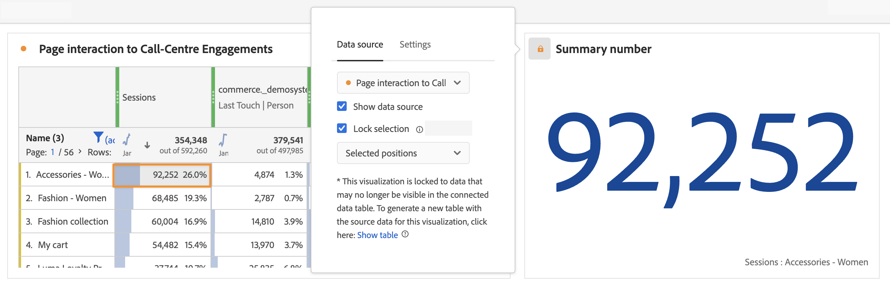

# Gegevensbronnen beheren {#manage-data-sources}

<!-- markdownlint-disable MD034 -->

>[!CONTEXTUALHELP]
>id="cja_workspace_freeformtable_lockselection"
>title="Selectie vergrendelen"
>abstract="Schakel deze instelling in om de visualisatie te vergrendelen op de geselecteerde posities of op de geselecteerde items in de gegevensbron."

<!-- markdownlint-enable MD034 -->

<!-- markdownlint-disable MD034 -->

>[!CONTEXTUALHELP]
>id="cja_workspace_freeformtable_lockselection_showtable"
>title="Tabel tonen"
>abstract="Als u **[!UICONTROL Show table]** selecteert, wordt een nieuwe gegevensbron voor uw huidige visualisatie gegenereerd, los van de oorspronkelijke gegevensbron."

<!-- markdownlint-enable MD034 -->

Door visualisatie te synchroniseren kunt u bepalen welke datatabel of gegevensbron overeenkomt met een visualisatie.

>[!TIP]
>
>U kunt zien welke visualisaties door de kleur van  naast de titel van visualisaties verwant zijn. Gelijktijdige kleuren betekenen dat visualisaties zijn gebaseerd op dezelfde gegevensbron.
>

U kunt de gegevensbron tonen of verbergen. U kunt de selectie ook vergrendelen op geselecteerde posities of geselecteerde items. Deze instellingen bepalen hoe de visualisatie verandert (of niet verandert) wanneer er nieuwe gegevens binnenkomen.

| Optie | Beschrijving |
|--- |--- |
| **[!UICONTROL Data source]** | Selecteer in het vervolgkeuzemenu de gegevensbron waarop de visualisatie is gebaseerd. |
| **[!UICONTROL Linked visualizations]** | Hiermee geeft u alle gekoppelde visualisaties weer. Is van toepassing op de gegevensbron (vrije-vormlijst). |
| **[!UICONTROL Show data source]** | Hiermee kunt u de gegevensbron (vrije-vormentabel) die overeenkomt met de visualisatie, weergeven of verbergen. |
| **[!UICONTROL Lock Selection]** | Selecteer deze optie om visualisatie  aan de gegevens te sluiten die momenteel in de overeenkomstige gegevenslijst worden geselecteerd. Als deze optie is ingeschakeld, selecteert u tussen:  <ul><li>**Geselecteerde Plaatsen**: De visualisatie is gesloten op de **posities** die in de overeenkomstige gegevenslijst worden geselecteerd. Deze posities blijven zichtbaar, zelfs als de specifieke punten in deze posities veranderen (bijvoorbeeld toe te schrijven aan het sorteren of het filtreren). Selecteer deze optie bijvoorbeeld als u de vijf belangrijkste campagnemenamen in de gegevensbron in deze visualisatie altijd wilt weergeven. Geen kwestie welke campagnemenamen verschijnen.</li> <li>**Geselecteerde Punten**: De visualisatie is gesloten op de specifieke **punten** momenteel geselecteerd in de overeenkomstige gegevenslijst. Deze items blijven zichtbaar, zelfs als ze een andere positie innemen onder de items in de tabel. Selecteer deze optie bijvoorbeeld als u altijd dezelfde vijf specifieke campagnemenamen wilt weergeven die in de gegevensbron in deze visualisatie worden vermeld. Hoe die campagnenamen er ook uitzien.</li></ul>Als de visualisatie is vergrendeld voor gegevens die niet meer zichtbaar zijn in de tabel met verbonden gegevens, kunt u een nieuwe tabel genereren. Selecteer **[!UICONTROL Show table]** om een nieuwe gegevensbron voor uw huidige visualisatie, los van de originele gegevensbron te produceren. |
