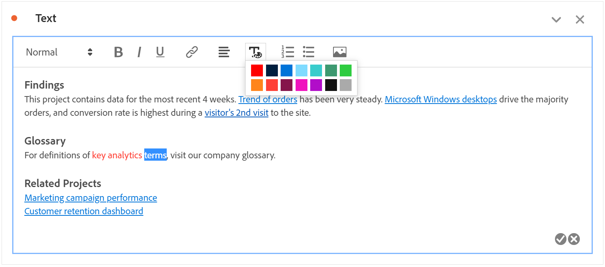
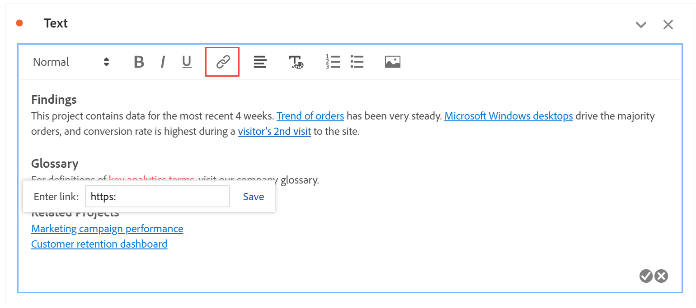

# Tekst {#text-visualization}

<!-- markdownlint-disable MD034 -->

>[!CONTEXTUALHELP]
>id="cja_workspace_text_button"
>title="Tekst"
>abstract="Voeg een user-defined rijke tekstvisualisatie aan uw project toe."

<!-- markdownlint-enable MD034 -->

Om user-defined rijke tekst aan uw project van Workspace toe te voegen, kunt u a ](/help/assets/icons/Text.svg) **[!UICONTROL Text]** visualisatie gebruiken van de Tekst  **[!UICONTROL Text]** visualisatie toe. Zie [ een visualisatie aan een paneel ](freeform-analysis-visualizations.md#add-visualizations-to-a-panel) toevoegen.

1. Selecteer **[!UICONTROL Edit description]** in een deelvenster of in een visualisatie.

   Selecteer  wanneer gebeëindigd het uitgeven van de beschrijving, uitgezochte  om te annuleren.

U kunt de opmaak van de tekst wijzigen, hyperlinks toevoegen en afbeeldingen toevoegen.

## Opmaak aanpassen {#format}

Wanneer u het tekstvak of de beschrijving bewerkt, kunt u de tekengrootte (kopniveaus), de kleur, de opmaak (vet, cursief, onderstrepen) en de uitlijning van geselecteerde tekst aanpassen. U kunt ook lijsten met opsommingstekens en nummers toevoegen.

## Hyperlinks toevoegen {#hyperlinks}

Om een hyperlink toe te voegen, benadruk de tekst en selecteer  in het menu. U kunt hyperlinks gebruiken om verdere hulp aan uw projectontvangers te verlenen. De hyperlinks kunnen met externe websites, documentatiepagina&#39;s, [ projecten van Workspace, panelen, of visualisaties ](https://experienceleague.adobe.com/en/docs/analytics/analyze/analysis-workspace/curate-share/shareable-links), en meer verbinden.

## Afbeeldingen toevoegen {#images}

Om een beeld aan uw project toe te voegen, selecteer  in het menu en neem een openbaar beeld URL op. De afbeeldings-URL moet openbaar toegankelijk zijn, beginnen met `https` en de notatie `.png` , `.jpeg` , `.jpg` of `.gif` hebben. Statische en geanimeerde afbeeldingen worden ondersteund.

