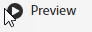

# Annotaties delen in mobiele scoreborden

U kunt annotaties weergeven die zijn gemaakt in Workspace, in Mobiele Scorecards. Hierdoor kunt u contextuele gegevensnuances en inzichten over uw organisatie en campagnes rechtstreeks delen binnen Mobile Scorecard-projecten, die kunnen worden weergegeven in de mobiele app Analytics dashboards.

## Oppervlakannotaties in mobiele scoreborden

Als u annotaties in mobiele scorecards wilt weergeven, maakt u eerst de annotatie via Workspace-projecten of via het menu Componenten.

Voor informatie over het maken van annotaties raadpleegt u [Annotaties maken](create-annotations.md). Annotaties worden standaard uitgeschakeld in mobiele scorecards. Deze annotaties moeten zijn ingeschakeld voor elke scorecard die u wilt laten verschijnen in mobiele scorecards.

1. Schakel notities in. Als u annotaties wilt inschakelen, raadpleegt u [Annotaties in- of uitschakelen](overview.md#annotations-on-off).

1. Maak een annotatie en zorg ervoor dat deze wordt gedeeld met al uw projecten. Als u een annotatie wilt maken in Workspace, raadpleegt u [Annotaties maken](create-annotations.md).

1. Selecteren **[!UICONTROL Show annotations]** om de annotatie weer te geven in Mobile Scorecards.

   

1. Bevestig dat Annotaties tonen is geselecteerd, ga naar **[!UICONTROL Project]** > **[!UICONTROL Project info and settings]**.

   

## Annotaties weergeven in mobiele scènes

Wanneer annotaties zijn ingeschakeld, zijn de annotatiepictogrammen zichtbaar in de Scorecard Builder. Annotaties worden alleen weergegeven in grafieken en tabellen in de gedetailleerde weergave. De annotaties zijn niet zichtbaar van de belangrijkste tegelweergave van de scorecard.

Wanneer annotatiepictogrammen zichtbaar zijn, kunt u de annotaties op het canvas van de builder niet volledig weergeven of ermee werken. In de modus Voorvertoning kunt u annotaties weergeven en gebruiken zoals deze in de app worden weergegeven. 

Annotatiekleuren worden geselecteerd wanneer de annotatie wordt gemaakt in de werkruimte. Grijsaantekeningen duidden op de aanwezigheid van meer dan één aantekening.  

## Diagramannotaties weergeven

| Datum | Weergave |
| --- | --- |
| **[!UICONTROL Single da]y** |    |
| **[!UICONTROL Date range]** |  |
| **[!UICONTROL Overlapping annotations]** |   Tik op een annotatiepictogram om de annotatiedetails weer te geven in de app Analytics dashboards.   Wanneer u een annotatie in een diagram weergeeft, kunt u naar links en naar rechts vegen om door alle annotaties in het diagram te navigeren. Als u een annotatie in de tabel weergeeft, veegt u naar links en naar rechts om door alle annotaties te navigeren die aan dat rijitem in de tabel zijn gekoppeld.      In grafieken zonder tijdbasis *x-as*, zoals de donut- of horizontale staafdiagrammen, kunnen annotaties die van toepassing zijn op het diagram worden weergegeven door te tikken op het pictogram in de rechterbenedenhoek.    |
