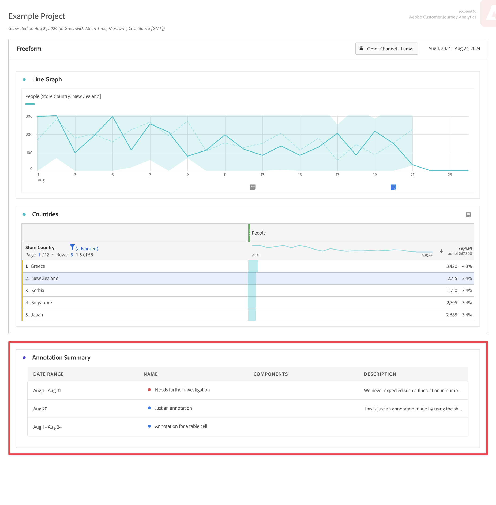

# Annotaties weergeven

Annotaties worden iets anders weergegeven, afhankelijk van de locatie waar ze worden weergegeven en van het feit of ze één dag of een datumbereik beslaan.

## Annotaties weergeven in lijngrafieken of tabellen

| Visualisatie   Type | Beschrijving |
| --- | --- |
| **Lijn &#x200B;** **Enige dag** | Wanneer u  in een lijnvisualisatie selecteert annoteert, ziet u popup met de annotatiedetails.   om de annotatie in de [&#x200B; Bouwer van de Annotatie uit te geven &#x200B;](create-annotations.md#annotation-builder) uitgezocht uitgeeft . Om de annotatie te schrappen, uitgezochte . |
| **waaier van de Lijn &#x200B;** **Datum** | Wanneer u  selecteert ziet u popup met de annotatiedetails en een lijn bij de bodem die op de datumwaaier wijzen.  om de annotatie in de [&#x200B; Bouwer van de Annotatie uit te geven &#x200B;](create-annotations.md#annotation-builder) uitgezocht uitgeeft . Om de annotatie te schrappen, uitgezochte . |
| **Vrije-vormentabel** | In een tabel met vrije vorm hebt u toegang tot alle annotaties via de knop Annotaties rechtsboven in de visualisatie. Selecteer  om a (het scrollen lijst) van alle annotaties te zien.   voor elke annotatie, kunt u  om de annotatie in de [&#x200B; Bouwer van de Annotatie &#x200B;](create-annotations.md#annotation-builder) uit te geven en  om de annotatie te schrappen. |

{style="table-layout:auto"}

## Annotaties weergeven in een PDF

Wanneer u uw project downloadt als een PDF of uw project verzendt als een PDF, worden annotaties in PDF samengevat in het overzichtsgedeelte Annotatie.

