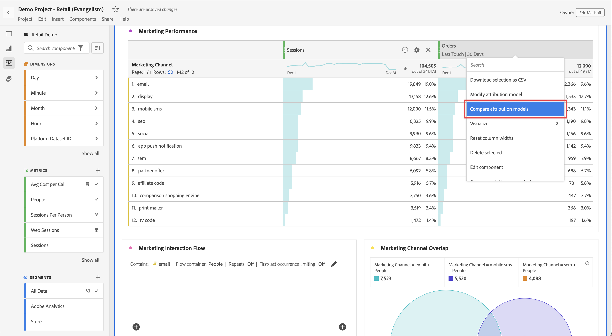

# Metrics

Met cijfers kunt u gegevenspunten in Analysis Workspace kwantificeren. Deze worden meestal gebruikt als kolommen in een visualisatie en zijn gekoppeld aan afmetingen.

## Soorten metingen

De Adobe biedt verscheidene types van metriek voor gebruik in Analysis Workspace aan:

* **Standaard metriek**: Voorbeeld van standaardmetriek zijn Mensen, Zittingen, Gebeurtenissen.

* **Berekende metriek** : Gebruiker-bepaalde metriek die op standaardmetriek, statische aantallen, of algoritmische functies gebaseerd zijn.

* **Berekende metrische malplaatjes**   : Adobe-gedefinieerde metriek die zich op dezelfde manier gedraagt als berekende metriek. U kunt ze ongewijzigd gebruiken in Workspace-projecten of een kopie opslaan om de logica ervan aan te passen.

U kunt zien of metrisch wordt goedgekeurd  of niet. Als u meer details op metrisch wilt, beweegt over metrisch, en selecteert .

Metriek is flexibel in het gebruik binnen Analysis Workspace. Sleep metrisch aan een lege lijst Freeform om te zien die metrisch over de de datumperiode van het project trended. U kunt metrisch ook slepen wanneer een afmeting aanwezig is om dat metrisch vergeleken bij elk afmetingspunt te zien. Als u een metrische waarde boven op een bestaande metrische koptekst sleept, wordt deze vervangen en als u een metrische waarde naast een koptekst sleept, ziet u beide meetgegevens naast elkaar.

## Metriek gebruiken in Analysis Workspace

Metriek kan op verschillende manieren in Analysis Workspace worden gebruikt. Voor informatie over hoe te om metriek en andere soorten componenten aan Analysis Workspace toe te voegen, zie [ de componenten van het Gebruik in Analysis Workspace ](/help/components/use-components-in-workspace.md).

## Berekende waarden maken

Met berekende meetwaarden kunt u gemakkelijk zien hoe de meetgegevens op elkaar betrekking hebben met behulp van eenvoudige operatoren of statistische functies.

Er zijn verschillende manieren om berekende metriek te maken. De methode u kiest bepaalt of berekende metrisch van de componentenlijst over alle projecten, of slechts in het project beschikbaar is waar het werd gecreeerd.

### Berekende waarden maken voor alle projecten

U kunt de berekende metrische bouwer gebruiken om berekende metriek tot stand te brengen. Wanneer gecreeerd op deze manier, zijn de berekende metriek beschikbaar in de componentenlijst en kunnen dan in projecten door uw organisatie worden gebruikt.

Voor informatie over hoe te om tot de berekende metriebouwer toegang te hebben, zie [ metriek bouwen ](/help/components/calc-metrics/cm-workflow/cm-build-metrics.md).

### Berekende waarden maken voor één project

U kunt snelle berekende metriek tot stand brengen die slechts voor het project beschikbaar zijn waar zij werden gecreeerd.

Om berekende metrisch voor één enkel project tot stand te brengen:

1. Open in Analysis Workspace het project waar u de berekende metrische waarde wilt maken.

1. Klik in een vrije-vormlijst met de rechtermuisknop op een of meer cellen in de koptekstkolom en selecteer vervolgens **[!UICONTROL Create metric from selection]**

    benadrukt

1. Als u alleen voor dit project een berekende metrische waarde wilt maken, kiest u een van de volgende opties:

   * [!UICONTROL **Splitsen**]

   * [!UICONTROL **trekt af**]

   * [!UICONTROL **voeg toe**]

   * [!UICONTROL **vermenigvuldigen**]

   Of, om de berekende metrische bouwer te openen en berekende metrisch voor alle projecten tot stand te brengen, selecteer [!UICONTROL **Open in Berekende Metrische Bouwer**], dan met [ bouwt metriek ](/help/components/calc-metrics/cm-workflow/cm-build-metrics.md) verder.

[ Berekende Metriek: Implementatie-minder metriek ](https://experienceleague.adobe.com/docs/analytics-learn/tutorials/components/calculated-metrics/calculated-metrics-implementationless-metrics.html) (3:42)

## Metrische gegevens vergelijken met verschillende attribuutmodellen

Als u snel en gemakkelijk één attributiemodel aan een andere wilt vergelijken, klik metrisch met de rechtermuisknop aan en selecteer **[!UICONTROL Compare Attribution Models]**:

Met deze sneltoets kunt u snel en eenvoudig een attributiemodel vergelijken met een ander attribuut zonder dat u dit model in een metrische modus hoeft te slepen en tweemaal hoeft te configureren.
