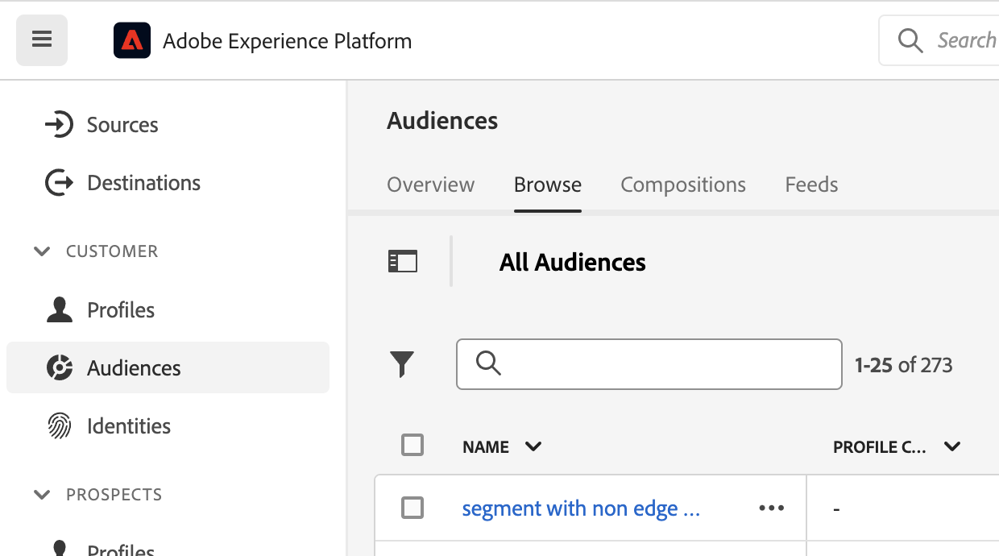

# Soorten publiek maken en publiceren

>[!NOTE]
>
>Deze functionaliteit is momenteel in [beperkte tests](/help/release-notes/releases.md).

Dit onderwerp bespreekt hoe te om publiek tot stand te brengen en te publiceren dat in Customer Journey Analytics (CJA) wordt ontdekt aan [Klantprofiel in realtime](https://experienceleague.adobe.com/docs/experience-platform/profile/home.html?lang=en) in Adobe Experience Platform voor klantgerichtheid en personalisatie.

Lees deze [overzicht](/help/components/audiences/audiences-overview.md) kennis te nemen van het CJA-publiek.

## publiek maken

1. U kunt op drie manieren een publiek maken:

   | Aanmaakmethode | Details |
   | --- | --- |
   | Van de belangrijkste **[!UICONTROL Components]>[!UICONTROL Audiences]** menu | De pagina Soortbeheer wordt geopend. Klikken **[!UICONTROL Create audience]** en de [!UICONTROL Audience builder] wordt geopend. |
   | Vanuit een tabel voor vrije vorm | Klik met de rechtermuisknop op een item in een tabel voor vrije vorm en selecteer **[!UICONTROL Create an audience from selection]**. Met deze methode wordt het filter vooraf gevuld met de dimensie of het dimensie-item dat u in de tabel hebt geselecteerd. |
   | Via de interface voor het maken/bewerken van filters | Schakel het selectievakje **[!UICONTROL Create an audience from this filter]**. Met deze methode wordt het filter vooraf gevuld. |

   {style=&quot;table-layout:auto&quot;}

1. Het publiek opbouwen.

   Configureer deze instellingen voordat u het publiek kunt publiceren.

   

   | Instelling | Beschrijving |
   | --- | --- |
   | [!UICONTROL Name] | De naam van het publiek. |
   | [!UICONTROL Tags] | Alle tags die u aan het publiek wilt toewijzen voor organisatorische doeleinden. U kunt een bestaande tag gebruiken of een nieuwe tag invoeren. |
   | [!UICONTROL Description] | Voeg een goede beschrijving van het publiek toe om het van anderen te onderscheiden. |
   | [!UICONTROL Refresh frequency] | De frequentie waarmee u het publiek wilt vernieuwen.<ul><li>U kunt kiezen om een eenmalig publiek te maken (standaard) dat niet hoeft te worden vernieuwd. Dit is bijvoorbeeld handig voor specifieke eenmalige campagnes.</li><li>U kunt andere vernieuwingsintervallen selecteren. Voor de frequentie van 4 uur, is er een grens van 150 publiek, aangezien dit vernieuwingstarief zeer verwerkingsintensief is. Voor andere intervallen is er geen maximumaantal doelgroepen.</li></ul> |
   | Vervaldatum | Wanneer het publiek stopt met vernieuwen. De standaardwaarde is 1 jaar vanaf de aanmaakdatum. Het verouderen van het publiek wordt op dezelfde manier behandeld als het verlopen van geplande rapporten - admin krijgt een e-mail een maand alvorens het publiek verloopt. |
   | Zoekvenster vernieuwen | Hiermee geeft u aan hoe ver u wilt teruggaan in uw gegevensvenster om dit publiek te maken. De maximale waarde. is 90 dagen. |
   | [!UICONTROL One-time date range] | Datumbereik wanneer u wilt dat het eenmalig publiek wordt gepubliceerd. |
   | [!UICONTROL Filter] | Filters zijn de belangrijkste invoer voor het publiek. U kunt maximaal 20 filters toevoegen. Deze filters kunnen worden aangesloten met `And` of `Or` operatoren. |
   | [!UICONTROL View sample IDs] | Een voorbeeld van id&#39;s in dit publiek. Gebruik de zoekbalk om te zoeken naar voorbeeld-id&#39;s. |

   {style=&quot;table-layout:auto&quot;}

1. De gegevensvoorvertoning interpreteren.

   De voorvertoning voor het publiek wordt weergegeven in de rechtertrack. Het maakt een geavanceerde analyse mogelijk van het publiek dat u hebt gemaakt.

   

   | Voorvertoning instellen | Beschrijving |
   | --- | --- |
   | [!UICONTROL Data preview] venster | Het datumbereik voor het publiek. |
   | [!UICONTROL Total people] | Een samenvattingsnummer van het totale aantal personen in dit publiek. Het kan tot 100 miljoen mensen gaan. Als uw publiek meer dan 100 miljoen mensen telt, moet u de omvang van het publiek reduceren voordat u het kunt publiceren. |
   | [!UICONTROL Audience size limit] | Toont hoe ver van de 100 miljoen grens dit publiek is. |
   | [!UICONTROL Estimated audience return] | Deze instelling is handig als u klanten in dit publiek die terugkeren naar uw site opnieuw wilt richten. (Met andere woorden, die opnieuw in deze dataset worden gezien.) 
Hier kunt u het tijdkader (volgende 7 dagen, volgende 2 weken, volgende maand) selecteren voor het geschatte aantal klanten dat kan terugkeren. |
   | [!UICONTROL Estimated to return] | Dit aantal geeft u een geschat aantal terugkerende klanten over het tijdkader dat u van de drop-down lijst selecteerde. We kijken naar de historische waarde van de kroon voor dit publiek om dit getal te voorspellen. |
   | [!UICONTROL Preview metrics] | Met deze instelling kunt u naar specifieke maateenheden kijken om te zien of dit publiek een onevenredig grote bijdrage levert aan deze metrische waarde, zoals &#39;[!UICONTROL Revenue]&#39; of &#39;[!UICONTROL Average time on site]&quot;. Het geeft u het totale aantal metrisch, evenals het percentage van het totaal het vertegenwoordigt. U kunt elke metrische waarde selecteren die beschikbaar is in de gegevensweergave. |
   | Ingesloten naamruimten | De specifieke naamruimten die zijn gekoppeld aan de personen in uw publiek. Voorbeelden zijn ECID, CRM-id, e-mailadressen enzovoort. |
   | Sandbox | De sandbox met Experience Platform waarin dit publiek zich bevindt. Wanneer u dit publiek naar het Platform publiceert, kunt u er alleen binnen de grenzen van deze sandbox mee werken. |

   {style=&quot;table-layout:auto&quot;}

1. Als alles er goed uitziet, klikt u op **[!UICONTROL Publish]**.

   Als alles goed ging, ontvangt u een bevestigingsbericht dat het publiek werd gepubliceerd.

1. Klikken **[!UICONTROL View audience in AEP]** in hetzelfde bericht en wordt u doorgestuurd naar de gebruikersinterface van Segment in Adobe Experience Platform. Zie hieronder voor meer informatie.

## CJA-publiek gebruiken in Experience Platform

U kunt CJA-publiek in Platform bekijken door naar **[!UICONTROL Segments]** > **[!UICONTROL Create segments]** > **[!UICONTROL Audiences]** tab > **[!UICONTROL CJA Audiences]**.

U kunt CJA-publiek naar de segmentdefinitie voor AEP-segmenten slepen.

Als u ervoor kiest om deze Publiek naar het meer van Gegevens van AEP uit te voeren, zal het als dataset verschijnen die aan de Klasse van het Schema van het Individuele Profiel XDM in overeenstemming is:

## Volgende stappen

* Ga naar de [Gebruikersinterface voor beheer](/help/components/audiences/manage.md).
