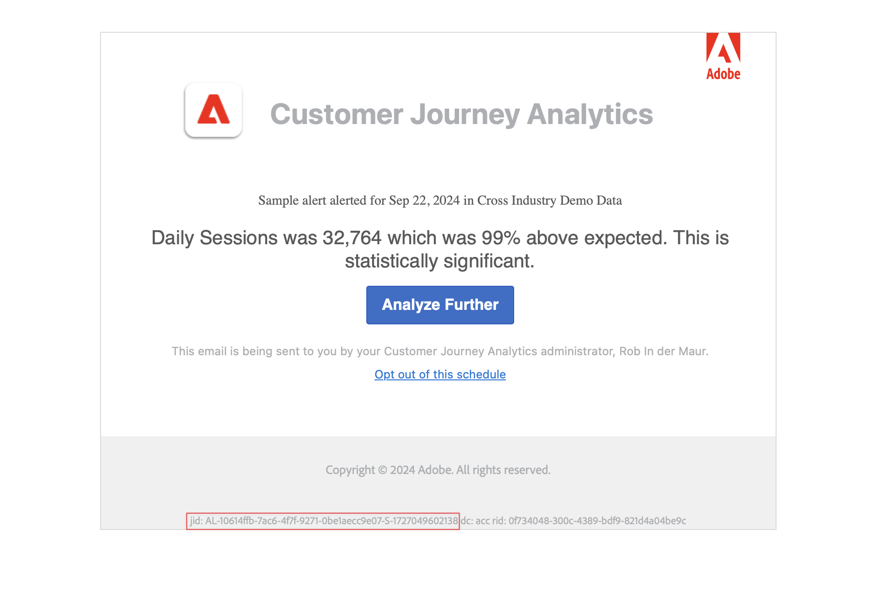

# Waarschuwingen maken {#create-alerts}

<!-- markdownlint-disable MD034 -->

>[!CONTEXTUALHELP]
>id="components_alerts_timegranularity"
>title="Tijdkorreligheid"
>abstract="De tijdsgranulariteit verwijst naar hoe vaak de waarschuwing wordt gecontroleerd."

<!-- markdownlint-enable MD034 -->

>[!NOTE]
>
>Het gebruiken van alarm met anomalieopsporing (die ook als _Intelligente Alarm_ wordt bekend) is beschikbaar slechts aan organisaties met een pakket van Customer Journey Analytics Prime of Ultimate.

Met waarschuwingen in Customer Journey Analytics kunt u op basis van gewijzigde percentages of specifieke gegevenspunten op de hoogte worden gesteld. Afhankelijk van het Customer Journey Analytics-pakket kunt u ook waarschuwingen gebruiken die op basis van afwijkende drempelwaarden moeten worden geactiveerd.

Voor meer gedetailleerde informatie over alarm, zie [&#x200B; het overzicht van Alarm &#x200B;](/help/components/c-intelligent-alerts/intelligent-alerts.md).

Een waarschuwing maken:

<!-- Note that there are difference in how alerts are created in CJA vs AA. In AA you can create alerts from the Workspace menu and using a shortcut; these are not possible in CJA... -->

1. Selecteer in Customer Journey Analytics **[!UICONTROL Components]** > **[!UICONTROL Alerts]** . In de [&#x200B; manager van het Alarm &#x200B;](alert-manager.md), uitgezochte  **[!UICONTROL Add]** om een nieuw alarm tot stand te brengen, of om het even welk vermeld alarm te selecteren om een bestaand alarm te wijzigen.

1. Selecteer in Analysis Workspace een of meer regelitems in een vrije-vormentabel en selecteer **[!UICONTROL Create alert from selection]** in het contextmenu. Deze actie vult onmiddellijk de waakzame bouwer vooraf in om een alarm met de correcte metriek en de segmenten tot stand te brengen.

De [&#x200B; Waakzame bouwer &#x200B;](#alert-builder) interfacevertoningen.

## Alert builder

De waarschuwingsbuilderinterface is vertrouwd met de interface die u gebruikt wanneer u segmenten of berekende metriek in Customer Journey Analytics maakt:

Geef de volgende gegevens op in de wizard Alarm Builder voor een waarschuwing:

| Element | Beschrijving |
|---------|----------|
| **[!UICONTROL Title]** | Geef een naam op voor de waarschuwing. De waakzame naam zou de naam van het rapport of de metriedrempel kunnen bevatten. |
| **[!UICONTROL Description (optional)]** | Geef een beschrijving voor de waarschuwing op. |
| **[!UICONTROL Time granularity]** | Selecteer hoe vaak u de metrische waarde wilt controleren: Dagelijks, Wekelijks of Maandelijks.
<b> Nota </b>: Voor gegevensmeningen met a [&#x200B; douanekalender &#x200B;](/help/data-views/create-dataview.md#calendar), wordt de maandelijkse granulariteit niet gesteund in de Waakzame Bouwer.<!--true?-->
 |
| **[!UICONTROL Recipients]** | Geef op waar de waarschuwing kan worden verzonden. Een waarschuwing kan naar een gebruiker van de Analyse, een groep van Analytics, een onbewerkt e-mailadres, of naar een telefoonaantal worden verzonden.
<b> Belangrijk </b>: Het telefoonaantal moet door a `+` en a [&#x200B; landcode &#x200B;](https://countrycode.org/) worden voorafgegaan.

Het e-mailbericht dat een gebruiker ontvangt na een waarschuwing:

 |
| **[!UICONTROL Expiration date]** | Stel de datum en tijd in waarop de waarschuwing moet verlopen. |
| **[!UICONTROL Delay]** | De tijd die nodig is voordat de gegevens zijn voltooid en beschikbaar zijn voor rapportage in Customer Journey Analytics, varieert per organisatie, meestal van 3 tot 9 uur na de tijd van de gegevensgebeurtenis. Voor waarschuwingen is accuraat, moeten de gebeurtenisgegevens voor een bepaald gebeurtenisbereik volledig zijn, wat betekent dat Adobe geen gebeurtenisgegevens meer ontvangt voor het opgegeven gebeurtenisbereik.
Voor deze vertraging in de innametijd hebben waarschuwingen een standaardvertraging van 9 uur voordat ze worden verzonden.

U kunt de standaardvertraging van 9 uur aanpassen aan een willekeurige locatie tussen 0 en 24 uur. Als u echter de vertraging tot minder dan 9 uur verkort, kan dit betekenen dat u onvolledige gegevens rapporteert, wat leidt tot onjuiste waarschuwingsinformatie.

Overweeg het volgende wanneer het verminderen van de vertragingstijd:
<ul><li>**Begrijp gegevensbeschikbaarheid tegenover gegevensvolledigheid**: De gegevens van de partij worden opgenomen in een dataset van Experience Platform slechts na een periode van 3 tot 9 uur. Voor nauwkeurige waarschuwingen moet de gegevensinvoer volledig zijn, met alle partijgegevens beschikbaar in de dataset.</li><li>**bepaalt hoe lang het voor uw gegevens vergt om volledig en beschikbaar in de dataset** te zijn: De tijden van de opname van gegevens verschillen door organisatie. Zorg ervoor dat de vertragingstijd u voor waakzame levering kiest het zelfde of minder frequent is dan de tijd het voor de partijgegevens neemt om in de dataset van het Platform beschikbaar te zijn <!--add link? -->.</li>
**Uiteinde:** de nauwkeurigste manier om de tijd te kennen die voor alle partijgegevens wordt vereist om volledig en in de dataset van Experience Platform worden opgenomen is de gegevensingenieurs in uw organisatie te raadplegen.

Alternatief, kunt u een algemeen idee krijgen van hoe lang het voor de partijlevering in uw organisatie om in de dataset van het Platform nodig heeft beschikbaar te zijn. De volgende vrije-vormtabel maken in Analysis Workspace:
<ol><li>In een vrije vormlijst in Analysis Workspace, voeg metrische en 3&rbrace; dimensie van de Dag van a [!UICONTROL **Gebeurtenissen**] en van a [!UICONTROL **toe.**]</li><li>Onderdeel de [!UICONTROL **dimensie van de Dag 0&rbrace; {gebruikend een**] 3} dimensie van Uren &lbrace;.[!UICONTROL **&#x200B;**]
Uren zonder gegevens worden weergegeven als 0.
</li></ol><li>**Rekening voor fouten in uw berekeningen**: Als u de standaardvertragingstijd vermindert, vorm de vertraging minstens een uur langer dan de tijd het uw organisatie voor volledigheid van gegevensopname neemt. Als er bijvoorbeeld een vertraging van 3 uur is voordat de gegevens zijn ingevoerd, moet u de vertraging instellen op 4 uur.</li></ul>
Voor meer informatie, zie [&#x200B; de ingangstijden van Gegevens in Customer Journey Analytics &#x200B;](/help/components/c-intelligent-alerts/alerts-feature-comparison.md#data-ingestion-times-vary-in-customer-journey-analytics) in de de eigenschapvergelijking van het artikel [&#x200B; Alarm variëren: Customer Journey Analytics en Adobe Analytics &#x200B;](/help/components/c-intelligent-alerts/alerts-feature-comparison.md). |
| **[!UICONTROL Send an alert when]** | [!UICONTROL **om het even welk van deze metrieke trekker**]: Sleep en dalingsmetriek (met inbegrip van berekende metriek) hier om trekkers voor het alarm tot stand te brengen.
Een **&quot;incompatibele componenten&quot;** bericht verschijnt als niet alle metriek, dimensies, of segmenten in de alarm compatibel zijn met de momenteel geselecteerde gegevensmening.

Bepaal de drempel die metrisch moet overschrijden alvorens een alarm wordt geplaatst. U kunt deze waarde instellen op een drempel en vervolgens op een van de volgende voorwaarden:
<ul><li>anomalie bestaat</li><li>anomalie is groter dan verwacht</li><li>anomalie is minder dan verwacht</li><li>is boven of gelijk aan</li><li>is lager of gelijk aan</li><li>wijzigingen door</li><li>U kunt een drempel instellen van 90%, 95%, 99%, 99,75% en 99,9%.</li></ul>
[!UICONTROL **met elk van deze filters**]: Sleep en dalingssegmenten of dimensies om filters aan het alarm toe te voegen. Bijvoorbeeld, zou het toevoegen van a *Mobiele Apparaten slechts* segment betekenen dat de regel slechts voor mobiele apparaten teweegbrengt. U kunt extra filters toevoegen door een EN verklaring te gebruiken. U kunt EN of OF regels toevoegen door het tandwielpictogram te klikken.

Zie [&#x200B; Alarm - de gevallen van het gebruiks &#x200B;](/help/components/c-intelligent-alerts/alerts-use-cases.md) gevallen.
 |
| **[!UICONTROL Preview]** | De interactieve waarschuwingsvoorvertoning laat zien hoe vaak, ongeveer, een waarschuwingsbericht wordt geactiveerd op basis van eerdere ervaringen.
Als u bijvoorbeeld de tijdsgranulariteit instelt op dagelijks, kan de voorvertoning u vertellen dat de waarschuwing gedurende een bepaalde metrische x-maal in de afgelopen 30 of 31 dagen zou zijn geactiveerd.

Als u vindt dat teveel alarm wordt teweeggebracht, kunt u de drempel in [&#x200B; aanpassen leidt alarm &#x200B;](/help/components/c-intelligent-alerts/alert-manager.md).

{width="50%"}
 |
