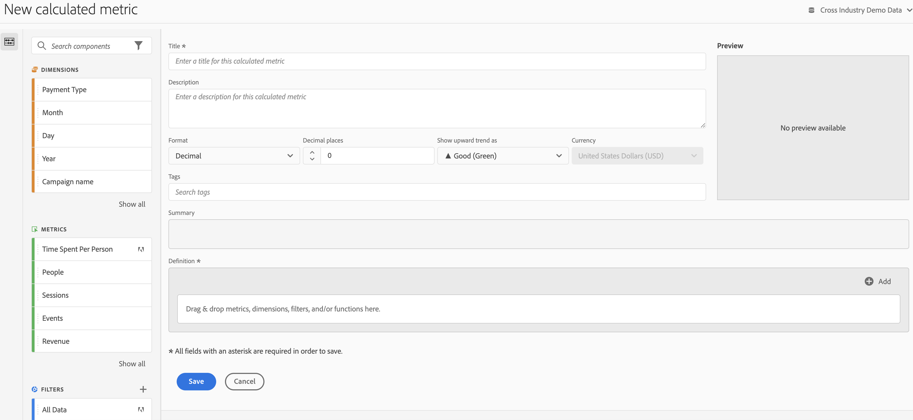

# Cijfers samenstellen

De Berekende Bouwer van Metriek verstrekt een canvas om Dimension, Metriek, Filters, en Functies te slepen en te laten vallen om douanemetriek tot stand te brengen die op containerhiërarchische logica, regels, en exploitanten wordt gebaseerd. Met dit geïntegreerde ontwikkelingshulpmiddel kunt u eenvoudige berekende metriek of complexe, berekende metriek bouwen en opslaan.

Er zijn verscheidene manieren om aan Berekende Metrische Bouwer te krijgen:

* Open in Analysis Workspace een project en klik op  **[!UICONTROL + New]** > **[!UICONTROL Create Metric]** .
* In [!DNL Analytics], ga naar **[!UICONTROL Components]** > **[!UICONTROL Calculated Metrics]**.

* Klikken **[!UICONTROL + Add]** boven aan het dialoogvenster [Berekend metrisch beheer](/help/components/calc-metrics/cm-workflow/cm-manager.md), of

* Ga naar **[!UICONTROL Analytics]** > **[!UICONTROL Reports]**, opent u een willekeurig rapport en klikt u op het pictogram Metriek   om de metrieke spoorstaaf te verhogen, dan klik **[!UICONTROL Add]**.

## UI-componenten {#ui-components}

| Veld | Beschrijving |
| --- | --- |
| Titel | De naam van de metrische waarde is verplicht. U kunt metrisch opslaan tenzij het wordt genoemd. |
| Beschrijving | Geef het een gebruikersvriendelijke beschrijving om te tonen waarvoor het wordt gebruikt en het van gelijkaardige degenen te onderscheiden. De beschrijving wordt ook weergegeven in een rapport. Het is beter NIET om de formule in de beschrijving te zetten - in plaats daarvan, beschrijf wat deze metrisch zou moeten en niet zouden moeten worden gebruikt. (De formule wordt geproduceerd aangezien u metrisch bouwt, onder de Summiere rubriek. Dientengevolge, is het niet nodig om de formule aan de beschrijving toe te voegen.) |
| Indeling | U kunt kiezen uit Decimaal, Tijd, Percentage en Valuta. |
| Decimalen | Toont hoeveel decimalen in het rapport zullen worden getoond. Het maximumaantal decimalen dat u kunt opgeven, is 10. |
| Naar boven trends tonen als... | Deze metrische polariteit die toont of de Analyse een stijgende trend in metrisch als goed (groen) of slecht (rood) zou moeten beschouwen. Als gevolg hiervan zal de grafiek van het rapport als groen of rood worden weergegeven wanneer het omhoog gaat. |
| Valuta | De basisvaluta voor deze gegevensweergave. |
| Tags | Tags zijn een goede manier om metriek in te delen. Alle gebruikers kunnen tags maken en een of meer tags toepassen op een metrische waarde. U kunt echter alleen labels zien voor de segmenten die u bezit of die met u zijn gedeeld. Welke soorten markeringen moet u creëren? Hier volgen enkele suggesties voor handige tags:<ul><li>Tags die zijn gebaseerd op teamnamen, zoals Sociale marketing, Mobiele marketing.</li><li>Projectlabels (analysetags), zoals analyse van de pagina Entry.</li><li>Categorielabels: Mannen; geografie.</li><li>Workflowlabels: goed te keuren; Gecurreerd voor (een specifieke bedrijfseenheid)</li></ul> |
| Samenvatting | De [!UICONTROL Summary] de formule werkt op om het even welk ogenblik bij u een verandering in de metrische definitie aanbrengt. Deze formule wordt ook weergegeven in de metrische rail links wanneer u de muisaanwijzer boven een metrische waarde houdt en op het pictogram klikt. |
| Definitie | Dit is waar u in metriek/berekende metriek, filters, en/of functies sleept om berekende metrisch te bouwen. Als u in berekende metrisch sleept, zal het zijn metrische definitie automatisch uitbreiden. U kunt definities nesten met containers. In tegenstelling tot gesegmenteerde containers, functioneren deze containers als een wiskundige uitdrukking en bepalen de orde van verrichtingen. |
| Operator | [!UICONTROL Divided by] is de standaardoperator, plus de operatoren +, - en x. |
| Voorvertoning | Hiermee kunt u snel informatie lezen over mogelijke fouten. De voorvertoning beslaat de laatste 90 dagen. Dit is een manier om aanvankelijk te graven of u de juiste componenten voor uw metrisch hebt geselecteerd. Een onverwacht resultaat zou betekenen u een tweede blik bij de metrische definitie moet nemen. |
| Productcompatibiliteit | De verenigbaarheid van het product toont u of metrisch met Volledig Verwerkte Gegevens compatibel is. |
| Toevoegen | Voor alle soorten berekende metriek, kunt u containers en statische aantallen aan de definitie toevoegen. Voor geavanceerde berekende metriek, kunt u filters en functies ook toevoegen.<ul><li>Containers werken als een wiskundige expressie en bepalen de volgorde van bewerkingen. Dus alles in een container wordt verwerkt voor de volgende bewerking.</li><li>Als u een segment naar een container sleept, wordt alles in die container gesegmenteerd. (Alleen geavanceerde berekende cijfers)</li><li>U kunt meerdere filters in een container stapelen.</li></ul> |
| Pictogram tandwiel (metrisch type, kenmerk) | Als u het tandwielpictogram naast een metrische waarde selecteert, kunt u het metrische type en de kenmerkmodellen opgeven. |
| + Nieuw | Hiermee kunt u een nieuwe component maken, zoals een nieuw filter (waarmee u naar de Filterbouwer gaat). |
| Componenten zoeken | Met deze zoekbalk kunt u zoeken naar afmetingen, metriek, segmenten (alleen geavanceerde berekende meetgegevens) en functies (alleen geavanceerde berekende meetgegevens). |
| Lijst van Dimension | In plaats van de Berekende Metrische Bouwer te verlaten om een eenvoudig filter (in de Bouwer van de Filter) te bouwen, b.v. &quot;Pagina = Homepage&quot;, kunt u in Pagina slepen en Homepage van Berekende Metrische Bouwer direct selecteren. Dit resulteert in een veel gestroomlijnder werkschema voor het creëren van gefilterde berekende metriek. |
| Lijst met meetwaarden | De cijfers zijn ingedeeld in drie categorieën:<ul><li>Standaardwaarden</li><li>Berekende standaarden</li><li>Metrische sjablonen - onder aan de lijst.</li></ul>Wanneer u de cursor boven een metrische waarde houdt, ziet u het pictogram Info rechts ervan. Als u op dit pictogram klikt, krijgt u de volgende informatie:<ul><li>De formule van hoe het wordt berekend.</li><li>Een voorproeftrend van metrisch.</li><li>Een bewerkingspictogram (potlood) rechtsboven dat u naar de Calculated Metrics Builder brengt waar u deze berekende metrische waarde kunt bewerken.</li></ul> |
| Lijst met filters | (Alleen Geavanceerde berekende metriek) Als beheerder worden in deze lijst alle filters weergegeven die in uw aanmeldingsbedrijf zijn gemaakt. Als u een gebruiker niet-Admin bent, toont deze lijst filters u bezit en die met u worden gedeeld. |
| Lijst met functies | (Alleen geavanceerde berekende metriek) Functies worden in twee lijsten onderverdeeld: Standaard (vaak gebruikt) en Geavanceerd. |
| Selector gegevensweergave | Met deze kiezer (rechtsboven) kunt u overschakelen naar een andere gegevensweergave. |
