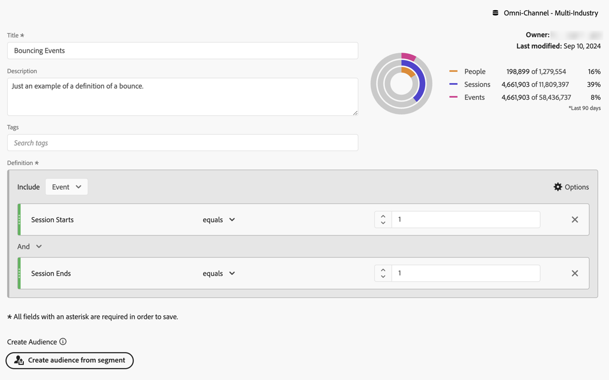

# Voorbeelden van berekende metriek

In dit artikel worden voorbeelden getoond van het definiëren van geavanceerdere berekende meetwaarden.

## Stuitpercentage

U wilt de stuiteringsfrequentie berekenen.

+++ Details

De definitie van een stuit is onderwerp voor een andere bespreking maar voor dit voorbeeld definieert u een Omgeslagen gebeurtenisfilter waarbij het Begin van de sessie gelijk is aan 1 en Sessie eindigt op 1. Met dit filter definieert u wel de frequentie van teruggestuurde sessies aan sessies.

### Filter

### Berekende metrische waarde

### Afgeleide velden

Alternatief, kunt u a [ stuittarief bepalen gebruikend afgeleide gebieden ](/help/data-views/derived-fields/derived-fields.md#bounces).

Afgeleide gebieden maken deel uit van een mening van Gegevens die het voordeel heeft dat niet elke gebruiker de definitie van metrisch tarief met betrekking tot Stuiteren kan met voeten treden of wijzigen. Dat voordeel heeft ook een beperking ingevoerd. Gebruikers die geen toegang hebben tot een gegevensweergave, kunnen geen afgeleide velden gebruiken en moeten hun toevlucht nemen tot filters en berekende meetwaarden om een stuiteringsfrequentie te definiëren.

Zie voor meer achtergrondinformatie over hoe te om grenzen en stuitend tarief in Customer Journey Analytics te berekenen, dit [ blogpost ](https://experienceleaguecommunities.adobe.com/t5/adobe-analytics-blogs/calculating-bounces-amp-bounce-rate-in-adobe-customer-journey/ba-p/706446).

+++

## Voorwaardelijke paginaweergaven

U wilt een berekende maatstaf definiëren die alleen de paginaweergaven berekent voor de pagina&#39;s die in meer dan 100 sessies zijn bezocht.

+++ Details

+++

## Paginaweergaven voor de bovenste 30% sessies

U wilt een berekende metrisch bepalen die slechts paginameningen voor de hoogste 30% zittingen berekent.

+++ Details

+++
