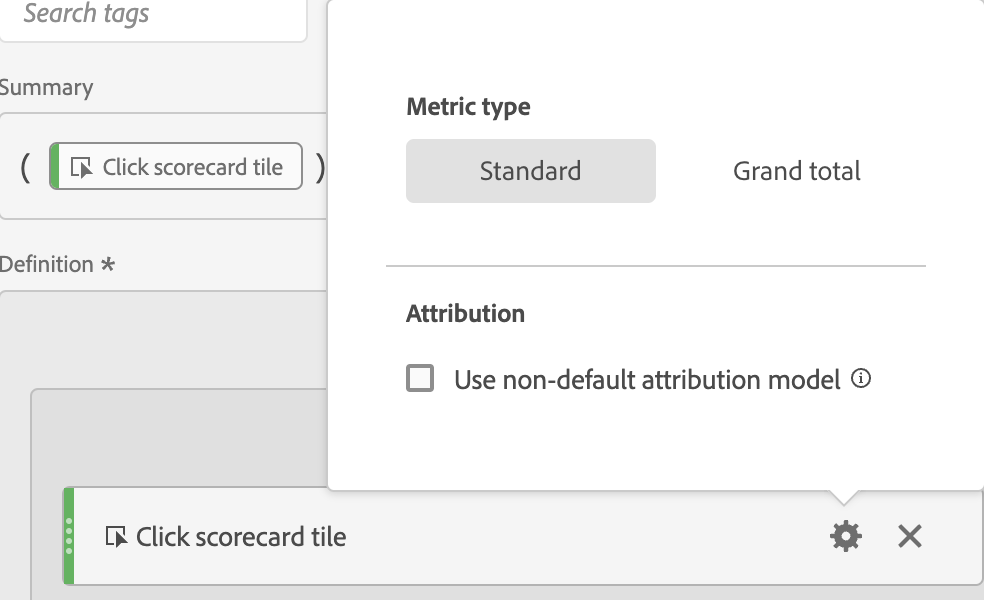

# Type cijfers en attributie

Als u het tandwielpictogram naast een metrische waarde selecteert, kunt u het metrische type en het attributiemodel opgeven.

## Metrisch type

| Metrisch type | Definitie |
|---|---|
| Standaard | Deze cijfers zijn dezelfde maatstaven die standaard worden gebruikt [!DNL Analytics] rapportage. Als een formule uit één enkele norm bestond, toont het identieke gegevens aan zijn niet-berekende-metrische tegenhanger. Standaardmetriek zijn handig voor het maken van berekende metriek die specifiek is voor elk afzonderlijk regelitem. Bijvoorbeeld: [Orders] / [Bezoeken] neemt orders voor dat specifieke lijnpunt en verdeelt het door het aantal bezoeken voor dat specifieke lijnpunt. |
| Totaal | Gebruik het totaal voor de rapportageperiode in elke post. Als een formule uit één enkel totaal metrisch bestond, toont het het zelfde totale aantal op elk lijnpunt. De totale metriek zijn nuttig om berekende metriek tot stand te brengen die met plaats totale gegevens vergelijkt. Bijvoorbeeld: [Orders] / [Totaal aantal bezoeken] geeft het aantal bestellingen tegen ALLE bezoeken aan uw site weer, niet alleen de bezoeken aan het specifieke onderdeel. |

## Attributie

>[!IMPORTANT]
>Voor een volledige lijst met ondersteunde niet-standaard toewijzingsmodellen en terugzoekvensters raadpleegt u [Attributiemodellen en terugzoekvensters](/help/analysis-workspace/attribution/models.md).
