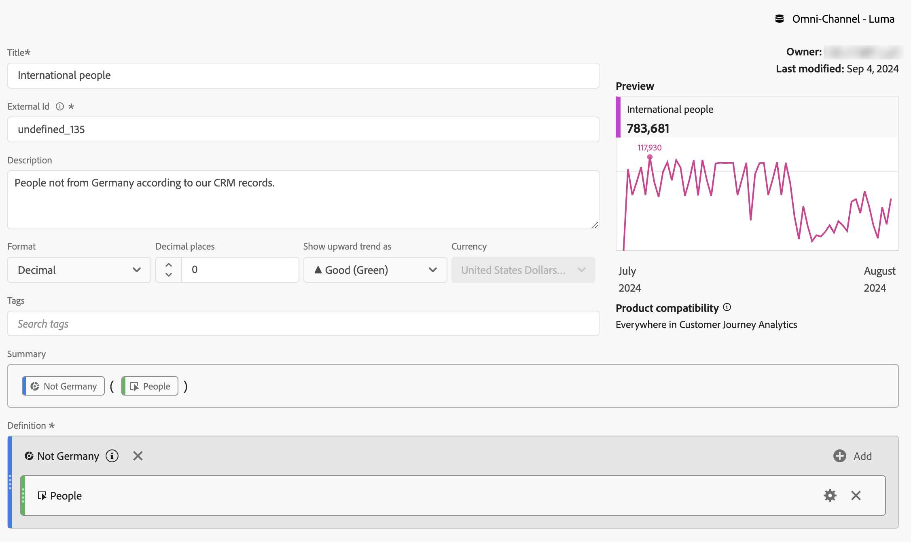
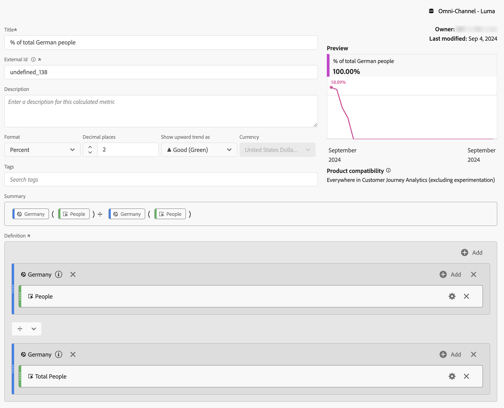
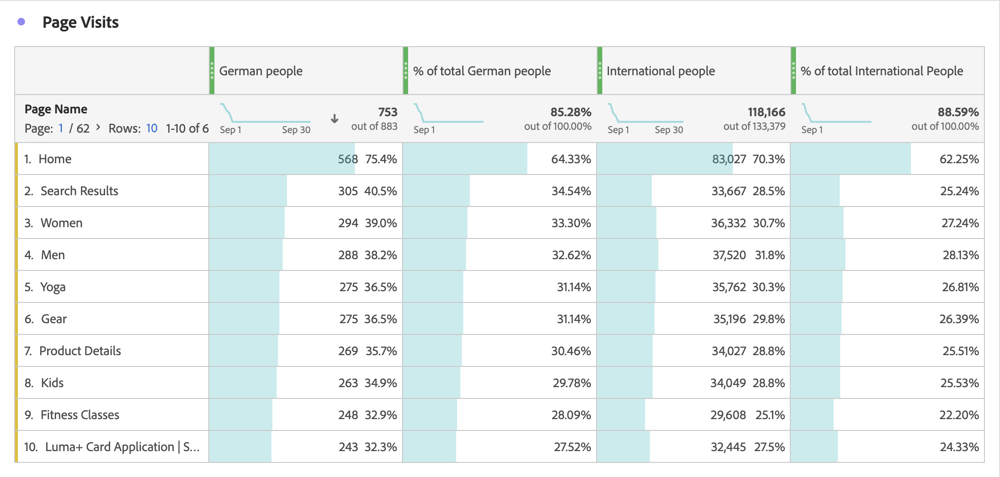

# Gefilterde metriek

In de [ Berekende metrische bouwer ](cm-build-metrics.md#definition-builder), kunt u filters binnen uw metrische definitie toepassen. Het toepassen van filters is nuttig als u metriek voor een ondergroep van uw gegevens in uw analyse wilt gebruiken.

>[!NOTE]
>
>De definities van de filter worden bijgewerkt door de [ bouwer van de Filter ](/help/components/filters/filter-builder.md). Als u een wijziging aanbrengt in een filter, wordt het filter automatisch bijgewerkt wanneer het filter wordt gebruikt, ook als het filter deel uitmaakt van een berekende metrische definitie.
>

Je wilt meetgegevens vergelijken voor Duitse mensen die interageren met je merk versus mensen buiten Duitsland. U kunt dus vragen beantwoorden zoals:

1. Hoeveel Duitse versus internationale mensen bezoeken uw meest [ populaire pagina&#39;s ](#popular-pages).
1. Hoeveel Duitse versus internationale mensen in [ totaal ](#totals) online met uw merk deze maand hebben gecommuniceerd.
1. Wat zijn de [ percentages ](#percentages) van Duitsers en internationale mensen die uw populaire pagina&#39;s hebben bezocht?

Zie de volgende secties om te illustreren hoe gefilterde metriek u kan helpen deze vragen te beantwoorden. In voorkomend geval wordt verwezen naar meer gedetailleerde documentatie.

## Populaire pagina&#39;s

1. [ creeer berekende metrisch ](cm-workflow.md) van een project van Workspace, genoemd `German people`.
1. Van binnen de [ Berekende metrische bouwer ](cm-build-metrics.md), [ creeer een filter ](/help/components/filters/filter-builder.md), getiteld `Germany`, die het gebied van het Land van CRM van uw gegevens van CRM gebruikt om te bepalen waar een persoon van komt.

   >[!TIP]
   >
   >In de Berekende metrische bouwer, kunt u een filter direct tot stand brengen gebruikend het paneel van Componenten.
   >   

   Uw filter kan er zo uitzien.

   

1. In de Berekende metrische bouwer, gebruik de filter terug om berekende metrisch bij te werken.

   

Herhaal bovenstaande stappen voor de internationale versie van de berekende metrische waarde.

1. Maak een berekende metrische waarde van het Workspace-project met de naam `International people` .
1. Van binnen de Berekende metrische bouwer, creeer een filter, genoemd `Not Germany`, dat het gebied van het Land van CRM van uw gegevens van CRM gebruikt om te bepalen waar een persoon uit komt.

   Het filter moet er zo uitzien.

   

1. In de Berekende metrische bouwer, gebruik de filter terug om berekende metrisch bij te werken.

   

1. Maak een project in Analysis Workspace, waar je kijkt naar pagina&#39;s die door Duitse en internationale mensen worden bezocht.

   

## Totalen

1. Maak twee nieuwe filters op basis van Eindtotaal. Open elk van de eerder gemaakte filters, wijzig de naam van het filter, stel de **[!UICONTROL Metric type]** for **[!UICONTROL People]** in op **[!UICONTROL Grand Total]** en gebruik **[!UICONTROL Save As]** om het filter op te slaan met de nieuwe naam. Bijvoorbeeld:

   

1. Voeg een nieuwe tabelvisualisatie voor vrije vorm toe aan uw Workspace-project en geef het totaal aantal pagina&#39;s voor deze maand weer.

   

## Percentage

1. Creeer twee nieuwe berekende metriek die een percentage van de berekende metriek berekenen u vroeger creeerde.

    toont

1. Werk uw Workspace-project bij.

   

>[!BEGINSHADEBOX]

Zie  [ Gebruik gefilterd berekend metrisch als implementationless metrisch ](https://video.tv.adobe.com/v/25407?quality=12&learn=on){target="_blank"} voor een demo video.

{{videoaa}}

>[!ENDSHADEBOX]

