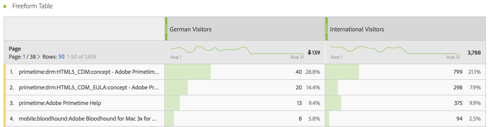

# Gefilterde metriek

In de Berekende metrische bouwer, kunt u filters binnen uw metrische definitie toepassen. Dit is nuttig als u nieuwe metriek aan gebruik in uw analyse wilt afleiden. Houd in mening, kunnen de filterdefinities door de Bouwer van de Filter worden bijgewerkt. Als er wijzigingen worden aangebracht, wordt het filter automatisch bijgewerkt op de locatie waar het wordt toegepast, ook als het deel uitmaakt van een berekende definitie van metrische waarde.

## Een gefilterde metriek maken {#create}

Laten we zeggen dat u verschillende aspecten van een filter &quot;Duitse bezoekers&quot; wilt vergelijken met die van een filter &quot;Internationale Bezoekers&quot;. U kunt metriek tot stand brengen die u inzichten zoals zal geven:

* Hoe vergelijk het gedrag van bladeren door inhoud tussen de twee groepen? (Een ander voorbeeld is: Hoe vergelijk de omrekeningskoers tussen de twee filters?)
* Als percentage van het totale aantal personen, hoeveel Duitse personen op bepaalde pagina&#39;s surfen, tegenover internationale personen?
* Waar zijn de grootste verschillen in termen van welke inhoud door deze verschillende filters wordt betreden?

1. Als u geen vergelijkbaar filter hebt, maakt u een ad-hocsegment in de Berekende metrische bouwer met de naam &quot;Duitse bezoekers&quot;, waarbij &quot;Landen&quot; gelijk is aan &quot;Duitsland&quot;. Sleep gewoon de dimensie Landen naar het canvas Definition en selecteer Duitsland als waarde:

   

   >[!NOTE]
   >
   >U kunt dit ook doen in het dialoogvenster [Filter Builder](/help/components/filters/create-filters.md), maar we hebben de workflow vereenvoudigd door afmetingen beschikbaar te maken in de Calculated Metric Builder. &quot;Ad hoc&quot; betekent dat het segment niet zichtbaar is in de **[!UICONTROL Filters]** lijst in de linkerspoorstaaf. U kunt het echter openbaar maken door de muisaanwijzer boven het pictogram &quot;i&quot; naast het pictogram te plaatsen en op **[!UICONTROL Make public]**.

1. Als u geen vergelijkbaar filter hebt, maakt u een filter genaamd &quot;Internationale Bezoekers&quot;, waarbij &quot;Landen&quot; niet gelijk is aan &quot;Duitsland&quot;.
1. Bouw en bewaar metrisch genoemd &quot;Duitse Bezoekers&quot;door het filter van Duitsland in het canvas van de Definitie te slepen en de Unieke Bezoekers metrisch binnen het te slepen:

   

1. Herhaal Stap 3 met het Internationale segment van Bezoekers en de Unieke metrisch van Bezoekers om Internationale metrische Bezoekers tot stand te brengen.
1. Sleep in Analysis Workspace de **[!UICONTROL Page]** Dimension in een lijst van de Vrije Vorm en sleep de 2 nieuwe berekende metriek naast elkaar aan de bovenkant:

   

Hier volgt een video-overzicht:

>[!VIDEO](https://video.tv.adobe.com/v/25407/?quality=12)

## Percentage van totale metriek {#percent-total}

U kunt het voorbeeld boven een stap verder zetten door uw filter te vergelijken met een totale populatie. Hiertoe maakt u twee nieuwe meeteenheden: &quot;% van de totale Duitse bezoekers&quot; en &quot;% van de totale internationale bezoekers&quot;:

1. Zet het filter Duitse (of internationale) bezoekers neer op het canvas.
1. Zet een ander Duits (of Internationaal) filter Bezoekers hieronder neer. Deze keer klikt u echter op het pictogram voor configuratie (versnelling) om het metrische type &quot;Totaal&quot; te selecteren. De notatie moet &#39;Percentage&#39; zijn. De exploitant zou &quot;gedeeld door&quot;moeten zijn. U eindigt omhoog met deze metrische definitie:

   

1. Pas deze metrisch op uw project toe:

   
