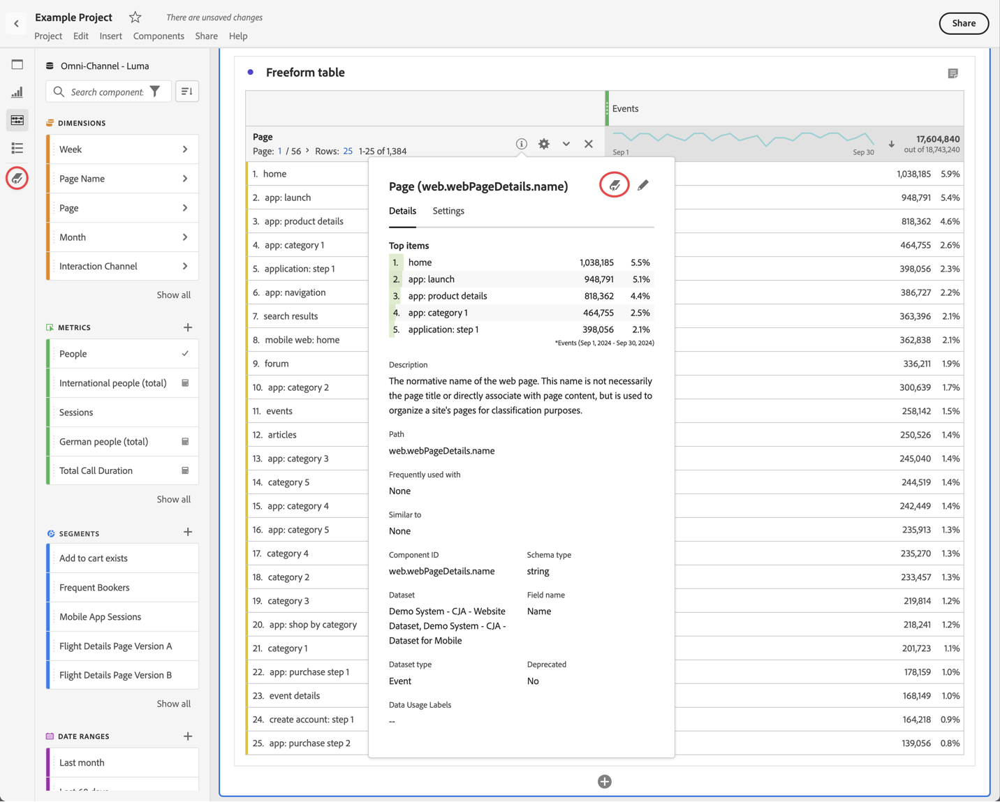

# Overzicht van gegevenswoordenboek {#data-dictionary-overview}

<!-- markdownlint-disable MD034 -->

>[!CONTEXTUALHELP]
>id="component_datadictionary"
>title="Gegevenswoordenboek"
>abstract="Met het gegevenswoordenboek kunnen gebruikers en beheerders de componenten in hun Customer Journey Analytics-omgeving volgen en beter begrijpen.   de beheerders van Customer Journey Analytics zijn de oorzaak van het leiden van informatie over elke component in het Woordenboek van Gegevens."

<!-- markdownlint-enable MD034 -->

Met het gegevenswoordenboek in Analysis Workspace kunnen gebruikers en beheerders de componenten in hun analyseomgeving volgen en beter begrijpen.

De beheerders van Analytics zijn verantwoordelijk voor het krommen van informatie over elke component in het Woordenboek van Gegevens om het ter beschikking te stellen van gebruikers.

>[!BEGINSHADEBOX]

Zie  [&#x200B; het woordenboek van Gegevens voor Analysis Workspace &#x200B;](https://video.tv.adobe.com/v/3418028/?quality=12&learn=on){target="_blank"} voor een demo video.

{{videoaa}}

>[!ENDSHADEBOX]

## Voordelen voor gebruikers

Met het gegevenswoordenboek krijgen gebruikers meer inzicht in de componenten die voor hen beschikbaar zijn.

De informatie die beschikbaar is in het gegevenswoordenboek is:

* Functie en beoogd gebruik van een component

* Componenten die doorgaans worden gebruikt bij de component die u weergeeft

* Componenten die vergelijkbaar zijn met de component die u bekijkt

* Of een component door de systeembeheerder wordt goedgekeurd

Voor informatie over hoe te om tot het Woordenboek van Gegevens en voor details over de informatie toegang te hebben bevat het, zie [&#x200B; de componenteninformatie van de Mening in het Woordenboek van Gegevens &#x200B;](/help/components/data-dictionary/view-data-dictionary.md).

## Voordelen voor beheerders

Met het gegevenswoordenboek kunnen systeembeheerders de componenten in hun analyseomgeving bijhouden en beheren.

Analysebeheerders kunnen het gegevenswoordenboek voor deze doeleinden gebruiken:

* Identificeer dubbele componenten die moeten worden geconsolideerd.

* Identificeer componenten die geen gegevens verzamelen zodat kunnen zij of worden bijgewerkt of worden geschrapt.

* Identificeer componenten die nog niet zijn goedgekeurd.

* Werk componentenbeschrijvingen rechtstreeks bij in Analysis Workspace. Alle updates van componentbeschrijvingen in het gegevenswoordenboek worden weerspiegeld in de gegevensweergave.

  Zo worden updates van componentbeschrijvingen in de gegevensweergave ook weerspiegeld in Analysis Workspace.

  Voor meer informatie over het toevoegen van componentenbeschrijvingen in of Analysis Workspace of in een gegevensmening, zie [&#x200B; componentenbeschrijvingen &#x200B;](/help/components/add-component-descriptions.md) toevoegen.

## Het gegevenswoordenboek openen

U kunt het gegevenswoordenboek op de volgende manieren openen in Analysis Workspace:

* Van  in het knooppaneel.

* Van  binnen info popover van een component.

Voor gedetailleerde informatie over de diverse opties beschikbaar in het Woordenboek van Gegevens, zie [&#x200B; de componenteninformatie van de Mening in het Woordenboek van Gegevens &#x200B;](/help/components/data-dictionary/view-data-dictionary.md).

## Het gegevenswoordenboek bijwerken en beheren

De beheerders van Customer Journey Analytics zijn verantwoordelijk voor het handhaven van een gezond Woordenboek van Gegevens voor hun organisatie, zoals die in [&#x200B; wordt beschreven de Gezondheid van het Woordenboek van Gegevens van de Monitor van de Woordenboek &#x200B;](/help/components/data-dictionary/monitor-data-dictionary-health.md).

Als deel van dit proces, kunnen de beheerders van Customer Journey Analytics informatie over elke component in het gegevenswoordenboek uitgeven, zoals die in [&#x200B; wordt beschreven geef componenteningangen in het Woordenboek van Gegevens &#x200B;](/help/components/data-dictionary/edit-entries-data-dictionary.md) uit.

## Het gegevenswoordenboek verplaatsen, minimaliseren of sluiten

Wanneer u het Woordenboek van Gegevens opent (zoals die in [&#x200B; wordt beschreven toegang tot het Woordenboek van Gegevens &#x200B;](#access-the-data-dictionary)), toont het als venster bovenop Analysis Workspace.

U kunt het venster Gegevenswoordenboek op de volgende manieren bewerken:

* Sleep het naar een willekeurig gebied in Analysis Workspace

  Als u Analysis Workspace sluit en weer opent, blijft het venster Gegevenswoordenboek op de locatie staan waar u het als laatste hebt verplaatst. <!--True?-->

* Minimaliseer het venster.

  Als deze optie is geminimaliseerd, wordt het gegevenswoordenboek weergegeven als een blauw tabblad in de rechterbenedenhoek van Analysis Workspace.

  Wanneer u het blauwe tabblad selecteert, wordt het gegevenswoordenboek geopend voor de component die u het laatst hebt weergegeven.

* Sluit het venster.
