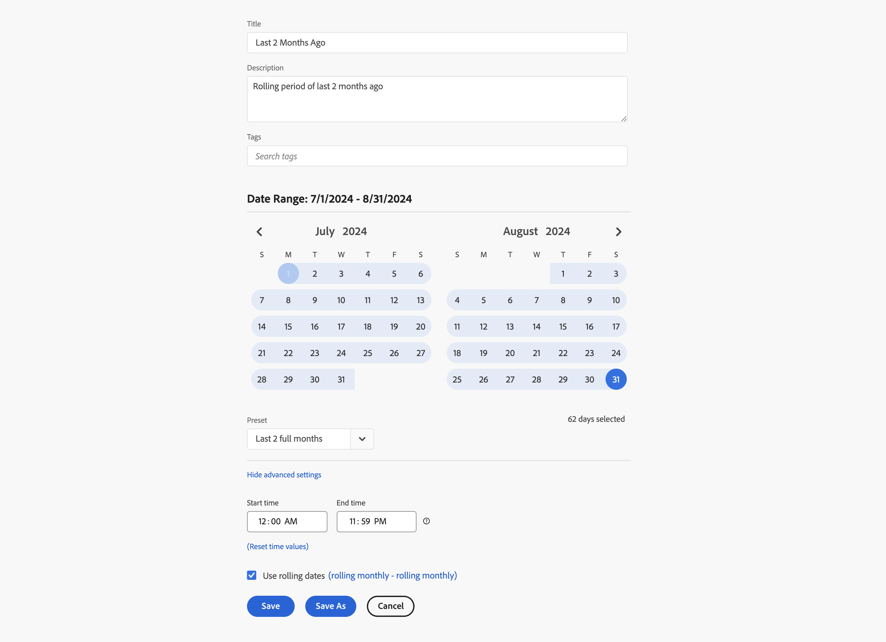

# Aangepaste datumbereiken

Dit artikel bevat meer voorbeelden van aangepaste datumbereiken

## Vorige twee maanden geleden

+++ Details

U wilt een aangepast datumbereik definiëren dat twee maanden geleden wordt gedefinieerd. U gebruikt een van de voorinstellingen.

+++

## Rollen tot het einde van vorige week

+++ Details

U wilt een datumbereik definiëren dat de periode definieert tussen de huidige dag een week geleden en het einde van dezelfde vorige week. Als vandaag bijvoorbeeld woensdag 11 september 2024 is. U wilt een datumbereik van 4 september 2024 tot 7 september 2024. september

+++

<!--
## Example: Use a 7-day rolling date range

You can create a date range that specifies a 7-day rolling window that ends one week ago:

Use *`rolling daily`*.

* The Start settings would be *`current day minus 6 days`*.

* The End settings would be *`current day minus 7 days`*.

This date range can be a component that you drag onto any freeform table.
-->