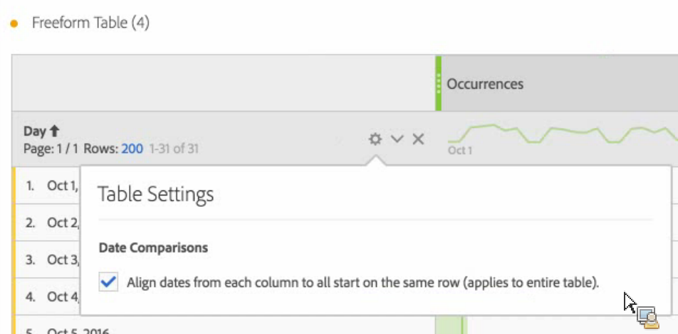

# Datumvergelijking

>[!NOTE]
>
>U bekijkt de documentatie voor de Werkruimte van de Analyse in de Analyse van de Reis van de Klant. Zijn eigenschapreeks verschilt lichtjes van [De Werkruimte van de analyse in de traditionele Analyse van Adobe](https://docs.adobe.com/content/help/en/analytics/analyze/analysis-workspace/home.html). [Meer informatie...](/help/getting-started/cja-aa.md)

De Vergelijking van de datum in de Werkruimte van de Analyse laat u om het even welke kolom nemen die een datumwaaier bevatten en een gemeenschappelijke datumvergelijking tot stand brengen, zoals: jaar-over-jaar, kwartaal-over-kwartaal, maand-over-maand enz.

## Vergelijk tijdsperioden

De analyse vereist context, en vaak wordt die context verstrekt door een vorige tijdspanne. Bijvoorbeeld de vraag &quot;Hoeveel beter/slechter doen we dan op dit moment vorig jaar?&quot; is essentieel voor het begrijpen van uw bedrijf. De Vergelijking van de datum omvat automatisch een &quot;verschil&quot;kolom, die de percentageverandering in vergelijking met een gespecificeerde tijdspanne toont.

1. Creeer een lijst Freeform, met om het even welke afmetingen en metriek u over een tijdspanne wilt vergelijken.
1. Klik met de rechtermuisknop op een tabelrij en selecteer **[!UICONTROL Compare Time Periods]**.

   

   >[!IMPORTANT]
   >
   >Deze met de rechtermuisknop aanklikken optie is gehandicapt voor metrische rijen, de rijen van de datumwaaier, en de rijen van de tijddimensie.

1. Afhankelijk van hoe u de de datumwaaier van de lijst hebt geplaatst, hebt u deze opties voor vergelijking:

   | Optie | Beschrijving |
   |---|---|
   | **[!UICONTROL Prior week/month/quarter/year to this date range]** | Vergelijkt met de week/maand/enz. onmiddellijk voor deze datumwaaier. |
   | **[!UICONTROL This week/month/quarter/year last year]** | Vergeleken met dezelfde datumwaaier een jaar geleden. |
   | **[!UICONTROL Select range]** | Laat u een waaier van de douanedatum selecteren. |

   >[!NOTE]
   >
   >Wanneer u een aangepast aantal dagen selecteert, bijvoorbeeld 7 oktober - 20 oktober (een 14-daagse reeks), krijgt u slechts 2 opties: **[!UICONTROL Prior 14 days before this date range]** en **[!UICONTROL Select range]**.

1. De resulterende vergelijking ziet er als volgt uit:

   

   De rijen in de Percenten kolom van de Verandering lijken rood voor negatieve waarden en groen voor positieve waarden.

1. (Facultatief) zoals in een andere projecten van de Werkruimte, kunt u visualisaties tot stand brengen die op deze tijdvergelijkingen worden gebaseerd. Bijvoorbeeld, hier is een grafiek van de Bar:

   

   Merk op dat om de percentageverandering in de bargrafiek te tonen, u de [!UICONTROL Percentages] instelling ingeschakeld in [!UICONTROL Visualization Settings].

## Voeg een kolom van de tijdperiode voor vergelijking toe

U kunt nu een tijdsperiode toevoegen aan elke tabelkolom. Zo kunt u een andere tijdsperiode toevoegen dan de periode waarop uw kalender is ingesteld. Dit is een andere manier u datums kunt vergelijken.

1. Klik een kolom in de lijst met de rechtermuisknop aan en selecteer **[!UICONTROL Add Time Period Column]** 

1. Afhankelijk van hoe u de de datumwaaier van de lijst hebt geplaatst, hebt u deze opties voor vergelijking:

   | Optie | Beschrijving |
   |---|---|
   | **[!UICONTROL Prior week/month/quarter/year to this date range]** | Voegt een kolom met de week/maand/etc. toe. onmiddellijk voor deze datumwaaier. |
   | **[!UICONTROL This week/month/quarter/year last year]** | Voegt de zelfde datumwaaier een jaar terug toe. |
   | **[!UICONTROL Select range]** | Laat u een waaier van de douanedatum selecteren. |

   >[!NOTE]
   >
   >Wanneer u een aangepast aantal dagen selecteert, bijvoorbeeld 7 oktober - 20 oktober (een 14-daagse reeks), krijgt u slechts 2 opties: **[!UICONTROL Prior 14 days before this date range]** en **[!UICONTROL Select range]**.

1. De tijdspanne zal bovenop de kolom worden opgenomen u selecteerde:

   

1. U kunt zo vele tijdkolommen toevoegen aangezien u wilt, evenals mengen en verschillende datumwaaiers aanpassen:

   

1. Bovendien kunt u op elke kolom sorteren, die de orde van dagen afhankelijk van de kolom zal veranderen u op sorteert.

## Richt kolomdata om op dezelfde rij te beginnen {#section_5085E200082048CB899C3F355062A733}

Het nieuwe plaatsen voor alle lijsten laat u **[!UICONTROL Align Dates from each column to all start on the same row (applies to entire table)]**. &quot;Is op volledige lijst&quot;van toepassing betekent dat als u, bijvoorbeeld, een uitsplitsing in de lijst doet, en als u dit het plaatsen voor de uitsplitsing verandert, het het plaatsen voor de volledige lijst zal veranderen.

>[!IMPORTANT]
>
>Deze instelling is **gehandicapt** (ongecontroleerd) voor alle bestaande projecten en **ingeschakeld** (gecontroleerd) voor alle nieuwe projecten.

Voorbeeld: Wanneer u verkiest om de data te richten, als u een maand-over-maand vergelijking tussen Oktober en September 2016 doet, zal de linkerkolom met Oktober 1 beginnen en de juiste kolom zal met September 1 beginnen:

<!-- 

See Jonny Moon's email from November 3. 

 -->

