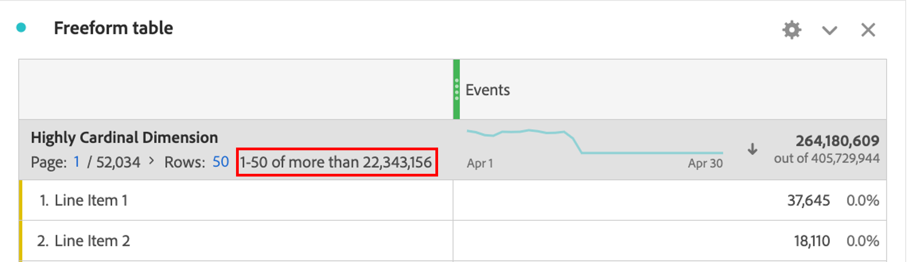

# Dimension met zeer hoge kardinaliteit

Customer Journey Analytics (CJA) stelt geen limieten in voor het aantal unieke waarden of dimensie-items waarop binnen één dimensie kan worden gerapporteerd. In sommige omstandigheden kunnen de afmetingen met een zeer groot aantal unieke artikelen - ook wel bekend als afmetingen met een hoge cardinaliteit - echter van invloed zijn op wat er kan worden gerapporteerd.

## Beperkingen

Afhankelijk van het aantal gebeurtenissen in een specifieke verbinding CJA, kunnen de volgende twee beperkingen samen met high-cardinality afmetingen voorkomen:

### 1. Aantal rijen is mogelijk niet exact te rapporteren

Rijtellingen met hoge kardinaalafmetingen zijn mogelijk niet precies te melden. Wanneer dit gebeurt, zullen de lijsten van de Vrije vorm een aanwijzing zoals hieronder getoond verstrekken:

### 2. Berekende cijfers kunnen schattingen retourneren

Bij gebruik met zeer kardinale afmetingen kunnen sommige berekende metrische functies schattingen retourneren, waaronder: Kolommaximum, Kolomminimum, Aantal rijen, Gemiddeld, Mediaan, Percentage, Kwartaal, Standaardafwijking, Variantie, Regressiefuncties en T- en Z-functies.

Bovendien kan het sorteren van een tabelkolom met behulp van een berekende metrische waarde gebaseerd zijn op een schatting en niet altijd de exacte sorteervolgorde weerspiegelen. Er verschijnt een waarschuwingsbericht om u te waarschuwen dat er mogelijk ramingen zijn gebruikt.

Houd er rekening mee dat, ook al kunnen berekende meetwaarden soms schattingen retourneren, de kolomtotalen altijd nauwkeurig zijn en nooit gebaseerd zijn op schattingen. Op dezelfde manier, wanneer het gebruiken van standaardmetriek, worden de ramingen nooit gebruikt om een kolom te sorteren en altijd op nauwkeurige soortorden te wijzen.

## Waar alle waarden van de dimensie in aanmerking worden genomen

Alhoewel er beperkingen aan sommige berekende metriek en de tellingen van de afmetingsrij zijn, ben me ervan bewust dat de volgende mogelijkheden altijd alle unieke waarden in om het even welke afmeting overwegen. Ze beschouwen ze ongeacht of een dimensie al dan niet zeer kardinaal is:

* Metrische toewijzing en dimensie-toewijzing
* De onderzoeken van het lijn-punt die op een lijst worden toegepast Freeform
* Filters die dimensies of dimensie-items gebruiken
* De geschatte tellings verschillende functie binnen Berekende Metriek
* Opnemen/uitsluiten van logica die wordt toegepast op elke metrische waarde of dimensie in een gegevensweergave
* Gegevensbestanden opzoeken die aan een Verbinding worden toegevoegd

## Aanbevolen werkwijzen voor het werken met afmetingen met hoge kardinale afmetingen

Om de waarschuwingen of schattingen te elimineren die kunnen voorkomen wanneer u afmetingen met hoge kardinaliteit gebruikt, adviseren wij dat u het aantal rijen die in uw rapport worden overwogen beperkt, gebruikend één van de volgende methodes:

* Voeg een filter toe aan de kolom of het paneel waarop de bewerking betrekking heeft.
* Hiermee past u een zoekopdracht toe op uw tabel voor vrije vorm.
* Pas een uitsplitsing toe op de rijen van rente, of het gebruiken van de hoogst-kardinale dimensie als verdelingsdimensie.
* Voeg toe omvat/sluit criteria aan de configuratie van de Mening van Gegevens van de afmeting uit om het aantal unieke waarden te beperken aanwezig in de afmeting.

Met deze technieken kunt u vaak ongewenste schattingen of waarschuwingen voorkomen die u krijgt bij het gebruik van afmetingen met een hoge kardinale waarde.
