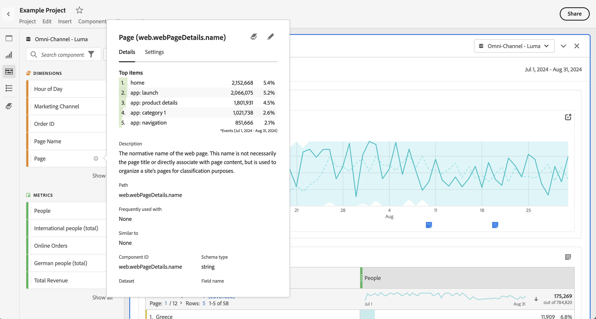

# Afmetingen voorvertonen in Analysis Workspace

U kunt [ componenteninfo ](/help/components/use-components-in-workspace.md#component-info) voor een component gebruiken om de hoogste punten voor een afmeting te tonen.

<!--
Now, by default, we show dynamic values instead of static ones, with the option to turn them into static values. Other things to note:

* As your data updates, the dynamic dimension columns will update to show the current 5/15 dimension items.
* A dynamic dimension column that is copied or moved will become static.
* When hovering a static dimension column you will see a lock icon, indicating that the dimension is static.

-->

## Dimensie-items tonen

Wanneer u  voor een afmeting in het componentenpaneel selecteert, verschijnt een lijst van zijn afmetingspunten. In de lijst met dimensie-items worden gewoonlijk de bovenste items voor de laatste 30 dagen weergegeven. Als er meer items beschikbaar zijn, selecteert u de koppeling buiten het geselecteerde datumbereik voor het deelvenster om meer items weer te geven. Bijvoorbeeld **[!UICONTROL Show items from last month]** .

