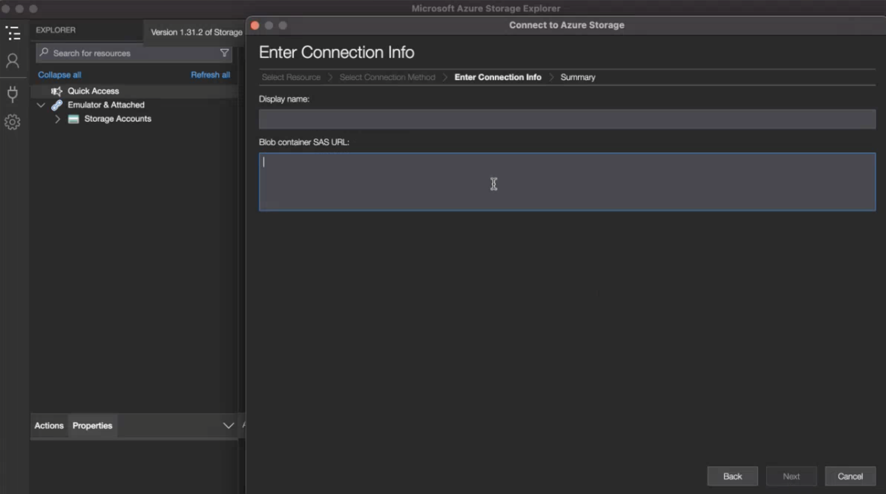

# Cloudexportaccounts configureren

Voordat u Customer Journey Analytics-rapporten kunt exporteren naar een cloudinrichting zoals beschreven in [Rapporten van de Customer Journey Analytics van de uitvoer naar de wolk](/help/analysis-workspace/export/export-cloud.md), moet u de bestemming toevoegen en vormen waar u de gegevens wilt worden verzonden.

Dit proces bestaat uit het toevoegen en configureren van de account (zoals Amazon S3, Google Cloud Platform, enzovoort), zoals beschreven in dit artikel, en vervolgens het toevoegen en configureren van de locatie binnen die account (zoals een map binnen de account) zoals beschreven in [Cloudexportlocaties configureren](/help/components/exports/cloud-export-locations.md).

Ga voor informatie over het beheren van bestaande accounts, zoals het weergeven, bewerken en verwijderen van accounts naar [Locaties en accounts voor cloudexport beheren](/help/components/exports/manage-export-locations.md).

## Beginnen met het maken van een cloud-exportaccount

1. Selecteer in Customer Journey Analytics [!UICONTROL **Componenten**] > [!UICONTROL **Uitvoer**].
1. Op de [!UICONTROL Exports] pagina, selecteert u de [!UICONTROL **Locatieaccounts**] tab.
1. Selecteren [!UICONTROL **Account toevoegen**].

   

   Het dialoogvenster Account toevoegen wordt weergegeven.

1. In de [!UICONTROL **Naam van locatieaccount**] veld, geeft u een naam voor het locatieaccount op. Deze naam wordt weergegeven wanneer u een locatie maakt.

1. In de [!UICONTROL **Beschrijving van locatieaccount**] in het veld een korte beschrijving van de account geven om deze te kunnen onderscheiden van andere accounts van hetzelfde type account.

1. In de [!UICONTROL **Accounttype**] selecteert u het type cloudaccount waarnaar u exporteert. Beschikbare accounttypen zijn Amazon S3 Role ARN, Google Cloud Platform, Azure SAS, Azure RBAC, Snowflake en AEP Data Landing Zone.

1. Ga door met de onderstaande sectie die overeenkomt met de [!UICONTROL **Accounttype**] geselecteerd.

   * [AEP gegevenslandingszone](#adobe-experience-platform)

   * [Amazon S3 Role ARN](#amazon-s3-role-arn)

   * [Google Cloud Platform](#google-cloud-platform)

   * [Azure SAS](#azure-sas)

   * [Azure RBAC](#azure-rbac)

   * [Snowflake](#snowflake)

### AEP gegevenslandingszone

>[!IMPORTANT]
>
>Wanneer het uitvoeren van de rapporten van de Customer Journey Analytics aan de Landing Zone van Adobe Experience Platform Gegevens, zorg ervoor dat u de gegevens binnen 7 dagen downloadt, dan schrapt het uit de Gebied van Gegevens AEP. Na 7 dagen worden de gegevens automatisch verwijderd uit de AEP Data Landing Zone.

1. [Beginnen met het maken van een cloud-exportaccount](#begin-creating-a-cloud-export-account), zoals hierboven beschreven.

1. Selecteren [!UICONTROL **Opslaan**].

   De [!UICONTROL **Exportaccount gemaakt**] wordt weergegeven.

   

1. Kopieer de inhoud van het dialoogvenster [!UICONTROL **SAS-URI**] aan uw klembord. U gebruikt deze SAS-URI om toegang te krijgen tot de gegevens die vanuit Analysis Workspace worden geëxporteerd vanuit de AEP Data Landing Zone.

   Als dit veld leeg is, moet u toestemming krijgen om toegang te krijgen tot Adobe Experience Platform.

1. In Adobe Experience Platform configureert u de gegevenslandingszone-container zodanig dat de door u gekopieerde SAS-URI wordt gebruikt.

   >[!NOTE]
   >
   >Omdat de AEP Data Landing Zone-account is gebaseerd op Azure, is de eenvoudigste manier om toegang te krijgen tot rapporten die u exporteert naar AEP Data Landing Zone, de Azure Storage Explorer. In de volgende stappen wordt deze methode gebruikt.

   1. Download de [Microsoft Azure Storage Explorer](https://azure.microsoft.com/en-us/products/storage/storage-explorer/).

   1. Voer in de Adobe Experience Platform-documentatie de stappen uit die worden beschreven in [Sluit uw container voor landingszones voor gegevens aan op Azure Storage Explorer](https://experienceleague.adobe.com/docs/experience-platform/destinations/catalog/cloud-storage/data-landing-zone.html?lang=en#connect-your-data-landing-zone-container-to-azure-storage-explorer).

      U kunt de in de secties beschreven taken overslaan [Haal de geloofsbrieven voor uw Gebied van Gegevens terug Landing](https://experienceleague.adobe.com/docs/experience-platform/destinations/catalog/cloud-storage/data-landing-zone.html?lang=en#retrieve-dlz-credentials) en [Referenties van gegevenslandingszone bijwerken](https://experienceleague.adobe.com/docs/experience-platform/destinations/catalog/cloud-storage/data-landing-zone.html?lang=en#update-dlz-credentials), omdat de URI die u hebt gekopieerd deze referenties bevat.

   1. Wanneer u de Adobe Experience Platform-documentatie volgt en naar de [!UICONTROL **SAS-URL blokcontainer**] plakken, plakt de SAS URI die u in Stap 3 kopieerde.

      >[!NOTE]
      >
      >U moet deze actie om de 7 dagen uitvoeren, omdat de SAS URI 7 dagen na het creëren vervalt. U kunt een script maken om dit proces te automatiseren.


      

   1. Selecteren [!UICONTROL **Volgende**] > [!UICONTROL **Verbinden**].

1. In Customer Journey Analytics, in [!UICONTROL **Exportaccount gemaakt**] dialoogvenster, selecteren [!UICONTROL **OK**].

   

1. Doorgaan met [Cloudexportlocaties configureren](/help/components/exports/cloud-export-locations.md).

### Amazon S3 Role ARN

1. [Beginnen met het maken van een cloud-exportaccount](#begin-creating-a-cloud-export-account), zoals hierboven beschreven.

1. In de [!UICONTROL **Accounteigenschappen**] van de [!UICONTROL **Account toevoegen**] geeft u de volgende informatie op:

   | Veld | -functie |
   |---------|----------|
   | [!UICONTROL **Rol ARN**] | U moet een Rol ARN (de Naam van het Middel van Amazon) verstrekken die de Adobe kan gebruiken om toegang tot de rekening van Amazon S3 te krijgen. Om dit te doen, creeert u een IAM toestemmingsbeleid voor de bronrekening, maakt het beleid aan een gebruiker vast, en creeert dan een rol voor de bestemmingsrekening. Zie voor specifieke informatie [deze AWS-documentatie](https://aws.amazon.com/premiumsupport/knowledge-center/cross-account-access-iam/). |

   {style="table-layout:auto"}

1. Selecteren [!UICONTROL **Opslaan**].

   De [!UICONTROL **Exportaccount gemaakt**] wordt weergegeven.

   

1. Kopieer de inhoud van het dialoogvenster [!UICONTROL **ARN gebruiker**] aan uw klembord. De Gebruiker ARN (de Naam van het Middel van Amazon) wordt verstrekt door Adobe. U moet deze gebruiker aan het beleid vastmaken u in Amazon S3 RolARN creeerde.

1. Selecteren [!UICONTROL **OK**].

1. Doorgaan met [Cloudexportlocaties configureren](/help/components/exports/cloud-export-locations.md).

### Google Cloud Platform

1. [Beginnen met het maken van een cloud-exportaccount](#begin-creating-a-cloud-export-account), zoals hierboven beschreven.

1. In de [!UICONTROL **Accounteigenschappen**] van de [!UICONTROL **Account toevoegen**] geeft u de volgende informatie op:

   | Veld | -functie |
   |---------|----------|
   | [!UICONTROL **Project-id**] | Uw Google Cloud-project-id die u kopieert van uw Google Cloud-account. Zie de [Google Cloud-documentatie over het ophalen van een project-id](https://cloud.google.com/resource-manager/docs/creating-managing-projects#identifying_projects). |

   {style="table-layout:auto"}

1. Selecteren [!UICONTROL **Opslaan**].

   De [!UICONTROL **Exportaccount gemaakt**] wordt weergegeven.

   

1. Kopieer de inhoud van het dialoogvenster [!UICONTROL **Opdrachtgever**] aan uw klembord, dan zorg ervoor dat u toestemming aan Principal verleent om dossiers aan dit emmertje in het Platform van Google Cloud te uploaden. <!-- add link to Google Cloud docs on how to do this -->

1. Selecteren [!UICONTROL **OK**].

1. Doorgaan met [Cloudexportlocaties configureren](/help/components/exports/cloud-export-locations.md).

### Azure SAS

1. [Beginnen met het maken van een cloud-exportaccount](#begin-creating-a-cloud-export-account), zoals hierboven beschreven.

1. In de [!UICONTROL **Accounteigenschappen**] van de [!UICONTROL **Account toevoegen**] geeft u de volgende informatie op:

   | Veld | -functie |
   |---------|----------|
   | [!UICONTROL **Toepassings-id**] | Kopieer deze id uit de Azure-toepassing die u hebt gemaakt. In Microsoft Azure bevindt deze informatie zich op de **Overzicht** in uw toepassing. Zie de klasse [Microsoft Azure-documentatie over het registreren van een toepassing bij het Microsoft Identity-platform](https://learn.microsoft.com/en-us/azure/active-directory/develop/quickstart-register-app). |
   | [!UICONTROL **Tenant-id**] | Kopieer deze id uit de Azure-toepassing die u hebt gemaakt. In Microsoft Azure bevindt deze informatie zich op de **Overzicht** in uw toepassing. Zie de klasse [Microsoft Azure-documentatie over het registreren van een toepassing bij het Microsoft Identity-platform](https://learn.microsoft.com/en-us/azure/active-directory/develop/quickstart-register-app). |
   | [!UICONTROL **URI sleutelvault**] | <p>Het pad naar het SAS-token in Azure Key Vault.  Om Azure SAS te configureren, moet u een SAS-token opslaan als een geheim met Azure Key Vault. Zie voor meer informatie de [Microsoft Azure-documentatie over het instellen en ophalen van een geheim bij Azure Key Vault](https://learn.microsoft.com/en-us/azure/key-vault/secrets/quick-create-portal?source=recommendations).</p><p>Nadat de sleutelvault-URI is gemaakt, voegt u een toegangsbeleid toe aan de Key Vault om toestemming te verlenen aan de Azure-toepassing die u hebt gemaakt. Zie voor meer informatie de [Microsoft Azure-documentatie over het toewijzen van een beleid voor toegang tot Key Vault](https://learn.microsoft.com/en-us/azure/key-vault/general/assign-access-policy?tabs=azure-portal).</p> |
   | [!UICONTROL **geheime naam sleutelvault**] | De geheime naam die u hebt gemaakt toen u het geheim toevoegde aan Azure Key Vault. In Microsoft Azure vindt u deze informatie in de Key Vault die u hebt gemaakt, op de **Key Vault** instellingenpagina&#39;s. Zie voor meer informatie de [Microsoft Azure-documentatie over het instellen en ophalen van een geheim bij Azure Key Vault](https://learn.microsoft.com/en-us/azure/key-vault/secrets/quick-create-portal?source=recommendations). |
   | [!UICONTROL **Locatierekeninggeheim**] <!-- nothing for us to have them do on the second screen. Just need to permission the container if they haven't --> | Kopieer het geheim van de Azure-toepassing die u hebt gemaakt. In Microsoft Azure bevindt deze informatie zich op de **Certificaten en geheimen** in uw toepassing. Zie de klasse [Microsoft Azure-documentatie over het registreren van een toepassing bij het Microsoft Identity-platform](https://learn.microsoft.com/en-us/azure/active-directory/develop/quickstart-register-app). <!-- need to grant permission to the bucket. Jun will send info on where that is documented) --> |

   {style="table-layout:auto"}

1. Selecteren [!UICONTROL **Opslaan**].

   De [!UICONTROL **Exportaccount gemaakt**] wordt weergegeven.

   

1. Als u nog geen machtigingen hebt, moet u ervoor zorgen dat u machtigingen verleent aan het emmertje in Azure SAS. <!-- add link to Google Cloud docs on how to do this -->

1. Selecteren [!UICONTROL **OK**].

1. Doorgaan met [Cloudexportlocaties configureren](/help/components/exports/cloud-export-locations.md).

### Azure RBAC

1. [Beginnen met het maken van een cloud-exportaccount](#begin-creating-a-cloud-export-account), zoals hierboven beschreven.

1. In de [!UICONTROL **Accounteigenschappen**] van de [!UICONTROL **Account toevoegen**] geeft u de volgende informatie op:

   | Veld | -functie |
   |---------|----------|
   | [!UICONTROL **Toepassings-id**] | Kopieer deze id uit de Azure-toepassing die u hebt gemaakt. In Microsoft Azure bevindt deze informatie zich op de **Overzicht** in uw toepassing. Zie de klasse [Microsoft Azure-documentatie over het registreren van een toepassing bij het Microsoft Identity-platform](https://learn.microsoft.com/en-us/azure/active-directory/develop/quickstart-register-app). |
   | [!UICONTROL **Tenant-id**] | Kopieer deze id uit de Azure-toepassing die u hebt gemaakt. In Microsoft Azure bevindt deze informatie zich op de **Overzicht** in uw toepassing. Zie de klasse [Microsoft Azure-documentatie over het registreren van een toepassing bij het Microsoft Identity-platform](https://learn.microsoft.com/en-us/azure/active-directory/develop/quickstart-register-app). |
   | [!UICONTROL **Locatierekeninggeheim**] | Kopieer het geheim van de Azure-toepassing die u hebt gemaakt. In Microsoft Azure bevindt deze informatie zich op de **Certificaten en geheimen** in uw toepassing. Zie de klasse [Microsoft Azure-documentatie over het registreren van een toepassing bij het Microsoft Identity-platform](https://learn.microsoft.com/en-us/azure/active-directory/develop/quickstart-register-app). |

   {style="table-layout:auto"}

1. Selecteren [!UICONTROL **Opslaan**].

   De [!UICONTROL **Exportaccount gemaakt**] wordt weergegeven.

   

1. Als u niet reeds hebt, zorg ervoor dat u toestemmingen aan de emmer in Azure RBAC verleent. <!-- add link to Google Cloud docs on how to do this -->

1. Selecteren [!UICONTROL **OK**].

1. Doorgaan met [Cloudexportlocaties configureren](/help/components/exports/cloud-export-locations.md).

### Snowflake

1. [Beginnen met het maken van een cloud-exportaccount](#begin-creating-a-cloud-export-account), zoals hierboven beschreven.

1. In de [!UICONTROL **Accounteigenschappen**] van de [!UICONTROL **Account toevoegen**] geeft u de volgende informatie op:

   | Veld | -functie |
   |---------|----------|
   | [!UICONTROL **Account-id**] | Identificeer uniek een rekening van de Snowflake binnen uw organisatie, evenals door het wereldwijde netwerk van Snowflake-gesteunde wolkenplatforms en wolkengebieden. <p>U moet de account-id ophalen van uw Snowflake-account en de gegevens hier plakken.</p><p>Als u wilt weten waar u deze informatie kunt ophalen, raadpleegt u de [De pagina Account Identifiers in de documentatie van de Snowflake](https://docs.snowflake.com/en/user-guide/admin-account-identifier).</p> |
   | [!UICONTROL **Gebruiker**] | De aanmeldnaam van de gebruiker die wordt gebruikt voor de verbinding. We raden u aan een nieuwe gebruiker te maken die specifiek voor Adobe wordt gebruikt. Geef hier de naam op en maak vervolgens een gebruiker in de Snowflake met dezelfde naam. U kunt een gebruiker in Snowflake tot stand brengen gebruikend `CREATE USER` gebruiken.  <p>Zie de klasse [Opdrachten voor gebruikers, rollen en bevoegdheden](https://docs.snowflake.com/en/sql-reference/commands-user-role).</p> |
   | [!UICONTROL **Rol**] | De rol die aan de gebruiker zal worden toegewezen. We raden u aan een nieuwe rol te creëren die specifiek voor Adobe zal worden gebruikt. Specificeer hier de rol, creeer dan een rol in Snowflake met de zelfde naam en geef de rol aan de gebruiker. U kunt een rol in Snowflake tot stand brengen gebruikend `CREATE ROLE` gebruiken. <p>Zie de klasse [Opdrachten voor gebruikers, rollen en bevoegdheden](https://docs.snowflake.com/en/sql-reference/commands-user-role).</p> |

   {style="table-layout:auto"}

1. Selecteren [!UICONTROL **Opslaan**].

   De [!UICONTROL **Exportaccount gemaakt**] wordt weergegeven.

   

1. Kopieer de inhoud van het dialoogvenster [!UICONTROL **Openbare sleutel**] aan uw klembord. De openbare sleutel wordt verstrekt door Adobe.

   Gebruik de openbare sleutel in Snowflake om met uw rekening van de Snowflake te verbinden. U moet de gebruiker associëren die u met deze openbare sleutel creeerde.

   Geef bijvoorbeeld in Snowflake de volgende opdracht op:

   ```
   CREATE USER <your_adobe_user> RSA_PUBLIC_KEY = '<your_public_key>';
   ```

   Zie de klasse [Verificatie van sleutelpaar en rotatie van sleutelpaar in de documentatie bij Snowflake](https://docs.snowflake.com/en/user-guide/key-pair-auth).

1. Selecteren [!UICONTROL **OK**].

1. Doorgaan met [Cloudexportlocaties configureren](/help/components/exports/cloud-export-locations.md).
