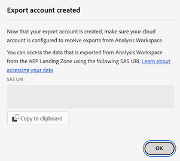

# Cloudexportaccounts configureren

Alvorens u de rapporten van de Customer Journey Analytics naar een wolkenbestemming kunt uitvoeren zoals die in [ worden beschreven de rapporten van de Customer Journey Analytics van de Uitvoer aan de wolk ](/help/analysis-workspace/export/export-cloud.md), moet u de bestemming toevoegen en vormen waar u de gegevens wilt worden verzonden.

Dit proces bestaat uit het toevoegen van en het vormen van de rekening (zoals Amazon S3, het Platform van de Wolk van Google, etc.) zoals die in dit artikel wordt beschreven, en dan het toevoegen van en het vormen van de plaats binnen die rekening (zoals een omslag binnen de rekening) zoals die in [ wordt beschreven vormt wolkenuitvoerplaatsen ](/help/components/exports/cloud-export-locations.md).

Voor informatie over hoe te om bestaande rekeningen, met inbegrip van het bekijken, het uitgeven, en het schrappen van rekeningen te beheren, zie [ wolkenuitvoerplaatsen en rekeningen beheren ](/help/components/exports/manage-export-locations.md).

## Beginnen met het maken van een cloud-exportaccount

1. Zorg ervoor u aan de [ minimumvereisten ](/help/analysis-workspace/export/export-cloud.md#minimum-requirements) voor het uitvoeren van rapporten aan de wolk voldoet.
1. In Customer Journey Analytics, uitgezochte [!UICONTROL **Componenten**] > [!UICONTROL **voert**] uit.
1. Voor de [!UICONTROL Exports] pagina, selecteer de [!UICONTROL **rekeningen van de Plaats**] tabel.

   

1. Selecteer [!UICONTROL **toevoegen rekening**].

   Het dialoogvenster Account toevoegen wordt weergegeven.

1. Op het [!UICONTROL **de rekeningsnaam van de Plaats**] gebied, specificeer een naam voor de plaatsrekening. Deze naam wordt weergegeven wanneer u een locatie maakt.

1. Op het **]gebied van de de rekeningsbeschrijving van de Plaats 0}, verstrek een korte beschrijving van de rekening helpen het van andere rekeningen van het zelfde rekeningtype onderscheiden.[!UICONTROL **

1. Laat de optie toe om rekening [!UICONTROL **ter beschikking te stellen van alle gebruikers in uw organisatie**] als u andere gebruikers in uw organisatie wilt toestaan om de rekening te gebruiken.

   Houd rekening met het volgende wanneer u accounts deelt:

   * Accounts die u deelt, kunnen niet worden verwijderd.

   * Gedeelde accounts kunnen alleen door de eigenaar van de account worden bewerkt.

   * Iedereen kan een locatie voor de gedeelde account maken.

1. Op het [!UICONTROL **type van Rekening**] gebied, selecteer het type van wolkenrekening u naar uitvoert. Beschikbare accounttypen zijn Amazon S3 Role ARN, Google Cloud Platform, Azure SAS, Azure RBAC, Snowflake en AEP Data Landing Zone.

1. Ga met de sectie hieronder verder die aan het [!UICONTROL **type van Rekening**] beantwoordt u selecteerde.

   * [AEP gegevenslandingszone](#aep-data-landing-zone)

   * [Amazon S3 Role ARN](#amazon-s3-role-arn)

   * [Google Cloud Platform](#google-cloud-platform)

   * [Azure SAS](#azure-sas)

   * [Azure RBAC](#azure-rbac)

   * [Snowflake](#snowflake)

### AEP gegevenslandingszone

>[!IMPORTANT]
>
>Wanneer het uitvoeren van de rapporten van de Customer Journey Analytics aan de Landing Zone van Adobe Experience Platform Gegevens, zorg ervoor dat u de gegevens binnen 7 dagen downloadt, dan schrapt het uit de Gebied van Gegevens AEP. Na 7 dagen worden de gegevens automatisch verwijderd uit de AEP Data Landing Zone.

1. Ga op een van de volgende manieren te werk om een cloud-exportaccount te maken:

   * Van de pagina van Uitvoer zoals hierboven beschreven, in [ beginnen creërend een rekening van de wolkenuitvoer ](#begin-creating-a-cloud-export-account)

   * Wanneer [ het uitvoeren van volledige lijsten van Analysis Workspace ](/help/analysis-workspace/export/export-cloud.md#export-full-tables-from-analysis-workspace)

1. Selecteer [!UICONTROL **sparen**].

   De [!UICONTROL **gecreeerde rekening van de Uitvoer**] dialoogvertoningen.

   

1. Kopieer de inhoud van het [!UICONTROL **SAS URI**] gebied aan uw klembord. U gebruikt deze SAS-URI om toegang te krijgen tot de gegevens die vanuit Analysis Workspace worden geëxporteerd vanuit de AEP Data Landing Zone.

   Als dit veld leeg is, moet u toestemming krijgen om toegang te krijgen tot Adobe Experience Platform.

1. In Adobe Experience Platform configureert u de gegevenslandingszone-container zodanig dat de door u gekopieerde SAS-URI wordt gebruikt.

   >[!NOTE]
   >
   >Omdat de AEP Data Landing Zone-account is gebaseerd op Azure, is de eenvoudigste manier om toegang te krijgen tot rapporten die u exporteert naar AEP Data Landing Zone, de Azure Storage Explorer. In de volgende stappen wordt deze methode gebruikt.

   1. Als u niet reeds hebt, download [ Microsoft Azure de Ontdekkingsreiziger van de Opslag ](https://azure.microsoft.com/en-us/products/storage/storage-explorer/).

   1. In de documentatie van Adobe Experience Platform, volg de stappen die in [ worden beschreven verbinden uw container van de Gebieden van Gegevens aan de Verkenner van de Opslag Azure ](https://experienceleague.adobe.com/docs/experience-platform/destinations/catalog/cloud-storage/data-landing-zone.html#connect-your-data-landing-zone-container-to-azure-storage-explorer).

      U kunt de taken overslaan die in de secties [ worden beschreven terugwinnen de geloofsbrieven voor uw Gegevens het Landing Zone ](https://experienceleague.adobe.com/docs/experience-platform/destinations/catalog/cloud-storage/data-landing-zone.html#retrieve-dlz-credentials) en [ Gegevens het Landing van de Zone van de Update geloofsbrieven ](https://experienceleague.adobe.com/docs/experience-platform/destinations/catalog/cloud-storage/data-landing-zone.html#update-dlz-credentials), omdat URI die u kopieerde deze geloofsbrieven bevat.

   1. Wanneer het volgen van de documentatie van Adobe Experience Platform en u aan het [!UICONTROL **de containerSAS URL van de Blob**] gebied komt, kleef SAS URI die u in Stap 3 kopieerde.

      >[!NOTE]
      >
      >U moet deze actie om de 7 dagen uitvoeren, omdat de SAS URI 7 dagen na het creëren vervalt. U kunt een script maken om dit proces te automatiseren.


      

   1. Selecteer [!UICONTROL **daarna**] > [!UICONTROL **verbinden**].

1. In Customer Journey Analytics, in de [!UICONTROL **gecreeerde rekening van de Uitvoer**] dialoog, uitgezochte [!UICONTROL **O.K.**].

   

1. Ga met [ verder vormen de plaatsen van de wolkenuitvoer ](/help/components/exports/cloud-export-locations.md).

### Amazon S3 Role ARN

1. Ga op een van de volgende manieren te werk om een cloud-exportaccount te maken:

   * Van de pagina van Uitvoer zoals hierboven beschreven, in [ beginnen creërend een rekening van de wolkenuitvoer ](#begin-creating-a-cloud-export-account)

   * Wanneer [ het uitvoeren van volledige lijsten van Analysis Workspace ](/help/analysis-workspace/export/export-cloud.md#export-full-tables-from-analysis-workspace)

1. In de [!UICONTROL **eigenschappen van de Rekening**] sectie van [!UICONTROL **voeg rekening**] dialoogdoos toe, specificeer de volgende informatie:

   | Veld | Functie |
   |---------|----------|
   | [!UICONTROL **ARN van de Rol**] | U moet een Rol ARN (de Naam van het Middel van Amazon) verstrekken die de Adobe kan gebruiken om toegang tot de rekening van Amazon S3 te krijgen. Om dit te doen, creeert u een IAM toestemmingsbeleid voor de bronrekening, maakt het beleid aan een gebruiker vast, en creeert dan een rol voor de bestemmingsrekening. Voor specifieke informatie, zie [ deze documentatie van AWS ](https://aws.amazon.com/premiumsupport/knowledge-center/cross-account-access-iam/). |

   {style="table-layout:auto"}

1. Selecteer [!UICONTROL **sparen**].

   De [!UICONTROL **gecreeerde rekening van de Uitvoer**] dialoogvertoningen.

   

1. Kopieer de inhoud van het [!UICONTROL **ARN van de Gebruiker**] gebied aan uw klembord. De Gebruiker ARN (de Naam van het Middel van Amazon) wordt verstrekt door Adobe. U moet deze gebruiker aan het beleid vastmaken u in Amazon S3 RolARN creeerde.

1. Selecteer [!UICONTROL **O.K.**].

1. Ga met [ verder vormen de plaatsen van de wolkenuitvoer ](/help/components/exports/cloud-export-locations.md).

### Google Cloud Platform

1. Ga op een van de volgende manieren te werk om een cloud-exportaccount te maken:

   * Van de pagina van Uitvoer zoals hierboven beschreven, in [ beginnen creërend een rekening van de wolkenuitvoer ](#begin-creating-a-cloud-export-account)

   * Wanneer [ het uitvoeren van volledige lijsten van Analysis Workspace ](/help/analysis-workspace/export/export-cloud.md#export-full-tables-from-analysis-workspace)

1. In de [!UICONTROL **eigenschappen van de Rekening**] sectie van [!UICONTROL **voeg rekening**] dialoogdoos toe, specificeer de volgende informatie:

   | Veld | Functie |
   |---------|----------|
   | [!UICONTROL **identiteitskaart van het Project**] | Uw Google Cloud-project-id die u kopieert van uw Google Cloud-account. Zie de [ documentatie van de Wolk van Google over het krijgen van een project identiteitskaart ](https://cloud.google.com/resource-manager/docs/creating-managing-projects#identifying_projects). |

   {style="table-layout:auto"}

1. Selecteer [!UICONTROL **sparen**].

   De [!UICONTROL **gecreeerde rekening van de Uitvoer**] dialoogvertoningen.

   

1. Kopieer de inhoud van het [!UICONTROL **Belangrijkste**] gebied aan uw klembord, dan zorg ervoor dat u toestemming aan Principal verleent om dossiers aan dit emmertje in het Platform van de Wolk van Google te uploaden. <!-- add link to Google Cloud docs on how to do this -->

1. Selecteer [!UICONTROL **O.K.**].

1. Ga met [ verder vormen de plaatsen van de wolkenuitvoer ](/help/components/exports/cloud-export-locations.md).

### Azure SAS

1. Ga op een van de volgende manieren te werk om een cloud-exportaccount te maken:

   * Van de pagina van Uitvoer zoals hierboven beschreven, in [ beginnen creërend een rekening van de wolkenuitvoer ](#begin-creating-a-cloud-export-account)

   * Wanneer [ het uitvoeren van volledige lijsten van Analysis Workspace ](/help/analysis-workspace/export/export-cloud.md#export-full-tables-from-analysis-workspace)

1. In de [!UICONTROL **eigenschappen van de Rekening**] sectie van [!UICONTROL **voeg rekening**] dialoogdoos toe, specificeer de volgende informatie:

   | Veld | Functie |
   |---------|----------|
   | [!UICONTROL **identiteitskaart van de Toepassing**] | Kopieer deze id uit de Azure-toepassing die u hebt gemaakt. In Microsoft Azure, wordt deze informatie gevestigd op het **Overzicht** lusje binnen uw toepassing. Voor meer informatie, zie [ Microsoft Azure documentatie over hoe te om een toepassing met het de identiteitsplatform van Microsoft ](https://learn.microsoft.com/en-us/azure/active-directory/develop/quickstart-register-app) te registreren. |
   | [!UICONTROL **identiteitskaart van de HTENT**] | Kopieer deze id uit de Azure-toepassing die u hebt gemaakt. In Microsoft Azure, wordt deze informatie gevestigd op het **Overzicht** lusje binnen uw toepassing. Voor meer informatie, zie [ Microsoft Azure documentatie over hoe te om een toepassing met het de identiteitsplatform van Microsoft ](https://learn.microsoft.com/en-us/azure/active-directory/develop/quickstart-register-app) te registreren. |
   | [!UICONTROL **Zeer belangrijke vault URI**] | <p>Het pad naar de SAS URI in Azure Key Vault.  Om Azure SAS te configureren, moet u een SAS-URI opslaan als een geheim met Azure Key Vault. Voor informatie, zie de [ Microsoft Azure documentatie over hoe te om een geheim van Azure Key Vault ](https://learn.microsoft.com/en-us/azure/key-vault/secrets/quick-create-portal?source=recommendations) te plaatsen en terug te winnen.</p><p>Nadat de sleutelvault-URI is gemaakt:<ul><li>Voeg een toegangsbeleid op de Zeer belangrijke vault toe om toestemming aan de Azure toepassing te verlenen die u creeerde.<p><p>Voor informatie, zie [ Microsoft Azure documentatie over hoe te om een Zeer belangrijk de toegangsbeleid van de Vault toe te wijzen ](https://learn.microsoft.com/en-us/azure/key-vault/general/assign-access-policy?tabs=azure-portal).</p>of</p><p>Als u een toegangsrol direct wilt verlenen zonder een toegangsbeleid te creëren, zie [ Microsoft Azure documentatie over hoe te om Azure rollen toe te wijzen gebruikend Azure portaal ](https://learn.microsoft.com/en-us/azure/role-based-access-control/role-assignments-portal). Hiermee voegt u de roltoewijzing voor de toepassings-id toe aan toegang tot de sleutelvault-URI. </p></li><li>Zorg ervoor dat de toepassings-id de `Key Vault Certificate User` ingebouwde rol heeft gekregen om toegang te krijgen tot de sleutelvault URI.</br><p>Voor meer informatie, zie [ Azure ingebouwde rollen ](https://learn.microsoft.com/en-us/azure/role-based-access-control/built-in-roles).</p></li></ul> |
   | [!UICONTROL **Zeer belangrijke geheime naam van de kluis**] | De geheime naam die u hebt gemaakt toen u het geheim toevoegde aan Azure Key Vault. In Microsoft Azure, wordt deze informatie gevestigd in de Belangrijkste Vault u, op de **Zeer belangrijke de montagespagina&#39;s van de Uitvault** creeerde. Voor informatie, zie de [ Microsoft Azure documentatie over hoe te om een geheim van Azure Key Vault ](https://learn.microsoft.com/en-us/azure/key-vault/secrets/quick-create-portal?source=recommendations) te plaatsen en terug te winnen. |
   | [!UICONTROL **het rekeningsgeheim van de Plaats**] | Kopieer het geheim van de Azure-toepassing die u hebt gemaakt. In Microsoft Azure, wordt deze informatie gevestigd op het **Certificaten &amp; geheimen** lusje binnen uw toepassing. Voor meer informatie, zie [ Microsoft Azure documentatie over hoe te om een toepassing met het de identiteitsplatform van Microsoft ](https://learn.microsoft.com/en-us/azure/active-directory/develop/quickstart-register-app) te registreren. <!-- need to grant permission to the bucket. Jun will send info on where that is documented) --> |

   {style="table-layout:auto"}

1. Selecteer [!UICONTROL **sparen**].

   De [!UICONTROL **gecreeerde rekening van de Uitvoer**] dialoogvertoningen.

   

1. Als u dat nog niet hebt gedaan, moet u ervoor zorgen dat u rechten toekent aan het emmertje in Azure SAS. <!-- add link to Google Cloud docs on how to do this -->

1. Selecteer [!UICONTROL **O.K.**].

1. Ga met [ verder vormen de plaatsen van de wolkenuitvoer ](/help/components/exports/cloud-export-locations.md).

### Azure RBAC

1. Ga op een van de volgende manieren te werk om een cloud-exportaccount te maken:

   * Van de pagina van Uitvoer zoals hierboven beschreven, in [ beginnen creërend een rekening van de wolkenuitvoer ](#begin-creating-a-cloud-export-account)

   * Wanneer [ het uitvoeren van volledige lijsten van Analysis Workspace ](/help/analysis-workspace/export/export-cloud.md#export-full-tables-from-analysis-workspace)

1. In de [!UICONTROL **eigenschappen van de Rekening**] sectie van [!UICONTROL **voeg rekening**] dialoogdoos toe, specificeer de volgende informatie:

   | Veld | Functie |
   |---------|----------|
   | [!UICONTROL **identiteitskaart van de Toepassing**] | Kopieer deze id uit de Azure-toepassing die u hebt gemaakt. In Microsoft Azure, wordt deze informatie gevestigd op het **Overzicht** lusje binnen uw toepassing. Voor meer informatie, zie [ Microsoft Azure documentatie over hoe te om een toepassing met het de identiteitsplatform van Microsoft ](https://learn.microsoft.com/en-us/azure/active-directory/develop/quickstart-register-app) te registreren. |
   | [!UICONTROL **identiteitskaart van de HTENT**] | Kopieer deze id uit de Azure-toepassing die u hebt gemaakt. In Microsoft Azure, wordt deze informatie gevestigd op het **Overzicht** lusje binnen uw toepassing. Voor meer informatie, zie [ Microsoft Azure documentatie over hoe te om een toepassing met het de identiteitsplatform van Microsoft ](https://learn.microsoft.com/en-us/azure/active-directory/develop/quickstart-register-app) te registreren. |
   | [!UICONTROL **het rekeningsgeheim van de Plaats**] | Kopieer het geheim van de Azure-toepassing die u hebt gemaakt. In Microsoft Azure, wordt deze informatie gevestigd op het **Certificaten &amp; geheimen** lusje binnen uw toepassing. Voor meer informatie, zie [ Microsoft Azure documentatie over hoe te om een toepassing met het de identiteitsplatform van Microsoft ](https://learn.microsoft.com/en-us/azure/active-directory/develop/quickstart-register-app) te registreren. |

   {style="table-layout:auto"}

1. Selecteer [!UICONTROL **sparen**].

   De [!UICONTROL **gecreeerde rekening van de Uitvoer**] dialoogvertoningen.

   

1. Als u nog geen machtigingen hebt, controleert u of u machtigingen hebt verleend aan het emmertje in Azure RBAC. <!-- add link to Google Cloud docs on how to do this -->

1. Selecteer [!UICONTROL **O.K.**].

1. Ga met [ verder vormen de plaatsen van de wolkenuitvoer ](/help/components/exports/cloud-export-locations.md).

### Snowflake

1. Ga op een van de volgende manieren te werk om een cloud-exportaccount te maken:

   * Van de pagina van Uitvoer zoals hierboven beschreven, in [ beginnen creërend een rekening van de wolkenuitvoer ](#begin-creating-a-cloud-export-account)

   * Wanneer [ het uitvoeren van volledige lijsten van Analysis Workspace ](/help/analysis-workspace/export/export-cloud.md#export-full-tables-from-analysis-workspace)

1. In de [!UICONTROL **eigenschappen van de Rekening**] sectie van [!UICONTROL **voeg rekening**] dialoogdoos toe, specificeer de volgende informatie:

   | Veld | Functie |
   |---------|----------|
   | [!UICONTROL **identiteitskaart van de Rekening**] | Identificeer uniek een rekening van de Snowflake binnen uw organisatie, evenals door het wereldwijde netwerk van Snowflake-gesteunde wolkenplatforms en wolkengebieden. <p>U moet de account-id ophalen van uw Snowflake-account en de gegevens hier plakken.</p><p>Leren waar te om deze informatie te krijgen, zie de [ pagina van de Identificatienummers van de Rekening in de documentatie van de Snowflake ](https://docs.snowflake.com/en/user-guide/admin-account-identifier).</p> |
   | [!UICONTROL **Gebruiker**] | De aanmeldnaam van de gebruiker die wordt gebruikt voor de verbinding. We raden u aan een nieuwe gebruiker te maken die specifiek voor Adobe wordt gebruikt. Geef hier de naam op en maak vervolgens een gebruiker in de Snowflake met dezelfde naam. U kunt een gebruiker in Snowflake tot stand brengen gebruikend het `CREATE USER` bevel.  <p>Voor meer informatie, zie de [ Gebruiker, Rol, &amp; Bevelen van de Voorrechten ](https://docs.snowflake.com/en/sql-reference/commands-user-role).</p> |
   | [!UICONTROL **Rol**] | De rol die aan de gebruiker zal worden toegewezen. We raden u aan een nieuwe rol te creëren die specifiek voor Adobe zal worden gebruikt. Specificeer hier de rol, creeer dan een rol in Snowflake met de zelfde naam en geef de rol aan de gebruiker. U kunt een rol in Snowflake tot stand brengen gebruikend het `CREATE ROLE` bevel. <p>Voor meer informatie, zie de [ Gebruiker, Rol, &amp; Bevelen van de Voorrechten ](https://docs.snowflake.com/en/sql-reference/commands-user-role).</p> |

   {style="table-layout:auto"}

1. Selecteer [!UICONTROL **sparen**].

   De [!UICONTROL **gecreeerde rekening van de Uitvoer**] dialoogvertoningen.

   

1. Kopieer de inhoud van het [!UICONTROL **Openbare zeer belangrijke**] gebied aan uw klembord. De openbare sleutel wordt verstrekt door Adobe.

   Gebruik de openbare sleutel in Snowflake om met uw rekening van de Snowflake te verbinden. U moet de gebruiker associëren die u met deze openbare sleutel creeerde.

   Geef bijvoorbeeld in Snowflake de volgende opdracht op:

   ```
   CREATE USER <your_adobe_user> RSA_PUBLIC_KEY = '<your_public_key>';
   ```

   Voor meer informatie, zie de [ Zeer belangrijke pagina van de Authentificatie van het Paar &amp; van de Omwenteling van het Zeer belangrijke Paar in de documentatie van de Snowflake ](https://docs.snowflake.com/en/user-guide/key-pair-auth).

1. Selecteer [!UICONTROL **O.K.**].

1. Ga met [ verder vormen de plaatsen van de wolkenuitvoer ](/help/components/exports/cloud-export-locations.md).
