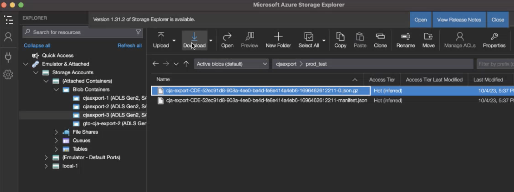

# Cloudexportlocaties configureren

Voordat u Customer Journey Analytics-rapporten kunt exporteren naar een cloudinrichting zoals beschreven in [Rapporten van de Customer Journey Analytics van de uitvoer naar de wolk](/help/analysis-workspace/export/export-cloud.md), moet u de plaats toevoegen en vormen waar u de gegevens wilt worden verzonden.

Dit proces bestaat uit het toevoegen en configureren van de account (zoals Amazon S3, Google Cloud Platform, enzovoort) zoals beschreven in [Cloudexportaccounts configureren](/help/components/exports/cloud-export-accounts.md)en vervolgens de locatie binnen die account (bijvoorbeeld een map binnen de account) toe te voegen en te configureren, zoals in dit artikel wordt beschreven.

Voor informatie over hoe u bestaande locaties kunt beheren, zoals het weergeven, bewerken en verwijderen van locaties, raadpleegt u [Locaties en accounts voor cloudexport beheren](/help/components/exports/manage-export-locations.md).

## Beginnen met het maken van een exportlocatie voor de cloud

1. U moet een account toevoegen voordat u een locatie kunt toevoegen. Voeg een account toe zoals beschreven in [Cloudexportaccounts configureren](/help/components/exports/cloud-export-accounts.md).

1. Selecteer in Customer Journey Analytics [!UICONTROL **Componenten**] > [!UICONTROL **Uitvoer**].

1. Selecteer de [!UICONTROL **Locaties**] tab, dan selecteren [!UICONTROL **Locatie toevoegen**].

   

   of

   Selecteer de [!UICONTROL **Locatieaccounts**] selecteert u het pictogram met drie punten op een bestaande account waaraan u een locatie wilt toevoegen en selecteert u vervolgens [!UICONTROL **Locatie toevoegen**].

   

   Het dialoogvenster Locatie wordt weergegeven.

1. Geef de volgende informatie op: |Veld | Functie | |—|—| | [!UICONTROL **Naam**] | De naam van de locatie.  | | [!UICONTROL **Beschrijving**] | Geef een korte beschrijving van de locatie om deze te onderscheiden van andere locaties op de account. | | [!UICONTROL **Locatieaccount**] | Selecteer de account waar u de locatie wilt maken. Voor informatie over het maken van een account raadpleegt u [Cloudexportaccounts configureren](/help/components/exports/cloud-export-accounts.md). |

1. In de [!UICONTROL **Locatie-eigenschappen**] in, geeft u specifieke informatie op over het accounttype van uw locatieaccount.

   Doorgaan met de sectie hieronder die overeenkomt met het accounttype dat u hebt geselecteerd in het dialoogvenster [!UICONTROL **Locatieaccount**] veld.

   * [AEP gegevenslandingszone](#aep-data-landing-zone)
   * [Amazon S3 Role ARN](#amazon-s3-role-arn)
   * [Google Cloud Platform](#google-cloud-platform)
   * [Azure SAS](#azure-sas)
   * [Azure RBAC](#azure-rbac)
   * [Snowflake](#snowflake)

### AEP gegevenslandingszone

>[!IMPORTANT]
>
>Wanneer het uitvoeren van de rapporten van de Customer Journey Analytics aan de Landing Zone van Adobe Experience Platform Gegevens, zorg ervoor dat u de gegevens binnen 7 dagen downloadt, dan schrapt het uit de Gebied van Gegevens AEP. Na 7 dagen worden de gegevens automatisch verwijderd uit de AEP Data Landing Zone.

1. Ga op een van de volgende manieren te werk om een exportlocatie voor de cloud te maken:

   * Vanaf de pagina Exporteren, zoals hierboven beschreven, in [Beginnen met het maken van een exportlocatie voor de cloud](#begin-creating-a-cloud-export-location)

   * Wanneer [volledige tabellen exporteren vanuit Analysis Workspace](/help/analysis-workspace/export/export-cloud.md#export-full-tables-from-analysis-workspace)

1. In de [!UICONTROL **Locatie-eigenschappen**] van de [!UICONTROL **Locatie toevoegen**] geeft u de volgende informatie op om een locatie in een Adobe Experience Platform Data Landing Zone te configureren:

   <!-- still need to update; can't create AEP account -->

   | Veld | Functie |
   |---------|----------|
   | [!UICONTROL **Voorvoegsel**] | De map in de container waarin u de gegevens wilt plaatsen. Geef een mapnaam op en voeg vervolgens na de naam een schuine streep toe om de map te maken. Bijvoorbeeld: `folder_name/` |

   {style="table-layout:auto"}

1. Selecteren [!UICONTROL **Opslaan**].

1. U kunt nu gegevens van Analysis Workspace exporteren naar de account en locatie die u hebt geconfigureerd. Ga voor informatie over het exporteren van gegevens naar de cloud naar [Projectgegevens exporteren naar de cloud](/help/analysis-workspace/export/export-cloud.md).

1. De eenvoudigste manier om toegang te krijgen tot uw gegevens in de AEP Data Landing Zone is om de Microsoft Azure Storage Explorer te gebruiken. Dit is het zelfde hulpmiddel dat in de instructies wordt gebruikt om te vormen [AEP-rekening gegevenslandingszone](/help/components/exports/cloud-export-accounts.md#aep-data-landing-zone).

   1. Open de [Microsoft Azure Storage Explorer](https://azure.microsoft.com/en-us/products/storage/storage-explorer/).

   1. Ga naar [!UICONTROL **Opslagaccounts**] > [!UICONTROL **(Bijgevoegde containers)**] > [!UICONTROL **Kloddercontainers**] > **[!UICONTROL cjaexport-_getal_]** > ***your_container_name***.

      >[!NOTE]
      >
      >De mapnaam **[!UICONTROL cjaexport-_getal_]** Dit is de standaardnaam die wordt verschaft door Azure Storage Explorer. Als u slechts één verbinding verbonden met uw SAS URI (wat normaal is) hebt, dan zal de naam van deze omslag zijn **[!UICONTROL cjaexport-1]**.

      

   1. Selecteer de exportbewerking die u wilt downloaden en selecteer vervolgens [!UICONTROL **Downloaden**] om te downloaden.

### Amazon S3 Role ARN

1. Ga op een van de volgende manieren te werk om een exportlocatie voor de cloud te maken:

   * Vanaf de pagina Exporteren, zoals hierboven beschreven, in [Beginnen met het maken van een exportlocatie voor de cloud](#begin-creating-a-cloud-export-location)

   * Wanneer [volledige tabellen exporteren vanuit Analysis Workspace](/help/analysis-workspace/export/export-cloud.md#export-full-tables-from-analysis-workspace)

1. In de [!UICONTROL **Locatie-eigenschappen**] van de [!UICONTROL **Locatie toevoegen**] geeft u de volgende informatie op om een ARN-locatie voor Amazon S3 Role te configureren:

   <!-- still need to update; can't create S3 role ARN account -->

   | Veld | Functie |
   |---------|----------|
   | [!UICONTROL **Emmertje**] | Het emmertje in uw Amazon S3-account waarin u Adobe Analytics-gegevens wilt verzenden. Zorg ervoor dat de gebruiker-ARN die door de Adobe is geleverd, toegang heeft om bestanden naar dit emmertje te uploaden. |
   | [!UICONTROL **Voorvoegsel**] | De map in het emmertje waar u de gegevens wilt plaatsen. Geef een mapnaam op en voeg vervolgens na de naam een schuine streep toe om de map te maken. Map_name/ |

   {style="table-layout:auto"}

1. Selecteren [!UICONTROL **Opslaan**].

1. U kunt nu gegevens van Analysis Workspace exporteren naar de account en locatie die u hebt geconfigureerd. Ga voor informatie over het exporteren van gegevens naar de cloud naar [Projectgegevens exporteren naar de cloud](/help/analysis-workspace/export/export-cloud.md).

### Google Cloud Platform

1. Ga op een van de volgende manieren te werk om een exportlocatie voor de cloud te maken:

   * Vanaf de pagina Exporteren, zoals hierboven beschreven, in [Beginnen met het maken van een exportlocatie voor de cloud](#begin-creating-a-cloud-export-location)

   * Wanneer [volledige tabellen exporteren vanuit Analysis Workspace](/help/analysis-workspace/export/export-cloud.md#export-full-tables-from-analysis-workspace)

1. In de [!UICONTROL **Locatie-eigenschappen**] van de [!UICONTROL **Locatie toevoegen**] geeft u de volgende informatie op om een locatie voor een Google Cloud Platform te configureren:

   <!-- still need to update; can't create GCP account -->

   | Veld | Functie |
   |---------|----------|
   | [!UICONTROL **Emmertje**] | Het emmertje binnen uw rekening GCP waar u de gegevens van de Customer Journey Analytics wilt worden verzonden. Zorg ervoor dat u aan Opdrachtgever toestemming hebt verleend die door Adobe wordt verstrekt om dossiers aan dit emmertje te uploaden. (De Opdrachtgever wordt verstrekt wanneer [configureren van Google Cloud Platform-account](/help/components/exports/cloud-export-accounts.md).) Zie voor informatie over het verlenen van machtigingen [Voeg een hoofd aan een beleid op het niveau van de emmertje toe](https://cloud.google.com/storage/docs/access-control/using-iam-permissions#bucket-add) in de Google Cloud-documentatie. |
   | [!UICONTROL **Voorvoegsel**] | De map in het emmertje waar u de gegevens wilt plaatsen. Geef een mapnaam op en voeg vervolgens na de naam een schuine streep toe om de map te maken. Map_name/ |

   {style="table-layout:auto"}

1. Selecteren [!UICONTROL **Opslaan**].

1. U kunt nu gegevens van Analysis Workspace exporteren naar de account en locatie die u hebt geconfigureerd. Ga voor informatie over het exporteren van gegevens naar de cloud naar [Projectgegevens exporteren naar de cloud](/help/analysis-workspace/export/export-cloud.md).

### Azure SAS

1. Ga op een van de volgende manieren te werk om een exportlocatie voor de cloud te maken:

   * Vanaf de pagina Exporteren, zoals hierboven beschreven, in [Beginnen met het maken van een exportlocatie voor de cloud](#begin-creating-a-cloud-export-location)

   * Wanneer [volledige tabellen exporteren vanuit Analysis Workspace](/help/analysis-workspace/export/export-cloud.md#export-full-tables-from-analysis-workspace)

1. In de [!UICONTROL **Locatie-eigenschappen**] van de [!UICONTROL **Locatie toevoegen**] geeft u de volgende informatie op om een Azure SAS-locatie te configureren:

   | Veld | Functie |
   |---------|----------|
   | [!UICONTROL **Containernaam**] | De container binnen de account die u hebt opgegeven, waarin u de gegevens van de Customer Journey Analytics wilt verzenden. |
   | [!UICONTROL **Voorvoegsel**] | De map in de container waarin u de gegevens wilt plaatsen. Geef een mapnaam op en voeg vervolgens na de naam een schuine streep toe om de map te maken. Bijvoorbeeld: `folder_name/` |

   {style="table-layout:auto"}

1. Selecteren [!UICONTROL **Opslaan**].

1. U kunt nu gegevens van Analysis Workspace exporteren naar de account en locatie die u hebt geconfigureerd. Ga voor informatie over het exporteren van gegevens naar de cloud naar [Projectgegevens exporteren naar de cloud](/help/analysis-workspace/export/export-cloud.md).

### Azure RBAC

1. Ga op een van de volgende manieren te werk om een exportlocatie voor de cloud te maken:

   * Vanaf de pagina Exporteren, zoals hierboven beschreven, in [Beginnen met het maken van een exportlocatie voor de cloud](#begin-creating-a-cloud-export-location)

   * Wanneer [volledige tabellen exporteren vanuit Analysis Workspace](/help/analysis-workspace/export/export-cloud.md#export-full-tables-from-analysis-workspace)

1. In de [!UICONTROL **Locatie-eigenschappen**] van de [!UICONTROL **Locatie toevoegen**] geeft u de volgende informatie op om een Azure RBAC-locatie te configureren:

   | Veld | Functie |
   |---------|----------|
   | [!UICONTROL **Container**] | De container in de account die u hebt opgegeven, waarnaar u Adobe Analytics-gegevens wilt verzenden. Zorg ervoor dat u machtigingen verleent om bestanden te uploaden naar de Azure-toepassing die u eerder hebt gemaakt. |
   | [!UICONTROL **Voorvoegsel**] | De map in de container waarin u de gegevens wilt plaatsen. Geef een mapnaam op en voeg vervolgens na de naam een schuine streep toe om de map te maken. Bijvoorbeeld: `folder_name/` |
   | [!UICONTROL **Account**] | De Azure-opslagaccount. |

   {style="table-layout:auto"}

1. Selecteren [!UICONTROL **Opslaan**].

1. U kunt nu gegevens van Analysis Workspace exporteren naar de account en locatie die u hebt geconfigureerd. Ga voor informatie over het exporteren van gegevens naar de cloud naar [Projectgegevens exporteren naar de cloud](/help/analysis-workspace/export/export-cloud.md).

### Snowflake

1. Ga op een van de volgende manieren te werk om een exportlocatie voor de cloud te maken:

   * Vanaf de pagina Exporteren, zoals hierboven beschreven, in [Beginnen met het maken van een exportlocatie voor de cloud](#begin-creating-a-cloud-export-location)

   * Wanneer [volledige tabellen exporteren vanuit Analysis Workspace](/help/analysis-workspace/export/export-cloud.md#export-full-tables-from-analysis-workspace)

1. In de [!UICONTROL **Locatie-eigenschappen**] van de [!UICONTROL **Locatie toevoegen**] geeft u de volgende informatie op om de locatie van een Snowflake te configureren:

   | Veld | Functie |
   |---------|----------|
   | [!UICONTROL **DB**] | De opgegeven database moet een bestaande database zijn. De rol u creeerde moet voorrechten hebben om tot dit gegevensbestand toegang te hebben.
Dit is de database die is gekoppeld aan de naam van het werkgebied.

U kunt deze rolvoorrechten aan het gegevensbestand in Snowflake verlenen gebruikend het volgende bevel: `GRANT USAGE ON DATABASE <your_database> TO ROLE <your_role>;`
 
Zie de klasse [Database-, Schema- en Share Commands-pagina in de documentatie van de Snowflake](https://docs.snowflake.com/en/sql-reference/commands-database).
 |
   | [!UICONTROL **Schema**] | Het opgegeven schema moet een bestaand schema zijn. De rol u creeerde moet voorrechten hebben om tot dit schema toegang te hebben.
Dit is het schema dat aan de naam van het werkgebied is gekoppeld.
U kunt de rol verlenen die u voorrechten aan het schema in Snowflake gebruikend het volgende bevel creeerde: `GRANT USAGE ON SCHEMA <your_database>.<your_schema> TO ROLE <your_role>;`

Zie de klasse [Database-, Schema- en Share Commands-pagina in de documentatie van de Snowflake](https://docs.snowflake.com/en/sql-reference/commands-database).
 |
   | [!UICONTROL **Werkgebiednaam**] | De naam van het interne werkgebied waarin gegevensbestanden in Snowflake worden opgeslagen.
Zorg ervoor dat de rol die u op de account hebt opgegeven, lees- en schrijftoegang heeft tot deze werkgebiednaam. (Omdat u Gelezen en schrijft toegang verleent, adviseren wij gebruikend een stadium dat slechts door Adobe wordt gebruikt.)
U kunt Lezen en schrijven toegang tot de werkgebiednaam in Snowflake verlenen gebruikend het volgende bevel: `GRANT READ, WRITE ON STAGE <your_database>.<your_schema>.<your_stage_name> TO ROLE <your_role>;`
 
Voor informatie over het verlenen van bevoegdheden aan een rol raadpleegt u [Rechten verlenen in de documentatie van de Snowflake](https://docs.snowflake.com/en/sql-reference/sql/grant-privilege). 
Zie de klasse [Een pagina Intern werkgebied voor lokale bestanden kiezen in de documentatie van Snowflake](https://docs.snowflake.com/en/user-guide/data-load-local-file-system-create-stage).
 |
   | [!UICONTROL **Werkgebiedpad**] | Het pad naar de locatie waar gegevensbestanden in Snowflake worden opgeslagen. 
Zie de klasse [Een pagina Intern werkgebied voor lokale bestanden kiezen in de documentatie van Snowflake](https://docs.snowflake.com/en/user-guide/data-load-local-file-system-create-stage).
 |

   {style="table-layout:auto"}

1. Selecteren [!UICONTROL **Opslaan**].

1. U kunt nu gegevens van Analysis Workspace exporteren naar de account en locatie die u hebt geconfigureerd. Ga voor informatie over het exporteren van gegevens naar de cloud naar [Projectgegevens exporteren naar de cloud](/help/analysis-workspace/export/export-cloud.md).
