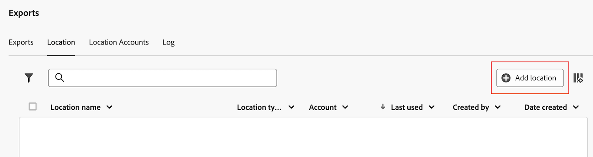

# Cloudexportlocaties configureren

Alvorens u de rapporten van de Customer Journey Analytics naar een wolkenbestemming kunt uitvoeren zoals die in [ worden beschreven de rapporten van de Customer Journey Analytics van de Uitvoer aan de wolk ](/help/analysis-workspace/export/export-cloud.md), moet u de plaats toevoegen en vormen waar u de gegevens wilt worden verzonden.

Dit proces bestaat uit het toevoegen van en het vormen van de rekening (zoals Amazon S3, het Platform van de Wolk van Google, etc.) zoals die in [ wordt beschreven vormt wolkenuitvoerrekeningen ](/help/components/exports/cloud-export-accounts.md), en dan het toevoegen van en het vormen van de plaats binnen die rekening (zoals een omslag binnen de rekening) zoals die in dit artikel wordt beschreven.

Voor informatie over hoe te om bestaande plaatsen, met inbegrip van het bekijken, het uitgeven, en het schrappen van plaatsen te beheren, zie [ wolkenuitvoerplaatsen en rekeningen beheren ](/help/components/exports/manage-export-locations.md).

## Beginnen met het maken van een exportlocatie voor de cloud

1. U moet een account toevoegen voordat u een locatie kunt toevoegen. Als u niet reeds hebt, voeg een rekening toe zoals die in [ wordt beschreven vormt de rekeningen van de wolkenuitvoer ](/help/components/exports/cloud-export-accounts.md).

1. In Customer Journey Analytics, uitgezochte [!UICONTROL **Componenten**] > [!UICONTROL **voert**] uit.

1. Selecteer het [!UICONTROL **lusje van Plaatsen**], dan uitgezocht [!UICONTROL **plaats**] toevoegen.

    benadrukken

   of

   Selecteer de [!UICONTROL **rekeningen van de Plaats**] tabel, selecteer het 3 puntpictogram op een bestaande rekening waar u een plaats wilt toevoegen, dan selecteren [!UICONTROL **plaats**] toevoegen.

   

   Het dialoogvenster Locatie wordt weergegeven.

1. Geef de volgende informatie op:

   | Veld | Functie |
   |---------|----------|
   | [!UICONTROL **Naam**] | De naam van de locatie. |
   | [!UICONTROL **Beschrijving**] | Geef een korte beschrijving van de locatie om deze te onderscheiden van andere locaties op de account. |
   | [!UICONTROL **plaats van het Merk beschikbaar aan alle gebruikers in uw organisatie**] | Schakel deze optie in als u wilt dat andere gebruikers in uw organisatie de locatie kunnen gebruiken. 
Houd rekening met het volgende wanneer u locaties deelt:
<ul><li>Locaties die u deelt, kunnen niet worden verwijderd.</li><li>Gedeelde locaties kunnen alleen door de eigenaar van de locatie worden bewerkt.</li><li>Locaties kunnen alleen worden gedeeld als de account waaraan de locatie is gekoppeld, ook wordt gedeeld.</li></ul> |
   | [!UICONTROL **de rekening van de Plaats**] | Selecteer de account waar u de locatie wilt maken. Voor informatie over hoe te om een rekening tot stand te brengen, zie [ de rekeningen van de wolkenuitvoer ](/help/components/exports/cloud-export-accounts.md) vormen. |

1. In de [!UICONTROL **eigenschappen van de Plaats**] sectie, specificeer informatie specifiek voor het accounttype van uw plaatsrekening.

   Ga met de sectie onder verder die aan het accounttype beantwoordt dat u op het [!UICONTROL **de rekeningsrekening van de Plaats**] gebied selecteerde.

   * [AEP gegevenslandingszone](#aep-data-landing-zone)
   * [Amazon S3 Role ARN](#amazon-s3-role-arn)
   * [Google Cloud Platform](#google-cloud-platform)
   * [Azure SAS](#azure-sas)
   * [Azure RBAC](#azure-rbac)
   * [Snowflake](#snowflake)

### AEP gegevenslandingszone

>[!IMPORTANT]
>
>Wanneer het uitvoeren van de rapporten van de Customer Journey Analytics aan de Landing Zone van Adobe Experience Platform Gegevens, zorg ervoor dat u de gegevens binnen 7 dagen downloadt, dan schrapt het uit de Gebied van Gegevens AEP. Na 7 dagen worden de gegevens automatisch verwijderd uit de AEP Data Landing Zone.

1. Ga op een van de volgende manieren te werk om een exportlocatie voor de cloud te maken:

   * Van de pagina van Uitvoer zoals hierboven beschreven, in [ beginnen creërend een wolkenuitvoerplaats ](#begin-creating-a-cloud-export-location)

   * Wanneer [ het uitvoeren van volledige lijsten van Analysis Workspace ](/help/analysis-workspace/export/export-cloud.md#export-full-tables-from-analysis-workspace)

1. In de [!UICONTROL **eigenschappen van de Plaats**] sectie van [!UICONTROL **voeg plaats**] dialoogdoos toe, specificeer de volgende informatie om een plaats van de Gebied van de Gegevens van Adobe Experience Platform te vormen Landing:

   <!-- still need to update; can't create AEP account -->

   | Veld | Functie |
   |---------|----------|
   | [!UICONTROL **Prefix**] | De map in de container waarin u de gegevens wilt plaatsen. Geef een mapnaam op en voeg vervolgens na de naam een schuine streep toe om de map te maken. Bijvoorbeeld: `folder_name/` |

   {style="table-layout:auto"}

1. Selecteer [!UICONTROL **sparen**].

1. U kunt nu gegevens van Analysis Workspace exporteren naar de account en locatie die u hebt geconfigureerd. Voor informatie over hoe te om gegevens naar de wolk uit te voeren, zie [ projectgegevens van de Uitvoer naar de wolk ](/help/analysis-workspace/export/export-cloud.md).

1. De eenvoudigste manier om toegang te krijgen tot uw gegevens in de AEP Data Landing Zone is om de Microsoft Azure Storage Explorer te gebruiken. Dit is het zelfde hulpmiddel dat in de instructies wordt gebruikt om de [ AEP- Gegevens Landing Rekening van de Zone ](/help/components/exports/cloud-export-accounts.md#aep-data-landing-zone) te vormen.

   1. Open [ Microsoft Azure de Ontdekkingsreiziger van de Opslag ](https://azure.microsoft.com/en-us/products/storage/storage-explorer/).

   1. Ga naar [!UICONTROL **de Rekeningen van de Opslag**] > [!UICONTROL **(in bijlage)**] > [!UICONTROL **Blokcontainers**] > **[!UICONTROL cjaexport-_aantal_]** > ***your_container_name***.

      >[!NOTE]
      >
      >De omslagnaam **[!UICONTROL cjaexport-_aantal_]** is de standaardnaam die door de Ontdekkingsreiziger van de Opslag wordt verstrekt Azure. Als u slechts één verbinding aan uw SAS URI (wat normaal is) hebt verbonden, dan zal de naam van deze omslag **[!UICONTROL cjaexport-1]** zijn.

      

   1. Selecteer de uitvoer die u wilt downloaden, dan selecteren [!UICONTROL **Download**] om te downloaden.

### Amazon S3 Role ARN

1. Ga op een van de volgende manieren te werk om een exportlocatie voor de cloud te maken:

   * Van de pagina van Uitvoer zoals hierboven beschreven, in [ beginnen creërend een wolkenuitvoerplaats ](#begin-creating-a-cloud-export-location)

   * Wanneer [ het uitvoeren van volledige lijsten van Analysis Workspace ](/help/analysis-workspace/export/export-cloud.md#export-full-tables-from-analysis-workspace)

1. In de [!UICONTROL **eigenschappen van de Plaats**] sectie van [!UICONTROL **voeg plaats**] dialoogdoos toe, specificeer de volgende informatie om een Amazon S3 plaats van de Rol ARN te vormen:

   <!-- still need to update; can't create S3 role ARN account -->

   | Veld | Functie |
   |---------|----------|
   | [!UICONTROL **Emmertje**] | Het emmertje binnen uw Amazon S3 rekening waar u de gegevens van de Customer Journey Analytics wilt verzenden. 
Zorg ervoor dat de Gebruiker ARN die door Adobe werd verstrekt de `S3:PutObject` toestemming heeft om dossiers aan dit emmertje te uploaden. 

Emmernamen moeten voldoen aan specifieke naamgevingsregels. Ze moeten bijvoorbeeld tussen 3 en 63 tekens lang zijn, ze mogen alleen bestaan uit kleine letters, cijfers, puntjes (.) en afbreekstreepjes (-) en ze moeten beginnen en eindigen met een letter of getal. [ A volledige lijst van het noemen van regels is beschikbaar in de documentatie van AWS ](https://docs.aws.amazon.com/AmazonS3/latest/userguide/bucketnamingrules.html). 
 |
   | [!UICONTROL **Prefix**] | De map in het emmertje waar u de gegevens wilt plaatsen. Geef een mapnaam op en voeg vervolgens na de naam een schuine streep toe om de map te maken. Map_name/ |

   {style="table-layout:auto"}

1. Selecteer [!UICONTROL **sparen**].

1. U kunt nu gegevens van Analysis Workspace exporteren naar de account en locatie die u hebt geconfigureerd. Voor informatie over hoe te om gegevens naar de wolk uit te voeren, zie [ projectgegevens van de Uitvoer naar de wolk ](/help/analysis-workspace/export/export-cloud.md).

### Google Cloud Platform

1. Ga op een van de volgende manieren te werk om een exportlocatie voor de cloud te maken:

   * Van de pagina van Uitvoer zoals hierboven beschreven, in [ beginnen creërend een wolkenuitvoerplaats ](#begin-creating-a-cloud-export-location)

   * Wanneer [ het uitvoeren van volledige lijsten van Analysis Workspace ](/help/analysis-workspace/export/export-cloud.md#export-full-tables-from-analysis-workspace)

1. In de [!UICONTROL **eigenschappen van de Plaats**] sectie van [!UICONTROL **voeg plaats**] dialoogdoos toe, specificeer de volgende informatie om een plaats van het Platform van de Wolk van Google te vormen:

   | Veld | Functie |
   |---------|----------|
   | [!UICONTROL **Emmertje**] | Het emmertje binnen uw rekening GCP waar u de gegevens van de Customer Journey Analytics wilt worden verzonden. 
Zorg ervoor dat u `roles/storage.objectCreator` toestemming aan Principal hebt verleend die door Adobe wordt verstrekt. (Het Belangrijkste wordt verstrekt wanneer [ het vormen van de rekening van het Platform van de Wolk van Google ](/help/components/exports/cloud-export-accounts.md).) 
Voor informatie over het verlenen van toestemmingen, zie [ een hoofd aan een emmertje-vlakke beleid ](https://cloud.google.com/storage/docs/access-control/using-iam-permissions#bucket-add) in de documentatie van de Wolk van Google toevoegen.

Als uw organisatie [ het beleidsbeperkingen van de Organisatie ](https://cloud.google.com/storage/docs/org-policy-constraints) gebruikt om slechts de rekening van het Platform van de Wolk van Google in uw lijst van gewenste personen toe te staan, hebt u de volgende Adobe-Bezit de organisatieidentiteitskaart van het Platform van Google Cloud nodig: <ul><li>`DISPLAY_NAME`: `adobe.com`</li><li>`ID`: `178012854243`</li><li>`DIRECTORY_CUSTOMER_ID`: `C02jo8puj`</li></ul> 
 |
   | [!UICONTROL **Prefix**] | De map in het emmertje waar u de gegevens wilt plaatsen. Geef een mapnaam op en voeg vervolgens na de naam een schuine streep toe om de map te maken. Map_name/ |

   {style="table-layout:auto"}

1. Selecteer [!UICONTROL **sparen**].

1. U kunt nu gegevens van Analysis Workspace exporteren naar de account en locatie die u hebt geconfigureerd. Voor informatie over hoe te om gegevens naar de wolk uit te voeren, zie [ projectgegevens van de Uitvoer naar de wolk ](/help/analysis-workspace/export/export-cloud.md).

### Azure SAS

1. Ga op een van de volgende manieren te werk om een exportlocatie voor de cloud te maken:

   * Van de pagina van Uitvoer zoals hierboven beschreven, in [ beginnen creërend een wolkenuitvoerplaats ](#begin-creating-a-cloud-export-location)

   * Wanneer [ het uitvoeren van volledige lijsten van Analysis Workspace ](/help/analysis-workspace/export/export-cloud.md#export-full-tables-from-analysis-workspace)

1. In de [!UICONTROL **eigenschappen van de Plaats**] sectie van [!UICONTROL **voeg plaats**] dialoogdoos toe, specificeer de volgende informatie om een Azure SAS plaats te vormen:

   | Veld | Functie |
   |---------|----------|
   | [!UICONTROL **naam van de Container**] | De container binnen de account die u hebt opgegeven, waarin u de gegevens van de Customer Journey Analytics wilt verzenden. |
   | [!UICONTROL **Prefix**] | De map in de container waarin u de gegevens wilt plaatsen. Geef een mapnaam op en voeg vervolgens na de naam een schuine streep toe om de map te maken. Bijvoorbeeld: `folder_name/`
Zorg ervoor dat de SAS-tokenopslag die u in het geheime naamveld Key Vault hebt opgegeven bij de configuratie van de Azure SAS-account, de `Write` -machtiging heeft. Hierdoor kan de SAS-token bestanden in uw Azure-container maken. 
Als u wilt dat het SAS-token ook bestanden kan overschrijven, controleert u of de SAS-token-winkel de machtiging `Delete` heeft.

Voor meer informatie, zie [ de opslagmiddelen van de Blob ](https://learn.microsoft.com/en-us/azure/storage/blobs/storage-blobs-introduction#blob-storage-resources) in de Azure documentatie van de Opslag van Blob.
 |

   {style="table-layout:auto"}

1. Selecteer [!UICONTROL **sparen**].

1. U kunt nu gegevens van Analysis Workspace exporteren naar de account en locatie die u hebt geconfigureerd. Voor informatie over hoe te om gegevens naar de wolk uit te voeren, zie [ projectgegevens van de Uitvoer naar de wolk ](/help/analysis-workspace/export/export-cloud.md).

### Azure RBAC

1. Ga op een van de volgende manieren te werk om een exportlocatie voor de cloud te maken:

   * Van de pagina van Uitvoer zoals hierboven beschreven, in [ beginnen creërend een wolkenuitvoerplaats ](#begin-creating-a-cloud-export-location)

   * Wanneer [ het uitvoeren van volledige lijsten van Analysis Workspace ](/help/analysis-workspace/export/export-cloud.md#export-full-tables-from-analysis-workspace)

1. In de [!UICONTROL **eigenschappen van de Plaats**] sectie van [!UICONTROL **voeg plaats**] dialoogdoos toe, specificeer de volgende informatie om een Azure plaats te vormen RBAC:

   | Veld | Functie |
   |---------|----------|
   | [!UICONTROL **Container**] | De container binnen de account die u hebt opgegeven, waarin u de gegevens van de Customer Journey Analytics wilt verzenden. Zorg ervoor dat u machtigingen verleent om bestanden te uploaden naar de Azure-toepassing die u eerder hebt gemaakt. |
   | [!UICONTROL **Prefix**] | De map in de container waarin u de gegevens wilt plaatsen. Geef een mapnaam op en voeg vervolgens na de naam een schuine streep toe om de map te maken. Bijvoorbeeld: `folder_name/`
Controleer of de toepassings-id die u hebt opgegeven bij het configureren van de Azure RBAC-account, de rol `Storage Blob Data Contributor` heeft gekregen voor toegang tot de container (map).
 
Voor meer informatie, zie [ Azure ingebouwde rollen ](https://learn.microsoft.com/en-us/azure/role-based-access-control/built-in-roles).
 |
   | [!UICONTROL **Rekening**] | De Azure-opslagaccount. |

   {style="table-layout:auto"}

1. Selecteer [!UICONTROL **sparen**].

1. U kunt nu gegevens van Analysis Workspace exporteren naar de account en locatie die u hebt geconfigureerd. Voor informatie over hoe te om gegevens naar de wolk uit te voeren, zie [ projectgegevens van de Uitvoer naar de wolk ](/help/analysis-workspace/export/export-cloud.md).

### Snowflake

1. Ga op een van de volgende manieren te werk om een exportlocatie voor de cloud te maken:

   * Van de pagina van Uitvoer zoals hierboven beschreven, in [ beginnen creërend een wolkenuitvoerplaats ](#begin-creating-a-cloud-export-location)

   * Wanneer [ het uitvoeren van volledige lijsten van Analysis Workspace ](/help/analysis-workspace/export/export-cloud.md#export-full-tables-from-analysis-workspace)

1. In de [!UICONTROL **eigenschappen van de Plaats**] sectie van [!UICONTROL **voeg plaats**] dialoogdoos toe, specificeer de volgende informatie om een plaats van de Snowflake te vormen:

   | Veld | Functie |
   |---------|----------|
   | [!UICONTROL **OB**] | De opgegeven database moet een bestaande database zijn. De rol u creeerde moet voorrechten hebben om tot dit gegevensbestand toegang te hebben.
Dit is de database die is gekoppeld aan de naam van het werkgebied.

U kunt deze rol voorrechten aan het gegevensbestand in Snowflake verlenen gebruikend het volgende bevel: `GRANT USAGE ON DATABASE <your_database> TO ROLE <your_role>;`
 
Voor meer informatie, zie het [ Gegevensbestand, Schema, en de pagina van de Bevelen van het Aandeel in de documentatie van de Snowflake ](https://docs.snowflake.com/en/sql-reference/commands-database).
 |
   | [!UICONTROL **Schema**] | Het opgegeven schema moet een bestaand schema zijn. De rol u creeerde moet voorrechten hebben om tot dit schema toegang te hebben.
Dit is het schema dat aan de naam van het werkgebied is gekoppeld.
U kunt de rol die u creeerde voorrechten aan het schema in Snowflake verlenen gebruikend het volgende bevel: `GRANT USAGE ON SCHEMA <your_database>.<your_schema> TO ROLE <your_role>;`

Voor meer informatie, zie het [ Gegevensbestand, Schema, en de pagina van de Bevelen van het Aandeel in de documentatie van de Snowflake ](https://docs.snowflake.com/en/sql-reference/commands-database).
 |
   | [!UICONTROL **naam van het Stadium**] | De naam van het interne werkgebied waarin gegevensbestanden in Snowflake worden opgeslagen.
Zorg ervoor dat de rol die u op de account hebt opgegeven, lees- en schrijftoegang heeft tot deze werkgebiednaam. (Omdat u Gelezen en schrijft toegang verleent, adviseren wij gebruikend een stadium dat slechts door Adobe wordt gebruikt.)
U kunt Lezen en Schrijven toegang tot de werkgebiednaam in Snowflake verlenen met de volgende opdracht: `GRANT READ, WRITE ON STAGE <your_database>.<your_schema>.<your_stage_name> TO ROLE <your_role>;`
 
Voor informatie over het verlenen van voorrechten aan een rol, zie [ voorrechten van de Verlening in de documentatie van de Snowflake ](https://docs.snowflake.com/en/sql-reference/sql/grant-privilege). 
Voor meer informatie over de werkgebiednaam, zie [ het Kiezen van een Intern Stadium voor de Lokale pagina van Dossiers in de documentatie van de Snowflake ](https://docs.snowflake.com/en/user-guide/data-load-local-file-system-create-stage).
 |
   | [!UICONTROL **weg van het Stadium**] | Het pad naar de locatie waar gegevensbestanden in Snowflake worden opgeslagen. 
Voor meer informatie, zie [ het Kiezen van een Intern Stadium voor de Lokale pagina van Dossiers in de documentatie van de Snowflake ](https://docs.snowflake.com/en/user-guide/data-load-local-file-system-create-stage).
 |

   {style="table-layout:auto"}

1. Selecteer [!UICONTROL **sparen**].

1. U kunt nu gegevens van Analysis Workspace exporteren naar de account en locatie die u hebt geconfigureerd. Voor informatie over hoe te om gegevens naar de wolk uit te voeren, zie [ projectgegevens van de Uitvoer naar de wolk ](/help/analysis-workspace/export/export-cloud.md).
