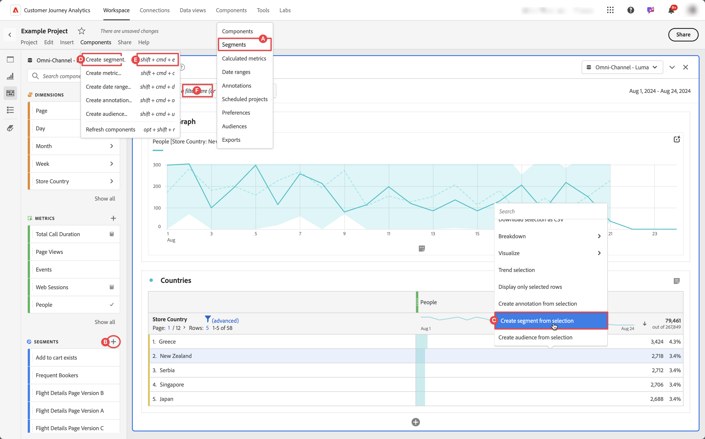

# Filters maken

U kunt verschillende soorten filters in Customer Journey Analytics tot stand brengen.  Het type dat u selecteert, is afhankelijk van de complexiteit van de filters en van de vraag of de filters alleen moeten worden toegepast op het huidige Workspace-project of op alle projecten. U kunt filters direct in de belangrijkste interface van Customer Journey Analytics tot stand brengen of wanneer het werken in een project van Workspace.

Standaard kunnen alleen beheerders filters maken. Gebruikers hebben rechten om filters weer te geven, vergelijkbaar met de manier waarop gebruikers andere componenten bekijken (zoals annotaties, berekende metriek, enz.).

Nochtans, kunnen de beheerders de **[!UICONTROL Filter Creation]** toestemming voor **[!UICONTROL Reporting Tools]** in **[!UICONTROL Edit permissions for CJA Workspace Access]** aan gebruikers via de [ Admin Console ](/help/technotes/access-control.md#user-level-access) geven.

U kunt op de volgende manieren een filter maken:

 te creëren

* ?? Selecteer **[!UICONTROL Components]** in de hoofdinterface en selecteer **[!UICONTROL Filters]** . Selecteer  [!UICONTROL **[!UICONTROL Add]**] van de [[!UICONTROL Filters] manager ](/help/components/filters/manage-filters.md).
* ?? In een project van Workspace, van het linkerpaneel van Componenten, voegt de uitgezochte  bij  **Filters** toe.
* ?? Selecteer **[!UICONTROL Create filter from selection]** in een Workspace-project in het contextmenu in een visualisatie.
* ?? Selecteer in een Workspace-project **[!UICONTROL Components]** in het menu en selecteer **[!UICONTROL Create filter]** .
* ?? In een Workspace-project gebruikt u de sneltoets **[!UICONTROL shift+cmd+e]** (macOS) of **[!UICONTROL shift+ctrl+e]** (Windows).
* ?? Selecteer  in ***Daling hier een filter (of een andere component)*** dalingsstreek. Met deze handeling maakt u een alleen-projectfilter.

Om de nieuwe filter te bepalen, gebruikt u de [ bouwer van de Filter ](/help/components/filters/filter-builder.md).

Wanneer u in een project van Workspace bent, kunt u een filter snel tot stand brengen gebruikend [ Snelle filter ](/help/components/filters/quick-filters.md).
