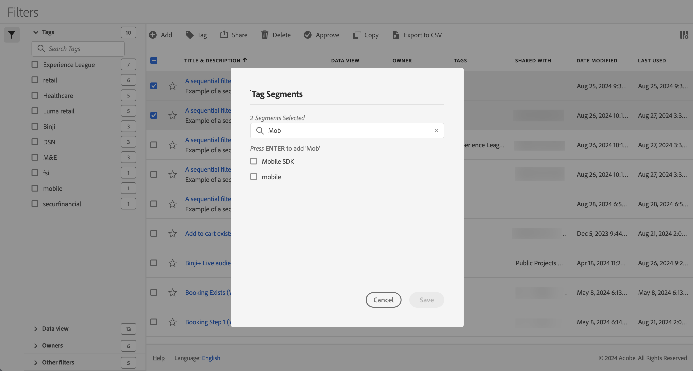

# Labelfilters

In de [ manager van de Filter ](manage-filters.md), kunt u markeringen gebruiken om filters te organiseren. Beheerders kunnen alle filters labelen. Niet-beheerders kunnen alleen labels toewijzen aan de filters die ze maken of met hen zijn gedeeld.

Een of meer filters labelen:

1. In de [ manager van de Filter ](manage-filters.md), selecteer één of meerdere filters u wilt etiketteren.
1. Van de actiebar, uitgezochte  **[!UICONTROL Tag]**.
1. In het dialoogvenster **[!UICONTROL Tag Filters]** :

   

   1. (Naar keuze) gebruik  om naar de lijst van markeringen te zoeken en te beperken.

   2. Gebaseerd op de lijst met labels:

      * een of meer bestaande tags in de lijst te selecteren, of
      * Voer een nieuwe tag in en druk op **[!UICONTROL ENTER]** . Herhaal deze bewerking om meerdere nieuwe tags toe te voegen.

1. Selecteer **[!UICONTROL Save]** om de labels voor het filter op te slaan. Selecteer **[!UICONTROL Cancel]** om te annuleren.

Zodra bewaard, zijn de markeringen vermeld op het [!UICONTROL Tag] gebied voor de geselecteerde filters in de [ bouwer van de Filter ](filter-builder.md).

## Suggesties

Hieronder volgen enkele suggesties voor het organiseren van tags op basis van:

* **Team**: Bijvoorbeeld, Sociale Marketing, Mobiele Marketing.

* **Project**: Bijvoorbeeld, ingang-pagina analyse.

* **Categorie**:. Bijvoorbeeld Mannen, Vrouwen, Kinderen.

* **Geografie**: Bijvoorbeeld: Verenigde Staten, Californië.

* **Werkschema**: Bijvoorbeeld: Om te worden goedgekeurd, Gekrulde

