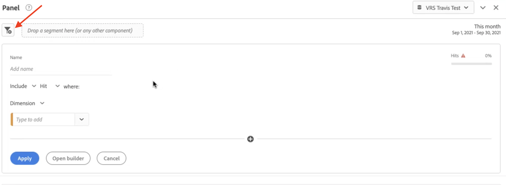
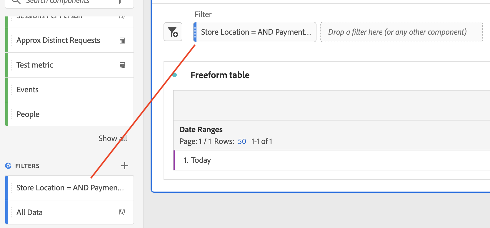
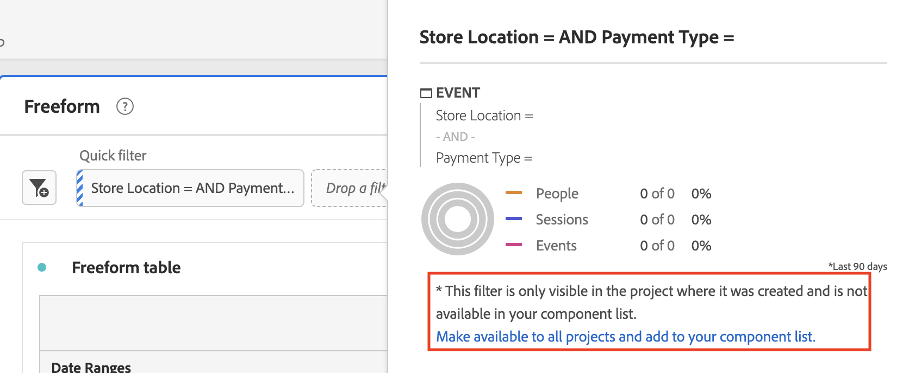

# Snelle filters

U kunt snelle filters binnen een project maken om de complexiteit van de volledige [Filter Builder](/help/components/filters/create-filters.md). Snelle filters

* Toepassen als [projectgebonden segmenten](https://experienceleague.adobe.com/docs/analytics-platform/analysis-workspace/components/filters/quick-filters.html).
* Maximaal 3 regels toestaan
* Plaats geen geneste containers of opeenvolgende regels.

Voor een vergelijking van wat snelle filters kunnen doen versus volledig-afgewerkte componenten-lijst filters, ga [hier](/help/components/filters/filters-overview.md).

## Vereisten {#prereqs}

Iedereen kan een Snel segment maken. U hebt echter de machtiging Segment maken nodig in het dialoogvenster [Adobe Admin Console](https://experienceleague.adobe.com/docs/analytics/admin/admin-console/permissions/summary-tables.html?lang=en#analytics-tools) om een snel segment op te slaan of te openen in de Segment Builder.

## Snelle filters maken {#create}

Klik in een tabel voor vrije vorm op het pictogram filter+ in de koptekst van het deelvenster:

| Instelling | Beschrijving |
| --- | --- |
| [!UICONTROL Name] | De standaardnaam van een filter is een combinatie van de regelnamen in het filter. U kunt de naam van het filter wijzigen in een vriendelijkere naam. |
| [!UICONTROL Include/exclude] | U kunt componenten in uw filterdefinitie opnemen of uitsluiten, maar niet beide. |
| [!UICONTROL Hit/Visit/Visitor] container | Snelle filters omvatten één [filtercontainer](https://experienceleague.adobe.com/docs/analytics-platform/using/cja-components/cja-filters/filters-overview.html?lang=en#filter-containers) alleen dat u een dimensie/metrisch/datumbereik in het filter kunt opnemen (of dit kunt uitsluiten). [!UICONTROL Visitor] bevat overkoepelende gegevens die specifiek zijn voor de bezoeker in verschillende bezoeken en paginaweergaven. A [!UICONTROL Visit] Met de container kunt u regels instellen om de gegevens van de bezoeker op basis van bezoeken te splitsen, en een [!UICONTROL Hit] Met de container kunt u bezoekersinformatie onderverdelen op basis van afzonderlijke paginaweergaven. De standaardcontainer is [!UICONTROL Hit]. |
| [!UICONTROL Components] (Dimension/metrisch/datumbereik) | Definieer maximaal 3 regels door componenten (afmetingen, metriek, datumbereiken of afmetingswaarden) toe te voegen. Er zijn drie manieren om de juiste component te vinden:<ul><li>Begin met typen en [!UICONTROL Quick Filter] de bouwer vindt automatisch de aangewezen component.</li><li>Gebruik de vervolgkeuzelijst om de component te zoeken.</li><li>Sleep componenten vanuit de linkerspoorstaaf.</li></ul> |
| [!UICONTROL Operator] | Gebruik het vervolgkeuzemenu om standaardoperatoren te zoeken en [!UICONTROL Distinct Count] operatoren. Zie [Filteroperatoren](operators.md). |
| plusteken (+) | Een andere regel toevoegen |
| EN/OF kwalificatietekens | U kunt de aanduidingen AND of OR toevoegen aan de regels, maar u kunt AND en OR niet combineren in één filterdefinitie. |
| [!UICONTROL Apply] | Pas dit filter toe op het deelvenster. Als het filter geen gegevens bevat, wordt u gevraagd of u wilt doorgaan. |
| [!UICONTROL Open builder] | Opent de Filter Builder. Wanneer u het filter opslaat of toepast in de Filter Builder, wordt het niet langer beschouwd als een &quot;Snel filter&quot;. Het wordt onderdeel van de filterbibliotheek van de component-lijst. |
| [!UICONTROL Cancel] | Annuleer dit snelle filter - pas het niet toe. |
| [!UICONTROL Date range] | De validator gebruikt het datumbereik van het deelvenster voor het opzoeken van de gegevens. Maar elk datumbereik dat u in een snel filter toepast, overschrijft het datumbereik van het deelvenster boven in het deelvenster. |
| Voorvertoning (rechtsboven) | Hiermee kunt u zien of u een geldig filter hebt en hoe breed het filter is. Geeft de uitsplitsing aan van de gegevensset die u kunt verwachten wanneer u dit filter toepast. Er kan een melding verschijnen dat aangeeft dat dit filter geen gegevens heeft. In dit geval kunt u doorgaan of de filterdefinitie wijzigen. |

Hier volgt een voorbeeld van een filter waarin afmetingen en meetwaarden worden gecombineerd:

Het filter verschijnt bovenaan. Let op de zijbalk met een blauwe streep, in tegenstelling tot de blauwe zijbalk voor filters op componentniveau in de filterbibliotheek aan de linkerkant.

## Snelle filters bewerken {#edit}

1. Houd de muisaanwijzer boven het snelle filter en selecteer het potloodpictogram.
1. Bewerk de filterdefinitie of de filternaam.
1. Klik op [!UICONTROL Apply].

## Snelle filters opslaan {#save}

U kunt snelle filters opslaan in het dialoogvenster [!UICONTROL Quick Filter Builder] of in de [!UICONTROL Filter Builder].

>[!IMPORTANT]
>Nadat u het filter hebt opgeslagen of toegepast, kunt u het niet meer bewerken in de Snelle Filterbouwer, alleen in de gewone Filter Builder.

### Opslaan in de constructor Quick Filter {#save2}

1. Zodra u het snelle filter hebt toegepast, beweegt u de muisaanwijzer over het filter en selecteert u het info-pictogram (&quot;i&quot;).
1. Klik op **[!UICONTROL Make available to all projects and add to your component list]**.
1. (Optioneel) Wijzig de naam van het filter.
1. Klik op **[!UICONTROL Save]**.

De zijbalk van het filter verandert van gestreept blauw in lichter blauw. Het wordt nu weergegeven in uw lijst met componenten in de linkerrails.

### Opslaan in de Filterbouwer {#save3}

1. Houd de muisaanwijzer boven het snelle filter en selecteer het pictogram Info (&quot;i&quot;).
1. Selecteren **[!UICONTROL Save filter]**
1. Laat de naam ongewijzigd of wijzig de naam van het filter.

   Ga terug naar Workspace en zie hoe het filter nu een lichtblauwe zijbalk heeft. Dit geeft aan dat het bestand niet langer kan worden bewerkt of geopend in de Quick Filter Builder. En door het op te slaan, wordt het onderdeel van de componentenlijst.

   

Nadat u het filter hebt toegepast, kunt u verkiezen om het aan uw lijst van de filtercomponent toe te voegen en het ter beschikking te stellen van al uw projecten.

1. Houd de muisaanwijzer boven het opgeslagen filter en selecteer het potloodpictogram.

1. Boven aan de Filter Builder ziet u dit dialoogvenster:

   

1. Schakel het selectievakje in naast **[!UICONTROL Make available to all your projects and add to your component list.]**
1. Klik op **[!UICONTROL Save]**.
1. Het filter verschijnt nu in uw lijst van de filtercomponent voor al uw projecten.
1. U kunt ook [delen, filter](/help/components/filters/manage-filters.md) met andere mensen in uw organisatie.

## Wat zijn alleen-projectfilters? {#project-only}

Alleen-projectfilters zijn filters die alleen van toepassing zijn op het huidige project waarin ze zijn gemaakt. Ze zijn niet beschikbaar in andere projecten en kunnen niet worden gedeeld met andere gebruikers. Ze zijn bedoeld voor een snelle verkenning van uw gegevens zonder dat u een filter hoeft te maken en op te slaan in de linkerspoorstaaf. U kunt alleen-projectfilters maken in de neerzetzone van het deelvenster met behulp van snelle filters of [ad-hocfilters](/help/components/filters/ad-hoc-filters.md).

Als u een alleen-projectfilter opent in het dialoogvenster [!UICONTROL Filter Builder], verschijnt een bericht dat alleen voor het project geldt. Als u &quot;Dit filter beschikbaar maken&quot; niet inschakelt. en klik op **[!UICONTROL APPLY]**, blijft het segment een project-slechts segment.

>[!NOTE]
>
>Als u een Snel filter toepast vanuit de Filter Builder, kan het niet meer worden geopend in het dialoogvenster [!UICONTROL Quick Filter Builder].

Als u &quot;Dit filter beschikbaar maken&quot; inschakelt. en klik op **[!UICONTROL SAVE]**, wordt het filter beschikbaar in de linkerlijst van de spoorcomponent voor gebruik in andere projecten. Het kan ook met andere gebruikers van de Manager van de Filter worden gedeeld.

