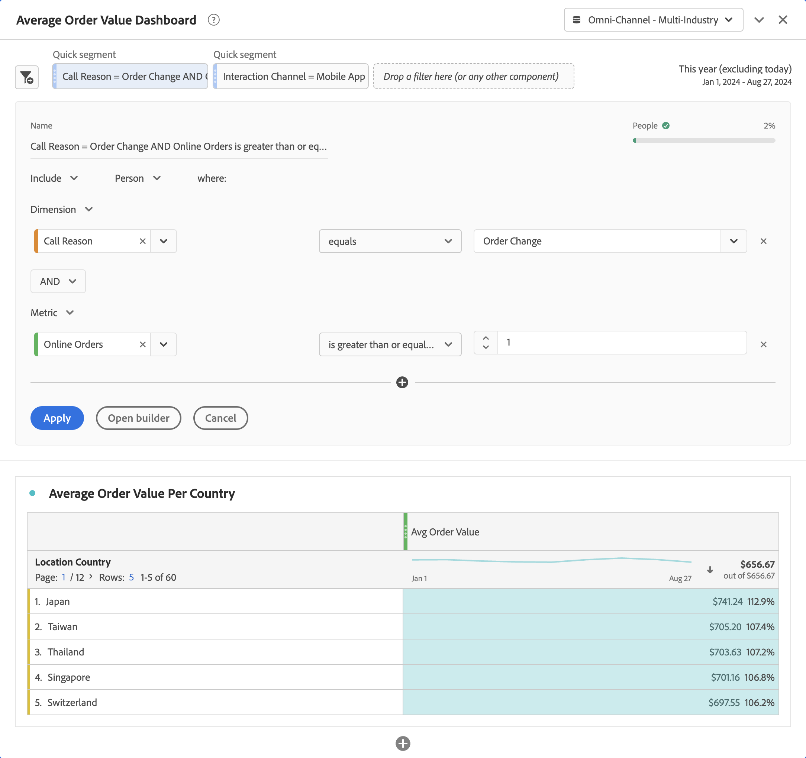

# Snelle filters

De snelle filters staan u toe om gegevens binnen een project van Workspace snel te onderzoeken, zonder de behoefte om een filter in de [ Bouwer van de Filter ](/help/components/filters/create-filters.md) tot stand te brengen.

+++ In de volgende video ziet u hoe u snelle filters kunt gebruiken.

>[!VIDEO](https://video.tv.adobe.com/v/341466/?quality=12&learn=on)

+++

Wanneer u snelle filters wilt gebruiken, moet u het volgende opmerken:

* Snelle filters worden direct in een Workspace-project gemaakt. Een snelfilter wordt daarom alleen toegepast op het Workspace-project waarin u het snelfilter maakt. De snelfilters in uw Workspace-project zijn niet beschikbaar in andere projecten en kunnen niet worden gedeeld met andere gebruikers.
* U kunt slechts drie voorwaarden opgeven als onderdeel van een snel filter.
* Snelle filters ondersteunen geen geneste containers of sequentiële voorwaarden.
* U kunt snelle filters binnen een gedeeld Workspace-project bewerken. Andere gebruikers kunnen de snelfilters dus bewerken in een Workspace-project dat u met deze gebruikers hebt gedeeld.

## Maken

Snelle filters zijn van toepassing op panelen. U kunt een of meer snelle filters maken voor elk deelvenster in uw Workspace-project. Elke gebruiker in Analysis Workspace kan snelle filters maken.

Een snelfilter maken:

* Selecteer  bij de bovenkant van het paneel.   dan, geef direct het filter in de [ Snelle filterbouwer ](#quick-filter-builder) uit.
* Sleep een component van het componentenpaneel aan de filterdalingsstreek in de paneelkopbal. Zodra gelaten vallen, beweegt over de filter en selecteert  uitgeven om de filter in de [ Snelle filterbouwer ](#quick-filter-builder) uit te geven.

Wanneer u een snel filter maakt met slepen en neerzetten, moet u het volgende opmerken:

* Niet alle componenttypen worden ondersteund. Berekende metriek worden niet ondersteund en alleen afmetingen en metriek van waaruit u filters kunt maken, worden ondersteund.
* Voor dimensies en metriekcomponenten, leidt de [ Snelle filterbouwer ](#quick-filter-builder) automatisch tot een `exists` voorwaarden. Als u bijvoorbeeld `City` sleept en neerzet, wordt de voorwaarde `City exists` gemaakt.
* Voor afmetingswaarden, leidt de [ Snelle filteraannemer ](#quick-filter-builder) automatisch tot een `equals` voorwaarde. Als u bijvoorbeeld `amsterdam` sleept vanuit de `City` -dimensie, wordt de voorwaarde `City equals amsterdam` gemaakt.
* Als u sleept en `unspecified` of `none` laat vallen, [ Snelle filterbouwer ](#quick-filter-builder) leidt automatisch tot een `does not exist` voorwaarde.

Snelle filters die u maakt, worden boven in het deelvenster weergegeven. Snelle filters hebben wel een lichtblauwe dunne linkerbalk. Wanneer een snelle filter op uitgeeft wijze gebruikend de [ Snelle filterbouwer ](#quick-filter-builder) is, is de achtergrond van de Snelle filter lichtblauw.

De resultaten van de snelle filters die u in een deelvenster maakt, worden toegepast (met AND-logica) op alle visualisaties die deel uitmaken van het deelvenster.

## Beheren

Als u een snel filter wilt beheren, houdt u de muisaanwijzer boven de specifieke **[!UICONTROL Quick filter]** .

* Selecteer  om de [ Snelle filterbouwer ](#quick-filter-builder) te openen en de snelle filter uit te geven.
* Selecteer  om popup te openen. De pop-up toont informatie over de filter. U kunt selecteren **[!UICONTROL Make available to all projects and add to your component list]** om de filter aan de  **[!UICONTROL Filters]** toe te voegen in het componentenpaneel. Er wordt een dialoogvenster **[!UICONTROL Save quick filter]** weergegeven waarin u wordt gevraagd een naam voor het filter op te geven. Selecteer **[!UICONTROL Save]** om door te gaan. De [!UICONTROL Quick filter] verandert in een **[!UICONTROL Filter]** . U kunt niet de Filter meer uitgeven gebruikend de [ Snelle filterbouwer ](#quick-filter-builder). In plaats daarvan, moet u de filter als regelmatige filter uitgeven, gebruikend de [ bouwer van de Filter ](filter-builder.md).

## Snelle filterbuilder

Zie hieronder voor een voorbeeld van de snelle filterbuilder. In het voorbeeld wordt de builder geopend voor een snel filter met de naam `Call Reason = Order Change AND Online Orders is greater than or equal 1` . Beide snelle filters bovenaan zijn van toepassing op het deelvenster [!UICONTROL Average Order Value Dashboard] en alle visualisaties daarbinnen, zoals de vrije-vormtabel van [!UICONTROL Average Order Value Per Country] .

De snelle filterbouwer bestaat uit de volgende gebieden en de knopen.

### Koptekstgebied

Het koptekstgebied bepaalt de naam, het type en het bereik van het snelle filter. Ook wordt een visuele weergave weergegeven voor de resultaten van het snelle filter.

| Element | Beschrijving |
|---|---|
| **[!UICONTROL Name]** | De naam wordt automatisch afgeleid van de snelle filterdefinitie. |
| **[!UICONTROL People]**    | Een voorvertoning weergeven van de gegevens die het snelle filter oplevert. Een balk en een percentage geven inzicht in hoeveel van de algemene gegevens deel uitmaken van het resultaat van het snelle filter. Een rood  signaleert dat de snelle filter geen gegevens terugkeert. |
| **[!UICONTROL Include]** **[!UICONTROL Exclude]** | Selecteer van dropdown  of u de resultaten van de snelle filter van de gegevens in het paneel wilt omvatten of uitsluiten. |
| **[!UICONTROL Event]** **[!UICONTROL Session]** **[!UICONTROL Person]** | Selecteer van dropdown  het werkingsgebied van de snelle filter. |

### Voorwaardegebied

In het voorwaardengebied worden de voorwaarden opgegeven (maximaal drie). Voor elke voorwaarde kunt u het volgende opgeven:

| Element | Beschrijving |
|---|---|
| **[!UICONTROL Dimension]** **[!UICONTROL Metric]** **[!UICONTROL Date range]** | Selecteer van dropdown  of u een voorwaarde voor een afmeting, metrische of datumwaaier wilt specificeren. |
| **[!UICONTROL *component *]** | Het componentveld voor de voorwaarde. U kunt [!UICONTROL *Type*] toevoegen een component, een component van de lijst selecteren, of u kunt een component van het componentenpaneel slepen en laten vallen. U kunt vergelijkbare componenten alleen neerzetten in het deelveld van de voorwaarde. U kunt bijvoorbeeld alleen een dimensie-component uit het deelvenster Componenten neerzetten als aan een afmetingsvoorwaarde is voldaan.   u kunt ook slepen en laten vallen om een bestaande component te vervangen.  Uitgezochte  om de component van het componentengebied te schrappen. |
| **[!UICONTROL *exploitant *]** | De operator voor de component. Zie [ Operatoren ](operators.md) voor meer informatie. Alleen beschikbaar voor afmetingen en metriek. |
| **[!UICONTROL *waarde *]** | De waarde voor de voorwaarde. Afhankelijk van de geselecteerde operator kunt u de waarde in een lijst selecteren of een waarde invoeren. |
|  | Selecteer deze optie om een voorwaarde uit het filter Snel te verwijderen. |

### Knoppen

| Knop | Beschrijving |
|---|---|
| **[!UICONTROL AND]** **[!UICONTROL OR]** | Deze optie is alleen beschikbaar wanneer u meerdere voorwaarden definieert. Selecteer van dropdown  tussen de voorwaarden. De selectie bepaalt de booleaanse logica voor het snelle filter. U kunt logica niet mengen wanneer er drie voorwaarden zijn. De Booleaanse logica is **[!UICONTROL AND]** of **[!UICONTROL OR]** . |
|  | Hiermee voegt u een andere voorwaarde toe aan het snelle filter. Deze knop is alleen beschikbaar als u een of twee voorwaarden voor het snelle filter hebt gedefinieerd. |
| **[!UICONTROL Apply]** | Pas de wijzigingen toe op het snelle filter. |
| **[!UICONTROL Open builder]** | U wordt om bevestiging gevraagd met een dialoogvenster **[!UICONTROL Are your sure?]** . Als u **[!UICONTROL OK]** selecteert, kunt u uw filter in [ Snelle filterbouwer ](#quick-filter-builder) niet meer wijzigen Uw snelle filter wordt anders genoemd aan **[!UICONTROL Filter]** en heeft nu een donkerdere blauwe dunne linkerbar.  de regelmatige [ bouwer van de Filter ](filter-builder.md) opent met de optie aan **[!UICONTROL Make this filter available to all your projects and add it to your component list]**. <ul><li>Als u deze optie selecteert en **[!UICONTROL Apply]** selecteert, wordt de filter toegevoegd aan de  **[!UICONTROL Filters]** in het componentenpaneel.</li><li>Als u deze optie niet selecteert en **[!UICONTROL Apply]** selecteert, blijft het filter alleen beschikbaar voor Workspace-projecten.</li></ul> |
| **[!UICONTROL Cancel]** | Selecteer deze optie om het maken of bewerken van een snel filter te annuleren. |

## Snelle filters versus filters

Quick filters zijn precies wat ze noemen. U kunt snelle filters snel inline maken en bewerken en de effecten direct in het deelvenster bekijken.

Filters hebben de volgende voordelen ten opzichte van snelle filters.

* Filters kunnen beschikbaar worden gesteld voor al uw Workspace-projecten
* Filters ondersteunen meer complexiteit met behulp van geneste en hiërarchische containers en reeksen (met behulp van reeksfilters).

