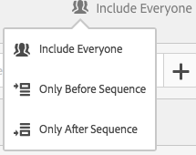
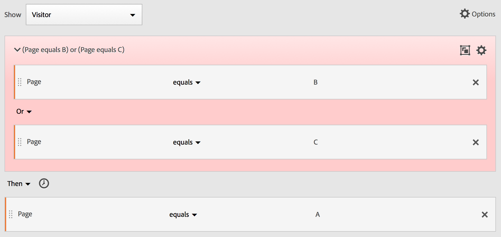

# Opeenvolgende filters maken

Opeenvolgende filters worden gemaakt met behulp van de operator THEN in plaats van AND of OR. VERVOLGENS impliceert dat één filtercriteria voorkomen, gevolgd door een andere. Standaard identificeert een sequentieel filter alle overeenkomende gegevens en wordt het filter &quot;Inclusief iedereen&quot; weergegeven. Opeenvolgende filters kunnen verder worden gefilterd naar een subset van overeenkomende resultaten met de opties &quot;Alleen voor reeks&quot; en &quot;Alleen na reeks&quot;.

Hier is een video over sequentiële segmentatie:

>[!VIDEO](https://video.tv.adobe.com/v/25405/?quality=12)

## Inclusief iedereen {#include_everyone}

Wanneer u een filter maakt waarin Inclusief iedereen is ingesteld, identificeert het filter paden die overeenkomen met het opgegeven patroon als geheel. Dit is een voorbeeld van een standaardsequentiefilter dat zoekt naar één hit (pagina A) gevolgd door een andere hit (pagina B) die dezelfde bezoeker heeft bezocht. Het filter is ingesteld op Inclusief iedereen.

| Indien resultaat... | Reeks |
|--- | --- |
| Overeenkomsten | A then B A then (bij een ander bezoek) BA, dan D en B |
| Komt niet overeen | B en A |

## Alleen voor reeks en Alleen na reeks {#only_before_after}

De opties **[!UICONTROL Only Before Sequence]** en **[!UICONTROL Only After Sequence]** filtert het filter naar een subset van gegevens voor of na de opgegeven reeks.

* **Alleen voor reeks**: Hiermee worden alle treffers vóór een reeks + de eerste treffer van de reeks zelf opgenomen (zie voorbeeld 1, 3). Als een reeks meerdere keren in een pad wordt weergegeven, bevat &quot;Alleen voor reeks&quot; de eerste treffer van de laatste instantie van de reeks en alle vorige treffers (zie voorbeeld 2).
* **Alleen na reeks**: Bevat alle treffers na een reeks + de laatste treffer van de reeks zelf (zie voorbeeld 1, 3). Als een reeks meerdere keren in een pad wordt weergegeven, bevat &quot;Alleen na&quot; de laatste hit van de eerste instantie van de reeks en alle volgende treffers (zie voorbeeld 2).

Neem bijvoorbeeld de volgorde B -> D. De drie filters zouden klappen als volgt identificeren:

**Voorbeeld 1: B en D verschijnen eenmaal**

| Voorbeeld | A | B | C | D | E | F |
|---|---|---|---|---|---|---|
| Inclusief iedereen | A | B | C | D | E | F |
| Alleen voor reeks | A | B |  |  |  |  |
| Alleen na reeks |  |  |  | D | E | F |

**Voorbeeld 2: B dan D wordt meerdere keren weergegeven**

| Voorbeeld | A | B | C | D | B | C | D | E |
|---|---|---|---|---|---|---|---|---|
| Inclusief iedereen | A | B | C | D | B | C | D | E |
| Alleen voor reeks | A | B | C | D | B |  |  |  |
| Alleen na reeks |  |  |  | D | B | C | D | E |

Laten we dit concept ook omringen met de dimensie van de Diepte van het Actief.

**Voorbeeld 3: Hit Depth 3 then 5**

## Beperkingen Dimension {#constraints}

In een &quot;binnen&quot;clausule, binnen tussen VEREN verklaringen, kunt u, bijvoorbeeld, &quot;binnen 1 onderzoek sleutelwoordinstantie&quot;toevoegen, &quot;binnen 1 eVar 47 instantie&quot;. Hierdoor blijft het filter binnen één instantie van een dimensie.

Door een component &#39;Binnen Dimension&#39; tussen regels in te stellen, kan een filter gegevens beperken tot reeksen waarvoor aan die voorwaarde wordt voldaan. Zie het onderstaande voorbeeld, waarin de beperking is ingesteld op &quot;Binnen 1 pagina&quot;:

| Indien resultaat... | Reeks |
|--- |--- |
| Overeenkomsten | A then B |
| Komt niet overeen | A then C then B (omdat B zich niet binnen 1 pagina van A bevond) **Opmerking:**  Als de afmetingsbeperking wordt geschrapt, &quot;A toen B&quot;en &quot;A toen C dan B&quot;allebei aanpast. |

## Eenvoudige paginaweergavevolgorde {#simple_sequence}

Geef bezoekers op die een pagina hebben weergegeven en bekijk vervolgens een andere pagina. De gegevens op hit-level gegevens zullen deze opeenvolging ongeacht vorige, afgelopen, of tussentijdse bezoeken zittingen of de tijd of het aantal paginameningen filtreren die tussen voorkomen.

**Voorbeeld**: Bezoeker heeft pagina A bekeken en vervolgens pagina B tijdens hetzelfde of een ander bezoek bekeken.

**Gebruik hoofdletters**

Hieronder ziet u voorbeelden van het gebruik van het filter.

1. Bezoekers van een sportsite bekijken de landingspagina van het voetbal en bekijken de landingspagina van de basketbal dan in volgorde, maar niet noodzakelijkerwijs tijdens hetzelfde bezoek. Dit leidt tot een campagne om basketbalinhoud aan voetbalkijkers tijdens het voetbalseizoen te promoten.
1. De autoverkoper identificeert een verhouding tussen degenen die op de pagina van de klantenloyaliteit landen en dan naar de videopagina op elk ogenblik tijdens het bezoek of een ander bezoek gaan.

**Dit filter maken**

U negeert twee paginalijnen binnen een bovenste regel [!UICONTROL Visitor] container en reeks de pagina-treffers met behulp van de [!UICONTROL THEN] operator.

## Bezoekersreeks bij bezoeken {#sequence_across}

Identificeer de bezoekers die uit een campagne vielen maar dan aan de opeenvolging van paginameningen in een andere zitting terugkwamen.

**Voorbeeld**: Bezoeker heeft pagina A bekeken tijdens een bezoek en vervolgens pagina B bekeken tijdens een ander bezoek.

**Gevallen gebruiken**

Hieronder volgen voorbeelden van het gebruik van dit type filter:

* Bezoekers op de pagina Sport van een nieuwssite bekijken de pagina Sport in een andere sessie opnieuw.
* Een kledinghandelaar ziet een relatie tussen bezoekers die op een landingspagina in één zitting landen, en dan direct naar de checkout pagina in een andere zitting gaan.

**Dit filter maken**

In dit voorbeeld zijn twee nesten **[!UICONTROL Visit]** containers op het hoogste niveau **[!UICONTROL Visitor]** container en voert de filterreeks uit met de [!UICONTROL THEN] operator.

## Volgorde op gemengde niveaus {#mixed_level}

Identificeer bezoekers die twee pagina&#39;s over een onbepaald aantal bezoeken bekijken, maar dan een derde pagina in een afzonderlijk bezoek bekijken.

**Voorbeeld**: Bezoekers bezoeken pagina A en vervolgens pagina B tijdens een of meer bezoeken, gevolgd door een bezoek aan pagina C tijdens een afzonderlijk bezoek.

**Gevallen gebruiken**

Hieronder volgen voorbeelden van het gebruik van dit type filter:

* Bezoekers bezoeken eerst een nieuwssite en bekijken de sportpagina tijdens hetzelfde bezoek. Bij een ander bezoek bezoekt de bezoeker de weerpagina.
* De detailhandelaar bepaalt bezoekers die de Belangrijkste pagina ingaan en dan naar de Mijn pagina van de Rekening gaan. In een ander bezoek gaan ze naar de pagina Winkelwagentje bekijken.

**Dit filter maken**

1. Afmetingen van twee pagina&#39;s in het linkervenster van de bovenste pagina neerzetten [!UICONTROL Visitor] container.
1. Voeg de operator THEN ertussen toe.
1. Klikken **[!UICONTROL Options]** > **[!UICONTROL Add container]** en voeg een [!UICONTROL Visit] container onder de container [!UICONTROL Visitor] niveau en volgorde met behulp van de [!UICONTROL THEN] operator.

## Samengevoegde containers {#aggregate_containers}

Meerdere toevoegen [!UICONTROL Hit] containers binnen een [!UICONTROL Visitor] Met de container kunt u de juiste operatoren gebruiken tussen hetzelfde type containers en regels en dimensies gebruiken, zoals Pagina en Bezoek nummer, om de paginaweergave te definiëren en een reeksdimensie binnen de [!UICONTROL Hit] container. Door logica op het niveau Actief toe te passen, kunt u overeenkomsten op hetzelfde niveau van hits beperken en combineren in de [!UICONTROL Visitor] container voor het samenstellen van diverse filtertypen.

**Voorbeeld**: Bezoekers bezochten pagina A na de eerste treffer in de reeks paginaweergaven (pagina D in het voorbeeld) en bezochten vervolgens pagina B of pagina C, ongeacht het aantal bezoeken.

**Gevallen gebruiken**

Hieronder volgen voorbeelden van het gebruik van dit type filter:

* Geef bezoekers die naar de Main-landingspagina gaan tijdens een bezoek op, bekijk de pagina voor kleding voor heren tijdens een ander bezoek en bekijk vervolgens de landingspagina van Vrouw of Kinderen tijdens een ander bezoek.
* Een e-zine legt de bezoekers vast die in één bezoek naar de startpagina gaan, de pagina Sport in een ander bezoek en de pagina Advies in een ander bezoek.

**Dit filter maken**

1. Selecteer de [!UICONTROL Visitor] container als container op hoofdniveau.
1. Twee toevoegen [!UICONTROL Hit]-level container-een afmeting met een aangewezen numerieke afmeting die bij het zelfde wordt aangesloten [!UICONTROL Hit] door de [!UICONTROL AND] en [!UICONTROL OR] operator.
1. Binnen de [!UICONTROL Visit] container toevoegen [!UICONTROL Hit] container en nesten twee extra [!UICONTROL Hit] containers verbonden met een [!UICONTROL OR] of [!UICONTROL AND] operator.

   Reeks deze genest [!UICONTROL Hit] containers met de [!UICONTROL THEN] operator.

## &quot;Nesten&quot; in opeenvolgende filters {#nesting}

Door controlepunten op beide plaatsen te plaatsen [!UICONTROL Visit] en [!UICONTROL Hit] niveau, kunt u het filter beperken om aan vereisten binnen een specifiek bezoek evenals een specifieke klap te voldoen.

**Voorbeeld**: Bezoeker bezocht pagina A en bezocht vervolgens pagina B tijdens hetzelfde bezoek. Tijdens een nieuw bezoek ging de bezoeker naar pagina C.

**Dit filter maken**

1. Onder een bovenste niveau [!UICONTROL Visit] slepen in twee pagina-afmetingen.
1. Selecteer beide regels meerdere keren en klik op **[!UICONTROL Options]** > **[!UICONTROL Add container from selection]** en wijzigen in een [!UICONTROL Visit] container.
1. Sluit ze aan bij een [!UICONTROL THEN] operator.
1. Een container Actief maken als peer voor de [!UICONTROL Visit] container en sleep in een paginadimensie.
1. Sluit de geneste reeks aan op de knop [!UICONTROL Visit] container met de [!UICONTROL Hit] container gebruiken met een andere [!UICONTROL THEN] operator.

## hits uitsluiten {#exclude}

De segmentregels bevatten alle gegevens, tenzij u deze specifiek uitsluit [!UICONTROL Visitor], [!UICONTROL Visit], of [!UICONTROL Hit] gegevens die de [!UICONTROL Exclude] regel. Hiermee kunt u algemene gegevens negeren en filters met meer focus maken. U kunt ook filters maken die gevonden groepen uitsluiten om de resterende gegevensset te identificeren, zoals het maken van een regel die succesvolle bezoekers die bestellingen hebben geplaatst, omvat en hen vervolgens uitsluit om &quot;niet-kopers&quot; te identificeren. In de meeste gevallen is het echter beter om regels te maken die brede waarden uitsluiten in plaats van te proberen de [!UICONTROL Exclude] regel om specifieke waarden te richten omvat waarden.

Bijvoorbeeld:

* **Pagina&#39;s uitsluiten**. Een filterregel gebruiken om een specifieke pagina (zoals *`Home Page`*) in een rapport, een Actief-regel maken waarbij de pagina gelijk is aan &quot;Startpagina&quot; en deze vervolgens uitsluiten. Deze regel bevat automatisch alle waarden behalve de startpagina.
* **Exclusief verwijzende domeinen**. Gebruik een regel die alleen verwijzende domeinen van Google.com omvat en alle andere uitsluit.
* **Niet-kopers identificeren**. Identificeer wanneer de orden groter zijn dan nul en sluit dan uit [!UICONTROL Visitor].

De [!UICONTROL Exclude] kan worden gebruikt om een opeenvolging te identificeren waar specifieke bezoeken of treffers niet door de bezoeker worden uitgevoerd. [!UICONTROL Exclude Checkpoints] kan ook worden opgenomen in een logische groep (zie hieronder).

### Uitsluiten tussen controlepunten {#exclude_between}

U kunt logica afdwingen om bezoekers te filteren op plaatsen waar een controlepunt niet expliciet voorkomt tussen twee andere controlepunten.

**Voorbeeld**: Bezoekers die pagina A hebben bezocht en vervolgens pagina C hebben bezocht, maar pagina B niet hebben bezocht.

**Gevallen gebruiken**

Hieronder volgen voorbeelden van het gebruik van dit type filter:

* Bezoekers naar een pagina Lifestyle en vervolgens naar de sectie Theater zonder naar de pagina Arts te gaan.
* Een auto-detailhandelaar ziet een relatie tussen hen die de belangrijkste landingspagina bezoeken en dan direct naar de campagne van de Geen Rente gaan zonder naar de pagina van het Voertuig te gaan.

**Dit filter maken**

Maak een filter zoals u dat zou doen voor een eenvoudig, gemengd of genest opeenvolgend filter en stel vervolgens het filter [!UICONTROL EXCLUDE] operator voor het containerelement. Het onderstaande voorbeeld is een verzamelfilter waarbij de drie [!UICONTROL Hit] containers worden naar het canvas gesleept, [!UICONTROL THEN] operator die is toegewezen om de containerlogica samen te voegen, sluit vervolgens de weergavecontainer voor de middelste pagina uit om alleen bezoekers die van pagina A naar pagina C zijn gegaan in de reeks op te nemen.

### Uitsluiten aan begin van reeks {#exclude_beginning}

Als het uitsluit controlepunt aan het begin van een opeenvolgend filter is, dan zorgt het ervoor dat een uitgesloten paginamening niet vóór de eerste niet-uitgesloten slag voorkwam.

Een restaurant wil bijvoorbeeld gebruikers zien die de hoofdbestemmingspagina vaak niet hoeven te gebruiken en rechtstreeks naar de pagina Bestellen uit gaan. U kunt deze gegevens weergeven door treffers naar de bestemmingspagina uit te sluiten en hits naar de pagina Bestellen uit op te nemen in een opeenvolgend filter.

**Dit filter maken**

Maak twee aparte Hit-containers in een bezoekercontainer op hoofdniveau. Stel vervolgens de [!UICONTROL EXCLUDE] voor de eerste container.

### Uitsluiten aan einde van reeks {#exclude_end}

Als het uitsluit controlepunt aan het eind van een opeenvolging is, dan zorgt het ervoor dat het controlepunt niet tussen het laatste niet-uitgesloten controlepunt en het eind van de bezoekersopeenvolging gebeurde.

Een kledingwinkel wil bijvoorbeeld alle bezoekers zien die een productpagina hebben bekeken, maar daarna nooit hun winkelwagentje hebben bezocht. Dit voorbeeld kan worden vereenvoudigd voor een bezoeker die naar pagina A gaat en dan nooit naar pagina B gaat bij huidige of volgende bezoeken.

**Dit filter maken**

Een eenvoudig reeksfilter maken door twee te slepen [!UICONTROL Hit] containers op het canvas en deze verbinden met behulp van de [!UICONTROL THEN] operator. Wijs vervolgens de [!UICONTROL EXCLUDE] operator naar de tweede [!UICONTROL Hit] in de reeks.

## Containers voor logische groepen {#logic_group}

Logische Groepcontainers worden vereist om voorwaarden in één enkel opeenvolgend controlepunt van de filterfilter te groeperen. De container voor de speciale logische groep is alleen in sequentiële segmentatie beschikbaar, om ervoor te zorgen dat aan de voorwaarden wordt voldaan na elk voorafgaand controlepunt en vóór elk volgend controlepunt. Aan de voorwaarden binnen het controlepunt van de Logische Groep zelf kan in om het even welke orde worden voldaan. Niet-opeenvolgende containers (hit, visit, bezoeker) vereisen daarentegen niet dat aan de voorwaarden ervan wordt voldaan binnen de gehele reeks, wat leidt tot intuïtieve resultaten bij gebruik met een THEN-operator.
De [!UICONTROL Logic Group] container is ontworpen voor behandeling *meerdere controlepunten als groep*, *zonder bestelling* onder de gegroepeerde controlepunten. Met andere woorden, we geven niet om de volgorde van de controlepunten binnen die groep. U kunt bijvoorbeeld geen [!UICONTROL Visitor] container binnen een [!UICONTROL Visitor] container. Maar in plaats daarvan kunt u een [!UICONTROL Logic Group] container binnen een [!UICONTROL Visitor] container met specifieke [!UICONTROL Visit]-niveau en [!UICONTROL Hit]-level checkpoints.

>[!NOTE]
>
>A [!UICONTROL Logic Group] kan alleen in een opeenvolgend filter worden gedefinieerd, wat betekent dat de [!UICONTROL THEN] wordt gebruikt binnen de expressie.

| Containerhiërarchie | Illustratie | Definitie |
|---|---|---|
| Standaard containerhiërarchie |  | Binnen de [!UICONTROL Visitor] container, de [!UICONTROL Visit] en [!UICONTROL Hit] containers worden op volgorde genest om filters te extraheren op basis van hits, het aantal bezoeken en de bezoeker. |
| Logische containerhiërarchie |  | De standaardcontainerhiërarchie is ook vereist buiten de [!UICONTROL Logic Group] container. Maar in de [!UICONTROL Logic Group] voor de controlepunten is er geen vaste volgorde of hiërarchie vereist. De bezoeker moet in willekeurige volgorde aan deze controlepunten voldoen. |

Logische groepen lijken ontmoedigend. Hier volgen enkele aanbevolen procedures voor het gebruik ervan:

**Logische groep of Handje/Bezoek container?**
Als u opeenvolgende controlepunten wilt groeperen, dan is uw &quot;container&quot;Logische Groep. Als deze opeenvolgende controlepunten echter moeten plaatsvinden binnen één druk- of bezoekbereik, is een &quot;hit&quot;- of &quot;visit&quot;-container vereist. (Natuurlijk heeft &#39;hit&#39; geen zin voor een groep opeenvolgende controlepunten, wanneer één hit niet meer dan één controlepunt mag crediteren).

**Zijn logicagroepen het samenstellen van opeenvolgende filters eenvoudiger?**
Ja, dat kunnen ze. Laten we aannemen dat u dit filter bezoekers probeert te identificeren: **Bezoekers die pagina A bekeken, bekeken dan alle pagina&#39;s van B, C en D**

U kunt dit filter bouwen zonder een container van de Logische Groep, maar het is complex en moeizaam. U moet elke reeks pagina&#39;s opgeven die de bezoeker kan weergeven:
* `Visitor Container [Page A THEN Page B THEN Page C THEN Page D] or`
* `Visitor Container [Page A THEN Page B THEN Page D THEN Page C] or`
* `Visitor Container [Page A THEN Page C THEN Page B THEN Page D] or`
* `Visitor Container [Page A THEN Page C THEN Page D THEN Page B] or`
* `Visitor Container [Page A THEN Page D THEN Page B THEN Page C] or`
* `Visitor Container [Page A THEN Page D THEN Page C THEN Page B]`

Een container van de Logische Groep vereenvoudigt de bouw van dit filter, zoals hier getoond:

### Een filter voor de logische groep maken {#logic_group_filter}

Zoals andere containers, [!UICONTROL Logic Group] containers kunnen op meerdere manieren worden gebouwd binnen de [!UICONTROL Segment Builder]. Dit is de voorkeursmanier om te nesten [!UICONTROL Logic Group] containers:

1. Sleep afmetingen, gebeurtenissen of filters uit het linkervenster.
1. De bovenste container wijzigen in een [!UICONTROL Visitor] container.
1. Wijzig de [!UICONTROL AND] of [!UICONTROL OR] operator die standaard wordt ingevoegd door de operator THEN.
1. Selecteer de [!UICONTROL Hit] containers (het Dimension, de Gebeurtenis, of het Punt) en klik **[!UICONTROL Options]** > **[!UICONTROL Add container from selection]**.
1. Klik op het containerpictogram en selecteer **[!UICONTROL Logic Group]**.  
1. U kunt nu de [!UICONTROL Hit] binnen de [!UICONTROL Logic Group] container zonder rekening te houden met hiërarchie.

### Controlepunten voor logische groepen in willekeurige volgorde {#any_order}

Met de [!UICONTROL Logic Group] Hiermee kunt u voldoen aan voorwaarden binnen die groep die buiten de reeks vallen. Op deze manier kunt u filters maken waarbij een [!UICONTROL Visit] of [!UICONTROL Hit] de container gebeurt ongeacht de normale hiërarchie.

**Voorbeeld**: Bezoekers die pagina A bezochten, bezochten vervolgens pagina B en pagina C in willekeurige volgorde.

**Dit filter maken**

Pagina B en C zijn genest in een [!UICONTROL Logic Group] container in de buitenzijde [!UICONTROL Visitor] container. De [!UICONTROL Hit] container voor A wordt gevolgd door [!UICONTROL Logic Group] container met B en C, geïdentificeerd met behulp van [!UICONTROL AND] operator. Omdat het in [!UICONTROL Logic Group]De volgorde is echter niet gedefinieerd en als u pagina B en C aanslaat, wordt het argument waar.

**Een ander voorbeeld**: Bezoekers die pagina B of pagina C hebben bezocht en vervolgens pagina A hebben bezocht:

Het filter moet overeenkomen met een van de controlepunten van de logische groep (B of C). Aan logische groepsvoorwaarden kan ook worden voldaan bij hetzelfde resultaat of bij meerdere treffers. &#x200B;

### Logische groep eerst overeenkomst {#first_match}

Met de [!UICONTROL Logic Group] Hiermee kunt u voldoen aan voorwaarden binnen die groep die buiten de reeks vallen. In dit ongeordende filter voor eerste overeenkomst [!UICONTROL Logic Group] De regels worden eerst aangeduid als een paginaweergave van pagina B of pagina C en daarna als de vereiste weergave van pagina A.

**Voorbeeld**: Bezoekers die pagina B of pagina C hebben bezocht en vervolgens pagina A hebben bezocht.

**Dit filter maken**

Pagina B en pagina C worden gegroepeerd in een [!UICONTROL Logic Group] container met de [!UICONTROL OR] operator geselecteerd, dan de [!UICONTROL Hit]container die een paginaweergave van pagina A als waarde aanduidt.

### Logische groep uitsluiten EN {#lg_exclude_and}

Filters maken met de opdracht [!UICONTROL Logic Group] waarin meerdere paginaweergaven worden samengevoegd om te bepalen welke pagina&#39;s moesten worden gevonden terwijl andere pagina&#39;s specifiek werden overgeslagen. ****

**Voorbeeld**: Bezoeker heeft pagina A bezocht, heeft pagina B of C dan expliciet niet bezocht, maar pagina D gevonden.

**Dit filter maken**

Maak dit filter door Dimensionen, gebeurtenissen en vooraf gebouwde filters vanuit de linkerdeelvensters te slepen. Zie de sectie over het bouwen van een filter van de Groep van de Logica.

Na het nesten van de waarden binnen [!UICONTROL Logic Group]klikt u op de knop **[!UICONTROL Exclude]** in de [!UICONTROL Logic Group] container.

### Logic Group exclude OR {#lg_exclude_or}

Filters maken met de opdracht [!UICONTROL Logic Group] waarin meerdere paginaweergaven worden samengevoegd om te bepalen welke pagina&#39;s moesten worden gevonden terwijl andere pagina&#39;s specifiek werden overgeslagen.

**Voorbeeld**: Bezoekers die pagina A hebben bezocht, maar die pagina B of pagina C niet vóór pagina A hebben bezocht.

**Dit filter maken**

De eerste B- en C-pagina&#39;s worden in een [!UICONTROL Logic Group] container die is uitgesloten en vervolgens door de bezoeker op pagina A wordt geraakt.

Bouw dit filter door Dimensionen, Gebeurtenissen, en pre-gebouwde Segmenten van de linkerruiten te slepen.

Na het nesten van de waarden binnen [!UICONTROL Logic Group]klikt u op de knop **[!UICONTROL Exclude]** in de [!UICONTROL Logic Group] container.

## Intime-binnen- en time-after-filters maken {#time_within_after}

Gebruik de [!UICONTROL Within] en [!UICONTROL After] operatoren die zijn ingebouwd in de koptekst van elke container om de tijd, gebeurtenissen en telling te definiëren.

U kunt de overeenkomst beperken tot een bepaalde tijdsduur door de [!UICONTROL Within] en [!UICONTROL After] containers en geeft een granulariteit en aantal op. De [!UICONTROL Within] wordt gebruikt om een maximumlimiet op te geven voor de hoeveelheid tijd tussen twee controlepunten. De [!UICONTROL After] wordt gebruikt om een minimumlimiet op te geven voor de tijd tussen twee controlepunten.

>[!NOTE]
>
>Er zijn verschillen in evaluatie tussen elementen met een vergelijkbare naam, zoals **Dag(en)** of **Dag**. Voor op tijd gebaseerde definities van Binnen en na, gebruik de opties die eerst in popup venster worden vermeld:
>
>
>
>Gebruik voor op dimensies gebaseerde definities van Binnen en Na de opties onder het submenu *Overige Dimensionen*:
>
>

### Operatoren voor na en binnen {#after_within}

De duur wordt opgegeven met één hoofdletter die de granulariteit vertegenwoordigt, gevolgd door een getal dat het herhalingstemmer van de granulariteit vertegenwoordigt.

**[!UICONTROL Within]** bevat het eindpunt (kleiner dan of gelijk aan).

**[!UICONTROL After]** omvat niet het eindpunt (groter dan).

| Operatoren | Beschrijving |
|--- |--- |
| NA | De After operator wordt gebruikt om een minimumlimiet op te geven voor de tijd tussen twee controlepunten. Wanneer het plaatsen van na waarden, zal de tijdgrens beginnen wanneer de filter wordt toegepast. Bijvoorbeeld, als de Na exploitant op een container wordt geplaatst om bezoekers te identificeren die pagina A maar niet terugkeren om pagina B tot na één dag te bezoeken, dan zal die dag beginnen wanneer de bezoeker pagina A verlaat. De bezoeker kan alleen in het filter worden opgenomen als er minimaal 1440 minuten (één dag) overblijven nadat hij pagina A heeft verlaten om pagina B weer te geven. |
| BINNEN | De operator Binnen wordt gebruikt om een maximumlimiet op te geven voor de tijd tussen twee controlepunten. Als de operator Binnen bijvoorbeeld op een container is ingesteld om bezoekers te identificeren die pagina A bezoeken en vervolgens binnen één dag zijn teruggekeerd om pagina B te bezoeken, begint die dag wanneer de bezoeker pagina A verlaat. De bezoeker kan maximaal één dag vóór het openen van pagina B in het filter opnemen. Voor de bezoeker die in het filter moet worden opgenomen, moet het bezoek aan pagina B plaatsvinden binnen maximaal 1440 minuten (één dag) nadat pagina A voor weergave van pagina B is verlaten. |
| NA/BINNEN | Wanneer u zowel de operatoren Na als Binnen gebruikt, is het belangrijk te begrijpen dat beide operatoren parallel beginnen en eindigen, niet opeenvolgend.   Als u bijvoorbeeld een filter maakt met de container ingesteld op: `After = 1 Week(s) and Within = 2 Week(s)` Vervolgens wordt slechts tussen 1 en 2 weken voldaan aan de voorwaarden om bezoekers in het filter te identificeren. Beide voorwaarden worden afgedwongen vanaf het moment van de eerste paginaklok. |

### De operator Na gebruiken {#after}

* De tijd na laat u door jaar, maand, dag, uur, en minuut volgen om bezoeken aan te passen.
* Tijd na kan slechts op worden toegepast [!UICONTROL Hit] container, omdat dit het enige niveau is waarvoor een dergelijke fijne korreligheid wordt gedefinieerd.

**Voorbeeld**: Bezoekers die pagina A bezochten, bezochten pagina B pas na twee weken.****

**Het segment maken**: Dit filter wordt gemaakt door een [!UICONTROL Visitor] container met twee [!UICONTROL Hit] containers. U kunt vervolgens de [!UICONTROL THEN] en opent u de [!UICONTROL AFTER] vallen neer en plaatsen het aantal weken.

**Overeenkomsten**

Als op 1 juni 2019, om 00:01, een hit naar pagina A wordt weergegeven als &quot;Na 2 weken&quot;, komt een bericht op bladzijde B overeen als dit vóór 15 juni 2019 00:01 komt (14 dagen later).

| Druk op A | Hit B | Overeenkomend |
|--- |--- |--- |
| **A** hit: 1 juni 2019 00:01 | **B** hit: 15 juni 2019 00:01 | **Overeenkomsten:** Deze tijdbeperking komt overeen omdat deze na 1 juni 2019 (twee weken) is. |
| **A** hit: 1 juni 2019 00:01 | **B** hit: 8 juni 2019 00:01 B hit: 15 juni 2019 00:01 | **Komt niet overeen:** De eerste treffer op pagina B komt niet overeen, omdat deze in strijd is met de vereiste beperking na twee weken. |

### De operator Within gebruiken {#within}

* [!UICONTROL Within] kunt u bijhouden op jaar, maand, dag, uur en minuut om bezoeken te zoeken.
* [!UICONTROL Within] kan alleen worden toegepast op een [!UICONTROL Hit] container, omdat dit het enige niveau is waarvoor een dergelijke fijne korreligheid wordt gedefinieerd.

>[!TIP]
>
>In een &quot;binnen&quot;clausule, binnen tussen VEREN verklaringen, kunt u, bijvoorbeeld, &quot;binnen 1 onderzoek sleutelwoordinstantie&quot;toevoegen, &quot;binnen 1 eVar 47 instantie&quot;. Hierdoor blijft het filter binnen één instantie van een dimensie.

**Voorbeeld**: Bezoekers die pagina A hebben bezocht, hebben pagina B binnen 5 minuten bezocht.

**Het filter maken**: Dit filter wordt gemaakt door een [!UICONTROL Visitor] container, vervolgens slepen met twee [!UICONTROL Hit] containers. U kunt vervolgens de [!UICONTROL THEN] en opent u de [!UICONTROL AFTER] de exploitant laat vallen neer en bepaalt het interval: klappen, paginameningen, bezoeken, notulen, uren, dagen, weken, maanden, kwartalen, of jaren.

**Overeenkomsten**

De overeenkomsten moeten binnen de tijdslimiet voorkomen. Als een bezoeker pagina A raakt voor de expressie, wordt de volgende hit op pagina B weergegeven als deze plaatsvindt op of vóór 00:06 (vijf minuten later, inclusief dezelfde minuut). De uren binnen dezelfde minuut zullen ook aanpassen.

### De operatoren Within en After {#within_after}

Gebruiken [!UICONTROL Within] en [!UICONTROL After] om een maximum en minimumeindpunt aan beide uiteinden van een filter te verstrekken.

**Voorbeeld**: Bezoekers die pagina A bezochten, bezochten pagina B na 2 weken maar binnen 1 maand.

**Het segment maken**: Maak het filter door twee reeksen aan te brengen [!UICONTROL Hit] containers binnen een [!UICONTROL Visitor] container. Stel vervolgens de [!UICONTROL After] en [!UICONTROL Within] operatoren.

**Overeenkomsten**

Bezoekers die pagina A op 1 juni 2019 bezoeken, keren terug na 15 juni 2019 00:01, maar *voor* 1 juli 2019 is opgenomen in het filter. Vergelijk met de sectie over tijd tussen uitsluitingen.

De [!UICONTROL After] en [!UICONTROL Within] kunnen samen worden gebruikt om een opeenvolgend filter te definiëren.

Dit voorbeeld toont een tweede bezoek aan pagina B na twee weken maar binnen een maand.
