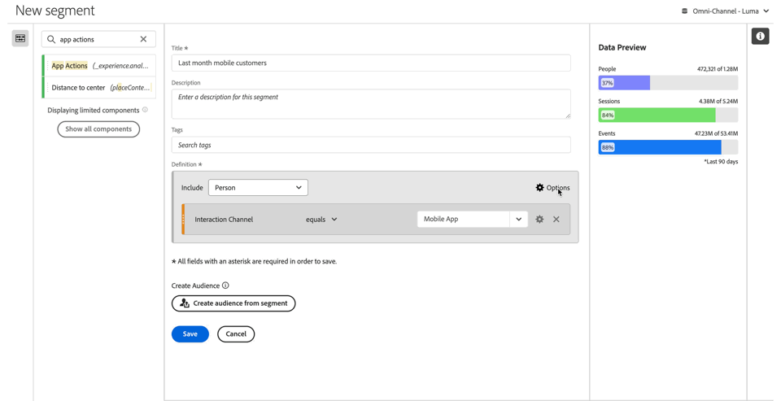
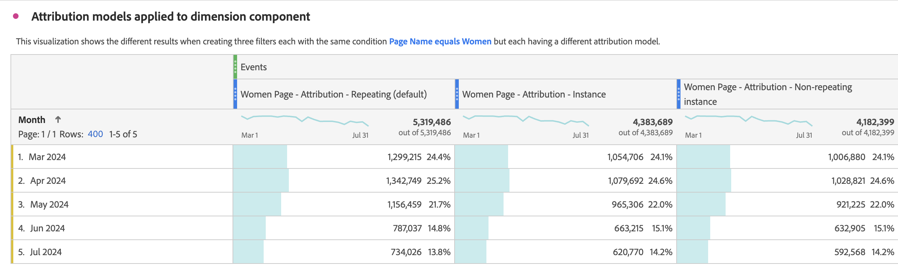

# Segmenten maken {#build-segments}

>[!CONTEXTUALHELP]
>id="components_filters_createaudience"
>title="Publiek maken"
>abstract="Soorten publiek kan worden gemaakt op basis van een segment en worden gedeeld met de Adobe Experience Platform voor activering."

>[!CONTEXTUALHELP]
>id="components_filters_datapreview"
>title="Gegevensvoorbeeld"
>abstract="Vergelijkt de gegevens van dit segment met gegevens van de gegevensmening. Het voorproefpercentage is gebaseerd op het totale aantal in de gegevensmening van **laatste 90 dagen**.   als de voorproef niet laadt, zou uw verbinding nog kunnen terugvullen."

Het dialoogvenster **[!UICONTROL Segment builder]** wordt gebruikt om nieuwe segmenten te maken of bestaande segmenten te bewerken. Het dialoogvenster krijgt de naam **[!UICONTROL New segment]** of **[!UICONTROL Edit segment]** voor segmenten die u maakt of beheert met de [[!UICONTROL Segment] manager ](/help/components/segments/seg-manage.md) .

>[!BEGINTABS]

>[!TAB  de bouwer van het Segment ]

>[!TAB  creeer of geef segment ] uit

>[!ENDTABS]

1. Specificeer de volgende details ( wordt vereist):

   | Element | Beschrijving |
   | --- | --- |
   | **[!UICONTROL Data view]** | U kunt de gegevensweergave voor het segment selecteren.  Het segment u bepaalt is beschikbaar als segment op het [ lusje van Montages ](/help/data-views/create-dataview.md#settings-filters) van een gegevensmening. |
   | **[!UICONTROL Project-only segment]** | Een infovakje om uit te leggen dat het segment slechts zichtbaar in het project is waar het wordt gecreeerd en dat het segment niet aan uw componentenlijst zal worden toegevoegd. Schakel **[!UICONTROL Make this segment available to all your projects and add it to your component list]** in om die instelling te wijzigen. Dit infovakje is slechts zichtbaar wanneer u a [ snel segment ](seg-quick.md) creeert en de snelle segmentinfo een regelmatig segment draait gebruikend **[!UICONTROL Open builder]** van de [!UICONTROL Quick segment] interface. |
   | **[!UICONTROL Title]**  | Geef het segment een naam, bijvoorbeeld `Last month mobile customers` . |
   | **[!UICONTROL Description]** | Geef een beschrijving voor het segment op, bijvoorbeeld `Segment to define the mobile customers for the last month` . |
   | **[!UICONTROL Tags]** | Organiseer het segment door een of meer tags te maken of toe te passen. Begin te typen om naar bestaande tags te zoeken die u kunt selecteren. Of druk op **[!UICONTROL ENTER]** om een nieuwe tag toe te voegen. Selecteer  om een markering te verwijderen. |
   | **[!UICONTROL Definition]**  | Bepaal uw segment gebruikend de [ bouwer van de Definitie ](#definition-builder). |

   {style="table-layout:auto"}

1. Om te verifiëren of uw segmentdefinitie correct is, gebruik de constant bijgewerkte voorproef van de resultaten van het segment bij hoogste recht.
1. Selecteer **[!UICONTROL Create audience from segment]** als u een publiek wilt maken van het segment en het publiek wilt delen met Experience Platform. Zie [ publiek ](/help/components/audiences/publish.md) voor meer informatie creëren en publiceren.
1. Selecteren:
   * **[!UICONTROL Save]** om het segment op te slaan.
   * **[!UICONTROL Save As]** om een kopie van het segment op te slaan.
   * **[!UICONTROL Delete]** om het segment te verwijderen.
   * **[!UICONTROL Cancel]** om eventuele wijzigingen die u hebt aangebracht in het segment te annuleren of om het maken van een nieuw segment te annuleren.

## Definition builder

U gebruikt de Bouwer van de Definitie om uw segmentdefinitie te construeren. In die constructie, gebruikt u componenten, containers, exploitanten en logica.

U kunt het type en het werkingsgebied van uw definitie vormen:

1. Om het type van uw definitie te specificeren, specificeer of u de bouwstijl wilt omvatten of definitie uitsluiten. Selecteer  **[!UICONTROL Options]** en van het drop-down menu **[!UICONTROL Include]** of **[!UICONTROL Exclude]**.
1. Om het werkingsgebied van uw definitie te specificeren, selecteer van **[!UICONTROL Include]** of **[!UICONTROL Exclude]** drop-down menu of u het werkingsgebied van de definitie **[!UICONTROL Event]** wilt zijn, **[!UICONTROL Session]**, **[!UICONTROL Person]**, **[!UICONTROL Global Account]** [!BADGE  B2B edition ]{type=Informative url="https://experienceleague.adobe.com/en/docs/analytics-platform/using/cja-overview/cja-b2b/cja-b2b-edition" newtab=true tooltip="Customer Journey Analytics B2B edition"}, **[!UICONTROL Account]** [!BADGE  B2B edition ]{type=Informative url="https://experienceleague.adobe.com/en/docs/analytics-platform/using/cja-overview/cja-b2b/cja-b2b-edition" newtab=true tooltip="Customer Journey Analytics B2B edition"}, **[!UICONTROL Opportunity]** [!BADGE  B2B edition ]{type=Informative url="https://experienceleague.adobe.com/en/docs/analytics-platform/using/cja-overview/cja-b2b/cja-b2b-edition" newtab=true tooltip="Customer Journey Analytics B2B edition"}, of **[!UICONTROL Buying Group]** [!BADGE  B2B edition ]{type=Informative url="https://experienceleague.adobe.com/en/docs/analytics-platform/using/cja-overview/cja-b2b/cja-b2b-edition" newtab=true tooltip="Customer Journey Analytics B2B edition"} 6}

U kunt deze instellingen altijd later wijzigen.

### Onderdelen

Een essentieel onderdeel van de constructie van uw segmentdefinitie is het gebruik van dimensies, metriek, bestaande segmenten en datumbereiken. Al deze componenten zijn beschikbaar bij het componentenpaneel in de Bouwer van het Segment.

{width=100%}

Een component toevoegen:

1. Sleep een component van het deelvenster Componenten naar **[!UICONTROL Drag and drop Metric(s), Segment(s), and/or Dimensions here]** . U kunt het  in de componentenbar gebruiken om naar specifieke componenten te zoeken.
1. Geef details voor de component op. Selecteer bijvoorbeeld een waarde in **[!UICONTROL Select value]** . Of voer een waarde in. Wat en hoe u een of meer waarden kunt opgeven, is afhankelijk van de component en de operator.
1. Wijzig desgewenst de standaardoperator. Bijvoorbeeld van **[!UICONTROL equals]** tot **[!UICONTROL equals any of]** . Zie [ Exploitanten ](seg-operators.md) voor een gedetailleerd overzicht van de beschikbare exploitanten.

Een component bewerken:

* Selecteer een nieuwe operator voor de component in het vervolgkeuzemenu van de operator.
* Selecteer indien van toepassing een andere waarde voor de operator of geef deze op.
* Als het componenttype een dimensie is, kunt u het attributiemodel definiëren. Zie [ model van de Attributie ](#attribution) voor meer informatie.

Een component verwijderen:

* Selecteer  in een component.

### Containers

U kunt meerdere componenten groeperen in een of meer containers en logica definiëren binnen en tussen containers. Met containers kunt u complexe definities voor uw segment maken.

{Width=100%} toe

* Om een container toe te voegen, selecteer **[!UICONTROL Add container]** van  **[!UICONTROL Options]**.
* Als u een bestaande component aan de container wilt toevoegen, sleept u de component naar de container.
* Als u een andere component aan de container wilt toevoegen, sleept u een component uit het deelvenster met componenten naar de container. Gebruik de blauwe invoeglijn als hulplijn.
* Als u een andere component buiten de container wilt toevoegen, sleept u een component uit het deelvenster met componenten buiten de container, maar binnen de container met de hoofddefinitie. Gebruik de blauwe invoeglijn als hulplijn.
* Als u de logica tussen componenten in een container, tussen containers of tussen een container en een component wilt wijzigen, selecteert u de desbetreffende **[!UICONTROL And]**, **[!UICONTROL Or]**, **[!UICONTROL Then]** . Wanneer u toen selecteert, verandert u het segment in een opeenvolgend segment. Zie [ opeenvolgend segment ](seg-sequential-build.md) voor meer informatie creëren.
* Om het containerniveau te schakelen, selecteer  **[!UICONTROL Global Account]** B2B edition [!BADGE , ]{type=Informative url="https://experienceleague.adobe.com/en/docs/analytics-platform/using/cja-overview/cja-b2b/cja-b2b-edition" newtab=true tooltip="Customer Journey Analytics B2B edition"} Rekening  **[!UICONTROL Account]** B2B edition [!BADGE , ]{type=Informative url="https://experienceleague.adobe.com/en/docs/analytics-platform/using/cja-overview/cja-b2b/cja-b2b-edition" newtab=true tooltip="Customer Journey Analytics B2B edition"} Opportunity  **[!UICONTROL Opportunity]** B2B edition [!BADGE , ]{type=Informative url="https://experienceleague.adobe.com/en/docs/analytics-platform/using/cja-overview/cja-b2b/cja-b2b-edition" newtab=true tooltip="Customer Journey Analytics B2B edition"} BuyingGroup  **[!UICONTROL Buying Group]** B2B edition 19}, [!BADGE  WebPage ]{type=Informative url="https://experienceleague.adobe.com/en/docs/analytics-platform/using/cja-overview/cja-b2b/cja-b2b-edition" newtab=true tooltip="Customer Journey Analytics B2B edition"}  Bezoek **[!UICONTROL Event]**  Gebruiker **[!UICONTROL Session]** **[!UICONTROL Person]**

U kunt  in een container voor de volgende acties gebruiken:

| Container, actie | Beschrijving |
|---|---|
| **[!UICONTROL Add container]** | Voeg een geneste container toe aan de container. |
| **[!UICONTROL Exclude]** | Sluit het resultaat uit van de container in de segmentdefinitie uit. Een dunne, rode linkerbalk geeft een uitsluitingscontainer aan. |
| **[!UICONTROL Include]** | Neem het resultaat van de container op in de segmentdefinitie. Opnemen is de standaardinstelling. Een dunne grijze linkerbalk geeft een include-container aan. |
| **[!UICONTROL Name container]** | Wijzig de naam van de container ten opzichte van de standaardbeschrijving. Typ een naam in het tekstveld. Als u geen invoer opgeeft, wordt de standaardbeschrijving gebruikt. |
| **[!UICONTROL Delete container]** | Verwijder de container uit de definitie. |

## Datumbereiken

U kunt segmenten samenstellen die roldatumbereiken bevatten. Op deze manier kunt u vragen beantwoorden over lopende campagnes of gebeurtenissen. Bijvoorbeeld, kunt u een segment bouwen dat *iedereen omvat die een online aankoop in de afgelopen 60 dagen* heeft gemaakt.

>[!BEGINSHADEBOX]

Zie  [ Rolling datumwaaiers in segmenten ](https://video.tv.adobe.com/v/25403/?quality=12&learn=on){target="_blank"} voor een demo video.

>[!ENDSHADEBOX]

## Segmenten stapelen {#stack}

U kunt segmenten samenstellen met behulp van segmenten. Wanneer u segmenten in een segment gebruikt, kunt u het segment optimaliseren en de complexiteit verminderen.

Stel dat u wilt segmenteren op de combinatie van apparaattype (2) en status VS (50). U zou of 100 segmenten, elk voor de unieke combinatie apparatentype (mobiele telefoon tegenover tablet) en de staat van de V.S. kunnen bouwen. Om de tabletgebruikers in Californië te krijgen, zou u één van de 100 segmenten gebruiken:

Of u kunt 52 segmenten definiëren: 50 segmenten voor de Amerikaanse staten, één voor mobiele telefoon en één voor tablet. Vervolgens stapelt u de segmenten om dezelfde resultaten te verkrijgen. Om de de tabletgebruikers van Californië te krijgen, zou u twee segmenten stapelen:

## Attributie {#attribution}

>[!CONTEXTUALHELP]
>id="components_filters_attribution_repeating"
>title="Herhalend"
>abstract="Bevat varianten en doorlopende waarden voor de dimensie."

>[!CONTEXTUALHELP]
>id="components_filters_attribution_instance"
>title="Instantie"
>abstract="Bevat exemplaren voor de dimensie."

>[!CONTEXTUALHELP]
>id="components_filters_attribution_nonrepeatinginstance"
>title="Niet-herhalende instantie"
>abstract="Bevat unieke (niet-herhalende) instanties voor de dimensie."

Wanneer u een afmeting in de bouwer van het Segment gebruikt, hebt u de opties om het attributiemodel voor die afmeting te specificeren. Het toewijzingsmodel dat u selecteert, bepaalt of de gegevens in aanmerking komen voor de voorwaarde die u voor de dimensie-component hebt opgegeven.

Selecteer  binnen de afmetingscomponent en selecteer één van de modellen van de Attributie van popup:

| Modellen | Beschrijving |
|---|---|
| **[!UICONTROL Repeating model (default)]** | Instantie en doorlopende waarden voor de dimensie opnemen om kwalificatie te bepalen. |
| **[!UICONTROL Instance]** | Neem alleen instantiewaarden op voor de dimensie om de kwalificatie te bepalen. |
| **[!UICONTROL Non-repeating instance]** | U kunt unieke instantie-waarden (niet-herhalende waarden) voor de dimensie opnemen om de kwalificatie te bepalen. |

### Voorbeeld

Als onderdeel van een segmentdefinitie hebt u de volgende voorwaarde opgegeven: De paginanaam is gelijk aan Vrouwen. Vergelijkbaar met het bovenstaande voorbeeld. U herhaalt deze segmentdefinitie met de twee andere attributiemodellen. Dus u hebt drie segmenten elk met hun eigen attributiemodel:

* Vrouwenpagina - Attributie - Herhaling (standaard)
* Women page - Attribution - Instance
* Vrouwenpagina - Attributie - Niet-herhalende instantie

De lijst verklaart hieronder, voor elk attributiemodel, die de inkomende gebeurtenissen  voor die voorwaarde gekwalificeerd zijn.

| De Pagina van vrouwen - Attributie -  *attributiemodel* | Gebeurtenis 1:  de Naam van de Pagina evenaart   Vrouwen | Gebeurtenis 2:  de Naam van de Pagina evenaart   Mannen | Gebeurtenis 3:  de Naam van de Pagina evenaart   Vrouwen | Gebeurtenis 4:  de Naam van de Pagina evenaart   Vrouwen   (voortgeduurd) | Gebeurtenis 5:  de Naam van de Pagina evenaart   Controle | Gebeurtenis 6:  de Naam van de Pagina evenaart   Vrouwen | Gebeurtenis 7:  de Naam van de Pagina evenaart   Huis |
|---|:---:|:---:|:---:|:---:|:---:|:---:|:--:|
| Herhaald (standaard) |  |  |  |  |  |  |  |
| Instantie |  |  |  |  |  |  |  |
| Niet-herhalende instantie |  |  |  |  |  |  |  |

Een voorbeeldrapport over gebeurtenissen die de drie segmenten gebruiken ziet er als volgt uit:

