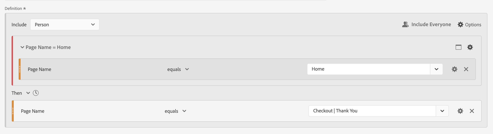

# Sequentiële segmenten

U maakt opeenvolgende segmenten met de logische operator [!UICONTROL Then] tussen componenten, containers en componenten of containers. De logische operator [!UICONTROL Then] impliceert dat de ene segmentvoorwaarde optreedt, gevolgd door een andere.

>[!BEGINSHADEBOX]

Zie  [&#x200B; Opeenvolgende segmentatie &#x200B;](https://video.tv.adobe.com/v/25405/?quality=12&learn=on){target="_blank"} voor een demo video.

{{videoaa}}

>[!ENDSHADEBOX]

Een opeenvolgend segment heeft sommige [&#x200B; basisfunctionaliteit &#x200B;](#basics) en extra opties die u kunt vormen om meer ingewikkeldheid aan het opeenvolgende segment toe te voegen:

* [&#x200B; na en binnen &#x200B;](#after-and-within) beperkingen voor toen logica in de definitie van het opeenvolgingssegment:

* Welke gegevens aan [&#x200B; omvatten &#x200B;](#include) als deel van de algemene opeenvolging voor de segmentdefinitie. Of voor een reeks die is gedefinieerd als onderdeel van een container. Standaard wordt rekening gehouden met alle overeenkomende gegevens. Dat gegeven wordt geïdentificeerd door  [!UICONTROL Include Everyone].

   * Selecteer  **[!UICONTROL Only Before Sequence]** om slechts gegevens vóór de opeenvolging te overwegen.
   * Selecteer  **[!UICONTROL Only After Sequence]** om slechts gegevens na de opeenvolging te overwegen.

* Welke gegevens aan [&#x200B; uitsluiten &#x200B;](#exclude) als deel van de opeenvolgende segmentdefinitie.

* Hoe te [&#x200B; logisch gezien groeperen &#x200B;](#logic-group) voorwaarden in uw opeenvolgende segmentdefinitie.

## Basisbeginselen

De grondbeginselen van de bouw van een opeenvolgend segment zijn niet verschillend dan de bouw van een regelmatig segment gebruikend de [&#x200B; bouwer van het Segment &#x200B;](seg-builder.md). U kunt de [&#x200B; bouwer van de Definitie &#x200B;](seg-builder.md#definition-builder) gebruiken om uw segmentdefinitie te construeren. In die constructie, gebruikt u componenten, containers, exploitanten en logica. Een regelmatig segment wordt een opeenvolgend segment zodra u de **[!UICONTROL Then]** exploitant in de belangrijkste definitie of in om het even welke containers selecteert u binnen de [&#x200B; Bouwer van de Definitie &#x200B;](seg-builder.md#definition-builder) gebruikt.

### Voorbeelden

In de onderstaande voorbeelden ziet u hoe u sequentiële segmenten gebruikt in verschillende gevallen.

#### Eenvoudige reeks

Identificeer personen die een pagina hebben bekeken en vervolgens een andere pagina hebben bekeken. De gegevens op gebeurtenisniveau worden gesegmenteerd met behulp van deze reeks. Ongeacht eerdere sessies of sessies van voorbije, vorige of tijdelijke personen, of de tijd of het aantal paginaweergaven die zich tussen de sessies voordoen.

#### Volgorde voor sessies

Identificeer personen die een pagina in een sessie hebben bekeken en bekijk vervolgens een andere pagina in een andere sessie. Om tussen zittingen te onderscheiden, gebruik containers om de opeenvolging te bouwen en  **[!UICONTROL Session]** niveau voor elke container.

#### Volgorde op gemengde niveaus

Identificeer personen die twee pagina&#39;s voor een onbepaald aantal sessies weergeven en bekijk vervolgens een derde pagina in een aparte sessie. Opnieuw, gebruiks containers om de opeenvolging te bouwen en  **[!UICONTROL Session]** niveau op de container te bepalen die de afzonderlijke zitting bepaalt.

#### Samengevoegde reeks

Identificeer personen die tijdens hun eerste sessie een specifieke pagina bezochten en later een aantal andere pagina&#39;s bezochten. Om tussen de opeenvolging van gebeurtenissen te onderscheiden, gebruikcontainers om de logica op a  te scheiden **[!UICONTROL Session]** containerniveau.

#### Een reeks nesten

Identificeer alle zittingen waar een persoon één pagina vóór een andere pagina bezoekt en dan follow-up zittingen heeft die twee andere pagina&#39;s impliceren. U kunt bijvoorbeeld alle sessies identificeren waarbij een persoon eerst de startpagina bezoekt, vervolgens een pagina van categorie 1 en vervolgens andere sessies heeft waarin in elke sessie de pagina van categorie 2 en 3 wordt bezocht.

## [!UICONTROL After] en [!UICONTROL Within]

U kunt  en **[!UICONTROL After]** Klok  de **[!UICONTROL Within]** exploitant om extra **[!UICONTROL Then]** tijdbeperkingen [&#x200B; of &#x200B;](#time-constraints) beperkingen voor Gebeurtenissen, Zittingen of Dimensies [&#x200B; te bepalen.](#event-session-and-dimension-constraints)

### Tijdbeperkingen

Tijdsbeperkingen toepassen op de operator **[!UICONTROL Then]** :

1. Selecteer .
1. Selecteer **[!UICONTROL Within]** of **[!UICONTROL After]** in het contextmenu.
1. Geef een tijdsperiode op (**[!UICONTROL Minute]**, **[!UICONTROL Hour]** tot **[!UICONTROL Years]** ).
1. Selecteer  **[!UICONTROL *aantal *]**&#x200B;om popup te openen die u toestaat om binnen te typen of een aantal te specificeren gebruikend **[!UICONTROL -]**&#x200B;of **[!UICONTROL +]**.

Om een tijdbeperking te verwijderen, gebruik .

In de onderstaande tabel worden de tijdbeperkingsoperatoren gedetailleerder uitgelegd.

| Operatoren | Beschrijving |
|--- |--- |
| **[!UICONTROL After]** | De operator [!UICONTROL After] wordt gebruikt om een minimumlimiet op te geven voor de tijd tussen twee controlepunten. Wanneer het plaatsen van de Na waarden, begint de tijdslimiet wanneer het segment wordt toegepast. Als de operator [!UICONTROL After] bijvoorbeeld op een container is ingesteld om personen te identificeren die pagina A bezoeken, maar pas na één dag naar pagina B terugkeren, begint die dag wanneer de bezoeker pagina A verlaat.  De bezoeker kan pas in het segment worden opgenomen nadat hij pagina A heeft verlaten en pagina B heeft weergegeven, nadat hij minimaal 1440 minuten (één dag) heeft doorgebracht. |
| **[!UICONTROL Within]** | De operator [!UICONTROL Within] wordt gebruikt om een maximumlimiet op te geven voor de hoeveelheid tijd tussen twee controlepunten. Als de operator [!UICONTROL Within] bijvoorbeeld op een container is ingesteld om personen te identificeren die pagina A bezoeken en vervolgens binnen één dag naar pagina B terugkeren, begint die dag wanneer de persoon pagina A verlaat. Om in het segment te worden opgenomen, heeft de persoon een maximumtijd van één dag alvorens pagina B te openen. De persoon die in het segment moet worden opgenomen, moet pagina B openen binnen maximaal 1440 minuten (één dag) nadat hij pagina A heeft verlaten om pagina B te bekijken. |
| **[!UICONTROL After but Within]** | Wanneer u zowel de operatoren [!UICONTROL After] als [!UICONTROL Within] gebruikt, beginnen en eindigen beide operatoren parallel, niet opeenvolgend.   bijvoorbeeld, bouwt u een segment met de container die aan wordt geplaatst: `After = 1 Week(s) and Within = 2 Week(s)`.  de voorwaarden om bezoekers in dit segment te identificeren worden voldaan slechts tussen één en twee weken. Beide voorwaarden worden afgedwongen vanaf het moment van de eerste paginaweergave. |

#### Voorbeelden

Enkele voorbeelden van het gebruik van de tijdbeperkingen.

##### [!UICONTROL After] operator

Identificeer personen die slechts na twee weken een pagina en vervolgens een andere pagina hebben bezocht. Bijvoorbeeld personen die de startpagina hebben bezocht, maar de vrouwen | Hiermee wordt de pagina pas na twee weken weergegeven.

Als een paginamening voor Home op 1 Juni, 2024, bij 00 :01 gebeurt, dan een paginamening aan pagina Vrouwen | De tonen zullen aanpassen zolang die paginamening na 15 Juni, 2024 00 :01 voorkomt.

##### [!UICONTROL Within] operator

Identificeer personen die een pagina en een andere pagina binnen vijf minuten hebben bezocht. Bijvoorbeeld personen die de startpagina hebben bezocht en vervolgens de vrouwen | Hiermee wordt de pagina binnen 5 minuten weergegeven.

Als een paginamening voor het Huis op 1 Juni, 2024, bij 12 :01 gebeurt, dan een paginamening aan pagina Vrouwen | De tonen zullen aanpassen zolang die paginamening vóór 15 Juni, 2024 12 :16 voorkomt.

##### [!UICONTROL After] but [!UICONTROL Within] operator

Identificeer personen die een pagina bezochten en vervolgens een andere pagina bezochten na twee weken, maar binnen één maand. Bijvoorbeeld personen die de startpagina hebben bezocht en vervolgens na twee weken en binnen een maand de Vrouwen | Shoes page.

Personen die op 1 juni 2024 op de startpagina komen en die terugkeren naar de Vrouwen | De pagina van vertoningen na 15 juni, 2019 00 :01, maar vóór 1 juli 2019 komt voor het segment in aanmerking.

### [!UICONTROL Event] -, [!UICONTROL Session] - en [!UICONTROL Dimension] -beperkingen

De  **[!UICONTROL After]** en  **[!UICONTROL Within]** beperkingen staan u niet alleen toe om een tijdbeperking maar ook een gebeurtenis, een zitting of een afmetingsbeperking te specificeren. Selecteer **[!UICONTROL Event(s)]**, **[!UICONTROL Session(s)]** of **[!UICONTROL Other dimensions]**  **[!UICONTROL *naam van Dimension *]**. U kunt het [!UICONTROL *gebied van het Onderzoek*] aan onderzoek naar een afmeting gebruiken.

#### Voorbeeld

Hieronder ziet u een voorbeeld van een sequentieel segment waarin wordt gezocht naar personen die een productcategoriepagina hebben bezocht (Vrouwen) | Shoes), gevolgd door een afrekenpagina (Afhandeling | Bedankt) op één pagina.

De volgende voorbeeldreeksen komen overeen of komen niet overeen:

| Reeks |  |
|--- | :---: |
| Pagina `Women \| Shoes` gevolgd door pagina `Checkout \| Thank You` |  |
| Pagina `Women \| Shoes` gevolgd door pagina `Women \| Tops` gevolgd door pagina `Checkout \| Thank You` |  |

## [!UICONTROL Include]

U kunt specificeren welke gegevens in uw opeenvolgend segment of in een opeenvolgende container moeten omvatten die deel van uw opeenvolgend segment uitmaakt.

### [!UICONTROL Everyone] {#include_everyone}

Om een opeenvolgend segment tot stand te brengen dat iedereen omvat, selecteer de optie  **[!UICONTROL Include Everyone]**.

Het opeenvolgende segment identificeert gegevens die overeenkomen met het opgegeven patroon als geheel.  Hieronder ziet u een voorbeeld van een basissequentiesegment waarin wordt gezocht naar personen die een productcategoriepagina hebben bezocht (Vrouwen) | Shoes), gevolgd door een afrekenpagina (Afhandeling | Dank u.). Het segment wordt geplaatst aan  **[!UICONTROL Include Everyone]**.

De volgende voorbeeldreeksen komen overeen of komen niet overeen:

| | Reeks |  |
|---:|--- | --- |
| 1 | `Women \| Shoes` dan `Checkout \| Thank You` in dezelfde sessie |  |
| 2 | `Women \| Shoes` then `Men \| Shoes` then `Checkout \| Thank You` (voor verschillende sessies) |  |
| 3 | `Checkout \| Thank You` then `Women \| Shoes` |  |

### [!UICONTROL Only Before Sequence] en [!UICONTROL Only After Sequence]

De opties  **[!UICONTROL Only Before Sequence]** en  **[!UICONTROL Only After Sequence]** segmenteren de gegevens aan een ondergroep vóór of na de gespecificeerde opeenvolging.

*  **slechts vóór Opeenvolging**: Omvat alle gegevens vóór een opeenvolging en de eerste gegevens van de opeenvolging zelf. Als een reeks meerdere keren als onderdeel van de gegevens wordt weergegeven, bevat [!UICONTROL Only Before Sequence] de eerste hit van de laatste instantie van de reeks en alle vorige treffers.
*  **slechts na Reeks**: Omvat alle klappen na een opeenvolging en de laatste gegevens van de opeenvolging zelf. Als een reeks meerdere keren als onderdeel van de gegevens wordt weergegeven, bevat [!UICONTROL Only After Sequence] de laatste hit van de eerste instantie van de reeks en alle volgende treffers.

Overweeg een definitie die een opeenvolging van een component met criteria specificeert die door B worden geïdentificeerd, (toen) door een component met criteria wordt gevolgd die door D worden geïdentificeerd. De drie opties zouden gegevens als volgt identificeren:

| B Vervolgens D | A | B | C | D | E | F |
|---|:---:|:---:|:---:|:---:|:---:|:---:|
| Inclusief iedereen |  |  |  |  |  |  |
| Alleen voor reeks |  |  |  |  |  |  |
| Alleen na reeks |  |  |  |  |  |  |

{style="table-layout:fixed"}

| B Dan D (komt meerdere keren voor) | A | B | C | D | B | C | D | E |
|---|:---:|:---:|:---:|:---:|:---:|:---:|:---:|:---:|
| Inclusief iedereen |  |  |  |  |  |  |  |  |
| Alleen voor reeks |  |  |  |  |  |  |  |  |
| Alleen na reeks |  |  |  |  |  |  |  |  |

{style="table-layout:fixed"}

#### Voorbeeld

U hebt drie versies van een opeenvolgend segment gedefinieerd voor sitesecties. Één met de optie  **[!UICONTROL Include Everyone]**, met de optie  **[!UICONTROL Only Before Sequence]**, en met de optie  **[!UICONTROL Only After Sequence]**. U noemde de drie segmenten dienovereenkomstig.

Wanneer het melden van plaatssecties die deze drie segmenten gebruiken, kijkt de voorbeeldoutput in een vrije vormlijst als:

## [!UICONTROL Exclude]

De definities van het segment omvatten alle gegevens tenzij u specifiek  [!UICONTROL Person] uitsluiten,  [!UICONTROL Session], of  [!UICONTROL Event] gegevens gebruikend **[!UICONTROL Exclude]**.

Met [!UICONTROL Exclude] kunt u algemene gegevens negeren en segmenten met meer focus maken. Met Uitsluiten kunt u ook segmenten maken, met uitzondering van specifieke groepen personen. Bijvoorbeeld, om een segment te bepalen dat personen specificeert die orden plaatste en dan die groep personen uitsluiten om *niet-kopers* te identificeren. De beste manier is om regels te maken die een brede definitie gebruiken in plaats van [!UICONTROL Exclude] te gebruiken om specifieke personen die overeenkomen met specifieke include-waarden, als doel in te stellen.

Voorbeeld van uitsluitingsdefinities zijn:

* **sluit pagina&#39;s** uit. Gebruik een segmentdefinitie om een specifieke pagina (zoals *Pagina van het Huis*) van een rapport weg te halen, creeer een regel van de Gebeurtenis waar de pagina `Home Page` evenaart, en sluit dan de regel uit. Deze definitie omvat automatisch alle pagina&#39;s behalve de *Pagina van het Huis*.
* **sluit verwijzende domeinen** uit. Gebruik een definitie die alleen verwijzende domeinen van Google.com omvat en alle andere uitsluitt.
* **identificeer niet-kopers**. Identificeer wanneer orden groter dan nul zijn en sluit dan [!UICONTROL Person] uit.

[!UICONTROL Exclude] kan worden gebruikt om een opeenvolging te identificeren waar de personen geen deel van specifieke zittingen uitmaken of specifieke gebeurtenissen uitvoeren. [!UICONTROL Exclude] kan ook worden opgenomen in een [!UICONTROL Logic Group] (zie hieronder).

U kunt containers uitsluiten, geen componenten.

### Voorbeelden

Zie hieronder voor voorbeelden van het gebruik van [!UICONTROL Exclude] .

#### [!UICONTROL Exclude] within

Identificeer personen die een pagina hebben bezocht, geen andere pagina hebben bezocht en vervolgens weer een andere pagina hebben bezocht. U sluit de container uit gebruikend  [!UICONTROL Exclude]. Een uitgesloten container wordt geïdentificeerd door een dunne rode balk aan de linkerkant.

 uit

#### [!UICONTROL Exclude] bij begin

Identificeer personen die een pagina hebben bezocht zonder ooit naar een andere pagina te gaan. Mensen die een aankoop hebben uitgecheckt zonder ooit de homepage te hebben bezocht, bijvoorbeeld.

 uit

#### [!UICONTROL Exclude] aan einde

Identificeer personen die één pagina hebben bezocht maar nooit andere pagina&#39;s hebben bezocht. Bijvoorbeeld personen die uw homepage hebben bezocht, maar nooit een van uw afhandelingspagina&#39;s.

 uit

## [!UICONTROL Logic Group]

>[!NOTE]
>
>Een [!UICONTROL Logic Group] kan alleen worden gedefinieerd in een opeenvolgend segment, wat betekent dat de operator [!UICONTROL Then] wordt gebruikt in de container.

Met de Logische groep kunt u voorwaarden groeperen in één controlepunt voor opeenvolgende segmenten. Als onderdeel van de reeks wordt de logica die is gedefinieerd in de container die is geïdentificeerd als Logic Group, geëvalueerd na een voorafgaand controlepunt en vóór een volgend volgend controlepunt.

Aan de voorwaarden binnen de Logische Groep zelf kan in om het even welke orde worden voldaan. Niet-opeenvolgende containers (gebeurtenis, sessie, persoon) vereisen daarentegen niet dat aan de voorwaarden ervan wordt voldaan binnen de gehele reeks, wat mogelijk niet-intuïtieve resultaten oplevert bij gebruik met een Dan-operator.

[!UICONTROL Logic Group] werd ontworpen om *verscheidene voorwaarden als groep te behandelen, zonder enige het opdracht geven tot* onder de gegroepeerde voorwaarden. Anders gezegd, is de volgorde van de voorwaarden binnen een logische groep irrelevant.

U kunt Logica Group het beste gebruiken:

* Opeenvolgende controlepunten groeperen.
* Om de bouw van opeenvolgende segmenten te vereenvoudigen.

### Voorbeelden

Hier volgen voorbeelden van het gebruik van de container van de Logische Groep.

#### Elke bestelling

Identificeer personen die een pagina hebben bezocht en bekijk elke pagina in een willekeurige volgorde uit een andere set pagina&#39;s. Bijvoorbeeld, bezochten de mensen die de Homepage bezochten, dan elk van de Mannen pagina, de pagina van Vrouwen, en de pagina van Kinderen, ongeacht de orde.

U kunt dit segment maken zonder een [!UICONTROL Logic Group] , maar de constructie zal complex en ingewikkeld zijn. Geef elke reeks pagina&#39;s op die de bezoeker kan bekijken. Voor duidelijkheid, slechts wordt de eerste container geopend  en de andere containers zijn gesloten . U kunt de inhoud van de andere containers afleiden door de titels.

 gebruikt

U kunt [!UICONTROL Logic Group] gebruiken om het samenstellen van dit segment te vereenvoudigen, zoals hieronder wordt getoond. Verzeker u  **[!UICONTROL Logic Group]** voor de container selecteert.

 gebruikt

#### Eerste overeenkomst

Identificeer personen die een pagina of een andere pagina hebben bezocht en vervolgens weer een andere pagina hebben bezocht. Bijvoorbeeld personen die de pagina Vrouwen of de pagina Mannen hebben bezocht, bezochten de kassa | Bedankt, pagina.

 gebruikt

#### [!UICONTROL Exclude] [!UICONTROL And]

Identificeer personen die een pagina bezochten toen uitdrukkelijk geen reeks andere pagina&#39;s bezochten, maar opnieuw een andere pagina bezocht. Bijvoorbeeld, de personen die de Homepage bezochten, bezochten niet de Mannen of de Vrouwen pagina, maar bezochten de Kinderen pagina.

#### [!UICONTROL Exclude] [!UICONTROL Or]

Identificeer personen die een pagina bezochten toen uitdrukkelijk geen pagina van een reeks pagina&#39;s bezocht, maar opnieuw een andere pagina bezocht. Bijvoorbeeld personen die de startpagina hebben bezocht en de pagina Mannen en Vrouwen niet hebben bezocht, maar wel de pagina Kinderen hebben bezocht.

<!--
An example of a complex sequential segment if you want to find the persons that 

| Session One | Session Two | Session Three |
| --- | --- | --- |
| The person went to the main landing page A, excluded the campaign page B, and then viewed the Product page C.| The person again went to the main landing page A, excluded the campaign page B, and went again to the Product page C, and then to a new page D. | The person entered and followed that same path as in the first and second visits, then excluded page F to go directly to a targeted product on page G. |
-->

## Een laatste voorbeeld

Als laatste voorbeeld, wilt u mensen identificeren die over een specifieke productpagina leerden, zonder deze personen ooit door uw Empower Your Move campagne werden geraakt. En tijdens hun eerste bezoek aan uw online winkel werd de startpagina bekeken, maar werd niet verder gekeken naar fitness (tandwielproducten) producten uit de categorie Men. In hun volgende sessie direct daarna gingen ze echter naar een productpagina en plaatsten ze een onlinebestelling zonder eerst de startpagina te doorlopen.

