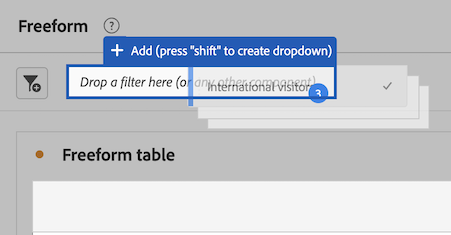

# Componenten in Analysis Workspace gebruiken

Componenten vormen de feitelijke gegevens van elk project in Analysis Workspace. Componenten bestaan uit afmetingen, metriek, filters en datumbereiken. U kunt componenten aan een project toevoegen door hen in visualisaties of panelen te slepen.

Voor overzichtsinformatie over de types van componenten kunt u toevoegen, zie [Overzicht van componenten](/help/components/overview.md).

>[!TIP]
>
>Voor informatie over elke component, selecteer het pictogram van Info naast de naam van een component in de linkerspoorstaaf van Analysis Workspace.

## Beginnen met het toevoegen van componenten aan een project

1. [Een project maken in Analysis Workspace](/help/analysis-workspace/build-workspace-project/create-projects.md) als je dat nog niet hebt gedaan.

1. [Deelvenster toevoegen](/help/analysis-workspace/c-panels/panels.md) of [een visualisatie toevoegen](/help/analysis-workspace/visualizations/freeform-analysis-visualizations.md#add-visualizations-to-a-panel) naar het project in Analysis Workspace.

   Als u een component aan een leeg project toevoegt, wordt automatisch een vrije lijstvisualisatie gecreeerd.

1. Selecteer de **[!UICONTROL Components]** in de linkerspoorstaaf.

   

1. Blader naar of zoek naar de component die u wilt toevoegen en sleep deze naar een deelvenster of een visualisatie in uw project.

   U kunt bijvoorbeeld een filter naar de neerzetzone van het filter in een deelvensterkop slepen.

   

1. Voor meer gedetailleerde informatie gaat u verder met een van de volgende secties, afhankelijk van het componenttype dat u toevoegt:

   * [Afmetingen toevoegen aan een project](#add-dimensions-to-a-project)

   * [Metriek toevoegen aan een project](#add-metrics-to-a-project)

   * [Filter toevoegen aan een project](#add-filters-to-a-project)

   * [Datumbereiken toevoegen aan een project](#add-date-ranges-to-a-project)

## Afmetingen toevoegen aan een project

[Dimensionen](/help/components/dimensions/overview.md) zijn variabelen in Adobe Analytics die doorgaans tekenreekswaarden bevatten. In tegenstelling tot [cijfers](/help/components/calc-metrics/calc-metr-overview.md) bevatten numerieke waarden die aan een afmeting binden. Een basisrapport toont rijen van koordwaarden (afmeting), tegen een kolom van numerieke waarden (metrisch).

1. Begin een dimensie aan uw project in Analysis Workspace toe te voegen, zoals beschreven in [Beginnen met het toevoegen van componenten aan een project](#begin-adding-components-to-a-project).

1. Kies een van de volgende methoden om afmetingen toe te voegen en het type gegevens te bepalen dat u wilt analyseren:

   * Sleep een dimensie naar een visualisatie (zoals een vrije-vormlijst) in Analysis Workspace.

     

   * Sleep een of meer afmetingen van de linkerspoorstaaf naar de filterneerzetzone om een ad-hocfilter te maken, zoals beschreven in [Filters toevoegen aan een project](#add-filters-to-a-project).

Ga voor meer informatie over het gebruik van dimensies in Analysis Workspace naar [Voorvertoningsafmetingen](/help/components/dimensions/view-dimensions.md), [Afmetingen onderverdelingen](/help/components/dimensions/t-breakdown-fa.md), en [Afmetingen van tijd tot tijd](/help/components/dimensions/time-parting-dimensions.md).

## Metriek toevoegen aan een project

Met cijfers kunt u gegevenspunten in Analysis Workspace kwantificeren. Deze worden meestal gebruikt als kolommen in een visualisatie en zijn gekoppeld aan afmetingen.

Om metrisch aan een project in Analysis Workspace toe te voegen:

1. Een metrische waarde toevoegen aan uw project in Analysis Workspace, zoals wordt beschreven in [Beginnen met het toevoegen van componenten aan een project](#begin-adding-components-to-a-project).

1. Kies een van de volgende methoden om metrisch toe te voegen in Analysis Workspace:

   * Sleep metrisch aan de metrische dalingsstreek in een lege lijst Freeform om te zien dat metrisch over de de datumperiode van het project trended.

     

   * Sleep metrisch wanneer een afmeting aanwezig is om dat metrisch vergeleken bij elk afmetingspunt te zien.

   * Sleep metrisch bovenop een bestaande metrische kopbal om het te vervangen.

   * Sleep metrisch naast een kopbal om beide metriek naast elkaar te zien.

Voor meer informatie over metriek, zie [Overzicht van berekende metriek](/help/components/calc-metrics/calc-metr-overview.md).

## Filters toevoegen aan een project

[Filters](/help/components/filters/filters-overview.md) kunt u subsets van bezoekers identificeren op basis van kenmerken of specifieke interacties.

Een filter toevoegen aan een project in Analysis Workspace:

1. Een filter toevoegen aan uw project in Analysis Workspace, zoals wordt beschreven in [Beginnen met het toevoegen van componenten aan een project](#begin-adding-components-to-a-project).

1. Kies een van de volgende methoden om het deelvenster te filteren:

   * Sleep een afzonderlijk filter van de linkerspoorstaaf naar de filterneerzetzone.

     

   * Houd Shift of Ctrl ingedrukt als u meerdere filters in de linkertrack wilt selecteren en houd Shift ingedrukt als u deze naar de dropzone van het filter verplaatst.

     

     Hiermee maakt u een vervolgkeuzemenu waarin gebruikers van het deelvenster het filter kunnen kiezen dat zij willen toepassen. Het vervolgkeuzemenu bevat een [!UICONTROL **Geen filter**] die gebruikers kunnen selecteren, zodat het deelvenster ongefilterd blijft.

     U kunt de (x) selecteren om het even welke optie uit het drop-down menu te verwijderen. Als u de [!UICONTROL **Geen filter**] en is een filter vereist.

   * Maak ad-hocfilters door niet-filtercomponenten naar de neerzetzone te slepen. Dit kan u de tijd en moeite besparen om naar de Bouwer van de Filter te gaan. Filters die op deze manier worden gemaakt, worden automatisch gedefinieerd als filters op raakniveau. Deze definitie kan worden gewijzigd door te klikken op het informatiepictogram (i) naast het filter, vervolgens op het pictogram voor het bewerken van de vorm van een potlood en dit te bewerken in de Filter Builder.

     Ad hoc filters zijn een type snel filter, en zijn plaatselijk aan het project. Ze komen niet in de linkerspoorstaaf voor als je ze niet openbaar maakt.

     Zie voor meer informatie [Snelle filters](/help/components/filters/quick-filters.md).

Ga voor meer informatie over hoe u de neerzetzone van het filter op een deelvenster kunt gebruiken om uw deelvenster te filteren naar [Valzone](/help/analysis-workspace/c-panels/panels.md#drop-zone) in [Overzicht van deelvensters](/help/analysis-workspace/c-panels/panels.md).

## Datumbereiken toevoegen aan een project

[Datumbereiken](/help/components/date-ranges/custom-date-ranges.md) bepaalt het rapporttijdkader in Analysis Workspace, en kan op één of meerdere panelen binnen een project worden toegepast.

Elk deelvenster bevat standaard een datumbereik. Er zijn meerdere manieren om een datumbereik voor een deelvenster bij te werken. U kunt een datumbereik voor een deelvenster in Analysis Workspace bijwerken door een datumbereikcomponent van de linkertrack te slepen:

1. Beginnen met het toevoegen van een datumbereik aan uw project in Analysis Workspace, zoals beschreven in [Beginnen met het toevoegen van componenten aan een project](#begin-adding-components-to-a-project).

1. Sleep een datumbereik van de linkertrack naar het huidige datumbereik in de rechterbovenhoek van het deelvenster.

   

Zie voor meer informatie over het gebruik van kalenders en datumbereiken in Analysis Workspace [Overzicht van kalender- en datumbereiken](/help/components/date-ranges/custom-date-ranges.md).
