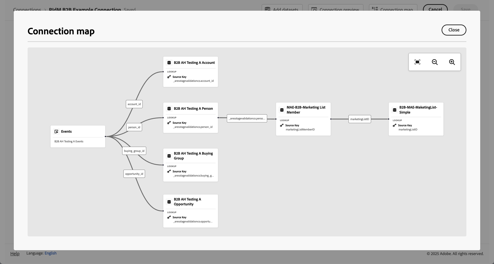

# Verbinding maken of bewerken {#create-or-edit-a-connection}

<!-- markdownlint-disable MD034 -->

>[!CONTEXTUALHELP]
>id="cja_connections_recordsadded"
>title="Toegevoegde records"
>abstract="Het aantal verslagen (rijen) die aan een Verbinding tijdens het geselecteerde tijdinterval voor de geselecteerde datasets worden toegevoegd."

<!-- markdownlint-enable MD034 -->

<!-- markdownlint-disable MD034 -->

>[!CONTEXTUALHELP]
>id="cja_connections_recordsskipped"
>title="Records overgeslagen"
>abstract="Het aantal verslagen (rijen) die tijdens gegevensoverdracht voor een Verbinding tijdens het geselecteerde tijdinterval voor de geselecteerde datasets worden overgeslagen."

<!-- markdownlint-enable MD034 -->

<!-- markdownlint-disable MD034 -->

>[!CONTEXTUALHELP]
>id="cja_connections_recordsdeleted"
>title="Verslagen verwijderd"
>abstract="Het aantal verslagen (rijen) die uit een Verbinding tijdens het geselecteerde tijdinterval voor de geselecteerde datasets worden verwijderd."

<!-- markdownlint-enable MD034 -->

<!-- markdownlint-disable MD034 -->

>[!CONTEXTUALHELP]
>id="cja_connection_lastadded"
>title="Laatst toegevoegd"
>abstract="De tijdstempel van de laatste batch van elke gegevensset die is overgedragen naar een verbinding."

<!-- markdownlint-enable MD034 -->

<!-- markdownlint-disable MD034 -->

>[!CONTEXTUALHELP]
>id="cja_connection_enablerollingdatawindow"
>title="Het venster Rolgegevens inschakelen"
>abstract="Definieer de gegevensbewaring als een schuifvenster in maanden op verbindingsniveau."

<!-- markdownlint-enable MD034 -->

<!-- markdownlint-disable MD034 -->

>[!CONTEXTUALHELP]
>id="cja_connection_averagenumberofdailyuses"
>title="Gemiddeld aantal dagelijkse toepassingen"
>abstract="Selecteer een bereik voor het aantal verwachte dagelijkse gebeurtenissen voor de volledige verbinding."

<!-- markdownlint-enable MD034 -->

<!-- markdownlint-disable MD034 -->

>[!CONTEXTUALHELP]
>id="connections_recordsadded"
>title="Toegevoegde records"
>abstract="Het aantal verslagen (rijen) die aan een Verbinding tijdens het geselecteerde tijdinterval voor de geselecteerde datasets worden toegevoegd."

<!-- markdownlint-enable MD034 -->

<!-- markdownlint-disable MD034 -->

>[!CONTEXTUALHELP]
>id="connections_recordsskipped"
>title="Records overgeslagen"
>abstract="Het aantal verslagen (rijen) die tijdens gegevensoverdracht voor een Verbinding tijdens het geselecteerde tijdinterval voor de geselecteerde datasets worden overgeslagen."

<!-- markdownlint-enable MD034 -->

<!-- markdownlint-disable MD034 -->

>[!CONTEXTUALHELP]
>id="connections_recordsdeleted"
>title="Verslagen verwijderd"
>abstract="Het aantal verslagen (rijen) die uit een Verbinding tijdens het geselecteerde tijdinterval voor de geselecteerde datasets worden verwijderd"

<!-- markdownlint-enable MD034 -->

<!-- markdownlint-disable MD034 -->

>[!CONTEXTUALHELP]
>id="connection_lastadded"
>title="Laatst toegevoegd"
>abstract="De tijdstempel van de laatste batch van elke gegevensset die is overgedragen naar een verbinding."

<!-- markdownlint-enable MD034 -->

<!-- markdownlint-disable MD034 -->

>[!CONTEXTUALHELP]
>id="connection_enablerollingdatawindow"
>title="Het venster Rolgegevens inschakelen"
>abstract="Definieer de gegevensbewaring als een schuifvenster in maanden op verbindingsniveau."

<!-- markdownlint-enable MD034 -->

<!-- markdownlint-disable MD034 -->

>[!CONTEXTUALHELP]
>id="connection_averagenumberofdailyuses"
>title="Gemiddeld aantal dagelijkse toepassingen"
>abstract="Selecteer een bereik voor het aantal verwachte dagelijkse gebeurtenissen voor de volledige verbinding."


De verbindings verwezenlijking en geeft werkschemaervaring uit brengt alle dataset en montages van de verbindingsconfiguratie aan het centrum van het scherm met een hulpwerkschema uit. Het verstrekt gedetailleerde datasetselectie, configuratie, en overzichtservaring. En staat u toe om kritieke informatie zoals [ datasettype ](#dataset-types), grootte, schema, dataset identiteitskaart, partijstatus, backfill status, identiteiten, en veel meer te specificeren, om het risico van verkeerde verbindingsconfiguratie te verminderen. Hier volgt een overzicht van de mogelijkheden:

* U kunt het rollen venster van het gegevensbehoud toelaten wanneer u de verbinding creeert.
* U kunt datasets toevoegen aan en verwijderen uit een verbinding. (Als u een gegevensset verwijdert, wordt deze uit de verbinding verwijderd en worden de bijbehorende gegevensweergaven en onderliggende Analysis Workspace-projecten beïnvloed.)
* U kunt terugvullingsgegevens per dataset toelaten en verzoeken.
* U kunt datasets uitgeven, bijvoorbeeld om een andere backfill te verzoeken.
* U kunt bestaande gegevens per dataset importeren.


>[!BEGINSHADEBOX]

Zie  [ een verbinding ](https://video.tv.adobe.com/v/343044/?quality=12&learn=on){target="_blank"} voor een demo video creëren en uitgeven.

>[!ENDSHADEBOX]


## Vereisten

Het maximumaantal datasets u aan een verbinding kunt toevoegen wordt beperkt tot 100. De mix is afhankelijk van welk Customer Journey Analytics-pakket uw bedrijf heeft aangeschaft.

Neem contact op met de beheerder als u niet zeker weet welk Customer Journey Analytics-pakket u hebt.

| **Uitgezochte** pakket | **het pakket van de Stichting** |
| --- | --- |
| Om het even welke combinatie gebeurtenis, profiel, raadpleging, of samenvattingsdatasets, die tot 100 toevoegen | Eén gebeurtenisgegevensset per verbinding |
|  | Tot 99 profiel, raadpleging, of samenvattingsdatasets per verbinding |

{style="table-layout:auto"}

## Verbinding maken {#create-connection}

Een verbinding maken:

1. Selecteer in Customer Journey Analytics **[!UICONTROL Connections]** (optioneel in **[!UICONTROL Data management]** ) in het bovenste menu.
1. Selecteer **[!UICONTROL Create new connection]** .

U kunt [ de details voor uw verbinding ](#edit-a-connection) nu uitgeven.

## Een verbinding bewerken {#edit-connection}

Hoe u de verbinding bewerkt, is afhankelijk van het Customer Journey Analytics-pakket waarvoor u een licentie hebt:

* [Customer Journey Analytics](#customer-journey-analytics)
* [Customer Journey Analytics B2B edition](#customer-journey-analytics-b2b-edition)

### Customer Journey Analytics

In **[!UICONTROL Connections]** > **[!UICONTROL *Naam van het verbindings *]**&#x200B;scherm:


1. Configureer de verbindingsinstellingen.

   | Instelling | Beschrijving |
   | --- | --- |
   | **[!UICONTROL Connection name]** | Voer een unieke naam in voor de verbinding. |
   | **[!UICONTROL Connection description]** | Beschrijf het doel van deze verbinding. |
   | **[!UICONTROL Tags]** | Geef tags op om tags toe te voegen aan uw verbinding, zodat u deze tags kunt gebruiken om in een later stadium naar de verbinding te zoeken. |
   | **[!UICONTROL Enable rolling data window]** | Als u dit selectievakje inschakelt, kunt u Customer Journey Analytics-gegevensbewaring definiëren als een schuifvenster in maanden (1 maand, 3 maanden, 6 maanden enzovoort) op verbindingsniveau.<p>Het bewaren van gegevens is gebaseerd op de tijdstempels van de gebeurtenisdataset en is slechts op gebeurtenisdatasets van toepassing. Er bestaat geen instelling voor het schuivende gegevensvenster voor profiel- of opzoekgegevenssets, omdat er geen relevante tijdstempels zijn. Nochtans, als uw verbinding om het even welk profiel of raadplegingsdatasets (naast één of meerdere gebeurtenisdatasets) omvat, worden die gegevens bewaard voor de zelfde tijdspanne.<p> Het belangrijkste voordeel is dat u alleen gegevens opslaat of rapporteert die van toepassing zijn en nuttig zijn, en oudere gegevens verwijdert die niet meer nuttig zijn. Het helpt u onder uw contractgrenzen te blijven en vermindert het risico van overleeftijdskosten.<p><ul><li>Als u de standaardinstelling (uitgeschakeld) verlaat, vervangt de bewaarinstelling voor Adobe Experience Platform-gegevens de bewaarperiode. Als je 25 maanden aan gegevens hebt in Experience Platform, krijgt Customer Journey Analytics 25 maanden aan gegevens via back-up. Als je 10 van die maanden in Experience Platform verwijdert, behoudt Customer Journey Analytics de resterende 15 maanden.</li><li>Als u een schuivend gegevensvenster inschakelt, geeft u in **[!UICONTROL Select number of months]** het aantal maanden op waarvoor u het schuivende gegevensvenster inschakelt. |
   | **[!UICONTROL Sandbox]** | Kies een sandbox in Experience Platform die de gegevenssets bevat waarvoor u een verbinding wilt maken.<p>Adobe Experience Platform verstrekt [ zandbakken ](https://experienceleague.adobe.com/en/docs/experience-platform/sandbox/home) die één enkele instantie van het Platform in afzonderlijke virtuele milieu&#39;s verdelen helpen digitale ervaringstoepassingen ontwikkelen en evolueren. U kunt sandboxen zien als &#39;gegevenssilo&#39;s&#39; die gegevenssets bevatten. Sandboxen worden gebruikt om toegang tot datasets te controleren.<p>Als u de sandbox hebt geselecteerd, geeft de linkerrail alle gegevenssets in die sandbox weer waaruit u kunt trekken. |
   | **[!UICONTROL Add datasets]** | Selecteer  **[!UICONTROL Add datasets]** om datasets toe te voegen. Als de verbinding nog geen datasets heeft, kunt u **[!UICONTROL Add datasets]** in de datasetlijst ook selecteren. |


   Voor de datasets u hebt gevormd, toont de lijst van datasets de volgende kolommen:

   | Kolom | Beschrijving |
   |---|---|
   | **[!UICONTROL Dataset name]** | Selecteer een of meer gegevenssets die u in Customer Journey Analytics wilt gebruiken en selecteer **[!UICONTROL Add]** .<p>(Als u veel datasets hebt waaruit u kunt kiezen, kunt u naar de juiste zoeken met behulp van de zoekbalk met zoekgegevens boven de lijst met gegevenssets.) |
   |  | Selecteer  om een contextmenu voor de geselecteerde dataset te openen. Gebaseerd op de (type van) dataset, kunt u selecteren:<ul><li>  **[!UICONTROL Delete dataset]** [ schrapt een dataset ](#delete-a-dataset).</li><li> **[!UICONTROL Edit dataset]** uit [ geef een dataset ](#edit-a-dataset) uit.</li><li> **[!UICONTROL Past backfills]** om [ vroegere backfills voor de dataset ](#past-backfills) te tonen. |
   | **[!UICONTROL Last updated]** | Alleen voor gebeurtenisgegevenssets wordt deze instelling automatisch ingesteld op het standaardtijdstempelveld vanuit op gebeurtenissen gebaseerde schema&#39;s in Experience Platform. &quot;N.v.t.&quot; betekent dat deze gegevensset geen gegevens bevat. |
   | **[!UICONTROL Number of records]** | The total records in the previous month for the dataset in Experience Platform. |
   | **[!UICONTROL Schema]** | Het [ die schema ](https://experienceleague.adobe.com/en/docs/experience-platform/xdm/schema/composition) wordt gebaseerd waarop de dataset in Adobe Experience Platform werd gecreeerd. |
   | **[!UICONTROL Dataset type]** | Voor elke dataset die u aan deze verbinding toevoegde, plaatst Customer Journey Analytics automatisch het [ datasettype ](#dataset-types) dat op de gegevens wordt gebaseerd die binnen komen. Er zijn drie verschillende gegevenstypen: gebeurtenisgegevens, profielgegevens en opzoekgegevens. Zie de tabel hieronder voor een uitleg van de typen gegevenssets. |
   | **[!UICONTROL Granularity]** | De granulariteit van de gegevens in de gegevensset; alleen van toepassing voor samenvattende gegevenssets. |
   | **[!UICONTROL Data source type]** | Het gegevensbrontype van de dataset. Niet van toepassing voor samenvattende gegevensreeksen. |
   | **[!UICONTROL Person ID]** | De persoon-id die wordt gebruikt ter ondersteuning van op personen gebaseerde rapportage voor de gegevensset. |
   | **[!UICONTROL Key]** | De sleutel die voor een raadplegingsdataset wordt gebruikt. |
   | **[!UICONTROL Matching Key]** | De passende sleutel die voor een raadplegingsdataset wordt gebruikt. |
   | **[!UICONTROL Import new data]** | De status van het invoeren van nieuwe gegevens voor de dataset: <p>   **[!UICONTROL _x _op]**&#x200B;als de dataset wordt gevormd om nieuwe gegevens in te voeren, en<p>   **[!UICONTROL _x van_]** als de dataset wordt gevormd om nieuwe gegevens niet in te voeren. |
   | **[!UICONTROL Backfill data]** | De status van backfill-gegevens voor de dataset.<p>   **[!UICONTROL _x _ontbroken backfills]**&#x200B;voor aantal ontbroken backfills,<p>   **[!UICONTROL _x _backfills verwerking]**&#x200B;voor aantal verwerkings backfills,<p>   **[!UICONTROL _x _voltooide backfills]**&#x200B;voor aantal voltooide backfills, en<p>   **[!UICONTROL _weg_]** voor het geval dat geen backfills wordt gevormd. |

   U kunt naar een specifieke dataset zoeken gebruikend het .

### Customer Journey Analytics B2B edition

[!BADGE &#x200B; B2B edition &#x200B;]{type=Informative url="https://experienceleague.adobe.com/en/docs/analytics-platform/using/cja-overview/cja-b2b/cja-b2b-edition" newtab=true tooltip="Customer Journey Analytics B2B edition"}

In **[!UICONTROL Connections]** > **[!UICONTROL *Naam van het verbindings *]**&#x200B;scherm:


1. Configureer de verbindingsinstellingen.

   | Instelling | Beschrijving |
   | --- | --- |
   | **[!UICONTROL Connection name]** | Voer een unieke naam in voor de verbinding. |
   | **[!UICONTROL Connection description]** | Beschrijf het doel van deze verbinding. |
   | **[!UICONTROL Tags]** | Geef tags op om tags toe te voegen aan uw verbinding, zodat u deze tags kunt gebruiken om in een later stadium naar de verbinding te zoeken. |
   | **[!UICONTROL Primary ID]** | Selecteer de juiste primaire id voor uw verbinding: <ul><li> **[!UICONTROL Person]** voor een op persoon-gebaseerde verbinding u typisch in een scenario B2C gebruikt.</li><li>  **[!UICONTROL Account]** voor een op rekening-gebaseerde verbinding u typisch in een B2B scenario gebruikt.</li></ul>Zodra u één of meerdere datasets aan uw verbinding toevoegt, kunt u primaire identiteitskaart niet meer veranderen. <br/> de selectie van primaire identiteitskaart bepaalt of de verbinding op persoon-gebaseerd of op rekening-gebaseerd is. De verbindingsbasis bepaalt de beschikbare [ montages ](#dataset-settings) voor bepaalde types van datasets. |
   | **[!UICONTROL Optional containers]** | Als u  **[!UICONTROL Account]** als **[!UICONTROL Primary ID]** hebt geselecteerd, selecteer extra containers.<ul><li>**[!UICONTROL Global account]**: hiermee kunt u algemene accounts configureren in een verbinding.</li><li>**[!UICONTROL Opportunity]**: hiermee kunt u de mogelijkheden van een verbinding configureren.</li><li>**[!UICONTROL Buying group]**: hiermee kunt u groepen aanschaffen in een verbinding.</li><ul> |
   | **[!UICONTROL Sandbox]** | Kies een sandbox in Experience Platform die de gegevenssets bevat waarop u een verbinding wilt maken.<p>Adobe Experience Platform verstrekt [ zandbakken ](https://experienceleague.adobe.com/en/docs/experience-platform/sandbox/home) die één enkele instantie van het Platform in afzonderlijke virtuele milieu&#39;s verdelen helpen digitale ervaringstoepassingen ontwikkelen en evolueren. U kunt sandboxen zien als &#39;gegevenssilo&#39;s&#39; die gegevenssets bevatten. Sandboxen worden gebruikt om toegang tot datasets te controleren.<p>Als u de sandbox hebt geselecteerd, geeft de linkerrail alle gegevenssets in die sandbox weer waaruit u kunt trekken. |
   | **[!UICONTROL Enable rolling data window]** | Als u dit selectievakje inschakelt, kunt u Customer Journey Analytics-gegevensbewaring definiëren als een schuifvenster in maanden (1 maand, 3 maanden, 6 maanden enzovoort) op verbindingsniveau.<p>Het bewaren van gegevens is gebaseerd op de tijdstempels van de gebeurtenisdataset en is slechts op gebeurtenisdatasets van toepassing. Er bestaat geen instelling voor het schuivende gegevensvenster voor profiel- of opzoekgegevenssets, omdat er geen relevante tijdstempels zijn. Nochtans, als uw verbinding om het even welk profiel of raadplegingsdatasets (naast één of meerdere gebeurtenisdatasets) omvat, worden die gegevens bewaard voor de zelfde tijdspanne.<p> Het belangrijkste voordeel is dat u alleen gegevens opslaat of rapporteert die van toepassing zijn en nuttig zijn, en oudere gegevens verwijdert die niet meer nuttig zijn. Het helpt u onder uw contractgrenzen te blijven en vermindert het risico van overleeftijdskosten.<p><ul><li>Als u de standaardinstelling (uitgeschakeld) verlaat, vervangt de bewaarinstelling voor Adobe Experience Platform-gegevens de bewaarperiode. Als je 25 maanden aan gegevens hebt in Experience Platform, krijgt Customer Journey Analytics 25 maanden aan gegevens via back-up. Als u 10 van die maanden in Platform schrapte, zou Customer Journey Analytics de resterende 15 maanden behouden.</li><li>Als u een schuivend gegevensvenster inschakelt, geeft u in **[!UICONTROL Select number of months]** het aantal maanden op waarvoor u het schuivende gegevensvenster inschakelt. |
   | **[!UICONTROL Add datasets]** | Selecteer  **[!UICONTROL Add datasets]** [ om datasets ](#add-datasets) toe te voegen. Als de verbinding nog geen datasets heeft, kunt u **[!UICONTROL Add datasets]** in de datasetlijst ook selecteren. |


   Voor de datasets u hebt gevormd, toont de lijst van datasets de volgende kolommen:

   | Kolom | Beschrijving |
   |---|---|
   | **[!UICONTROL Dataset name]** | Selecteer een of meer gegevenssets die u in Customer Journey Analytics wilt gebruiken en selecteer **[!UICONTROL Add]** .<p>(Als u veel datasets hebt waaruit u kunt kiezen, kunt u naar de juiste zoeken met behulp van de zoekbalk met zoekgegevens boven de lijst met gegevenssets.) |
   |  | Selecteer  om een contextmenu voor de geselecteerde dataset te openen. Gebaseerd op de (type van) dataset, kunt u selecteren:<ul><li>  **[!UICONTROL Delete dataset]** [ schrapt een dataset ](#delete-a-dataset).</li><li> **[!UICONTROL Edit dataset]** uit [ geef een dataset ](#edit-a-dataset) uit.</li><li> **[!UICONTROL Past backfills]** om [ vroegere backfills voor de dataset ](#past-backfills) te tonen. |
   | **[!UICONTROL Last updated]** | Alleen voor gebeurtenisgegevenssets wordt deze instelling automatisch ingesteld op het standaardtijdstempelveld vanuit op gebeurtenissen gebaseerde schema&#39;s in Experience Platform. &quot;N.v.t.&quot; betekent dat deze gegevensset geen gegevens bevat. |
   | **[!UICONTROL Number of records]** | The total records in the previous month for the dataset in Experience Platform. |
   | **[!UICONTROL Schema]** | Het [ die schema ](https://experienceleague.adobe.com/en/docs/experience-platform/xdm/schema/composition) wordt gebaseerd waarop de dataset in Adobe Experience Platform werd gecreeerd. |
   | **[!UICONTROL Dataset type]** | Voor elke dataset die u aan deze verbinding toevoegde, plaatst Customer Journey Analytics automatisch het [ datasettype ](#dataset-types) dat op de gegevens wordt gebaseerd die binnen komen. Er zijn drie verschillende gegevenstypen: gebeurtenisgegevens, profielgegevens en opzoekgegevens. Zie de tabel hieronder voor een uitleg van de typen gegevenssets. |
   | **[!UICONTROL Granularity]** | De granulariteit van de gegevens in de gegevensset; alleen van toepassing voor samenvattende gegevenssets. |
   | **[!UICONTROL Data source type]** | Het gegevensbrontype van de dataset. Niet van toepassing voor samenvattende gegevensreeksen. |
   | **[!UICONTROL Account ID]** | (slechts getoond voor op rekening-gebaseerde verbindingen) identiteitskaart van de Rekening die wordt gebruikt om op rekening-gebaseerde rapportering voor de dataset te steunen. |
   | **[!UICONTROL Global Account ID]** | (slechts getoond voor op rekening-gebaseerde verbindingen) Globale identiteitskaart van de Rekening die wordt gebruikt om op rekening-gebaseerde rapportering voor de dataset te steunen. |
   | **[!UICONTROL Buying Group ID]** | (slechts getoond voor op rekening-gebaseerde verbindingen) De het Kopen identiteitskaart van de Groep die wordt gebruikt aan raadpleging die groepsgegevens koopt. |
   | **[!UICONTROL Opportunity ID]** | (slechts getoond voor op rekening-gebaseerde verbindingen) identiteitskaart van de Kans die aan raadplegingsopportuniteitsgegevens wordt gebruikt. |
   | **[!UICONTROL Person ID]** | De persoon-id die wordt gebruikt ter ondersteuning van op personen gebaseerde rapportage voor de gegevensset. |
   | **[!UICONTROL Key]** | De sleutel die voor een raadplegingsdataset wordt gebruikt. |
   | **[!UICONTROL Matching Key]** | De passende sleutel die voor een raadplegingsdataset wordt gebruikt. |
   | **[!UICONTROL Import new data]** | De status van het invoeren van nieuwe gegevens voor de dataset: <p>   **[!UICONTROL _x _op]**&#x200B;als de dataset wordt gevormd om nieuwe gegevens in te voeren, en<p>   **[!UICONTROL _x van_]** als de dataset wordt gevormd om nieuwe gegevens niet in te voeren. |
   | **[!UICONTROL Backfill data]** | De status van backfill-gegevens voor de dataset.<p>   **[!UICONTROL _x _ontbroken backfills]**&#x200B;voor aantal ontbroken backfills,<p>   **[!UICONTROL _x _backfills verwerking]**&#x200B;voor aantal verwerkings backfills,<p>   **[!UICONTROL _x _voltooide backfills]**&#x200B;voor aantal voltooide backfills, en<p>   **[!UICONTROL _weg_]** voor het geval dat geen backfills wordt gevormd. |

   U kunt naar een specifieke dataset zoeken gebruikend het .

## Gegevenssets {#datasets}

U [ voegt één of meerdere datasets ](#add-datasets) toe of [ geeft bestaande datasets ](#edit-a-dataset) als deel van verbindingswerkschema uit.

<!-- markdownlint-disable MD034 -->

>[!CONTEXTUALHELP]
>id="cja_connection_primaryid"
>title="Primaire id"
>abstract="Selecteer juiste primaire id voor uw verbinding: persoon voor een B2C-scenario. Account voor een B2B-scenario."

<!-- markdownlint-enable MD034 -->

<!-- markdownlint-disable MD034 -->

>[!CONTEXTUALHELP]
>id="cja_connection_optionalcontainers"
>title="Optionele containers"
>abstract="Selecteer extra containers.<br/><br/>**[!UICONTROL Global account]**: hiermee kunt u algemene accounts configureren in een verbinding.<br/>**[!UICONTROL Opportunity]**: hiermee kunt u de mogelijkheden van een verbinding configureren.<br/>**[!UICONTROL Buying group]**: hiermee kunt u groepen aanschaffen in een verbinding."

<!-- markdownlint-enable MD034 -->

<!-- markdownlint-disable MD034 -->

>[!CONTEXTUALHELP]
>id="cja_connection_personid"
>title="Persoon-id"
>abstract="Selecteer een persoon-id uit de beschikbare identiteiten die zijn gedefinieerd in het gegevenssetschema in de Experience Platform."

<!-- markdownlint-enable MD034 -->

<!-- markdownlint-disable MD034 -->

>[!CONTEXTUALHELP]
>id="cja_connection_accountid"
>title="Account-id"
>abstract="Selecteer een account-id (de unieke id voor een account) uit de beschikbare identiteiten die zijn gedefinieerd in het gegevenssetschema in de Experience Platform."

<!-- markdownlint-enable MD034 -->

<!-- markdownlint-disable MD034 -->

>[!CONTEXTUALHELP]
>id="cja_connection_accountfield"
>title="Rekeningveld"
>abstract="Selecteer een veld dat de account-id vertegenwoordigt (de unieke id van een account)."

<!-- markdownlint-enable MD034 -->


<!-- markdownlint-disable MD034 -->

>[!CONTEXTUALHELP]
>id="cja_connection_globalaccountid"
>title="Algemene account-id"
>abstract="Selecteer een globale account-id (de unieke id voor een globale account) uit de beschikbare identiteiten die u in het gegevenssetschema in de Experience Platform hebt gedefinieerd."

<!-- markdownlint-enable MD034 -->

<!-- markdownlint-disable MD034 -->

>[!CONTEXTUALHELP]
>id="cja_connection_opportunityid"
>title="Opportunity-id"
>abstract="Selecteer een opportuniteits-id (de unieke id voor een opportuniteit) uit de beschikbare identiteiten die u in het gegevenssetschema in de Experience Platform hebt gedefinieerd."

<!-- markdownlint-enable MD034 -->

<!-- markdownlint-disable MD034 -->

>[!CONTEXTUALHELP]
>id="cja_connection_buyinggroupid"
>title="Groep-id voor kopen"
>abstract="Selecteer een koopgroep-id (de unieke id voor een inkoopgroep) uit de beschikbare identiteiten die u in het gegevenssetschema in de Experience Platform hebt gedefinieerd."

<!-- markdownlint-enable MD034 -->

<!-- markdownlint-disable MD034 -->

>[!CONTEXTUALHELP]
>id="cja_connection_matchingkey"
>title="Type overeenstemmende toets"
>abstract="Selecteer hoe u wilt deelnemen: op basis van een overeenkomst per veld of overeenkomst per container.<br/><br/>**[!UICONTROL Match by field]**: selecteer een veld om aan te sluiten bij een van de gebeurtenisgegevenssets. Als deze lijst leeg is, hebt u waarschijnlijk geen gebeurtenisdataset toegevoegd of gevormd.<br/>**[!UICONTROL Match by container]**: Selecteer een container die u wilt gebruiken om deel te nemen aan een van de gegevenssets voor gebeurtenissen."

<!-- markdownlint-enable MD034 -->

<!-- markdownlint-disable MD034 -->

>[!CONTEXTUALHELP]
>id="cja_connection_importnewdata"
>title="Nieuwe gegevens importeren"
>abstract="Nieuwe batches die worden toegevoegd aan de Experience Platform-gegevensset, worden automatisch toegevoegd aan deze verbinding en beschikbaar gesteld voor analyse."

<!-- markdownlint-enable MD034 -->

<!-- markdownlint-disable MD034 -->

>[!CONTEXTUALHELP]
>id="cja_connection_datasetbackfill"
>title="Gegevensset backfill"
>abstract="Met deze optie worden de bestaande (historische) gegevens van Experience Platform voor deze gegevensset in de verbinding hersteld."

<!-- markdownlint-enable MD034 -->

<!-- markdownlint-disable MD034 -->

>[!CONTEXTUALHELP]
>id="cja_connection_transformdataset"
>title="Gegevensset transformeren"
>abstract="Deze optie transformeert de dataset zodat kan het voor op persoon-gebaseerde raadplegingen in scenario&#39;s B2B worden gebruikt. Als de gegevensset eenmaal is ingeschakeld, is de transformatie ervan onomkeerbaar."

<!-- markdownlint-enable MD034 -->

<!-- markdownlint-disable MD034 -->

>[!CONTEXTUALHELP]
>id="cja_connection_connectionmap"
>title="Verbindingsmap"
>abstract="De kaart van de Verbinding visualiseert het verband tussen gebeurtenis, persoon, rekening en relevante raadplegingsdatasets (als kansen, campagnereleden, en meer)."

<!-- markdownlint-enable MD034 -->

<!-- markdownlint-disable MD034 -->

>[!CONTEXTUALHELP]
>id="connection_primaryid"
>title="Primaire id"
>abstract="Selecteer juiste primaire id voor uw verbinding: persoon voor een B2C-scenario. Account voor een B2B-scenario."

<!-- markdownlint-enable MD034 -->

<!-- markdownlint-disable MD034 -->

>[!CONTEXTUALHELP]
>id="connection_optionalcontainers"
>title="Optionele containers"
>abstract="Selecteer extra containers.<br/><br/>**[!UICONTROL Global account]**: hiermee kunt u algemene accounts configureren in een verbinding.<br/>**[!UICONTROL Opportunity]**: hiermee kunt u de mogelijkheden van een verbinding configureren.<br/>**[!UICONTROL Buying group]**: hiermee kunt u groepen aanschaffen in een verbinding."

<!-- markdownlint-enable MD034 -->

<!-- markdownlint-disable MD034 -->

>[!CONTEXTUALHELP]
>id="connection_personid"
>title="Persoon-id"
>abstract="Selecteer een persoon-id uit de beschikbare identiteiten die zijn gedefinieerd in het gegevenssetschema in de Experience Platform."

<!-- markdownlint-enable MD034 -->

<!-- markdownlint-disable MD034 -->

>[!CONTEXTUALHELP]
>id="connection_accountid"
>title="Account-id"
>abstract="Selecteer een account-id (de unieke id voor een account) uit de beschikbare identiteiten die zijn gedefinieerd in het gegevenssetschema in de Experience Platform."

<!-- markdownlint-enable MD034 -->

>[!CONTEXTUALHELP]
>id="connection_accountfield"
>title="Rekeningveld"
>abstract="Selecteer een veld dat de account-id vertegenwoordigt (de unieke id van een account)."

<!-- markdownlint-enable MD034 -->

<!-- markdownlint-disable MD034 -->

>[!CONTEXTUALHELP]
>id="connection_globalaccountid"
>title="Algemene account-id"
>abstract="Selecteer een globale account-id (de unieke id voor een globale account) uit de beschikbare identiteiten die u in het gegevenssetschema in de Experience Platform hebt gedefinieerd."

<!-- markdownlint-enable MD034 -->

<!-- markdownlint-disable MD034 -->

>[!CONTEXTUALHELP]
>id="connection_opportunityid"
>title="Opportunity-id"
>abstract="Selecteer een opportuniteits-id (de unieke id voor een opportuniteit) uit de beschikbare identiteiten die u in het gegevenssetschema in de Experience Platform hebt gedefinieerd."

<!-- markdownlint-enable MD034 -->

<!-- markdownlint-disable MD034 -->

>[!CONTEXTUALHELP]
>id="connection_buyinggroupid"
>title="Groep-id voor kopen"
>abstract="Selecteer een koopgroep-id (de unieke id voor een inkoopgroep) uit de beschikbare identiteiten die u in het gegevenssetschema in de Experience Platform hebt gedefinieerd."

<!-- markdownlint-enable MD034 -->

<!-- markdownlint-disable MD034 -->

>[!CONTEXTUALHELP]
>id="connection_matchingkey"
>title="Type overeenstemmende toets"
>abstract="Selecteer hoe u wilt deelnemen: op basis van een overeenkomst per veld of overeenkomst per container.<br/><br/>**[!UICONTROL Match by field]**: selecteer een veld om aan te sluiten bij een van de gebeurtenisgegevenssets. Als deze lijst leeg is, hebt u waarschijnlijk geen gebeurtenisdataset toegevoegd of gevormd.<br/>**[!UICONTROL Match by container]**: Selecteer een container die u wilt gebruiken om deel te nemen aan een van de gegevenssets voor gebeurtenissen."

<!-- markdownlint-enable MD034 -->

<!-- markdownlint-disable MD034 -->

>[!CONTEXTUALHELP]
>id="connection_importnewdata"
>title="Nieuwe gegevens importeren"
>abstract="Nieuwe batches die worden toegevoegd aan de Experience Platform-gegevensset, worden automatisch toegevoegd aan deze verbinding en beschikbaar gesteld voor analyse."

<!-- markdownlint-enable MD034 -->

<!-- markdownlint-disable MD034 -->

>[!CONTEXTUALHELP]
>id="connection_datasetbackfill"
>title="Gegevensset backfill"
>abstract="Met deze optie worden de bestaande (historische) gegevens van Experience Platform voor deze gegevensset in de verbinding hersteld."

<!-- markdownlint-enable MD034 -->

<!-- markdownlint-disable MD034 -->

>[!CONTEXTUALHELP]
>id="connection_transformdataset"
>title="Gegevensset transformeren"
>abstract="Deze optie transformeert de dataset zodat kan het voor op persoon-gebaseerde raadplegingen in scenario&#39;s B2B worden gebruikt. Als de gegevensset eenmaal is ingeschakeld, is de transformatie ervan onomkeerbaar."

<!-- markdownlint-enable MD034 -->

<!-- markdownlint-disable MD034 -->

>[!CONTEXTUALHELP]
>id="connection_connectionmap"
>title="Verbindingsmap"
>abstract="De kaart van de Verbinding visualiseert het verband tussen gebeurtenis, persoon, rekening en relevante raadplegingsdatasets (als kansen, campagnereleden, en meer)."

### Gegevenssets toevoegen

U kunt een of meer Experience Platform-gegevenssets toevoegen wanneer u een verbinding maakt of bewerkt.


1. In **[!UICONTROL Connection]** > **[!UICONTROL _Naam van de verbinding_]** interface, uitgezochte  **[!UICONTROL Add datasets]**.

1. In de stap ➊ **[!UICONTROL Select datasets]** ziet u een lijst met de Experience Platform-gegevenssets.

   

   Voor elke dataset, toont de lijst:

   | Kolom | Beschrijving |
   |---|---|
   | **[!UICONTROL Dataset]** | Naam van de gegevensset. Selecteer de naam om u naar de dataset in Experience Platform te leiden. Selecteer  om popup met meer details voor de dataset te tonen. U kunt **[!UICONTROL Edit in Platform]** selecteren om de dataset direct in Experience Platform uit te geven. |
   | **[!UICONTROL Dataset type]** | Het type gegevensset: Event, Profile, Lookup of Summary. |
   | **[!UICONTROL Number of records]** | The total records in the previous month for the dataset in Experience Platform. |
   | **[!UICONTROL Schema]** | Het schema voor de dataset. Selecteer de naam om u naar het schema in Experience Platform te leiden. |
   | **[!UICONTROL Last batch]** | De status van de laatste partij die in Experience Platform is ingenomen. Zie [ de staten van de Partij ](https://experienceleague.adobe.com/en/docs/experience-platform/ingestion/batch/troubleshooting#batch-states) meer informatie. |
   | **[!UICONTROL Dataset ID]** | De id van de gegevensset. |
   | **[!UICONTROL Last updated]** | De laatst bijgewerkte tijdstempel van de gegevensset. |

   * Om de kolommen te veranderen die voor de lijst van datasets worden getoond, selecteer  en selecteer de kolommen die in de [!UICONTROL Customize table] dialoog moeten worden getoond.
   * Om naar een specifieke dataset te zoeken, gebruik het  onderzoeksgebied van het 1&rbrace; Onderzoek .
   * Om tussen het tonen of het verbergen van de geselecteerde datasets van een knevel te voorzien, selecteer  **[!UICONTROL Hide selected]** of **[!UICONTROL Show selected]**.
   * Om een dataset uit de lijst van geselecteerde datasets te verwijderen, gebruik . Als u alle geselecteerde gegevenssets wilt verwijderen, selecteert u **[!UICONTROL Clear all]** .
   * Om details van een dataset te tonen, selecteer .


1. Selecteer een of meer gegevenssets en selecteer **[!UICONTROL Next]** . Minstens één gebeurtenis of samenvattingsdataset moet deel van de verbinding uitmaken.

1. Vorm de [ montages voor elk van de geselecteerde datasets ](#dataset-settings), één voor één, in de ➋ **[!UICONTROL Datasets settings]** stap van de **[!UICONTROL Add datasets]** dialoog.

    toe

1. Selecteer **[!UICONTROL Add datasets]** om de gevormde datasets aan de verbinding toe te voegen. U wordt op de hoogte gesteld wanneer u niet alle vereiste instellingen hebt opgegeven voor elke gegevensset die u wilt toevoegen.

   U kunt ook **[!UICONTROL Cancel]** selecteren om het toevoegen van gegevenssets aan de verbinding te annuleren. Of selecteer **[!UICONTROL Back]** om terug te gaan naar de stap ➊ **[!UICONTROL Select datasets]** .


### Een gegevensset bewerken

Om een dataset uit te geven die reeds voor een verbinding, in **[!UICONTROL Connections]** > **[!UICONTROL _Naam van de verbinding_]** interface wordt gevormd:

1. Selecteer  voor de dataset die in de datasetlijst wordt vermeld die u wilt uitgeven
1. Selecteer  **[!UICONTROL Edit dataset]**.

1. Vorm de [ montages van de dataset ](#dataset-settings) in de **[!UICONTROL Edit dataset: _naam van de Dataset_]** dialoog.

    uit

1. Selecteer **[!UICONTROL Apply]** om de gegevenssetinstellingen toe te passen. Selecteer **[!UICONTROL Cancel]** om te annuleren.


### Gegevensinstellingen

Wanneer u datasets toevoegt of een bestaande dataset uitgeeft, vormt u de datasetmontages voor elke dataset. De beschikbare montages hangen van het [ type van dataset ](#dataset-types) en, voor sommige datasettypes, van het type van verbinding (op persoon-gebaseerd of [!BADGE &#x200B; op B2B edition &#x200B;]{type=Informative url="https://experienceleague.adobe.com/en/docs/analytics-platform/using/cja-overview/cja-b2b/cja-b2b-edition" newtab=true tooltip="Customer Journey Analytics B2B edition"} rekening-gebaseerd.) af.

Alle datasets en datasettypes hebben [ algemene montages en details ](#general-dataset-settings-and-details), zoals al dan niet om nieuwe gegevens in te voeren en terugvullingen te verzoeken.

#### Gebeurtenisgegevensset

De specifieke montages voor een gebeurtenisdataset zijn afhankelijk van het type van verbinding.

##### Persoonlijke verbinding


Voor een gebeurtenisdataset in een op persoon-gebaseerde verbinding, kunt u specificeren:

| Instelling | Beschrijving |
| --- | --- |
| **[!UICONTROL Person ID]** | Selecteer een persoon-id in het keuzemenu met beschikbare identiteiten. Deze identiteiten werden bepaald in het datasetschema in Experience Platform. Zie [ de Kaart van de Identiteit van het Gebruik als identiteitskaart van de Persoon ](#id-map) voor informatie over hoe te om de Kaart van de Identiteit als identiteitskaart van de Persoon te gebruiken.<p>Als er geen persoon-id&#39;s zijn waaruit u kunt kiezen, betekent dit dat er geen persoon-id&#39;s zijn gedefinieerd in het schema. Zie [ identiteitsgebieden in UI ](https://experienceleague.adobe.com/en/docs/experience-platform/xdm/ui/fields/identity) voor meer informatie bepalen. <p>De waarde voor de geselecteerde persoon-id wordt als hoofdlettergevoelig beschouwd. `abc123` en `ABC123` zijn bijvoorbeeld twee verschillende waarden.<p>Als een verslag geen waarde voor de identiteit bevat u als Persoon identiteitskaart voor de gebeurtenisdataset hebt geselecteerd, wordt het verslag overgeslagen. |
| **[!UICONTROL Timestamp]** | Deze instelling wordt automatisch ingesteld op het standaardtijdstempelveld vanuit op gebeurtenissen gebaseerde schema&#39;s in Experience Platform. |
| **[!UICONTROL Data source type]** | Selecteer een type gegevensbron. De volgende gegevensbronnen zijn van verschillende typen: <ul><li>[!UICONTROL Web data]</li><li>[!UICONTROL Mobile App data]</li><li>[!UICONTROL POS data]</li><li>[!UICONTROL CRM data]</li><li>[!UICONTROL Survey data]</li><li>[!UICONTROL Call Center data]</li><li>[!UICONTROL Product data]</li><li> [!UICONTROL Accounts data]</li><li> [!UICONTROL Transaction data]</li><li>[!UICONTROL Customer Feedback data]</li><li> [!UICONTROL Other]</li></ul>Dit veld wordt gebruikt om de typen gebruikte gegevensbronnen te controleren. |
| **[!UICONTROL Data source description]** | Een beschrijving van de gegevensbron wanneer u Andere als gegevenstype hebt geselecteerd. |


##### Verbinding op basis van account

[!BADGE &#x200B; B2B edition &#x200B;]{type=Informative url="https://experienceleague.adobe.com/en/docs/analytics-platform/using/cja-overview/cja-b2b/cja-b2b-edition" newtab=true tooltip="Customer Journey Analytics B2B edition"}

Voor een gebeurtenisdataset in een op rekening-gebaseerde verbinding, kunt u specificeren:


| Instelling | Beschrijving |
| --- | --- |
| **[!UICONTROL Account ID]** | Selecteer een algemene account-id (de unieke id voor een account) uit de beschikbare identiteiten die zijn gedefinieerd in het gegevenssetschema in de Experience Platform. Dit is van toepassing wanneer u Global Account als container hebt toegevoegd aan uw verbinding. <p>Als een record geen waarde bevat voor de identiteit die u hebt geselecteerd als de account-id voor de gebeurtenisdataset, wordt de record overgeslagen. |
| **[!UICONTROL Global Account ID]** | Selecteer een account-id (de unieke id voor een account) uit de beschikbare identiteiten die zijn gedefinieerd in het gegevenssetschema in de Experience Platform. Dit is van toepassing wanneer u Global Account niet als container hebt toegevoegd aan uw verbinding. |
| **[!UICONTROL Opportunity ID]** | Selecteer een kansen-id (de unieke id voor een opportuniteit) uit de beschikbare id&#39;s die zijn gedefinieerd in het gegevenssetschema in de Experience Platform. |
| **[!UICONTROL Buying Group ID]** | Selecteer een koopgroep-id (de unieke id voor een inkoopgroep) uit de beschikbare identiteiten die zijn gedefinieerd in het gegevenssetschema in de Experience Platform. |
| **[!UICONTROL Person ID]** | Selecteer een persoon-id in het keuzemenu met beschikbare identiteiten. Deze identiteiten werden bepaald in het datasetschema in Experience Platform. Zie [ de Kaart van de Identiteit van het Gebruik als identiteitskaart van de Persoon ](#id-map) voor informatie over hoe te om de Kaart van de Identiteit als identiteitskaart van de Persoon te gebruiken.<p>Als er geen persoon-id&#39;s zijn waaruit u kunt kiezen, betekent dit dat een of meer personen-id&#39;s niet zijn gedefinieerd in het schema. Zie [ identiteitsgebieden in UI ](https://experienceleague.adobe.com/en/docs/experience-platform/xdm/ui/fields/identity) voor meer informatie bepalen. <p>De waarde voor de geselecteerde persoon-id wordt als hoofdlettergevoelig beschouwd. `abc123` en `ABC123` zijn bijvoorbeeld twee verschillende waarden. |
| **[!UICONTROL Timestamp]** | Deze instelling wordt automatisch ingesteld op het standaardtijdstempelveld vanuit op gebeurtenissen gebaseerde schema&#39;s in Experience Platform. |
| **[!UICONTROL Data source type]** | Selecteer een type gegevensbron. De volgende gegevensbronnen zijn van verschillende typen: <ul><li>[!UICONTROL Web data]</li><li>[!UICONTROL Mobile App data]</li><li>[!UICONTROL POS data]</li><li>[!UICONTROL CRM data]</li><li>[!UICONTROL Survey data]</li><li>[!UICONTROL Call Center data]</li><li>[!UICONTROL Product data]</li><li> [!UICONTROL Accounts data]</li><li> [!UICONTROL Transaction data]</li><li>[!UICONTROL Customer Feedback data]</li><li> [!UICONTROL Other]</li></ul>Dit veld wordt gebruikt om de typen gebruikte gegevensbronnen te controleren. |
| **[!UICONTROL Data source description]** | Een beschrijving van de gegevensbron wanneer u Andere als gegevenstype hebt geselecteerd. |

#### Profielgegevensset

De specifieke montages voor een profieldataset zijn afhankelijk van het type van verbinding.

##### Persoonlijke verbinding


Voor een profieldataset in een op persoon-gebaseerde verbinding, specificeert u:

| Instelling | Beschrijving |
| --- | --- |
| **[!UICONTROL Person ID]** | Selecteer een persoon-id in het keuzemenu met beschikbare identiteiten. Deze identiteiten werden bepaald in het datasetschema in Experience Platform. Zie [ de Kaart van de Identiteit van het Gebruik als identiteitskaart van de Persoon ](#id-map) voor informatie over hoe te om de Kaart van de Identiteit als identiteitskaart van de Persoon te gebruiken.<p>Als er geen persoon-id&#39;s zijn waaruit u kunt kiezen, worden er geen personen-id&#39;s gedefinieerd in het schema. Zie [ identiteitsgebieden in UI ](https://experienceleague.adobe.com/en/docs/experience-platform/xdm/ui/fields/identity) voor meer informatie bepalen. <p>De waarde voor de geselecteerde persoon-id wordt als hoofdlettergevoelig beschouwd. `abc123` en `ABC123` zijn bijvoorbeeld twee verschillende waarden. <p>Als een verslag geen waarde voor de identiteit bevat u als Persoon identiteitskaart voor de profieldataset hebt geselecteerd, wordt het verslag overgeslagen. |
| **[!UICONTROL Data source type]** | Selecteer een type gegevensbron. De volgende gegevensbronnen zijn van verschillende typen: <ul><li>[!UICONTROL Web data]</li><li>[!UICONTROL Mobile App data]</li><li>[!UICONTROL POS data]</li><li>[!UICONTROL CRM data]</li><li>[!UICONTROL Survey data]</li><li>[!UICONTROL Call Center data]</li><li>[!UICONTROL Product data]</li><li> [!UICONTROL Accounts data]</li><li> [!UICONTROL Transaction data]</li><li>[!UICONTROL Customer Feedback data]</li><li> [!UICONTROL Other]</li></ul>Dit veld wordt gebruikt om de typen gebruikte gegevensbronnen te controleren. |
| **[!UICONTROL Data source description]** | Een beschrijving van de gegevensbron wanneer u Andere als gegevenstype hebt geselecteerd. |

#### Verbinding op basis van account


Voor een profieldataset in een op rekening-gebaseerde verbinding, specificeert u:

| Instelling | Beschrijving |
| --- | --- |
| **[!UICONTROL Person ID]** | Selecteer een persoon-id in het keuzemenu met beschikbare identiteiten. Deze identiteiten werden bepaald in het datasetschema in Experience Platform. Zie [ de Kaart van de Identiteit van het Gebruik als identiteitskaart van de Persoon ](#id-map) voor informatie over hoe te om de Kaart van de Identiteit als identiteitskaart van de Persoon te gebruiken.<p>Als er geen persoon-id&#39;s zijn waaruit u kunt kiezen, worden er geen personen-id&#39;s gedefinieerd in het schema. Zie [ identiteitsgebieden in UI ](https://experienceleague.adobe.com/en/docs/experience-platform/xdm/ui/fields/identity) voor meer informatie bepalen. <p>De waarde voor de geselecteerde persoon-id wordt als hoofdlettergevoelig beschouwd. `abc123` en `ABC123` zijn bijvoorbeeld twee verschillende waarden. <p>Als een verslag geen waarde voor de identiteit bevat u als Persoon identiteitskaart voor de profieldataset hebt geselecteerd, wordt het verslag overgeslagen. |
| **[!UICONTROL Global Account field]** | Selecteer een globaal rekeningsgebied om op rekening-gebaseerde rapportering voor de dataset van het drop-down menu van beschikbare identiteiten te steunen. Dit is van toepassing wanneer u Global Account als container hebt toegevoegd aan uw verbinding. |
| **[!UICONTROL Account field]** | Selecteer een rekeningsgebied om op rekening-gebaseerde rapportering voor de dataset van het drop-down menu van beschikbare identiteiten te steunen. Dit is van toepassing wanneer u Global Account niet als container hebt toegevoegd aan uw verbinding. |
| **[!UICONTROL Data source type]** | Selecteer een type gegevensbron. De volgende gegevensbronnen zijn van verschillende typen: <ul><li>[!UICONTROL Web data]</li><li>[!UICONTROL Mobile App data]</li><li>[!UICONTROL POS data]</li><li>[!UICONTROL CRM data]</li><li>[!UICONTROL Survey data]</li><li>[!UICONTROL Call Center data]</li><li>[!UICONTROL Product data]</li><li> [!UICONTROL Accounts data]</li><li> [!UICONTROL Transaction data]</li><li>[!UICONTROL Customer Feedback data]</li><li> [!UICONTROL Other]</li></ul>Dit veld wordt gebruikt om de typen gebruikte gegevensbronnen te controleren. |
| **[!UICONTROL Data source description]** | Een beschrijving van de gegevensbron wanneer u Andere als gegevenstype hebt geselecteerd. |

#### Gegevensset opzoeken

De specifieke montages voor een raadplegingsdataset zijn afhankelijk van het type van verbinding.

##### Persoonlijke verbinding


Voor een raadplegingsdataset in een op persoon-gebaseerde verbinding, specificeert u:

| Instellingen | Beschrijving |
|---|---|
| **[!UICONTROL Key]** | De sleutel aan gebruik voor een dataset van de Opzoeken. <p>Als een verslag geen waarde voor de sleutel bevat u voor de raadplegingsdataset hebt geselecteerd, wordt het verslag overgeslagen. |
| **[!UICONTROL Matching key]** | De passende sleutel om zich aan te sluiten in één van de gebeurtenisdatasets. Als deze lijst leeg is, hebt u waarschijnlijk geen gebeurtenisdataset toegevoegd of gevormd. |
| **[!UICONTROL Data source type]** | Selecteer een type gegevensbron. De volgende gegevensbronnen zijn van verschillende typen: <ul><li>[!UICONTROL Web data]</li><li>[!UICONTROL Mobile App data]</li><li>[!UICONTROL POS data]</li><li>[!UICONTROL CRM data]</li><li>[!UICONTROL Survey data]</li><li>[!UICONTROL Call Center data]</li><li>[!UICONTROL Product data]</li><li> [!UICONTROL Accounts data]</li><li> [!UICONTROL Transaction data]</li><li>[!UICONTROL Customer Feedback data]</li><li> [!UICONTROL Other]</li></ul>Dit veld wordt gebruikt om de typen gebruikte gegevensbronnen te controleren. |
| **[!UICONTROL Data source description]** | Een beschrijving van de gegevensbron wanneer u Andere als gegevenstype hebt geselecteerd. |
| **[!UICONTROL Transform dataset]** | Voor specifieke B2B raadplegingsdatasets, kunt u de transformatie van een dataset voor juiste B2B op persoon-gebaseerde rapporteringsscenario&#39;s toelaten. Zie [ datasets van de Transformatie voor B2B raadplegingen ](transform-datasets-b2b-lookups.md) voor meer informatie. |


##### Verbinding op basis van account

[!BADGE &#x200B; B2B edition &#x200B;]{type=Informative url="https://experienceleague.adobe.com/en/docs/analytics-platform/using/cja-overview/cja-b2b/cja-b2b-edition" newtab=true tooltip="Customer Journey Analytics B2B edition"}


Voor een raadplegingsdataset in een op rekening-gebaseerde verbinding, kunt u specificeren:

| Instellingen | Beschrijving |
|---|---|
| **[!UICONTROL Key]** | De sleutel aan gebruik voor een dataset van de Opzoeken. <p>Als een verslag geen waarde voor de sleutel bevat u voor de raadplegingsdataset hebt geselecteerd, wordt het verslag overgeslagen. |
| **[!UICONTROL Matching key type]** | Selecteer hoe u zich bij de gegevenssets wilt aansluiten: op basis van een **[!UICONTROL Match by field]** of **[!UICONTROL Match by container]** . Zie [ Gelijke door container van gebied ](/help/getting-started/cja-b2b-concepts-features.md#match-by-container-or-field) voor meer informatie. |
| **[!UICONTROL Matching key]** | De passende sleutel om zich aan te sluiten in één van de gebeurtenisdatasets. Als deze lijst leeg is, hebt u waarschijnlijk geen gebeurtenisdataset toegevoegd of gevormd. <br/><br/> Gebaseerd op uw geselecteerde **[!UICONTROL Matching key type]**, selecteer de aangewezen waarde:<ul><li>**[!UICONTROL Match by field]**: <br/> Selecteer een gebied van het **[!UICONTROL Matching key]** drop-down menu om met één van de gebeurtenisdatasets toe te treden. Als deze lijst leeg is, hebt u waarschijnlijk geen gebeurtenisdataset toegevoegd of gevormd.</li><li>**[!UICONTROL Match by container]**: <br/> Selecteer een container van het **[!UICONTROL Matching key]** drop-down menu om met één van de gebeurtenisdatasets toe te voegen te gebruiken. De containers die u hebt opgenomen als onderdeel van het instellen van de verbinding, bepalen welke containers beschikbaar zijn om te selecteren.</li></ul> |
| **[!UICONTROL Global Account field]** | De globale account-id die moet worden gebruikt voor rapportage op basis van account. |


#### Samenvattingsgegevensset

De specifieke montages voor een summiere dataset zijn:

| Instelling | Beschrijving |
|---|---|
| **[!UICONTROL Timestamp]** | Deze instelling wordt automatisch ingesteld op het standaardtijdstempelveld vanuit op gebeurtenissen gebaseerde schema&#39;s in Experience Platform. |
| **[!UICONTROL Timezone]** | Selecteer de aangewezen tijdzone voor de tijdreekssummiere gegevens. |
| **[!UICONTROL Granularity]** | Vertegenwoordigt het tijdkader dat wordt gebruikt om summiere gegevens tegen, momenteel of uur of dag samen te voegen. Voortgekomen uit de gegevens in de dataset. |


#### Algemene instellingen en details van gegevenssets

Elk (type gegevensset) heeft de volgende algemene instellingen:

{{common-dataset-settings}}


### Gegevens opnieuw invoeren

Soms moet u gegevens uit een of meer gegevenssets opnieuw invoeren in een verbinding. Daartoe:

1. Voor elke dataset wilt u gegevens voor opnieuw opnemen:

   1. Wijzig een van de volgende opties:

      * Een id (Persoon-id, Account-id of andere id) voor een reeds opgenomen gebeurtenisdataset.
      * Een sleutel, passende sleutel, of het passende zeer belangrijke type (gebied of container) voor reeds opgenomen profiel of raadplegingsdataset.

      U kunt **[!UICONTROL Backfill all existing data backfill]** ook in- en uitschakelen op de gegevensset.

   1. **[!UICONTROL Apply]** de wijzigingen voor de dataset.

1. **[!UICONTROL Save]** de verbinding. De gegevens worden opnieuw opgenomen voor de specifieke datasets.


### Een gegevensset verwijderen

Wanneer u een dataset schrapt, wordt u geïnformeerd over de implicaties van de schrapping. De schrapping van een dataset kan alle bijbehorende verbindingen, gegevensmeningen en projecten beïnvloeden. Ook, als u één en enige gebeurtenis of samenvattingsdataset in uw verbinding schrapt, wordt u ertoe aangezet om een andere gebeurtenis of samenvattingsdataset toe te voegen. U kunt alleen een verbinding opslaan die ten minste één gebeurtenis of samenvattingsgegevensset bevat.


### Achtervullingen verleden

Wanneer u  **[!UICONTROL Past backfills]** in de interface selecteert, toont de a **[!UICONTROL Past backfills: _Naam van dataset_]** dialoog de meest recente backfills van de dataset.

## Gegevenstypen {#dataset-types}

Voor elke dataset die u aan deze verbinding toevoegt, [!UICONTROL Customer Journey Analytics] plaatst automatisch het datasettype dat op de gegevens wordt gebaseerd die binnen komen.

>[!IMPORTANT]
>
>Voeg minstens één gebeurtenis of samenvattingsdataset als deel van een verbinding toe.

Er zijn verschillende gegevenstypen: [!UICONTROL Event] data, [!UICONTROL Profile] data, [!UICONTROL Lookup] data en [!UICONTROL Summary] data.

| Type gegevensset | Beschrijving | Tijdstempel | Schema | Identiteitskaart van de persoon <br/> Rekening identiteitskaart [!BADGE &#x200B; B2B edition &#x200B;]{type=Informative url="https://experienceleague.adobe.com/en/docs/analytics-platform/using/cja-overview/cja-b2b/cja-b2b-edition" newtab=true tooltip="Customer Journey Analytics B2B edition"} |
|---|---|---|---|---|
| **[!UICONTROL Event]** | Gegevens die gebeurtenissen in de tijd vertegenwoordigen. Bijvoorbeeld webbezoeken, interacties, transacties, POS-gegevens, enquêtegegevens, impressiegegevens enzovoort. Deze gegevens kunnen typisch klikstroomgegevens, met een klant identiteitskaart of een identiteitskaart van de Koek, en een timestamp zijn. Met gebeurtenisgegevens beschikt u over de flexibiliteit welke id wordt gebruikt als de persoon-id. | Instellen op het standaardtijdstempelveld van op gebeurtenissen gebaseerde schema&#39;s in [!UICONTROL Experience Platform]. | Om het even welk ingebouwd of douaneschema dat op een klasse XDM met het *gedrag van de Reeks van de Tijd* &lbrace;is gebaseerd. De voorbeelden omvatten *Gebeurtenis van de Ervaring XDM* of *XDM- Beslissingsgebeurtenis*. | U kunt selecteren welke Persoon identiteitskaart of identiteitskaart van de Rekening [!BADGE &#x200B; B2B edition &#x200B;]{type=Informative url="https://experienceleague.adobe.com/en/docs/analytics-platform/using/cja-overview/cja-b2b/cja-b2b-edition" newtab=true tooltip="Customer Journey Analytics B2B edition"} u wilt omvatten. Voor elk gegevenssetschema dat in de Experience Platform is gedefinieerd, kan een eigen set met een of meer identiteiten zijn gedefinieerd en gekoppeld aan een naamruimte. Om het even welk van deze identiteiten kan als Persoon identiteitskaart of identiteitskaart van de Rekening [!BADGE &#x200B; B2B edition &#x200B;]{type=Informative url="https://experienceleague.adobe.com/en/docs/analytics-platform/using/cja-overview/cja-b2b/cja-b2b-edition" newtab=true tooltip="Customer Journey Analytics B2B edition"} worden gebruikt. De voorbeelden omvatten identiteitskaart van het Koekje, Stitched identiteitskaart, Gebruiker - identiteitskaart, het Volgen Code, identiteitskaart van de Rekening [!BADGE &#x200B; B2B edition &#x200B;]{type=Informative url="https://experienceleague.adobe.com/en/docs/analytics-platform/using/cja-overview/cja-b2b/cja-b2b-edition" newtab=true tooltip="Customer Journey Analytics B2B edition"}, etc. |
| **[!UICONTROL Lookup]** | U kunt datasets als raadplegingen van gebieden binnen alle datasettypes toevoegen: Profiel, Opzoeken, en de datasets van de Gebeurtenis (laatstgenoemden werd altijd gesteund). Deze extra mogelijkheid breidt de mogelijkheden van Customer Journey Analytics uit om complexe gegevensmodellen, waaronder B2B, te ondersteunen. Deze gegevens worden gebruikt om waarden of toetsen op te zoeken die in uw gebeurtenis-, profiel- of opzoekgegevens zijn gevonden. U kunt maximaal twee niveaus opzoeken. (Merk op dat [ Voortgekomen Gebieden ](/help/data-views/derived-fields/derived-fields.md) niet als passende sleutels voor raadplegingen binnen Verbindingen kunnen worden gebruikt.) U kunt bijvoorbeeld opzoekgegevens uploaden waarmee numerieke id&#39;s in uw gebeurtenisgegevens worden toegewezen aan productnamen. Zie het [ B2B voorbeeld ](/help/use-cases/b2b/example.md) voor een voorbeeld. | N.v.t. | Om het even welk ingebouwd of douaneschema dat op een klasse XDM met het *1&rbrace; gedrag van het Verslag &lbrace;wordt gebaseerd, behalve de* Individuele klasse van het Profiel XDM *.* | N.v.t. |
| **[!UICONTROL Profile]** | Gegevens die worden toegepast op uw account, personen, gebruikers of klanten in de [!UICONTROL Event] -gegevens. Staat u bijvoorbeeld toe om CRM-gegevens over uw klanten te uploaden. | N.v.t. | Om het even welk ingebouwd of douaneschema dat op de *individuele klasse van het Profiel XDM* gebaseerd is. | U kunt selecteren welke Persoon identiteitskaart/identiteitskaart van de Rekening [!BADGE &#x200B; B2B edition &#x200B;]{type=Informative url="https://experienceleague.adobe.com/en/docs/analytics-platform/using/cja-overview/cja-b2b/cja-b2b-edition" newtab=true tooltip="Customer Journey Analytics B2B edition"} u wilt omvatten. Elke dataset (behalve summiere datasets), die in [!DNL Experience Platform] wordt bepaald, heeft zijn eigen reeks van één of meerdere Persoon IDs of Account IDs [!BADGE &#x200B; B2B edition &#x200B;]{type=Informative url="https://experienceleague.adobe.com/en/docs/analytics-platform/using/cja-overview/cja-b2b/cja-b2b-edition" newtab=true tooltip="Customer Journey Analytics B2B edition"} bepaald. Bijvoorbeeld Cookie-id, Stitched ID, Gebruikersnaam, Trackingcode, Account-id enzovoort.**Nota** van identiteitskaart van de Persoon <br>: Als u een verbinding creeert die datasets met verschillende IDs omvat, geeft het rapporteren op dat. Om datasets samen te voegen, moet u zelfde Persoon identiteitskaart of identiteitskaart van de Rekening [!BADGE &#x200B; B2B edition &#x200B;]{type=Informative url="https://experienceleague.adobe.com/en/docs/analytics-platform/using/cja-overview/cja-b2b/cja-b2b-edition" newtab=true tooltip="Customer Journey Analytics B2B edition"} gebruiken. |
| **Samenvatting** | Gegevens uit tijdreeksen die niet aan een individuele persoon-id zijn gekoppeld. De summiere gegevens vertegenwoordigen samengevoegde gegevens op een verschillend niveau van samenvoeging, bijvoorbeeld campagnes. U kunt deze gegevens in Customer Journey Analytics gebruiken om verschillende gebruiksgevallen te ondersteunen. Zie [ Summiere gegevens ](/help/data-views/summary-data.md) voor meer informatie. | Automatisch instellen op het standaardtijdstempelveld van op gebeurtenissen gebaseerde overzichtsmetrieschema&#39;s in Experience Platform. Alleen granulariteit per uur of per dag wordt ondersteund. | Om het even welk ingebouwd of douaneschema dat op de *wordt gebaseerd XDM Summiere Metriek* klasse. | N.v.t. |

## Verbindingsvoorbeeld {#preview}

Om de verbinding voor te vertonen die u hebt gemaakt, selecteert u  PageSearch **[!UICONTROL Connection preview]** in het dialoogvenster Verbindingsinstellingen.


Deze voorvertoning bevat enkele kolommen met een overzicht van de verbindingsconfiguratie. Welke kolomtypes worden getoond hangt van uw individuele datasets af.


## Verbindingsmap

[!BADGE &#x200B; B2B edition &#x200B;]{type=Informative url="https://experienceleague.adobe.com/en/docs/analytics-platform/using/cja-overview/cja-b2b/cja-b2b-edition" newtab=true tooltip="Customer Journey Analytics B2B edition"}

Om een kaart van het verband tussen de datasets te zien die deel van uw verbinding uitmaken, selecteer  **[!UICONTROL Connection map]** in de de montagedialoog van de Verbinding.



Deze kaart helpt u om een beter inzicht te krijgen in hoe u uw verbinding hebt bepaald en opstelling het verband tussen uw gebeurtenis, profiel, raadpleging, en samenvattingsdatasets gebruikend herkenningstekens.


## Numerieke velden gebruiken als opzoektoetsen en opzoekwaarden {#numeric}

Deze opzoekfunctionaliteit is handig als u een numeriek veld, zoals een kostenpost of marge, wilt toevoegen aan een sleutelveld op basis van een tekenreeks. Hiermee kunnen numerieke waarden als sleutels of als waarden in zoekopdrachten worden opgenomen. In uw raadplegingsschema, zou u numerieke waarden kunnen hebben verbonden aan, bijvoorbeeld, uw productnamen, COGS, de kosten van de campagne marketing, of marges. Hier volgt een voorbeeld van een opzoekschema in Adobe Experience Platform:


Nu kunt u deze waarden als maateenheden of dimensies opnemen in Customer Journey Analytics-rapporten. Wanneer u opstelling uw verbinding en trekkracht in raadplegingsdatasets, kunt u de datasets uitgeven om [!UICONTROL Key] en [!UICONTROL Matching Key] te selecteren:


Wanneer u een gegevensweergave instelt op basis van deze verbinding, voegt u de numerieke waarden als componenten toe aan de gegevensweergave. Elk project dat is gebaseerd op deze gegevensweergave, kan vervolgens over deze numerieke waarden rapporteren.

## Identiteitskaart gebruiken als persoon-id {#id-map}

Customer Journey Analytics ondersteunt de mogelijkheid om de identiteitskaart te gebruiken voor de bijbehorende persoon-id. Identiteitskaart is een structuur van kaartgegevens waarmee u sleutelwaardeparen kunt uploaden. De sleutels zijn identiteitsnaamruimten en de waarde is een structuur die de identiteitswaarde bevat. De identiteitskaart bestaat op elke rij/gebeurtenis die wordt geüpload en wordt voor elke rij overeenkomstig gevuld.

De Kaart van de Identiteit is beschikbaar voor om het even welke dataset die een schema gebruikt dat op de [ wordt gebaseerd ExperienceEvent XDM ](https://experienceleague.adobe.com/en/docs/experience-platform/xdm/home) klasse. Wanneer u een dergelijke dataset selecteert die in een Verbinding van Customer Journey Analytics moet worden omvat, hebt u de optie om of een gebied als primaire identiteitskaart of de Kaart van de Identiteit te selecteren:


Als u Identiteitskaart selecteert, krijgt u twee extra configuratieopties:

| Optie | Beschrijving |
|---|---|
| **[!UICONTROL Use Primary ID Namespace]** | Met deze optie geeft u Customer Journey Analytics de opdracht om in de identiteitskaart de identiteit te zoeken die is gemarkeerd met een `primary=true` -kenmerk en die identiteit te gebruiken als Persoon-id voor die rij. Deze identiteit is de primaire sleutel die in Experience Platform voor het verdelen wordt gebruikt. En deze identiteit is ook de belangrijkste kandidaat voor gebruik als identiteitskaart van de Persoon van Customer Journey Analytics (afhankelijk van hoe de dataset in een verbinding van Customer Journey Analytics wordt gevormd). |
| **[!UICONTROL Namespace]** | (Deze optie is alleen beschikbaar als u de primaire-id-naamruimte niet gebruikt.) Identiteitsnaamruimten zijn een component van de [ Dienst van de Identiteit van Experience Platform ](https://experienceleague.adobe.com/en/docs/experience-platform/identity/features/namespaces). Naamruimten dienen als indicatoren voor de context waarop een identiteit betrekking heeft. Als u een naamruimte opgeeft, zoekt Customer Journey Analytics in elke rij naar Identiteitskaart voor deze naamruimtesleutel en gebruikt het de identiteit onder die naamruimte als Persoon-id voor die rij. Aangezien Customer Journey Analytics niet alle rijen volledig kan aftasten dataset om te bepalen welke namespaces aanwezig zijn, worden alle mogelijke namespaces getoond in het drop-down menu. Weet welke naamruimten in de gegevens zijn opgegeven; deze naamruimten worden niet automatisch gedetecteerd. |

{style="table-layout:auto"}

### Kwalen met de rand van Identity Map {#id-map-edge}

Deze lijst toont de twee configuratieopties wanneer de randgevallen aanwezig zijn en hoe zij worden behandeld:

| Optie | Er zijn geen id&#39;s aanwezig op de identiteitskaart | Meerdere id&#39;s, geen gemarkeerd als primair | Meerdere id&#39;s zijn gemarkeerd als primaire id | Eén id, al dan niet gemarkeerd als primair | Ongeldige naamruimte met een id gemarkeerd als primair |
|---|---|---|---|---|---|
| **[!UICONTROL Use Primary ID Namespace]checked** | Customer Journey Analytics laat de rij vallen. | Customer Journey Analytics laat de rij vallen, omdat er geen primaire id is opgegeven. | Alle id&#39;s die als primair zijn gemarkeerd, worden onder alle naamruimten geëxtraheerd naar een lijst. Vervolgens worden ze alfabetisch gesorteerd. Bij de nieuwe sortering wordt de eerste naamruimte met de eerste id gebruikt als de Person-id. | Eén id wordt gebruikt als de persoon-id. | Hoewel de naamruimte ongeldig kan zijn (niet aanwezig in Adobe Experience Platform), gebruikt Customer Journey Analytics de primaire id onder die naamruimte als de Person-id. |
| **[!UICONTROL Specific Identity Map namespace]selected** | Customer Journey Analytics laat de rij vallen. | Alle id&#39;s onder de geselecteerde naamruimte worden geëxtraheerd naar een lijst en de eerste id wordt gebruikt als de Person-id. | Alle id&#39;s onder de geselecteerde naamruimte worden geëxtraheerd naar een lijst en de eerste id wordt gebruikt als de Person-id. | Alle id&#39;s onder de geselecteerde naamruimte worden geëxtraheerd naar een lijst en de eerste id wordt gebruikt als de Person-id. | Alle id&#39;s onder de geselecteerde naamruimte worden geëxtraheerd naar een lijst en de eerste id wordt gebruikt als de Person-id. (Alleen een geldige naamruimte kan tijdens het maken van de verbinding worden geselecteerd, zodat een ongeldige naamruimte/id niet kan worden gebruikt als Person-id.) |

{style="table-layout:auto"}

## Het gemiddelde aantal dagelijkse gebeurtenissen berekenen {#average-number}

Deze berekening wordt gedaan voor elke dataset in de verbinding.

1. Ga naar [ de Diensten van de Vraag van Adobe Experience Platform ](https://experienceleague.adobe.com/en/docs/experience-platform/query/home) en creeer een vraag.

   De query ziet er als volgt uit:

   ```
   Select AVG(A.total_events) from (Select DISTINCT COUNT (*) as total_events, date(TIMESTAMP) from analytics_demo_data GROUP BY 2 Having total_events>0) A;
   ```

   In dit voorbeeld is &quot;analytics_demo_data&quot; de naam van de dataset.

2. Om alle datasets te tonen die in Adobe Experience Platform bestaan, voer `Show Tables` vraag uit.


## Algorithmic pruning of large lookup datasets

Wanneer het creëren van een verbinding, kunt u grote datasets voor raadplegingsdoeleinden toevoegen. Bijvoorbeeld, kan een dataset die een productcatalogus zo beschrijvende productinformatie vertegenwoordigt worden opgezocht wanneer het bouwen van rapporten en visualisaties. Zulk een grote raadplegingsdataset kan het maximum van 10 miljoen unieke raadplegingen overschrijden die momenteel als guardrail worden uitgevoerd, resulterend in extra gegevens die worden overgeslagen.

U kunt verzoeken om een algoritmische snoeiing van een grote raadplegingsdataset. Deze algoritmische het snoeien houdt slechts gegevens in de raadplegingsdataset die de sleutels in uw gebeurtenisdataset aanpast. Op deze manier hoeft u niet de gehele onafgebroken opzoekgegevensset te laden. Oude of minder vaak gebruikte items worden verwijderd, wat een lichte invloed kan hebben op rapporten, maar aanzienlijke voordelen met zich meebrengt. Het algoritme kijkt terug 90 dagen en werkt wekelijks bij.

Neem contact op met uw Adobe-ondersteuningsteam voor meer informatie en om deze mogelijkheid in te schakelen.


>[!MORELIKETHIS]
>
>Blog: [ hoe te Gebeurtenis, Opzoeken, en de Datasets van het Profiel in Adobe Customer Journey Analytics ](https://experienceleaguecommunities.adobe.com/t5/adobe-analytics-blogs/how-to-leverage-event-lookup-and-profile-datasets-in-adobe/ba-p/681478) gebruiken


