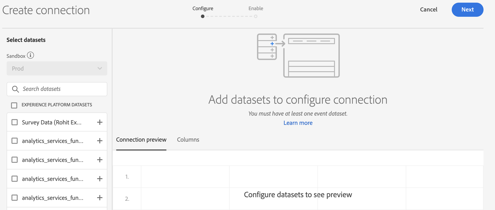

# Verbinding maken

Met een verbinding kunt u gegevenssets van [!DNL Adobe Experience Platform] integreren in [!UICONTROL Workspace]. Om over [!DNL Experience Platform] datasets te rapporteren, moet u eerst een verbinding tussen datasets in [!DNL Experience Platform] en [!UICONTROL Workspace] vestigen.

Klik [hier](https://experienceleague.adobe.com/docs/customer-journey-analytics-learn/tutorials/connecting-customer-journey-analytics-to-data-sources-in-platform.html?lang=en) voor een video-overzicht.

U hebt de volgende machtigingen nodig om een CJA-verbinding te maken:

Adobe Experience Platform:
* Gegevensmodellering: Schema&#39;s weergeven, schema&#39;s beheren
* Gegevensbeheer: Datasets weergeven, Gegevens beheren
* Gegevensinname: Bronnen beheren

Customer Journey Analytics
* Toegang tot productbeheerder

>[!IMPORTANT]
>
>U kunt veelvoudige [!DNL Experience Platform] datasets in één enkele verbinding combineren.

## Sandbox en datasets selecteren

1. Ga naar [https://analytics.adobe.com](https://analytics.adobe.com).

1. Klik op het tabblad **[!UICONTROL Connections]**.

1. Klik op **[!UICONTROL Create new connection]** rechtsboven.

   

1. Kies een sandbox in het Experience Platform die de gegevensset of gegevenssets bevat waarnaar u een verbinding wilt maken.

   Adobe Experience Platform biedt [sandboxen](https://docs.adobe.com/content/help/en/experience-platform/sandbox/home.html) die één Platform-instantie in afzonderlijke virtuele omgevingen verdelen om toepassingen voor digitale ervaring te ontwikkelen en te ontwikkelen. U kunt sandboxen beschouwen als &#39;gegevenssilo&#39;s&#39; die gegevenssets bevatten. Sandboxen worden gebruikt om de toegang tot gegevenssets te beheren.  Als u de sandbox hebt geselecteerd, geeft de linkerrail alle gegevenssets in die sandbox weer waaruit u kunt trekken.

   >[!IMPORTANT]
   >
   >U hebt geen toegang tot gegevens in verschillende sandboxen. U kunt dus alleen gegevenssets combineren die zich binnen dezelfde sandbox bevinden.

1. Selecteer een of meer gegevenssets waarin u [!UICONTROL Customer Journey Analytics] wilt plaatsen en klik op **[!UICONTROL Add]**.

   (Als u veel datasets hebt waaruit u kunt kiezen, kunt u naar de juiste zoeken met de zoekbalk **[!UICONTROL Search datasets]** boven de lijst met gegevenssets.)

## Gegevensset configureren

Aan de rechterkant kunt u nu de gegevensset(s) configureren die u hebt toegevoegd.

1. **[!UICONTROL Dataset type]**: Voor elke dataset die u aan deze verbinding toevoegde, plaatst  [!UICONTROL Customer Journey Analytics] automatisch het datasettype dat op de gegevens wordt gebaseerd die binnen komen.

   Er zijn 3 verschillende datasettypes: [!UICONTROL Event] gegevens, [!UICONTROL Profile] gegevens en [!UICONTROL Lookup] gegevens.

   | Type gegevensset | Beschrijving | Tijdstempel | Schema | Persoon-id |
   |---|---|---|---|---|
   | [!UICONTROL Event] | Gegevens die gebeurtenissen in de tijd vertegenwoordigen (bv. webbezoeken, interacties, transacties, POS-gegevens, enquêtegegevens, gegevens van de indruk enz.). Dit kunnen bijvoorbeeld standaard klikstreamgegevens zijn, met een klant-id of een cookie-id en een tijdstempel. Bij Gebeurtenisgegevens hebt u enige flexibiliteit met betrekking tot de id die wordt gebruikt als de Person-id. | Wordt automatisch ingesteld op het standaardtijdstempelveld van op gebeurtenissen gebaseerde schema&#39;s in [!UICONTROL Experience Platform]. | Om het even welk ingebouwd of douaneschema dat op een klasse XDM met het &quot;gedrag van de Reeks van de Tijd&quot;gebaseerd is. Voorbeelden zijn &quot;XDM Experience Event&quot; of &quot;XDM Decision Event&quot;. | U kunt kiezen welke persoon-id u wilt opnemen. Voor elk gegevenssetschema dat in het Experience Platform is gedefinieerd, kan een eigen set met een of meer identiteiten zijn gedefinieerd en gekoppeld aan een naamruimte Identiteit. Elk van deze kan worden gebruikt als de persoon-id. Voorbeelden zijn Cookie-id, Stitched ID, Gebruikersnaam, Trackingcode enzovoort. |
   | [!UICONTROL Lookup] | Deze gegevens worden gebruikt om waarden of toetsen in uw gebeurtenis- of profielgegevens op te zoeken. U kunt bijvoorbeeld opzoekgegevens uploaden waarmee numerieke id&#39;s in uw gebeurtenisgegevens worden toegewezen aan productnamen. Zie [dit gebruik case](/help/use-cases/b2b.md) voor een voorbeeld. | N.v.t. | Een ingebouwd of aangepast schema dat is gebaseerd op een XDM-klasse met het gedrag &quot;Opnemen&quot;, behalve de klasse &quot;Individueel profiel XDM&quot;. | N.v.t. |
   | [!UICONTROL Profile] | Gegevens die worden toegepast op uw bezoekers, gebruikers of klanten in de [!UICONTROL Event]-gegevens. Bijvoorbeeld, staat u toe om de gegevens van CRM over uw klanten te uploaden. | N.v.t. | Een ingebouwd of aangepast schema dat is gebaseerd op de klasse &quot;XDM Individual Profile&quot;. | U kunt kiezen welke persoon-id u wilt opnemen. Elke dataset die in [!DNL Experience Platform] wordt bepaald heeft zijn eigen reeks van één of meerdere Persoon IDs, zoals Cookie ID, Gestitched ID, Gebruiker - identiteitskaart, het Volgen Code, enz. wordt bepaald. **IDNote**: Als u een verbinding creeert die datasets met verschillende IDs omvat, zal het melden dat weerspiegelen. Om datasets echt samen te voegen, moet u zelfde Persoon identiteitskaart gebruiken. |

1. **[!UICONTROL Dataset ID]**: Deze id wordt automatisch gegenereerd.

1. **[!UICONTROL Time stamp]**: Alleen voor gebeurtenisgegevenssets wordt deze instelling automatisch ingesteld op het standaardtijdstempelveld van op gebeurtenissen gebaseerde schema&#39;s in  [!UICONTROL Experience Platform].

1. **[!UICONTROL Schema]**: Dit is het   schema waarop de dataset in Adobe Experience Platform werd gecreeerd.

1. **[!UICONTROL Person ID]**: Selecteer een persoon-id in de vervolgkeuzelijst met beschikbare identiteiten. Deze identiteiten werden bepaald in het datasetschema in het Experience Platform. Zie hieronder voor informatie over het gebruik van Identiteitskaart als Persoon identiteitskaart

   >[!IMPORTANT]
   >
   >Als er geen persoon-id&#39;s zijn waaruit u kunt kiezen, betekent dit dat een of meer persoon-id&#39;s niet zijn gedefinieerd in het schema. Bekijk [deze video](https://youtu.be/G_ttmGl_LRU) op hoe te om een identiteit in Experience Platform te bepalen.

1. Klik **[!UICONTROL Next]** om naar [!UICONTROL Enable Connection] dialoog te gaan.

### Identiteitskaart gebruiken als identiteitskaart van de Persoon

Customer Journey Analytics ondersteunt nu de mogelijkheid om de identiteitskaart te gebruiken voor de bijbehorende persoon-id. Identiteitskaart is een structuur van kaartgegevens die iemand toestaat om sleutel -> waardeparen te uploaden. De sleutels zijn identiteitsnaamruimten en de waarde is een structuur die de identiteitswaarde bevat. De identiteitskaart bestaat op elke rij/gebeurtenis die wordt geüpload en wordt voor elke rij overeenkomstig gevuld.

De Kaart van de Identiteit is beschikbaar voor om het even welke dataset die een schema gebruikt dat op [ExperienceEvent XDM](https://docs.adobe.com/content/help/en/experience-platform/xdm/home.html) klasse wordt gebaseerd. Wanneer u een dergelijke dataset selecteert die in een Verbinding CJA moet worden omvat, hebt u de optie om of een gebied als primaire identiteitskaart of de Kaart van de Identiteit te selecteren:

Als u Identiteitskaart selecteert, krijgt u twee extra configuratieopties:

| Optie | Beschrijving |
|---|---|
| [!UICONTROL Use Primary ID Namespace] | Dit instrueert CJA, per rij, om de identiteit in de Kaart van de Identiteit te vinden die met een primair=true attribuut duidelijk is en dat als Persoon identiteitskaart voor die rij te gebruiken. Dit betekent dat dit de primaire sleutel is die in Experience Platform voor het verdelen zal worden gebruikt. Het is ook de eerste kandidaat voor gebruik als bezoekersidentiteitskaart van CJA (afhankelijk van hoe de dataset in een Verbinding CJA wordt gevormd). |
| [!UICONTROL Namespace] | (Deze optie is alleen beschikbaar als u de primaire-id-naamruimte niet gebruikt.) Identiteitsnaamruimten zijn een onderdeel van [Adobe Experience Platform Identity Service](https://docs.adobe.com/content/help/en/experience-platform/identity/namespaces.html) dat dient als indicator van de context waarop een identiteit betrekking heeft. Als u een naamruimte opgeeft, zoekt CJA in elke rij naar Identiteitskaart voor deze naamruimtesleutel en gebruikt de identiteit onder die naamruimte als de persoon-id voor die rij. Merk op dat aangezien CJA geen volledige datasetaftasten van alle rijen kan doen om te bepalen welke namespaces eigenlijk aanwezig zijn, alle mogelijke namespaces zijn vermeld in dropdown. U moet weten welke naamruimten in de gegevens zijn opgegeven. dit kan niet automatisch worden gedetecteerd. |

### Kwalen met de rand van Identity Map

Deze lijst toont de twee configuratieopties wanneer de randgevallen aanwezig zijn en hoe zij worden behandeld:

| Optie | Er zijn geen id&#39;s aanwezig op de identiteitskaart | Geen id&#39;s zijn gemarkeerd als primair | Meerdere id&#39;s zijn gemarkeerd als primaire id | Eén id is gemarkeerd als primaire id | Ongeldige naamruimte met een id gemarkeerd als primair |
|---|---|---|---|---|---|
| **&quot;Primaire id-naamruimte gebruiken&quot; ingeschakeld** | De rij wordt neergezet door CJA. | De rij wordt neergezet door CJA, aangezien geen primaire identiteitskaart wordt gespecificeerd. | Alle id&#39;s die als primair zijn gemarkeerd, worden onder alle naamruimten geëxtraheerd naar een lijst. Vervolgens worden ze alfabetisch gesorteerd; met deze nieuwe sortering wordt de eerste naamruimte met de eerste id gebruikt als de Persoon-id. | De enige id die als primair is gemarkeerd, wordt gebruikt als de persoon-id. | Hoewel de naamruimte ongeldig kan zijn (niet aanwezig in AEP), gebruikt CJA de primaire id onder die naamruimte als de Person-id. |
| **Specifieke naamruimte Identiteitskaart geselecteerd** | De rij wordt neergezet door CJA. | Alle id&#39;s onder de geselecteerde naamruimte worden geëxtraheerd naar een lijst en de eerste id wordt gebruikt als de Person-id. | Alle id&#39;s onder de geselecteerde naamruimte worden geëxtraheerd naar een lijst en de eerste id wordt gebruikt als de Person-id. | Alle id&#39;s onder de geselecteerde naamruimte worden geëxtraheerd naar een lijst en de eerste id wordt gebruikt als de Person-id. | Alle id&#39;s onder de geselecteerde naamruimte worden geëxtraheerd naar een lijst en de eerste id wordt gebruikt als de Person-id. (Alleen een geldige naamruimte kan tijdens het maken van de verbinding worden geselecteerd, zodat een ongeldige naamruimte/id niet kan worden gebruikt als Person-id.) |

## Verbinding inschakelen

1. Om een verbinding toe te laten, bepaal deze montages voor de volledige verbinding, d.w.z. alle datasets in de verbinding:

   | Optie | Beschrijving |
   | --- | --- |
   | [!UICONTROL Name Connection] | Geef de verbinding een beschrijvende naam. De verbinding kan niet zonder een naam worden opgeslagen. |
   | [!UICONTROL Description] | Voeg meer details toe om deze verbinding van anderen te onderscheiden. |
   | [!UICONTROL Datasets] | De datasets die in deze verbinding inbegrepen zijn. |
   | [!UICONTROL Automatically import all new datasets in this connection, beginning today.] | Selecteer deze optie als u een aan de gang zijnde verbinding wilt vestigen, zodat om het even welke nieuwe gegevensbatches die aan de datasets in deze verbinding worden toegevoegd automatisch in [!UICONTROL Workspace] stromen. |
   | [!UICONTROL Import all existing data] | Wanneer u deze optie selecteert en de verbinding opslaat, worden alle bestaande (historische) gegevens van [!DNL Experience Platform] voor alle datasets in deze verbinding geïmporteerd of teruggevuld. In de toekomst worden alle bestaande historische gegevens voor nieuwe gegevenssets die aan deze opgeslagen verbinding zijn toegevoegd, ook automatisch geïmporteerd. Zie ook [Back-up maken van historische gegevens](https://docs.adobe.com/content/help/en/analytics-platform/using/cja-connections/create-connection.html#backfill-historical-data) hieronder. **Als deze verbinding eenmaal is opgeslagen, kan deze instelling niet worden gewijzigd.** |
   | [!UICONTROL Average number of daily events] | U moet het gemiddelde aantal dagelijkse gebeurtenissen specificeren die (nieuwe gegevens **en** backfill gegevens) voor alle datasets in de verbinding moeten worden ingevoerd. Selecteer een optie in het keuzemenu. Dit is zodat Adobe voldoende ruimte kan toewijzen aan deze gegevens. Als u niet het gemiddelde aantal dagelijkse gebeurtenissen kent uw bedrijf gaat invoeren, kunt u een eenvoudige SQL vraag in de Diensten van de Vraag van  [Adobe Experience Platform ](https://docs.adobe.com/content/help/en/experience-platform/query/home.html) om het te weten komen. Zie &quot;Het gemiddelde aantal dagelijkse gebeurtenissen berekenen&quot; hieronder. |

1. Klik op **[!UICONTROL Save and create data view]**. Zie [Een gegevensweergave maken](/help/data-views/create-dataview.md) voor documentatie.

### Back-up maken van historische gegevens

**[!UICONTROL Import all existing data]** Hiermee kunt u historische gegevens terugvullen. Houd dit in gedachten:

* We hebben de beperking voor backfill (historische gegevensimport) verwijderd. Eerder, kon u een maximum van 2.5 miljard rijen op uw en anders vereiste technische betrokkenheid terugvullen. U kunt nu zonder beperkingen back-ups maken van gegevens.
* Wij geven prioriteit aan nieuwe gegevens die aan een dataset in de verbinding worden toegevoegd, zodat hebben deze nieuwe gegevens de laagste latentie.
* Alle backfill (historische) gegevens worden langzamer geïmporteerd. De latentie wordt beïnvloed door hoeveel historische gegevens u hebt, gecombineerd met **[!UICONTROL Average number of daily events]** het plaatsen u selecteerde. Als u bijvoorbeeld meer dan een miljard rijen gegevens per dag hebt, plus drie jaar historische gegevens, kan het meerdere weken duren om deze te importeren. Anderzijds, als u minder dan een miljoen rijen per dag en een week van historische gegevens hebt, zou dat minder dan een uur vergen.
* De steun is op de volledige verbinding, niet op elke dataset individueel van toepassing.
* Met [Adobe Analytics Source Connector](https://docs.adobe.com/content/help/en/platform-learn/tutorials/data-ingestion/ingest-data-from-adobe-analytics.html) importeert u maximaal 13 maanden gegevens, ongeacht de grootte.

### Het gemiddelde aantal dagelijkse gebeurtenissen berekenen

Deze berekening moet voor elke dataset in de verbinding worden uitgevoerd.

1. Ga naar [Adobe Experience Platform Query Services](https://docs.adobe.com/content/help/en/experience-platform/query/home.html) en maak een nieuwe query.

1. De query zou er als volgt uitzien: `Select AVG(A.total_events) from (Select DISTINCT COUNT (*) as total_events, date(TIMESTAMP) from analytics_demo_data GROUP BY 2 Having total_events>0) A;`

* In dit voorbeeld is &quot;analytics_demo_data&quot; de naam van de dataset.
* Voer `Show Tables` vraag uit om alle datasets te tonen die in AEP bestaan.
