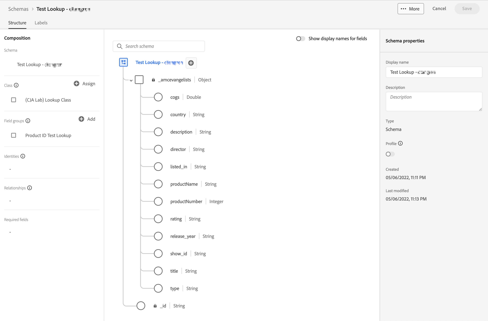

# Verbinding maken

Onlangs is in Customer Journey Analytics (CJA) een nieuwe workflow voor verbindingen gestart. De nieuwe ervaring van de verbindingsverwezenlijking en geeft werkschemaervaring uit brengt alle dataset en montages van de verbindingsconfiguratie aan het centrum van het scherm met hulpwerkschema.  Wij verstrekten gedetailleerde datasetselectie, configuratie, en overzichtservaring met kritieke informatie zoals datasettype, grootte, schema, dataset identiteitskaart, partijstatus, backfill status, Person IDs, en veel meer om het risico van verkeerde verbindingsconfiguratie te verminderen. Hier volgt een overzicht van de nieuwe mogelijkheden:

* U kunt het rollen venster van het gegevensbehoud toelaten wanneer u de verbinding creeert.
* U kunt datasets toevoegen aan en verwijderen uit een verbinding. (Als u een gegevensset verwijdert, wordt deze uit de verbinding verwijderd en worden de bijbehorende gegevensweergaven en onderliggende Analysis Workspace-projecten beïnvloed.)
* U kunt terugvullingsgegevens per dataset toelaten en verzoeken.
* U kunt datasets uitgeven, bijvoorbeeld om een andere backfill te verzoeken.
* U kunt bestaande gegevens per dataset importeren.

>[!VIDEO](https://video.tv.adobe.com/v/343044/?quality=12&learn=on)

## Verbinding maken en configureren {#create-connection}

1. Klik in CJA op de knop **[!UICONTROL Connections]** tab.
1. Klik op **[!UICONTROL Create new connection]**.

   

1. Configureer de verbindingsinstellingen.

   | Instelling | Beschrijving |
   | --- | --- |
   | **[!UICONTROL Connection name]** | Voer een unieke naam in voor de verbinding. |
   | **[!UICONTROL Connection description]** | Beschrijf het doel van deze verbinding. |
   | **[!UICONTROL Sandbox]** | Kies een sandbox in het Experience Platform die de gegevensset of gegevenssets bevat waarnaar u een verbinding wilt maken.<p>Adobe Experience Platform biedt [sandboxen](https://experienceleague.adobe.com/docs/experience-platform/sandbox/home.html?lang=en) die één enkele instantie van het Platform in afzonderlijke virtuele milieu&#39;s verdelen helpen digitale ervaringstoepassingen ontwikkelen en ontwikkelen. U kunt sandboxen beschouwen als &#39;gegevenssilo&#39;s&#39; die gegevenssets bevatten. Sandboxen worden gebruikt om de toegang tot gegevenssets te beheren.<p>Als u de sandbox hebt geselecteerd, geeft de linkerrail alle gegevenssets in die sandbox weer waaruit u kunt trekken. |
   | **[!UICONTROL Enable rolling data window]** | Als u dit selectievakje inschakelt, kunt u CJA-gegevensbewaring definiëren als een schuifvenster in maanden (1 maand, 3 maanden, 6 maanden, enzovoort) op verbindingsniveau.<p>Het bewaren van gegevens is gebaseerd op de tijdstempels van de gebeurtenisdataset en is slechts op gebeurtenisdatasets van toepassing. Er bestaat geen instelling voor het schuivende gegevensvenster voor profiel- of opzoekgegevenssets, omdat er geen relevante tijdstempels zijn. Nochtans, als uw verbinding om het even welk profiel of raadplegingsdatasets (naast één of meerdere gebeurtenisdatasets) omvat, zullen die gegevens voor de zelfde tijdspanne worden behouden.<p> Het belangrijkste voordeel is dat u alleen gegevens opslaat of rapporteert die van toepassing zijn en nuttig zijn, en oudere gegevens verwijdert die niet meer nuttig zijn. Het helpt u onder uw contractgrenzen te blijven en vermindert het risico van overleeftijdskosten.<p>Als u de standaardinstelling (uitgeschakeld) verlaat, wordt de bewaarperiode vervangen door de bewaarinstelling voor Adobe Experience Platform-gegevens. Als je 25 maanden aan gegevens in Experience Platform hebt, zal CJA 25 maanden aan gegevens door backfill krijgen. Als u 10 van die maanden in Platform schrapte, zou CJA de resterende 15 maanden behouden. |
   | **[!UICONTROL Add datasets]** (zie hieronder) | Voeg datasets toe als geen datasets in uw datasetlijst verschijnen. |
   | **[!UICONTROL Dataset name]** | Selecteer één of meerdere dataset(s) u in Customer Journey Analytics wilt trekken en klik **[!UICONTROL Add]**.<p>(Als u veel datasets hebt waaruit u kunt kiezen, kunt u naar juiste zoeken met behulp van de zoekbalk met zoekgegevens boven de lijst met gegevenssets.) |
   | **[!UICONTROL Last updated]** | Alleen voor gebeurtenisgegevenssets wordt deze instelling automatisch ingesteld op het standaardtijdstempelveld van op gebeurtenissen gebaseerde schema&#39;s in Experience Platform. &quot;N.v.t.&quot; betekent dat deze gegevensset geen gegevens bevat. |
   | **[!UICONTROL Schema]** | Dit is het [schema](https://experienceleague.adobe.com/docs/experience-platform/xdm/schema/composition.html?lang=en) op basis waarvan de gegevensset in Adobe Experience Platform is gemaakt. |
   | **[!UICONTROL Dataset type]** | Voor elke dataset die u aan deze verbinding toevoegde, plaatst Customer Journey Analytics automatisch het datasettype dat op de gegevens wordt gebaseerd die binnen komen. Er zijn 3 verschillende datasettypes: Gebeurtenisgegevens, profielgegevens en opzoekgegevens. Zie de tabel hieronder voor een uitleg van de typen gegevenssets. |
   | **[!UICONTROL Person ID]** | Selecteer een persoon-id in de vervolgkeuzelijst met beschikbare identiteiten. Deze identiteiten werden bepaald in het datasetschema in het Experience Platform. Zie hieronder voor informatie over het gebruik van Identiteitskaart als Persoon identiteitskaart<p>BELANGRIJK: Als er geen persoon-id&#39;s zijn waaruit u kunt kiezen, betekent dit dat een of meer persoon-id&#39;s niet zijn gedefinieerd in het schema. Weergave [deze video](https://www.youtube.com/watch?v=G_ttmGl_LRU) over het definiëren van een identiteit in Experience Platform. |
   | **[!UICONTROL Key]** | Alleen voor opzoekgegevenssets (zoals _id). |
   | **[!UICONTROL Matching Key]** | Alleen voor opzoekgegevenssets (zoals _id). |
   | **[!UICONTROL Import new data]** | Instellen op Aan of Uit. |
   | **[!UICONTROL Backfill data]** | U kunt verzoeken de gegevens in een dataset terug te vullen die op gebeurtenistimestamps wordt gebaseerd. Bijvoorbeeld, kunt u verzoeken om de laatste 7 dagen van gegevens terug te vullen, juiste identiteitskaart van de Persoon te vormen en uw verbinding voor correcte configuratie te testen. Als alles er goed uitziet, kunt u eenvoudig back-ups maken van alle resterende gegevens.<p>Bovendien kunt u de invoer van nieuwe gegevens door dataset toelaten. U kunt bijvoorbeeld het importeren van nieuwe gegevens alleen inschakelen voor opzoekgegevens. |
   | **[!UICONTROL Backfill status]** | Geeft aan of er backfill-gegevens worden verwerkt. |

   {style="table-layout:auto"}

## Gegevenssets toevoegen en configureren {#add-dataset}

Met de nieuwe workflow kunt u een gegevensset voor Experience Platforms toevoegen wanneer u een verbinding maakt.

1. Klik in het dialoogvenster Verbindingsinstellingen op **[!UICONTROL Add datasets]**.
1. Selecteer een of meer gegevenssets en klik op **[!UICONTROL Next]**.

   Merk op dat minstens één gebeurtenisdataset deel van de verbinding moet uitmaken.
1. Vorm nu de datasets één voor één.

   

   | Instelling | Beschrijving |
   | --- | --- |
   | **[!UICONTROL Person ID]** | Selecteer een persoon-id in de vervolgkeuzelijst met beschikbare identiteiten. Deze identiteiten werden bepaald in het datasetschema in het Experience Platform. Zie hieronder voor informatie over het gebruik van Identiteitskaart als Persoon identiteitskaart<p>Als er geen persoon-id&#39;s zijn waaruit u kunt kiezen, betekent dit dat een of meer persoon-id&#39;s niet zijn gedefinieerd in het schema. Bekijk deze video over het definiëren van een identiteit in een Experience Platform. |
   | **[!UICONTROL Timestamp]** | Alleen voor gebeurtenisgegevenssets wordt deze instelling automatisch ingesteld op het standaardtijdstempelveld van op gebeurtenissen gebaseerde schema&#39;s in Experience Platform. |
   | **[!UICONTROL Data source type]** | De volgende gegevensbronnen kunnen worden gebruikt: [!UICONTROL Web data], [!UICONTROL Mobile App data], [!UICONTROL POS data], [!UICONTROL CRM data], [!UICONTROL Survey data], [!UICONTROL Call Center data], [!UICONTROL Product data], [!UICONTROL Accounts data], [!UICONTROL Transaction data], [!UICONTROL Customer Feedback data], en [!UICONTROL Other]. |
   | **[!UICONTROL Import new data]** | Selecteer deze optie als u een aan de gang zijnde verbinding wilt vestigen, zodat om het even welke nieuwe gegevensbatches die aan de datasets in deze verbinding worden toegevoegd automatisch in Werkruimte stromen. Kan worden ingesteld op [!UICONTROL On] of [!UICONTROL Off]. |
   | **[!UICONTROL Dataset backfill]** | Klikken **[!UICONTROL Request backfill]** om historische gegevens te herstellen.<ul><li>U kunt elke dataset afzonderlijk terugvullen.</li><li>Wij geven prioriteit aan nieuwe gegevens die aan een dataset in de verbinding worden toegevoegd, zodat hebben deze nieuwe gegevens de laagste latentie.</li><li>Alle backfill (historische) gegevens worden langzamer geïmporteerd. De latentie wordt beïnvloed door hoeveel historische gegevens u hebt.</li><li>De Adobe Analytics Source Connector importeert tot 13 maanden aan gegevens, ongeacht de grootte.</li></ul> |
   | **[!UICONTROL Backfill status]** | Mogelijke statusindicatoren zijn:<ul><li>Succes</li><li>X backfill(s) verwerken</li><li>Uit</li></ul> |
   | **[!UICONTROL Dataset ID]** | Deze id wordt automatisch gegenereerd. |
   | **[!UICONTROL Description]** | De beschrijving die aan deze dataset werd gegeven toen het werd gecreeerd. |
   | **[!UICONTROL Dataset size]** | De grootte van de gegevensset. |
   | **[!UICONTROL Schema]** | Dit is het schema waarop de dataset in Adobe Experience Platform werd gecreeerd. |
   | **[!UICONTROL Dataset]** | De naam van de gegevensset. |
   | **[!UICONTROL Preview]**: `<dataset name>` | Hiermee geeft u een voorvertoning weer van de gegevensset met datum, mijn id- en id-kolommen. |
   | **[!UICONTROL Remove]** | U kunt de dataset schrappen of verwijderen en identiteitskaart van de Persoon veranderen zonder de volledige verbinding te schrappen. Dit vermindert de kosten verbonden aan gegevensopname en het lastige proces om de volledige verbinding en bijbehorende gegevensmeningen opnieuw te creëren. |

   {style="table-layout:auto"}

## Verbindingsvoorbeeld {#preview}

Klik op **[!UICONTROL Connection preview]** in het dialoogvenster Verbindingsinstellingen.


Deze voorvertoning bevat een aantal kolommen waarin de verbindingsconfiguratie wordt vermeld. Welke kolomtypes worden getoond hangt van uw individuele datasets af.

## Gegevenstypen {#dataset-types}

Voor elke dataset die u aan deze verbinding toevoegde, [!UICONTROL Customer Journey Analytics] plaatst automatisch het datasettype dat op de gegevens wordt gebaseerd die binnen komen.

>[!IMPORTANT]
>
>U moet minstens één gebeurtenisdataset als deel van een verbinding toevoegen.

Er zijn 3 verschillende datasettypes: [!UICONTROL Event] gegevens, [!UICONTROL Profile] gegevens, en [!UICONTROL Lookup] gegevens.

| Type gegevensset | Beschrijving | Tijdstempel | Schema | Persoon-id |
|---|---|---|---|---|
| **[!UICONTROL Event]** | Gegevens die gebeurtenissen in de tijd vertegenwoordigen (bv. webbezoeken, interacties, transacties, POS-gegevens, enquêtegegevens, gegevens van de indruk enz.). Dit kunnen bijvoorbeeld standaard klikstreamgegevens zijn, met een klant-id of een cookie-id en een tijdstempel. Bij Gebeurtenisgegevens hebt u enige flexibiliteit met betrekking tot de id die wordt gebruikt als de Person-id. | Wordt automatisch ingesteld op het standaardtijdstempelveld vanuit op gebeurtenissen gebaseerde schema&#39;s in [!UICONTROL Experience Platform]. | Om het even welk ingebouwd of douaneschema dat op een klasse XDM met het &quot;gedrag van de Reeks van de Tijd&quot;gebaseerd is. Voorbeelden zijn &quot;XDM Experience Event&quot; of &quot;XDM Decision Event&quot;. | U kunt kiezen welke persoon-id u wilt opnemen. Voor elk gegevenssetschema dat in het Experience Platform is gedefinieerd, kan een eigen set met een of meer identiteiten zijn gedefinieerd en gekoppeld aan een naamruimte Identiteit. Elk van deze kan worden gebruikt als de persoon-id. Voorbeelden zijn Cookie-id, Stitched ID, Gebruikersnaam, Trackingcode enzovoort. |
| **[!UICONTROL Lookup]** | Deze gegevens worden gebruikt om waarden of toetsen in uw gebeurtenis- of profielgegevens op te zoeken. U kunt bijvoorbeeld opzoekgegevens uploaden waarmee numerieke id&#39;s in uw gebeurtenisgegevens worden toegewezen aan productnamen. Zie [dit geval gebruiken](/help/use-cases/b2b/b2b.md) bijvoorbeeld. | N.v.t. | Een ingebouwd of aangepast schema dat is gebaseerd op een XDM-klasse met het gedrag &quot;Opnemen&quot;, behalve de klasse &quot;Individueel profiel XDM&quot;. | N.v.t. |
| **[!UICONTROL Profile]** | Gegevens die worden toegepast op uw bezoekers, gebruikers of klanten in de [!UICONTROL Event] gegevens. Bijvoorbeeld, staat u toe om de gegevens van CRM over uw klanten te uploaden. | N.v.t. | Een ingebouwd of aangepast schema dat is gebaseerd op de klasse &quot;XDM Individual Profile&quot;. | U kunt kiezen welke persoon-id u wilt opnemen. Elke gegevensset die in de [!DNL Experience Platform] heeft een eigen set van een of meer personen-id&#39;s gedefinieerd, zoals Cookie-id, Stitched ID, Gebruikersnaam, Trackingcode, enzovoort.<br>**Opmerking**: Als u een verbinding creeert die datasets met verschillende IDs omvat, zal het melden dat weerspiegelen. Om datasets echt samen te voegen, moet u zelfde Persoon identiteitskaart gebruiken. |

{style="table-layout:auto"}

## Numerieke velden gebruiken als opzoektoetsen en opzoekwaarden {#numeric}

Deze functionaliteit is nuttig als u een numeriek veld zoals een kostprijs of marge wilt toevoegen aan een sleutelveld op basis van een tekenreeks. Hiermee kunnen numerieke waarden als sleutels of als waarden in zoekopdrachten worden opgenomen. In uw raadplegingsschema, zou u numerieke waarden kunnen hebben verbonden aan, bijvoorbeeld, uw productnamen, COGS, de kosten van de campagne marketing, of marges. Hier volgt een voorbeeld van een opzoekschema in Adobe Experience Platform:



Wij steunen nu het opnemen van deze waarden als metriek of dimensies in CJA rapportering. Wanneer u opstelling uw verbinding en trekkracht in raadplegingsdatasets, kunt u de datasets uitgeven om te selecteren [!UICONTROL Key] en [!UICONTROL Matching Key]:


Wanneer u een gegevensweergave instelt op basis van deze verbinding, voegt u de numerieke waarden als componenten toe aan de gegevensweergave. Elk project dat is gebaseerd op deze gegevensweergave, kan vervolgens over deze numerieke waarden rapporteren.

## Identiteitskaart gebruiken als identiteitskaart van de Persoon {#id-map}

Customer Journey Analytics steunt de capaciteit om de Kaart van de Identiteit voor zijn identiteitskaart van de Persoon te gebruiken. Identiteitskaart is een structuur van kaartgegevens die u toestaat om sleutel -> waardeparen te uploaden. De sleutels zijn identiteitsnaamruimten en de waarde is een structuur die de identiteitswaarde bevat. De identiteitskaart bestaat op elke rij/gebeurtenis die wordt geüpload en wordt voor elke rij overeenkomstig gevuld.

De Kaart van de Identiteit is beschikbaar voor om het even welke dataset die een schema gebruikt dat op [ExperienceEvent XDM](https://experienceleague.adobe.com/docs/experience-platform/xdm/home.html?lang=nl) klasse. Wanneer u een dergelijke dataset selecteert die in een Verbinding CJA moet worden omvat, hebt u de optie om of een gebied als primaire identiteitskaart of de Kaart van de Identiteit te selecteren:


Als u Identiteitskaart selecteert, krijgt u twee extra configuratieopties:

| Optie | Beschrijving |
|---|---|
| **[!UICONTROL Use Primary ID Namespace]** | Dit instrueert CJA, per rij, om de identiteit in de Kaart van de Identiteit te vinden die met een primair=true attribuut duidelijk is en dat als Persoon identiteitskaart voor die rij te gebruiken. Dit betekent dat dit de primaire sleutel is die in Experience Platform voor het verdelen zal worden gebruikt. Het is ook de eerste kandidaat voor gebruik als bezoekersidentiteitskaart van CJA (afhankelijk van hoe de dataset in een Verbinding CJA wordt gevormd). |
| **[!UICONTROL Namespace]** | (Deze optie is alleen beschikbaar als u de primaire-id-naamruimte niet gebruikt.) Identiteitsnaamruimten zijn een component van [Adobe Experience Platform Identity Service](https://experienceleague.adobe.com/docs/experience-platform/identity/namespaces.html) die dienen als indicatoren van de context waarop een identiteit betrekking heeft. Als u een naamruimte opgeeft, zoekt CJA in elke rij naar Identiteitskaart voor deze naamruimtesleutel en gebruikt de identiteit onder die naamruimte als de persoon-id voor die rij. Merk op dat aangezien CJA geen volledige datasetaftasten van alle rijen kan doen om te bepalen welke namespaces eigenlijk aanwezig zijn, alle mogelijke namespaces zijn vermeld in dropdown. U moet weten welke naamruimten in de gegevens zijn opgegeven. dit kan niet automatisch worden gedetecteerd. |

{style="table-layout:auto"}

### Kwalen met de rand van Identity Map {#id-map-edge}

Deze lijst toont de twee configuratieopties wanneer de randgevallen aanwezig zijn en hoe zij worden behandeld:

| Optie | Er zijn geen id&#39;s aanwezig op de identiteitskaart | Meerdere id&#39;s, geen gemarkeerd als primair | Meerdere id&#39;s zijn gemarkeerd als primaire id | Eén id, al dan niet gemarkeerd als primair | Ongeldige naamruimte met een id gemarkeerd als primair |
|---|---|---|---|---|---|
| **[!UICONTROL Use Primary ID Namespace]ingeschakeld** | De rij wordt neergezet door CJA. | De rij wordt neergezet door CJA, aangezien geen primaire identiteitskaart wordt gespecificeerd. | Alle id&#39;s die als primair zijn gemarkeerd, worden onder alle naamruimten geëxtraheerd naar een lijst. Vervolgens worden ze alfabetisch gesorteerd; met deze nieuwe sortering wordt de eerste naamruimte met de eerste id gebruikt als de Persoon-id. | Eén id wordt gebruikt als de persoon-id. | Hoewel de naamruimte ongeldig kan zijn (niet aanwezig in AEP), gebruikt CJA de primaire id onder die naamruimte als de Person-id. |
| **[!UICONTROL Specific Identity Map namespace]geselecteerd** | De rij wordt neergezet door CJA. | Alle id&#39;s onder de geselecteerde naamruimte worden geëxtraheerd naar een lijst en de eerste id wordt gebruikt als de Person-id. | Alle id&#39;s onder de geselecteerde naamruimte worden geëxtraheerd naar een lijst en de eerste id wordt gebruikt als de Person-id. | Alle id&#39;s onder de geselecteerde naamruimte worden geëxtraheerd naar een lijst en de eerste id wordt gebruikt als de Person-id. | Alle id&#39;s onder de geselecteerde naamruimte worden geëxtraheerd naar een lijst en de eerste id wordt gebruikt als de Person-id. (Alleen een geldige naamruimte kan tijdens het maken van de verbinding worden geselecteerd, zodat een ongeldige naamruimte/id niet kan worden gebruikt als Person-id.) |

{style="table-layout:auto"}

## Het gemiddelde aantal dagelijkse gebeurtenissen berekenen

Deze berekening moet voor elke dataset in de verbinding worden uitgevoerd.

1. Ga naar [Adobe Experience Platform Query Services](https://experienceleague.adobe.com/docs/experience-platform/query/home.html?lang=nl) en maak een nieuwe query.

   De query ziet er als volgt uit:

   ```
   Select AVG(A.total_events) from (Select DISTINCT COUNT (*) as total_events, date(TIMESTAMP) from analytics_demo_data GROUP BY 2 Having total_events>0) A;
   ```

   In dit voorbeeld is &quot;analytics_demo_data&quot; de naam van de dataset.

1. Voer het `Show Tables` vraag om alle datasets te tonen die in AEP bestaan.
