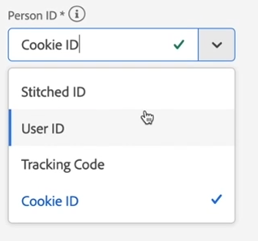

# Verbinding maken

Met een verbinding kunt u gegevenssets van het Adobe Experience Platform integreren in Workspace. Om over de datasets van het Platform te rapporteren, moet u eerst een verbinding tussen datasets in Platform en Werkruimte vestigen.

Klik [hier](https://docs.adobe.com/content/help/en/platform-learn/tutorials/cja/connecting-customer-journey-analytics-to-data-sources-in-platform.html) voor een video-overzicht.

>[!IMPORTANT] U kunt veelvoudige datasets van het Platform in één enkele verbinding combineren.

1. Ga naar [https://analytics.adobe.com](https://analytics.adobe.com).

1. Klik op het **[!UICONTROL Connections]** tabblad.

1. Klik **[!UICONTROL Create new connection]** op de rechterbovenhoek.

1. De linkerspoorstaaf toont alle datasets in Platform die u van kunt trekken. Selecteer één of meerdere dataset(s) u in de Analyse van de Reis van de Klant wilt trekken en klikken **[!UICONTROL Add]**. (Als u veel datasets hebt waaruit u kunt kiezen, kunt u naar de juiste zoeken met de zoekbalk boven de lijst met gegevenssets.)

1. Daarna, voor elke dataset die u aan deze verbinding toevoegde, plaatst de Analyse van de Reis van de Klant automatisch het datasettype dat op de gegevens wordt gebaseerd die binnen komen. Er zijn 3 verschillende datasettypes: Gebeurtenisgegevens, profielgegevens en opzoekgegevens.

   | Type gegevensset | Beschrijving | Tijdstempel | Schema | Persoon-id |
   |---|---|---|---|---|
   | Gebeurtenis | Gegevens die gebeurtenissen in de tijd vertegenwoordigen (bv. webbezoeken, interacties, transacties, POS-gegevens, enquêtegegevens, gegevens van de indruk enz.). Dit zijn typisch klikstroomgegevens, met een klant identiteitskaart of een koekjesidentiteitskaart, en een timestamp. Met gebeurtenisgegevens kunt u de gewenste id gebruiken. | Wordt ingesteld op Tijdstempel. | Het schema van het Platform dat dit datasettype is gebaseerd op. | N.v.t. |
   | Opzoeken | Dit is gelijk aan een bestand met classificaties. Deze gegevens worden gebruikt voor het opzoeken van waarden of toetsen in de gebeurtenis- of profielgegevens. U kunt bijvoorbeeld opzoekgegevens uploaden waarmee numerieke id&#39;s in uw gebeurtenisgegevens worden toegewezen aan productnamen. | N.v.t. | Het schema van het Platform dat dit datasettype is gebaseerd op. | N.v.t. |
   | Profiel | Analoog aan Kenmerken van de Klant - voor niet-veranderende en niet-temporale attributen. Gegevens die worden toegepast op uw bezoekers, gebruikers of klanten in de gebeurtenisgegevens. Bijvoorbeeld, staat u toe om de gegevens van CRM over uw klanten te uploaden. | N.v.t. | Het schema van het Platform dat dit datasettype is gebaseerd op. | U kunt kiezen welke persoon-id u wilt opnemen. Voor elke gegevensset die in het Adobe Experience Platform is gedefinieerd, is een eigen set met een of meer personen-id&#39;s gedefinieerd, zoals Cookie-id, Stitched ID, Gebruikersnaam, Trackingcode, enzovoort. **IDNote **: Als u een verbinding creeert die datasets met verschillende IDs omvat, zal het melden dat weerspiegelen. Om datasets echt samen te voegen, moet u zelfde identiteitskaart van de Persoon gebruiken. |

1. Klik op **[!UICONTROL Next]**.

1. Definieer de volgende instellingen in het dialoogvenster Verbinding maken:

   | Veld | Beschrijving |
   |---|---|
   | Naam | Geef de verbinding een beschrijvende naam. De verbinding kan niet zonder een naam worden opgeslagen. |
   | Beschrijving | Voeg meer details toe om deze verbinding van anderen te onderscheiden. |
   | Grootte | De collectieve grootte van de datasets in de gegevensverbinding. |
   | Gegevenssets | De datasets die in deze verbinding inbegrepen zijn. |
   | Gegevensstreaming | Schakel gegevensstreaming in om te beginnen met het streamen van gegevens voor deze verbinding. Wanneer gegevensstreaming is ingeschakeld voor deze verbinding, wordt voor uw account de hoeveelheid gegevens in rekening gebracht die door deze verbinding wordt gestreamd. (U kunt gegevensstreaming ook inschakelen in Connections Manager.) |

1. Klik op **[!UICONTROL Save]**. Wanneer u deze verbinding opslaat, gebeuren er twee dingen:

   * U trekt in alle historische gegevens van Platform voor alle datasets die in deze verbinding zijn.
   * Als u het stromen toeliet, vestigt u een aan de gang zijnde verbinding, zodat om het even welke nieuwe gegevens die aan de datasets in deze verbinding worden toegevoegd automatisch in Werkruimte stromen.

De volgende stap in de workflow is het [maken van een gegevensweergave](/help/data-views/create-dataview.md).
