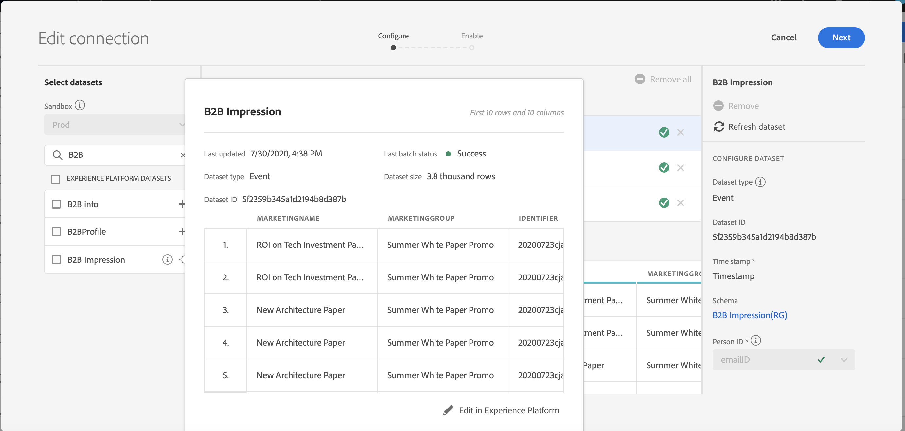

# De verbindingsgrootte schatten

Mogelijk moet u weten hoeveel rijen gegevens u momenteel hebt in [!UICONTROL Customer Journey Analytics]. Het doel van dit onderwerp is u te tonen hoe te om over uw huidige gebruik van [!UICONTROL Customer Journey Analytics] te rapporteren.

1. Klik in [!UICONTROL Customer Journey Analytics] op het tabblad **[!UICONTROL Connections]**.
1. Selecteer in het scherm [!UICONTROL Edit connection] een verbinding waarvoor u de grootte van het gebruik/de verbinding wilt bepalen.

   

1. Selecteer een dataset die uw deel van de verbinding van de linkerspoorstaaf is. In dit geval is het de dataset &quot;B2B Impression&quot;.

   

1. Klik op het blauwe pictogram (i) (info) naast de naam ervan. U zult merken dat de dataset 3.8k rijen/gebeurtenissen heeft. Voor het exacte aantal rijen klikt u bovendien op **[!UICONTROL Edit in Experience Platform]** onder de voorbeeldtabel. Dit zal u aan de datasets in [!UICONTROL Adobe Experience Platform] opnieuw richten.

   

1. Merk op **[!UICONTROL Total records]** voor deze dataset hoeveelheid aan 3.83k verslagen, met de grootte van de gegevens 388.59 KB is.

1. Herhaal stap 1-5 voor andere datasets in uw verbinding en voeg omhoog het aantal verslagen/rijen toe. Het uiteindelijke geaggregeerde getal is de gebruikstemetrische waarde van de verbinding. Dit is het aantal rijen van de datasets van uw verbinding die u van [!UICONTROL Adobe Experience Platform] gaat opnemen.

## Aantal toegevoegde rijen bepalen

Het aantal gebeurtenissen dat daadwerkelijk in [!UICONTROL Customer Journey Analytics] wordt opgenomen hangt van uw montages van de verbindingsconfiguratie af. Bovendien als u verkeerde identiteitskaart van de Persoon selecteerde of als dit identiteitskaart niet beschikbaar voor sommige rijen in de datasets is, dan [!UICONTROL Customer Journey Analytics] zal die rijen negeren. Voer de volgende stappen uit om de werkelijke rijen met opgenomen gebeurtenissen te bepalen:

1. Wanneer u de verbinding hebt opgeslagen, maakt u een gegevensweergave van dezelfde verbinding zonder filters.
1. Creeer een project van de Werkruimte en selecteer de correcte gegevensmening. Creeer een vrije vormlijst en sleep en laat vallen **[!UICONTROL Events]** metrisch met een **[!UICONTROL Year]** afmeting. Kies een groot voldoende datumbereik in de kalender voor datumselectie om alle gegevens in de verbinding in te kapselen. Dit staat u toe om het aantal gebeurtenissen te zien die in [!UICONTROL Customer Journey Analytics] worden opgenomen.

   

   >[!NOTE]
   >
   >Dit laat u het aantal gebeurtenissen zien die van uw gebeurtenisdataset worden opgenomen. Het omvat profiel en raadplegingstype geen datasets. Voer stap 1-3 onder &quot;De verbindingsgrootte schatten&quot; voor profiel- en opzoekgegevenssets uit en voeg de nummers toe om het totale aantal rijen voor deze verbinding op te halen.

## Diagnose discrepanties

In sommige gevallen, kunt u opmerken dat het totale aantal gebeurtenissen die door uw verbinding worden opgenomen verschillend is dan het aantal rijen in de dataset in [!UICONTROL Adobe Experience Platform]. In dit voorbeeld heeft de dataset &quot;B2B Impression&quot; 7650 rijen, maar de dataset bevat 3830 rijen in [!UICONTROL Adobe Experience Platform]. Er zijn verschillende redenen waarom er verschillen kunnen optreden en de volgende stappen kunnen worden uitgevoerd om een diagnose te stellen:

1. Verdeel deze afmeting door **[!UICONTROL Platform Dataset ID]** en u zult twee datasets met de zelfde grootte maar verschillend **[!UICONTROL Platform Dataset IDs]** opmerken. Elke dataset heeft 3825 verslagen. Dat betekent dat [!UICONTROL Customer Journey Analytics] 5 records heeft genegeerd vanwege ontbrekende persoon-id&#39;s of ontbrekende tijdstempels:

   

1. Als we [!UICONTROL Adobe Experience Platform] inchecken, is er bovendien geen dataset met ID &quot;5f21c12b732044194bffc1d0&quot;, vandaar dat iemand deze specifieke dataset heeft verwijderd uit [!UICONTROL Adobe Experience Platform] toen de eerste verbinding werd gemaakt. Later werd het opnieuw toegevoegd aan [!UICONTROL Customer Journey Analytics], maar een verschillende [!UICONTROL Platform Dataset ID] werd geproduceerd door [!UICONTROL Adobe Experience Platform].

   Lees meer over [implicaties van dataset en verbindingsschrapping](https://experienceleague.adobe.com/docs/analytics-platform/using/cja-overview/cja-faq.html?lang=en#implications-of-deleting-data-components) in [!UICONTROL Customer Journey Analytics] en [!UICONTROL Adobe Experience Platform].
