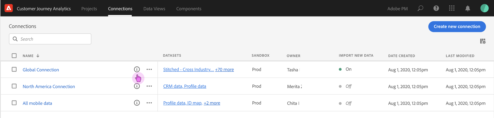

# Verbindingen beheren

Zodra Admin-gebruikers [één of meerdere verbindingen tot stand hebben gebracht](/help/connections/create-connection.md), kunnen ze beheren in de [!UICONTROL Connections] Manager. De recentste update aan de ervaring van de Verbinding voegt twee belangrijke mogelijkheden binnen de pagina van de Details van de Verbinding toe, die verder op deze pagina wordt beschreven:

* Hiermee kunt u de **status van de gegevensreeksen van uw verbinding en van het innameproces**. Deze statuscontrole laat u weten wanneer uw gegevens beschikbaar zijn zodat u naar Analysis Workspace kunt gaan en de analyse kunt starten.

* Het laat u **eventuele gegevensdiscrepanties vaststellen** vanwege verkeerde configuratie. Ontbreekt u rijen? Zo ja, welke rijen ontbreken en waarom? Hebt u verbindingen verkeerd gevormd en ontbrekende gegevens in CJA veroorzaakt?

Hier is een video over de nieuwe Manager van Verbindingen:

>[!VIDEO](https://video.tv.adobe.com/v/342097/?quality=12&learn=on)

## Verbindingsbeheer {#connections-manager}

Met de Connections Manager kunt u:

* Bekijk al uw verbindingen bij een blik, met inbegrip van de eigenaar, de zandbak, en toen zij werden gecreeerd en werden gewijzigd.
* Alle gegevenssets weergeven in een verbinding.
* Controleer de status van een verbinding.
* Een verbinding verwijderen.
* Wijzig de naam van een verbinding.
* Maak een gegevensweergave via een verbinding.

### Verbindingsbeheer-instellingen

| Instelling | Beschrijving |
| --- | --- |
| [!UICONTROL Name] | De vriendschappelijke naam van de verbinding. Wanneer u op de naam van de hyperlink klikt, gaat u naar de pagina Verbindingsdetails die hieronder wordt beschreven. |
| Verbindingsinfo | Klik op het pictogram Info naast de naam van de verbinding om de volgende informatie weer te geven: |
| Een verbinding bewerken | Klik op het ovaal (...) naast de naam van de verbinding en klik vervolgens op [!UICONTROL Edit]. Zie &quot;Verbinding bewerken&quot; hieronder voor meer informatie. |
| Een verbinding verwijderen | Klik op het ovaal (...) naast de naam van de verbinding en klik vervolgens op [!UICONTROL Delete]. Meer informatie vindt u onder de kop Verbindingen verwijderen hieronder. |
| Gegevensweergave maken | Klik op het ovaal (...) naast de naam van de verbinding en klik vervolgens op [!UICONTROL Create data view]. Met deze actie maakt u een nieuwe gegevensweergave op basis van deze verbinding. [Meer informatie](https://experienceleague.adobe.com/docs/analytics-platform/using/cja-dataviews/data-views.html) |
| [!UICONTROL Datasets] | De datasets die deel van de verbinding uitmaken. U kunt op de hyperlink klikken om alle datasets in de verbinding weer te geven. Als u op een gegevensset klikt, wordt die gegevensset in Adobe Experience Platform geopend op een nieuw tabblad. |
| [!UICONTROL Sandbox] | De [Adobe Experience Platform-sandbox](https://experienceleague.adobe.com/docs/experience-platform/sandbox/home.html?lang=nl) waarvan deze verbinding zijn datasets trekt. Deze sandbox werd geselecteerd toen u de verbinding voor het eerst maakte. Het kan niet worden gewijzigd. |
| [!UICONTROL Owner] | De persoon die de verbinding heeft gemaakt. |
| [!UICONTROL Import Data Sets] | Hiermee kunt u in- of uitschakelen wat voorheen &#39;gegevensstreaming&#39; werd genoemd. |
| [!UICONTROL Date Created] | De datum waarop de verbinding voor het eerst is gemaakt. |
| [!UICONTROL Last Modified] | De datum waarop de verbinding voor het laatst is bijgewerkt. |

### Verbindingen verwijderen {#connections-delete}

Alleen beheerders hebben toestemming om een verbinding te verwijderen. Deze handeling wordt niet weergegeven voor niet-beheerders.

1. Klik op de ellips (...) naast de naam van de verbinding.
1. Klik op [!UICONTROL Delete].

Wanneer u een verbinding verwijdert in [!UICONTROL Customer Journey Analytics], geeft een foutbericht aan dat:

* Gegevensweergaven die zijn gemaakt op basis van de verwijderde verbinding, werken niet meer.
* Op dezelfde manier zullen om het even welke projecten van de Werkruimte die van gegevensmeningen in de geschrapte verbinding afhangen ophouden werkend.

[Meer informatie](/help/admin/cja-deletion.md) over de gevolgen van verwijdering.

### Zoeken naar een verbinding of gegevensset

U kunt naar verbindingen zoeken met de zoekbalk bovenaan, onder de [!UICONTROL Connections] titel.

### Verbindingen sorteren

U kunt verbindingen sorteren door op elke kolomkop te klikken en omhoog of omlaag te sorteren.

## Pagina Verbindingsgegevens {#connection-detail}

De nieuwe pagina van de Details van Verbindingen geeft u een zeer gedetailleerde mening van de status van een verbinding.

Hiermee kunt u:

* Controleer de status van de datasets van uw verbinding en van het innameproces.
* Identificeer configuratieproblemen die tot overgeslagen, of geschrapte verslagen leiden.
* Zie wanneer de gegevens beschikbaar zijn voor rapportage.

>[!IMPORTANT]
>Gegevens die vóór 13 augustus 2021 zijn ingevoerd, worden niet in deze [!UICONTROL Connections] .

Hier worden de widgets en instellingen beschreven:

### Instellingen voor verbindingsdetails

| Widget/Setting | Beschrijving |
| --- | --- |
| Gegevensset selecteren | Hiermee kunt u een of alle gegevenssets in de verbinding kiezen. U kunt geen datasets selecteren. Standaardwaarden: [!UICONTROL All datasets]. |
| Kalender-/datumbereiken | Het datumbereik geeft aan wanneer u gegevens hebt toegevoegd aan de verbinding. Alle standaardkalendervoorinstellingen worden opgenomen. U kunt het datumbereik aanpassen, maar in de vervolgkeuzelijst worden geen aangepaste datumbereiken weergegeven. |
| [!UICONTROL Records of event data available] widget | Vertegenwoordigt het totale aantal rijen van de gebeurtenisdataset beschikbaar voor rapportering, **voor de volledige verbinding**. Deze telling is onafhankelijk van enige kalendermontages. Het verandert als u een dataset van de datasetselecteur selecteert of door een dataset in de lijst te selecteren. (Let op: er is een latentie van 1-2 uur om de gegevens weer te geven in de rapportage, zodra deze is toegevoegd.) |
| [!UICONTROL Metrics] widget | Hiermee geeft u een overzicht van de gebeurtenisrecords die zijn toegevoegd/overgeslagen/verwijderd en het aantal toegevoegde batches, **voor de dataset en de datumwaaier u hebt geselecteerd**. |
| [!UICONTROL Records added] widget | Geeft aan hoeveel rijen zijn toegevoegd in de geselecteerde tijdsperiode. **voor de dataset en de datumwaaier u hebt geselecteerd**. Om de 10 minuten bijgewerkt. **Opmerking**: Gegevens voor **[!UICONTROL Records added]** bevat momenteel alleen gebeurtenisgegevens, geen profiel- of opzoekgegevens. |
| [!UICONTROL Records skipped] widget | Geeft aan hoeveel rijen zijn overgeslagen in de geselecteerde tijdsperiode. **voor de dataset en de datumwaaier u hebt geselecteerd**. Redenen voor het overslaan van records zijn: Tijdstempels ontbreken, persoon-id ontbreekt of is ongeldig, enz. Om de 10 minuten bijgewerkt.
Ongeldige personen-id&#39;s (zoals &quot;undefined&quot; of &quot;00000000&quot; of een willekeurige combinatie van cijfers en letters in een [!UICONTROL Person ID] die in een gebeurtenis meer dan 1 miljoen keer in een bepaalde maand voorkomt) kan niet aan een specifieke gebruiker of persoon worden toegeschreven. Ze kunnen niet in het systeem worden opgenomen en leiden tot foutgevoelige inname en rapportage. U kunt ongeldige personen-id&#39;s corrigeren aan de hand van drie opties:<ul><li>Gebruiken [Kanaaloverschrijdende analyse](/help/cca/overview.md) om de niet-gedefinieerde of helemaal geen gebruikers-id&#39;s te vullen met geldige gebruikers-id&#39;s.</li><li>Blanco de gebruikersnaam. Deze wordt tijdens de inname overgeslagen (bij voorkeur aan ongeldige of helemaal geen gebruikers-id&#39;s).</li><li>Corrigeer eventuele ongeldige gebruikers-id&#39;s in uw systeem voordat u de gegevens opneemt.</li></ul>
**Opmerking**: Gegevens voor **[!UICONTROL Records skipped]** bevat momenteel alleen gebeurtenisgegevens, geen profiel- of opzoekgegevens. |
| [!UICONTROL Records deleted] widget | Geeft aan hoeveel rijen zijn verwijderd in de geselecteerde tijdsperiode. **voor de dataset en de datumwaaier u hebt geselecteerd**. Iemand heeft bijvoorbeeld een dataset in Experience Platform verwijderd. Om de 10 minuten bijgewerkt. **Opmerking**: Gegevens voor **[!UICONTROL Records deleted]** bevat momenteel alleen gebeurtenisgegevens, geen profiel- of opzoekgegevens. |
| Zoekvak voor gegevensset | U kunt zoeken op naam van een gegevensset of [!UICONTROL Dataset ID]. |
| [!UICONTROL Datasets] | Toont de datasets die deel van de verbinding uitmaken. U kunt op de hyperlink klikken om alle datasets in de verbinding weer te geven. |
| [!UICONTROL Dataset ID] | Deze id wordt automatisch gegenereerd door Adobe Experience Platform. |
| [!UICONTROL Batches] | Geeft aan hoeveel gegevensbatches aan deze gegevensset zijn toegevoegd. |
| [!UICONTROL Last added] | Toont timestamp voor de laatste toegevoegde partij aan deze dataset. |
| [!UICONTROL Dataset type] | Het gegevenstype van de dataset voor deze dataset kan zijn [!UICONTROL Event], [!UICONTROL Lookup], of [!UICONTROL Profile]. [Meer informatie](https://experienceleague.adobe.com/docs/analytics-platform/using/cja-connections/create-connection.html#configure-dataset) |
| Schema | Het Adobe Experience Platform-schema waarop de gegevenssets in deze verbinding zijn gebaseerd. |

### Instellingen voor rechtse spoorstaven op verbindingsniveau

| Instelling | Beschrijving |
| --- | --- |
| [!UICONTROL Refresh] | Vernieuw de verbinding zodat onlangs toegevoegde verslagen worden weerspiegeld. |
| [!UICONTROL Delete] | Verwijder deze verbinding. |
| [!UICONTROL Create data view] | Maak een nieuwe gegevensweergave op basis van deze verbinding. [Meer informatie](https://experienceleague.adobe.com/docs/analytics-platform/using/cja-dataviews/data-views.html) |
| [!UICONTROL Connection name] | Toont de vriendschappelijke naam van de verbinding. |
| [!UICONTROL Connection description] | Toont een meer gedetailleerde beschrijving die ideaal het doel van deze verbinding beschrijft. |
| [!UICONTROL Sandbox] | De [Adobe Experience Platform-sandbox](https://experienceleague.adobe.com/docs/experience-platform/sandbox/home.html?lang=nl) waarvan deze verbinding zijn dataset(s) trekt. Deze sandbox werd geselecteerd toen u de verbinding voor het eerst maakte. Het kan niet worden gewijzigd. |
| [!UICONTROL Connection ID] | Deze id is een systeem dat is gegenereerd in Adobe Experience Platform. |
| [!UICONTROL Data views using connection] | Hier worden alle gegevensweergaven weergegeven die deze verbinding gebruiken. |
| [!UICONTROL Import new data] | (Aan/Uit) Geeft aan of nieuwe batches gegevens al dan niet moeten worden toegevoegd aan de historische gegevens (backfill). |
| [!UICONTROL Backfill data] | Backfill (historische) gegevens worden in drie statussen bijgehouden: [!UICONTROL In queue], [!UICONTROL In progress] (met aangegeven voortgangspercentage), en [!UICONTROL Complete]. |
| [!UICONTROL Created by] | Hiermee wordt de naam weergegeven van de persoon die de verbinding heeft gemaakt. |
| [!UICONTROL Last modified] | Geeft de datum en tijd weer van de laatste wijziging in de verbinding. |
| [!UICONTROL Last modified by] | Toont de persoon die de verbinding het laatst heeft gewijzigd. |

### Instellingen voor rechtse spoorstaven op gegevenssetniveau

| Instelling | Beschrijving |
| --- | --- |
| [!UICONTROL Person ID] | Toont een identiteit die in het datasetschema in het Experience Platform werd bepaald. Dit is de persoon-id die u hebt gekozen tijdens het maken van de verbinding. Als u een verbinding creeert die datasets met verschillende IDs omvat, zal het melden dat weerspiegelen. Om datasets echt samen te voegen, moet u zelfde identiteitskaart van de Persoon over datasets gebruiken. |
| [!UICONTROL Records available] | Vertegenwoordigt het totale aantal rijen die voor deze dataset, voor de bepaalde tijdspanne worden opgenomen die door de kalender wordt geselecteerd. Er is geen latentie in termen van het krijgen van de gegevens om in rapportering te verschijnen, zodra het wordt toegevoegd. (De uitzondering is dat wanneer u een gloednieuwe verbinding maakt, er [latentie](https://experienceleague.adobe.com/docs/analytics-platform/using/cja-overview/cja-faq.html#3.-getting-data-into-customer-trip-analytics). |
| [!UICONTROL Records added] | Geeft aan hoeveel rijen zijn toegevoegd in de geselecteerde tijdsperiode. **Opmerking**: Gegevens voor **[!UICONTROL Records added]** bevat momenteel alleen gebeurtenisgegevens, geen profiel- of opzoekgegevens. |
| [!UICONTROL Records deleted] | Geeft aan hoeveel records tijdens de geselecteerde tijdsperiode zijn verwijderd. **Opmerking**: Gegevens voor **[!UICONTROL Records deleted]** bevat momenteel alleen gebeurtenisgegevens, geen profiel- of opzoekgegevens. |
| [!UICONTROL Batches added] | Geeft aan hoeveel gegevensbatches zijn toegevoegd aan deze gegevensset. |
| [!UICONTROL Records skipped] | Hiermee geeft u aan hoeveel rijen zijn overgeslagen tijdens het invoeren in de geselecteerde tijdsperiode.
Redenen voor het overslaan van records zijn: Tijdstempels ontbreken, persoon-id ontbreekt of is ongeldig, enz. Om de 10 minuten bijgewerkt.
Ongeldige personen-id&#39;s (zoals &quot;undefined&quot; of &quot;00000000&quot; of een willekeurige combinatie van cijfers en letters in een [!UICONTROL Person ID] die in een gebeurtenis meer dan 1 miljoen keer in een bepaalde maand voorkomt) kan niet aan een specifieke gebruiker of persoon worden toegeschreven. Ze kunnen niet in het systeem worden opgenomen en leiden tot foutgevoelige inname en rapportage. U kunt ongeldige personen-id&#39;s corrigeren aan de hand van drie opties:<ul><li>Gebruiken [Kanaaloverschrijdende analyse](/help/cca/overview.md) om de niet-gedefinieerde of helemaal geen gebruikers-id&#39;s te vullen met geldige gebruikers-id&#39;s.</li><li>Blanco de gebruikersnaam. Deze wordt tijdens de inname overgeslagen (bij voorkeur aan ongeldige of helemaal geen gebruikers-id&#39;s).</li><li>Corrigeer eventuele ongeldige gebruikers-id&#39;s in uw systeem voordat u de gegevens opneemt.</li></ul>
**Opmerking**: Gegevens voor **[!UICONTROL Records skipped]** bevat momenteel alleen gebeurtenisgegevens, geen profiel- of opzoekgegevens. |
| [!UICONTROL Last added] | Geeft aan wanneer de laatste batch is toegevoegd. |
| [!UICONTROL Dataset type] | Willekeurig [!UICONTROL Event], [!UICONTROL Lookup], of [!UICONTROL Profile]. [Meer informatie](https://experienceleague.adobe.com/docs/analytics-platform/using/cja-connections/create-connection.html#configure-dataset) |
| [!UICONTROL Schema] | Toont het schema van Adobe Experience Platform dat deze dataset op gebaseerd is. |
| [!UICONTROL Dataset ID] | Deze id is een systeem dat is gegenereerd in Adobe Experience Platform. |

## Verbinding bewerken

Hiermee kunnen beheerders de verbinding bewerken. Selecteer een verbinding en klik op [!UICONTROL Edit Connection] om naar dit dialoogvenster te gaan. Hier kunt u het volgende doen:

* Nieuwe gegevens beginnen en stoppen. Dit proces werd voorheen &quot;gegevensstreaming&quot; genoemd.
* Wijzig de naam van een verbinding.
* Vernieuw de gegevensset(s).
* Verwijder dataset/s uit de verbindingen.

