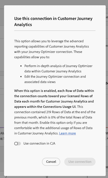
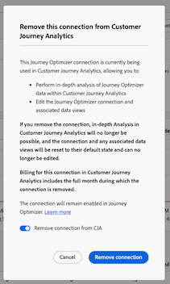
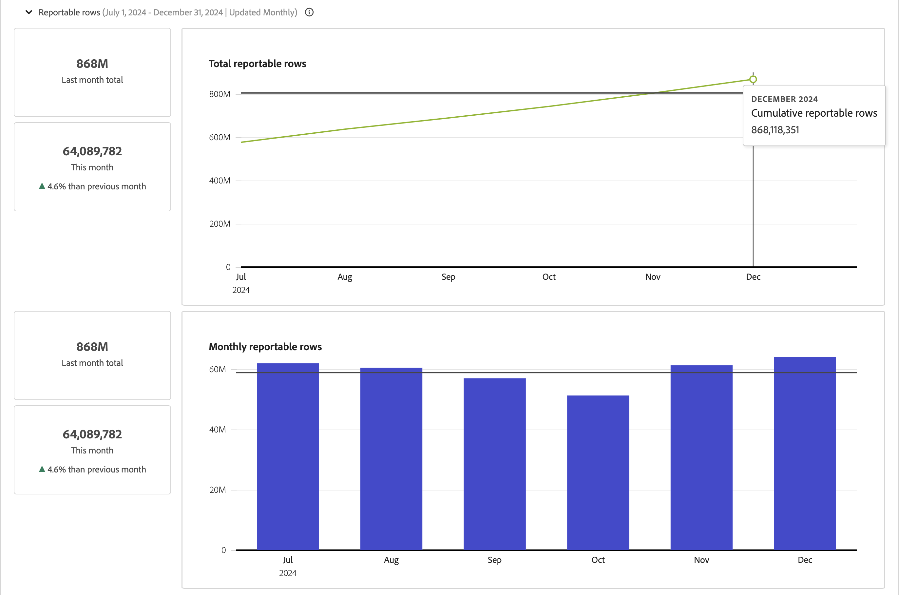

# Verbindingen beheren {#manage-connections}

>[!CONTEXTUALHELP]
>id="connections_use_ajo"
>title="Journey Optimizer-verbinding gebruiken"
>abstract="Gebruikt de geavanceerde Customer Journey Analytics rapportagemogelijkheden met Journey Optimizer."

>[!CONTEXTUALHELP]
>id="connections_cancel_ajo"
>title="Journey Optimizer-verbinding annuleren"
>abstract="Annuleert de geavanceerde Customer Journey Analytics-rapportagemogelijkheden met Journey Optimizer."

Zodra u [ creeerde of uitgegeven één of meerdere verbindingen ](/help/connections/create-connection.md) hebt, kunt u hen in **[!UICONTROL Connections]** beheren. Met de interface [!UICONTROL Connections] kunt u:

* Bekijk al uw verbindingen bij een blik, met inbegrip van de eigenaar, de zandbak, en wanneer de verbindingen werden gecreeerd en werden gewijzigd.
* Bewerk een verbinding.
* Een verbinding verwijderen.
* Maak een gegevensweergave via een verbinding.
* Alle gegevenssets weergeven in een verbinding.
* Controleer de status van de datasets van uw verbinding en de status van het innameproces. Wanneer zijn bijvoorbeeld uw gegevens beschikbaar, zodat u in Analysis Workspace kunt beginnen met rapporteren en analyseren.
* Identificeer om het even welke gegevensdiscrepanties toe te schrijven aan misconfiguration. Ontbreekt u rijen? Zo ja, welke rijen ontbreken en waarom? Hebt u verbindingen verkeerd geconfigureerd en ontbrekende gegevens veroorzaakt in Customer Journey Analytics?
* Krijg inzicht in het gebruik van ingeklapte en te melden rijen over al uw verbindingen.

[!UICONTROL Connections] heeft twee interfaces: [[!UICONTROL List]](#list) en [[!UICONTROL Usage]](#usage) .

## Lijst

De interface **[!UICONTROL List]** is de standaardinterface voor verbindingen. Als deze optie niet is geselecteerd, selecteert u de tab **[!UICONTROL List]** voor toegang tot de interface.

De interface [!UICONTROL List] toont een lijst van alle beschikbare verbindingen.

### Verbinding zoeken

U kunt snel naar een verbinding zoeken gebruikend het vakje van het Onderzoek .

### Een filter toepassen op de lijst met verbindingen

Als u een filter wilt toepassen op de lijst met verbindingen, selecteert u het filterpictogram en kiest u een van de volgende filteropties:

| Filter, optie | Beschrijving |
|---------|----------|
| **[!UICONTROL Datasets]** | Alleen verbindingen die zijn gekoppeld aan de gegevenssets die u selecteert, worden weergegeven. |
| **[!UICONTROL Owner]** | Alleen verbindingen die eigendom zijn van de personen die u selecteert, worden weergegeven. |
| **[!UICONTROL Sandbox]** | Alleen verbindingen die beschikbaar zijn in de sandboxen die u selecteert, worden weergegeven. |
| **[!UICONTROL Use in CJA]** | Selecteer **[!UICONTROL On]** om alleen verbindingen weer te geven die zijn ingeschakeld voor gebruik met Customer Journey Analytics. Selecteer **[!UICONTROL Off]** om alleen verbindingen weer te geven die nog niet zijn ingeschakeld voor gebruik met Customer Journey Analytics. |

### Beschikbare kolommen

De volgende kolommen of pictogrammen zijn beschikbaar in de tabel.

| Kolom of pictogram | Beschrijving |
| --- | --- |
| **[!UICONTROL _Naam_]** | De vriendelijke naam van de verbinding. Selecteer de hyperlinked naam om de [ details van de verbinding ](#connection-details) te zien. |
|  | Om informatie over [!UICONTROL Datasets included], [!UICONTROL Sandbox], [!UICONTROL Owner], en meer te bekijken, selecteer  naast de verbindingsnaam.
Een popup venster toont details over de dataset. 
 |
|  | Om [ een gegevensmening ](#create-a-data-view) voor de verbinding tot stand te brengen, uitgezochte . Dit pictogram wordt alleen weergegeven wanneer er al geen gegevensweergave is gekoppeld aan de verbinding. |
|  | Selecteer  om een contextmenu te openen. U kunt selecteren: 
 **[!UICONTROL Edit]** uit [ geef ](#edit-a-connection) een verbinding uit.
 **[!UICONTROL Delete]** aan [ schrap ](#delete-a-connection) een verbinding.
 **[!UICONTROL Create new data view]** [ creeer een nieuwe gegevensmening ](#create-a-data-view) voor de verbinding.
 **[!UICONTROL Connection map]** om a [ verbindingskaart ](#map-a-connection) voor de verbinding te bekijken. |
| [!BADGE &#x200B; B2B edition &#x200B;]{type=Informative url="https://experienceleague.adobe.com/en/docs/analytics-platform/using/cja-overview/cja-b2b/cja-b2b-edition" newtab=true tooltip="Customer Journey Analytics B2B edition"}  **[!UICONTROL Connection type]** | Het type verbinding: **[!UICONTROL Person]** - gebaseerde of **[!UICONTROL Account]** -verbinding. |
| **[!UICONTROL Datasets]** | Één of meerdere verbindingen met de datasets die deel van de verbinding uitmaken. U kunt de datasethyperlink selecteren om de dataset in de verbinding te bekijken. Als meer datasets deel van de geselecteerde verbinding uitmaken, selecteer **[!UICONTROL +*x *meer]**&#x200B;om een **[!UICONTROL Datasets included]**&#x200B;paneel te tonen. Dit paneel toont verbindingen aan alle datasets en een optie aan  onderzoek naar specifieke datasets die deel van de verbinding uitmaken.

Selecteer een naam van een dataset om de dataset in de interface van Experience Platform in een nieuw lusje te openen. |
| **[!UICONTROL Sandbox]** | De [ zandbak van Experience Platform ](https://experienceleague.adobe.com/en/docs/experience-platform/sandbox/home) waarvan deze verbinding zijn datasets trekt. U selecteert deze sandbox wanneer u de verbinding hebt gemaakt. U kunt de sandbox niet meer wijzigen nadat een verbinding is opgeslagen. |
| **[!UICONTROL Owner]** | De persoon die de verbinding heeft gemaakt. |
| **[!UICONTROL Import new data]** | De status van het invoeren van nieuwe gegevens voor datasets: 
   **[!UICONTROL _x _op]**&#x200B;voor datasets die worden gevormd om nieuwe gegevens in te voeren, en
   **[!UICONTROL _x van_]** voor datasets niet gevormd om nieuwe gegevens in te voeren. |
| **[!UICONTROL Date created]** | De tijdstempel op het moment dat de verbinding werd gemaakt. |
| **[!UICONTROL Last modified]** | De tijdstempel wanneer de verbinding voor het laatst is bijgewerkt. |
| **[!UICONTROL Backfill data]** | De status voor backfill gegevens over datasets.
   **[!UICONTROL _x _ontbroken backfills]**&#x200B;voor aantal ontbroken backfills over datasets,
   **[!UICONTROL _x _backfills verwerking]**&#x200B;voor aantal verwerkingsterugvullingen over datasets,
   **[!UICONTROL _x _voltooide backfills]**&#x200B;voor aantal voltooide backfills voor datasets, en
   **[!UICONTROL _weg_]** voor het geval dat geen backfills voor de datasets in de verbinding worden bepaald. |
| **[!UICONTROL Integrations]** | Hiermee worden alle Experience Platform-toepassingen weergegeven die met de verbinding zijn ingeschakeld. |
| **[!UICONTROL Use in CJA]** | Geeft aan of de verbinding is ingeschakeld voor gebruik met Customer Journey Analytics. |

Om te vormen welke kolommen in de lijst te tonen, selecteer . Selecteer in het dialoogvenster Tabel aanpassen de kolommen die u wilt weergeven.

### Een verbinding bewerken

Een verbinding bewerken:

1. Selecteer  naast de verbindingsnaam
1. Selecteer  **[!UICONTROL Edit]** van het contextmenu.

U kunt ook:

1. Selecteer de verbindingsrij.

1. Selecteer  **[!UICONTROL Edit]** van de blauwe actiebar.

Zie [ creeer of geef een verbinding ](create-connection.md) voor meer informatie uit.

### Een verbinding verwijderen {#connections-delete}

Een verbinding verwijderen:

1. Selecteer  naast de verbindingsnaam.
1. Selecteer  **[!UICONTROL Delete]**.

U kunt ook:

1. Selecteer de verbindingsrij.

1. Selecteer  **[!UICONTROL Delete]** van de blauwe actiebar.

Wanneer u een verbinding verwijdert, wordt in het deelvenster **[!UICONTROL Delete connection]** aangegeven welke gegevensweergaven worden verwijderd en welke werkruimteprojecten worden beïnvloed.

* In ➊ **[!UICONTROL Info]** worden de implicaties van het verwijderen van de verbinding weergegeven.

  

  Selecteer **[!UICONTROL Continue]** om de verwijdering te bevestigen.

* Voer in ➋ **[!UICONTROL Confirmation]** de naam van de verbinding in **[!UICONTROL Type connection name]** in en selecteer **[!UICONTROL Delete]** om de verbinding te verwijderen. Selecteer **[!UICONTROL Cancel]** om te annuleren.

Zie [ implicaties van de Schrapping ](/help/technotes/deletion.md) voor meer informatie over het schrappen van een verbinding.

### Een gegevensweergave voor een verbinding maken

Een gegevensweergave maken voor een verbinding:

1. Selecteer  naast de verbindingsnaam.
1. Selecteer  **[!UICONTROL Create new data view]**.

U kunt ook:

1. Selecteer de verbindingsrij.

1. Selecteer  **[!UICONTROL Create data view]** van de blauwe actiebar.

Zie [ creeer of geef een gegevensmening ](/help/data-views/create-dataview.md) voor meer informatie uit.

### Journey Optimizer-verbinding gebruiken in Customer Journey Analytics {#use-connection-in-cja}

>[!IMPORTANT]
>
>Wanneer u een verbinding van Journey Optimizer voor gebruik met Customer Journey Analytics zoals die in deze sectie wordt beschreven toelaat, telt elke Rij van Gegevens binnen de verbinding aan uw vergunning Rijen van Gegevens elke maand voor Customer Journey Analytics en verschijnt binnen UI van het Gebruik van Verbindingen. Selecteer de optie **[!UICONTROL Use in CJA]** alleen op de verbinding als u vertrouwd bent met het extra gebruik van gegevensrijen in Customer Journey Analytics.
>
>**als u op zowel Customer Journey Analytics als Journey Optimizer tussen Oktober 2024 en Oktober 2025 gerechtigd was, zie het volgende document betreffende [ AJO-Toegelaten Verbindingen ](https://view.adobe.com/viewer/1ed94fc35c7860b260766c620889e7a0#1)**.

U kunt een Journey Optimizer-verbinding in Customer Journey Analytics gebruiken om de volgende extra waarde toe te voegen aan uw verbinding:

* Voer een diepgaande analyse van Journey Optimizer-gegevens uit in Customer Journey Analytics (met de knop **[!UICONTROL Analyze in CJA]** in Journey Optimizer).

  Voor meer informatie, zie [ analyseren in Customer Journey Analytics ](https://experienceleague.adobe.com/en/docs/journey-optimizer/using/reporting/channel-report/report-cja-manage#cja-template) in de documentatie van Journey Optimizer.

* Bewerk de Journey Optimizer-verbinding en de bijbehorende gegevensweergaven.

  Voor meer informatie over het uitgeven van opties, zie [ een verbinding ](#edit-a-connection) uitgeven.

Uw organisatie heeft toegang tot Customer Journey Analytics nodig om deze functionaliteit in te schakelen. Neem contact op met je Adobe-verkoper als je geen toegang hebt.

Als u toegang hebt tot Customer Journey Analytics, moet u toestaan dat de Journey Optimizer-verbinding wordt gebruikt in Customer Journey Analytics:

1. Zoek de Journey Optimizer-verbinding die u met Customer Journey Analytics wilt gebruiken.

   1. Selecteer het pictogram Filter op de tab **[!UICONTROL Connections]** .

   1. Selecteer **[!UICONTROL Use in CJA]** in de sectie **[!UICONTROL Off]** .

      Hiermee worden alle Journey Optimizer-verbindingen weergegeven die momenteel niet zijn geconfigureerd voor gebruik in Customer Journey Analytics.

       worden toegelaten

1. Als u de verbinding wilt weergeven, selecteert u de naam van de Journey Optimizer-verbinding die u in Customer Journey Analytics wilt gebruiken.

1. Selecteer **[!UICONTROL Use in CJA]** wanneer u de Journey Optimizer-verbinding weergeeft.

   

   Het volgende dialoogvenster **[!UICONTROL Use this connection in Customer Journey Analytics]** wordt weergegeven:

   

1. De schakeloptie inschakelen, **[!UICONTROL Use connection in CJA]** .

1. Selecteren **[!UICONTROL Use connection]** . <!-- double-check these dialog button names -->

#### De verbinding verwijderen uit Customer Journey Analytics {#remove-connection-in-cja}

U kunt de Journey Optimizer-verbinding op elk gewenst moment uit Customer Journey Analytics verwijderen. Als u echter de verbinding uit Customer Journey Analytics verwijdert nadat deze is gebruikt, resulteert dit in het volgende:

* De Journey Optimizer-verbinding en eventuele bijbehorende gegevensweergaven worden teruggezet op de standaardstatus en kunnen niet meer worden bewerkt

* Eventuele aangepaste afgeleide velden die aan de verbinding zijn gekoppeld, worden verwijderd

* U kunt geen diepgaande analyse meer uitvoeren van Journey Optimizer-gegevens in Customer Journey Analytics

  Dit betekent dat de knop **[!UICONTROL Analyze in CJA]** in Journey Optimizer is uitgeschakeld

>[!IMPORTANT]
>
>Facturering voor de verbinding in Customer Journey Analytics omvat de volledige maand waarin de verbinding wordt verwijderd.

De verbinding verwijderen uit Customer Journey Analytics:

1. Zoek de Journey Optimizer-verbinding die u uit Customer Journey Analytics wilt verwijderen.

   1. Selecteer het pictogram Filter op de tab **[!UICONTROL Connections]** .

   1. Selecteer **[!UICONTROL Use in CJA]** in de sectie **[!UICONTROL On]** .

      Hiermee worden alle Journey Optimizer-verbindingen weergegeven die momenteel zijn geconfigureerd voor gebruik in Customer Journey Analytics.

       worden toegelaten

1. Als u de verbinding wilt weergeven, selecteert u de naam van de Journey Optimizer-verbinding die u uit Customer Journey Analytics wilt verwijderen.

1. Selecteer **[!UICONTROL Remove from CJA]** wanneer u de Journey Optimizer-verbinding weergeeft.

   

   Het volgende dialoogvenster **[!UICONTROL Remove this connection from Customer Journey Analytics]** wordt weergegeven:

   

1. Schakel de optie uit, **[!UICONTROL Remove connection from CJA]** .

1. Selecteer **[!UICONTROL Remove connection]** .

### Een verbinding toewijzen

Om a [ verbindingskaart ](/help/connections/create-connection.md#connection-map) te bekijken die het verband tussen de datasets detailleert die deel van een verbinding uitmaken:

1. Selecteer  naast de verbindingsnaam.
1. Selecteer  **[!UICONTROL Connection map]**.

### Verbindingsgegevens {#connection-detail}

Als u naar de gegevens voor een verbinding wilt gaan, selecteert u een naam voor een hyperlink in de tabel met verbindingen.

 toont

De interface van de Details van Verbindingen verstrekt een gedetailleerde mening van de status van een verbinding. U kunt:

* Controleer de status van de datasets van uw verbinding en van het innameproces.
* Identificeer configuratieproblemen die overgeslagen of geschrapte verslagen kunnen veroorzaken.
* Zie wanneer de gegevens beschikbaar zijn voor rapportage.

| Gebruikersinterface | Beschrijving |
| --- | --- |
|  **[!UICONTROL Edit Connection]** uit | Om de details van een verbinding uit te geven, uitgezocht  **[!UICONTROL Edit Connection]** uit. Zie [ creeer of geef een verbinding ](create-connection.md) voor meer informatie uit. |
| **[!UICONTROL *de selecteur van de Dataset *]** | Selecteer één of alle datasets om details voor in de verbinding te tonen. U kunt geen datasets selecteren. Wordt standaard ingesteld op **[!UICONTROL All datasets]** . |
| **[!UICONTROL *de bereikselecteur van de Datum *]** | Selecteer een gegevensbereik waarvoor u gegevens wilt weergeven in de verbinding. Bewerk begindatum, einddatum, of selecteer  om de selecteur van de datumwaaier te openen. Selecteer in de datumbereikkiezer een datumbereik met een van de vooraf gedefinieerde punten (bijvoorbeeld **[!UICONTROL Last 6 months]** ) of gebruik de kalender om de begin- en einddatum te selecteren. Selecteer **[!UICONTROL Apply]** om het nieuwe datumbereik toe te passen op de verbindingsdetails. |
| **[!UICONTROL Records of event data available]** | Het totale aantal rijen van de gebeurtenisdataset beschikbaar voor het melden, **voor de volledige verbinding**. Deze telling is onafhankelijk van om het even welk datumwaaier of datasetselectie. |
| [!UICONTROL **[!UICONTROL Metrics]**] | Geef een overzicht van de gebeurtenissen, opzoekactie, profielen en samenvattingsrecords die zijn toegevoegd, overgeslagen en verwijderd, en van het aantal toegevoegde batches. Deze metriek zijn gebaseerd op **de dataset en de datumwaaier die u** hebt geselecteerd.
Selecteer **[!UICONTROL Check detail]** om de pop-up **[!UICONTROL Check skipped detail]** weer te geven. popup maakt een lijst van het aantal overgeslagen verslagen en de reden voor alle gebeurtenisdatasets of geselecteerde dataset.

Selecteer  met meer informatie. Voor sommige overgeslagen redenen, zoals [!UICONTROL Empty visitor ID], popup toont **[!UICONTROL Sample PSQL for EQS]** (Experience Platform voor de Dienst van de Vraag) u in [ de Dienst van de Vraag ](https://experienceleague.adobe.com/en/docs/experience-platform/query/home) kunt gebruiken om voor de overgeslagen verslagen in de dataset te vragen. Selecteer  **[!UICONTROL Copy sample PSQL for EQS]** om SQL te kopiëren. |
| **[!UICONTROL Records added]** | Een visualisatie om erop te wijzen hoeveel rijen in de geselecteerde tijdspanne werden toegevoegd, **voor de dataset en de datumwaaier u** hebt geselecteerd. Wordt elke 10 minuten bijgewerkt. |
| **[!UICONTROL Records skipped]** | Een visualisatie om erop te wijzen hoeveel rijen in de geselecteerde tijdspanne werden overgeslagen, **voor de dataset en de datumwaaier u** hebt geselecteerd. De redenen voor het overslaan van verslagen omvatten: ontbrekende timestamps, ontbrekende of ongeldige identiteitskaart van de Persoon of identiteitskaart van de Rekening [!BADGE &#x200B; B2B edition &#x200B;]{type=Informative url="https://experienceleague.adobe.com/en/docs/analytics-platform/using/cja-overview/cja-b2b/cja-b2b-edition" newtab=true tooltip="Customer Journey Analytics B2B edition"}, etc. Wordt elke 10 minuten bijgewerkt. 
Ongeldige id&#39;s (zoals `undefined` of `00000000` , of een combinatie van getallen en letters in een [!UICONTROL Person ID] die in een gebeurtenis meer dan 1 miljoen keer in een bepaalde maand voorkomen) zijn id&#39;s die niet aan een bepaalde gebruiker of persoon kunnen worden toegewezen. Deze rijen kunnen niet in het systeem worden opgenomen en in fout-prone opname en rapportering resulteren. Om ongeldige Persoon IDs of van de Rekening IDs [!BADGE &#x200B; B2B edition &#x200B;]{type=Informative url="https://experienceleague.adobe.com/en/docs/analytics-platform/using/cja-overview/cja-b2b/cja-b2b-edition" newtab=true tooltip="Customer Journey Analytics B2B edition"} te bevestigen, hebt u 3 opties:<ul><li>Het gebruik [ Stitching ](/help/stitching/overview.md) om undefined of volledig-nul gebruiker te bevolken - identiteitskaarts met geldige gebruiker IDs.</li><li>Lege gebruikers-id&#39;s die vervolgens worden overgeslagen tijdens inname (voorkeur boven ongeldige of geen gebruikers-id&#39;s).</li><li>Corrigeer eventuele ongeldige gebruikers-id&#39;s in uw systeem voordat u de gegevens opneemt.</li></ul> |
| **[!UICONTROL Records deleted]** | Een visualisatie om erop te wijzen hoeveel rijen in de geselecteerde tijdspanne werden geschrapt, **voor de dataset en de datumwaaier u** hebt geselecteerd. Iemand heeft bijvoorbeeld een gegevensset verwijderd in [!DNL Experience Platform] . Wordt elke 10 minuten bijgewerkt.
In sommige scenario&#39;s, kan deze waarde ook verslagen omvatten die, zoals met het stitching of sommige updates van de raadplegingsdataset worden vervangen. Bekijk dit voorbeeld:
<ul><li>U uploadt één verslag aan een individuele dataset van het Profiel XDM, die Customer Journey Analytics wordt gevormd om als gegevens van de profielraadpleging in te voeren. In de verbindingsdetails, zou deze dataset 1 toegevoegde verslag tonen.</li><li>U uploadt een duplicaat van de oorspronkelijke record naar dezelfde AEP-gegevensset, die nu twee records bevat. Customer Journey Analytics neemt het extra verslag van het profiel of de rekening [!BADGE &#x200B; B2B edition &#x200B;]{type=Informative url="https://experienceleague.adobe.com/en/docs/analytics-platform/using/cja-overview/cja-b2b/cja-b2b-edition" newtab=true tooltip="Customer Journey Analytics B2B edition"} raadplegingsdataset op. Aangezien een profiel of rekeningsverslag reeds in de verbinding voor die Persoon identiteitskaart of identiteitskaart van de Rekening [!BADGE &#x200B; B2B edition &#x200B;]{type=Informative url="https://experienceleague.adobe.com/en/docs/analytics-platform/using/cja-overview/cja-b2b/cja-b2b-edition" newtab=true tooltip="Customer Journey Analytics B2B edition"} wordt opgenomen, schrapt Customer Journey Analytics zijn vroegere versie en voegt de nieuwe profielgegevens toe. In de verbindingsdetails, zou deze actie 1 toegevoegd en 1 geschrapt verslag vertegenwoordigen, omdat Customer Journey Analytics slechts de meest recente gegevens van de profielraadpleging voor om het even welke ingebedde identiteitskaart van de Persoon of identiteitskaart van de Rekening [!BADGE &#x200B; B2B edition &#x200B;]{type=Informative url="https://experienceleague.adobe.com/en/docs/analytics-platform/using/cja-overview/cja-b2b/cja-b2b-edition" newtab=true tooltip="Customer Journey Analytics B2B edition"} behoudt.</li><li>In totaal bevat de AEP-gegevensset twee records die identiek zijn. Afzonderlijk, tonen de de verbindingsdetails van Customer Journey Analytics de status van zijn opgenomen gegevens: 2 verslagen toegevoegd en 1 verslag geschrapt voor deze profieldataset. </li></ul> |
|  | Veld voor het zoeken naar gegevenssets. U kunt de datasetlijst door datasetnaam of datasetidentiteitskaart zoeken. |
| [!UICONTROL Datasets table] | De datasets die deel van de verbinding uitmaken. Zie de onderstaande tabel voor nadere uitleg. Selecteer  één enkele dataset om slechts verbindingsdetails voor de geselecteerde dataset te tonen. Dit is gelijkwaardig aan de selectie van een dataset van de **[!UICONTROL _selecteur van de Dataset_]**. |

De datasetlijst toont de volgende kolommen voor elke dataset:

| Kolom | Beschrijving |
| --- | --- |
| **[!UICONTROL Datasets]** | De naam van de gegevensset. U kunt de hyperlink selecteren om de dataset in Experience Platform UI op een nieuw lusje te openen. U kunt de rij of checkbox selecteren om details voor de geselecteerde dataset slechts te tonen. |
| **[!UICONTROL Dataset ID]** | De dataset-id, gegenereerd door Experience Platform. |
| **[!UICONTROL Records added]** | Het aantal gegevenssetrecords (rijen) dat tijdens het geselecteerde datumbereik aan een verbinding is toegevoegd. |
| **[!UICONTROL Records skipped]** | Het aantal gegevenssetrecords (rijen) dat tijdens gegevensoverdracht voor een verbinding tijdens het geselecteerde datumbereik is overgeslagen. |
| **[!UICONTROL Records deleted]** | Het aantal gegevenssetrecords (rijen) dat tijdens het geselecteerde datumbereik uit een verbinding is verwijderd. |
| **[!UICONTROL Batches added]** | Het aantal batches dat tijdens het geselecteerde datumbereik aan een verbinding is toegevoegd. |
| **[!UICONTROL Last added]** | De tijdstempel van de laatste batch die is toegevoegd aan een verbinding. |
| **[!UICONTROL Data source type]** | Het brontype. U bepaalt het brontype wanneer u een dataset aan een verbinding toevoegt. |
| **[!UICONTROL Dataset type]** | Het [ gegevenstype van de dataset ](create-connection.md#dataset-types). Type kan [!UICONTROL Event], [!UICONTROL Profile], [!UICONTROL Lookup] of [!UICONTROL Summary] zijn. |
| **[!UICONTROL Schema]** | Het schema van Experience Platform waarop de dataset is gebaseerd. |
| **[!UICONTROL Import new data]** | De status van het invoeren van nieuwe gegevens voor de dataset: 
   **[!UICONTROL _x _op]**&#x200B;als de dataset wordt gevormd om nieuwe gegevens in te voeren, en
   **[!UICONTROL _x van_]** als de dataset wordt gevormd om nieuwe gegevensimport niet in te voeren. |
| **[!UICONTROL Transform data]** | De transformatiestatus van toepasselijke B2B-opzoekgegevenssets. Zie [ datasets van de Transformatie voor B2B raadplegingen ](transform-datasets-b2b-lookups.md) voor meer informatie.
   **[!UICONTROL _x _op]**&#x200B;voor toepasselijke datasets die voor transformatie worden toegelaten, 
   **[!UICONTROL _x van_]** voor toepasselijke datasets niet toegelaten voor transformatie, en
**[!UICONTROL N/A]** voor alle andere gegevenssets, niet van toepassing voor transformatie. |
| **[!UICONTROL Backfill data]** | De status van backfill-gegevens voor de dataset.
   **[!UICONTROL _x _ontbroken backfills]**&#x200B;voor aantal ontbroken backfills,
   **[!UICONTROL _x _backfills verwerking]**&#x200B;voor aantal verwerkings backfills,
   **[!UICONTROL _x _voltooide backfills]**&#x200B;voor aantal voltooide backfills, en
   **[!UICONTROL _weg_]** in het geval de backfills niet worden gevormd. |

>[!IMPORTANT]
>
>Gegevens die vóór 13 augustus 2021 zijn ingevoerd, worden niet weerspiegeld in de interface [!UICONTROL Connections] .
>

#### Deelvenster Verbinding

Wanneer geen individuele dataset in de datasetlijst wordt geselecteerd, toont het juiste paneel verbindingsopties en details.

| Opties | Beschrijving |
| --- | --- |
|  **[!UICONTROL Refresh]** | Om de verbinding te verfrissen en onlangs toegevoegde verslagen toe te staan om worden weerspiegeld, uitgezocht  **[!UICONTROL Refresh]**. |
|  **[!UICONTROL Delete]** | [ Schrap ](#delete-a-connection) deze verbinding. |
|  toe **[!UICONTROL Create data view]** | [ creeer een gegevensmening ](#create-a-data-view) die op deze verbinding wordt gebaseerd. Zie [ meningen van Gegevens ](https://experienceleague.adobe.com/en/docs/analytics-platform/using/cja-dataviews/data-views) voor meer informatie. |
| **[!UICONTROL Use in CJA]** | Gebruik een Journey Optimizer-verbinding in Customer Journey Analytics om extra waarde toe te voegen aan uw Journey Optimizer-verbinding. Voor meer informatie, zie [ Gebruik een verbinding van Journey Optimizer in Customer Journey Analytics ](#use-a-journey-optimizer-connection-in-customer-journey-analytics). |
| **[!UICONTROL Connection name]** | De vriendelijke naam van de verbinding. |
| **[!UICONTROL Connection description]** | Een meer gedetailleerde beschrijving die het doel van deze verbinding beschrijft. |
| **[!UICONTROL Sandbox]** | De [ zandbak van Experience Platform ](https://experienceleague.adobe.com/en/docs/experience-platform/sandbox/home) waarvan deze verbinding zijn datasets trekt. U selecteert deze sandbox wanneer u de verbinding hebt gemaakt. U kunt de sandbox niet meer wijzigen nadat een verbinding is opgeslagen. |
| **[!UICONTROL Connection ID]** | Een gegenereerde id voor de verbinding. U kunt  gebruiken om de waarde te kopiëren. |
| [!BADGE &#x200B; B2B edition &#x200B;]{type=Informative url="https://experienceleague.adobe.com/en/docs/analytics-platform/using/cja-overview/cja-b2b/cja-b2b-edition" newtab=true tooltip="Customer Journey Analytics B2B edition"}  **[!UICONTROL Primary ID type]** | Het primaire-id-type voor de verbinding: **[!UICONTROL Person]** voor een op personen gebaseerde verbinding, **[!UICONTROL Account]** voor een op een account gebaseerde verbinding. |
| [!BADGE &#x200B; B2B edition &#x200B;]{type=Informative url="https://experienceleague.adobe.com/en/docs/analytics-platform/using/cja-overview/cja-b2b/cja-b2b-edition" newtab=true tooltip="Customer Journey Analytics B2B edition"}  **[!UICONTROL Containers]** | De geconfigureerde containers voor de verbinding. |
| **[!UICONTROL Data views using connection]** | De gegevensweergaven die deze verbinding gebruiken. |
| **[!UICONTROL Import new data]** | De status van het invoeren van nieuwe gegevens voor datasets: 
   **[!UICONTROL _x _op]**&#x200B;voor hoeveel datasets worden gevormd om nieuwe gegevens in te voeren, en
   **[!UICONTROL _x van_]** voor hoeveel datasets de nieuwe gegevensinvoer wordt uitgezet. |
| **[!UICONTROL Backfill data]** | De status van backfill-gegevens voor datasets.
   **[!UICONTROL _x _ontbroken backfills]**&#x200B;voor aantal ontbroken backfills over datasets,
   **[!UICONTROL _x _backfills verwerking]**&#x200B;voor aantal verwerkingsterugvullingen over datasets,
   **[!UICONTROL _x _voltooide backfills]**&#x200B;voor aantal voltooide backfills voor datasets, en
   **[!UICONTROL _weg_]** voor het geval dat geen backfills voor de datasets in de verbinding worden bepaald. |
| **[!UICONTROL Transform data]** | De transformatiestatus van toepasselijke B2B-opzoekgegevenssets. Zie [ datasets van de Transformatie voor B2B raadplegingen ](transform-datasets-b2b-lookups.md) voor meer informatie.
   **[!UICONTROL _x _op]**&#x200B;voor aantal datasets die voor transformatie worden toegelaten. |
| **[!UICONTROL Created by]** | De naam van de persoon die de verbinding heeft gemaakt. |
| **[!UICONTROL Last modified]** | De tijdstempel van de laatste wijziging in de verbinding. |
| **[!UICONTROL Last modified by]** | De naam van de persoon die de verbinding als laatste heeft gewijzigd. |

#### Deelvenster Gegevensset

Wanneer een datasetrij in de datasetlijst wordt geselecteerd, toont een paneel op de rechterkant van de interface van Verbindingen details voor de geselecteerde dataset.

| Details | Beschrijving |
| --- | --- |
| [!BADGE &#x200B; B2B edition &#x200B;]{type=Informative url="https://experienceleague.adobe.com/en/docs/analytics-platform/using/cja-overview/cja-b2b/cja-b2b-edition" newtab=true tooltip="Customer Journey Analytics B2B edition"}  **[!UICONTROL Global Account ID]** | De identiteit die u hebt opgegeven als de algemene account-id voor de verbinding. Alleen van toepassing op een op een account gebaseerde verbinding waarvoor een globale container van de account is geconfigureerd. |
| [!BADGE &#x200B; B2B edition &#x200B;]{type=Informative url="https://experienceleague.adobe.com/en/docs/analytics-platform/using/cja-overview/cja-b2b/cja-b2b-edition" newtab=true tooltip="Customer Journey Analytics B2B edition"}  **[!UICONTROL Account ID]** | De identiteit die u hebt opgegeven als de account-id voor de verbinding. Alleen van toepassing op een op een account gebaseerde verbinding waarvoor geen globale container van de account is geconfigureerd. |
| **[!UICONTROL Person ID]** | De identiteit die u hebt opgegeven als de persoon-id voor de verbinding. |
| **[!UICONTROL Key]** | De sleutel die u voor een raadplegingsdataset hebt gespecificeerd. |
| **[!UICONTROL Matching Key]** | De passende sleutel die u voor een raadplegingsdataset hebt gespecificeerd. |
| **[!UICONTROL Timestamp]** | De tijdstempel die is gedefinieerd voor een gebeurtenisgegevensset. |
| **[!UICONTROL Records available]** | Het totale aantal rijen dat voor deze dataset wordt opgenomen, voor de bepaalde tijdspanne die door de kalender wordt geselecteerd. Er is geen latentie in termen van het krijgen van de gegevens om in rapportering te verschijnen, zodra het wordt toegevoegd. Nochtans, wanneer u een gloednieuwe verbinding creeert, is er [ latentie ](https://experienceleague.adobe.com/en/docs/analytics-platform/using/cja-overview/cja-b2c-overview/cja-faq). |
| **[!UICONTROL Records added]** | Het aantal gegevenssetrecords (rijen) dat tijdens het geselecteerde datumbereik aan een verbinding is toegevoegd. |
| **[!UICONTROL Records skipped]** | Het aantal gegevenssetrecords (rijen) dat tijdens gegevensoverdracht voor een verbinding tijdens het geselecteerde datumbereik is overgeslagen. |
| **[!UICONTROL Batches added]** | Het aantal batches dat aan een verbinding is toegevoegd. |
| **[!UICONTROL Records deleted]** | Het aantal gegevenssetrecords (rijen) dat tijdens het geselecteerde datumbereik uit een verbinding is verwijderd. |
| **[!UICONTROL Last added]** | De tijdstempel van de laatste batch die is toegevoegd aan een verbinding. |
| **[!UICONTROL Import new data]** | De status van het invoeren van nieuwe gegevens voor de dataset: 
   **[!UICONTROL _x _op]**&#x200B;als de dataset wordt gevormd om nieuwe gegevens in te voeren, en
   **[!UICONTROL _x van_]** als de dataset wordt gevormd om nieuwe gegevens niet in te voeren. |
| **[!UICONTROL Backfill data]** | De status van backfill-gegevens voor de dataset.
   **[!UICONTROL _x _ontbroken backfills]**&#x200B;voor aantal ontbroken backfills,
   **[!UICONTROL _x _backfills verwerking]**&#x200B;voor aantal verwerkings backfills,
   **[!UICONTROL _x _voltooide backfills]**&#x200B;voor aantal voltooide backfills, en
   **[!UICONTROL _weg_]** voor het geval dat geen backfills wordt gevormd.
Om een dialoog met een overzicht van de vroegere backfills voor de dataset te tonen, selecteer  **[!UICONTROL Past backfills]**. |
| **[!UICONTROL Data source type]** | Het type van gegevensbron zoals bepaald toen de dataset aan de verbinding werd toegevoegd. |
| **[!UICONTROL Dataset type]** | Het [ gegevenstype van de dataset ](create-connection.md#dataset-types). |
| **[!UICONTROL Schema]** | Het Experience Platform-schema waarop deze gegevensset is gebaseerd. |
| **[!UICONTROL Dataset ID]** | De gegevensset-id, zoals deze is gegenereerd in Experience Platform. |

## Gebruik {#connections-usage}

>[!CONTEXTUALHELP]
>id="connections_usage_keyusagemetrics"
>title="Metingen van sleutelgebruik"
>abstract="Maandelijkse en totale gegevens verstrekken voor kern- en historische te rapporteren rijen."

>[!CONTEXTUALHELP]
>id="connections_usage_monthlyingestedrows"
>title="Maandelijkse gegeneerde rijen"
>abstract="Hiermee wordt het totale aantal records gemeten dat maandelijks aan het systeem wordt toegevoegd om inzicht te verschaffen in de groei van gegevens en de innamesnelheden."

>[!CONTEXTUALHELP]
>id="connections_usage_monthlyreportablerows"
>title="Maandelijkse te rapporteren rijen"
>abstract="Tracks the number of rows available for reporting. Te rapporteren rijen zijn de ingesloten rijen min de rijen die tijdens inname worden overgeslagen en verwijderd. Te rapporteren rijen fungeren als een belangrijke metrische factor voor facturering en gegevensgebruik."

>[!CONTEXTUALHELP]
>id="connections_usage_detailbreakdown"
>title="Gedetailleerde uitsplitsing."
>abstract="U kunt gedetailleerde metriek door verbinding, dataset, zandbak, en markeringen bekijken, met de optie om een Csv- dossier van de gegevens te downloaden."

>[!CONTEXTUALHELP]
>id="connections_usage_otherdatasets"
>title="Andere gegevenssets"
>abstract="Voor de maanden vóór September 2024, werden de gegevens verzameld op het datasetniveau en als *Andere datasets* voor duidelijkheid getoond. Beginnend van September 2024, wordt het gegeven verzameld op een korrelig datasetniveau, en *Andere datasets* verschijnt niet meer."

>[!CONTEXTUALHELP]
>id="connections_usage_unknowndatasetsorconnections"
>title="Onbekende datasets of verbindingen"
>abstract="Onbekende datasets of verbindingen worden getoond gebruikend hun IDs."

>[!CONTEXTUALHELP]
>id="connections_usage_datanotavailable"
>title="Gegevens niet beschikbaar"
>abstract="Historische gegevens van vóór september 2024 zijn niet beschikbaar vanwege systeembeperkingen. Metrische gegevens worden verzameld en weergegeven vanaf september 2024. Het diagram toont de laatste 18 maanden op de tijdlijn en toekomstige gegevens verschijnen wanneer de gegevens beschikbaar komen."

>[!CONTEXTUALHELP]
>id="connections_corereportablerows"
>title="Vermelde kernrijen"
>abstract="Het totale aantal rijen dat beschikbaar is voor de afgelopen 13 maanden. Op 1 februari 2024 toont het getal bijvoorbeeld het totale aantal rijen dat beschikbaar is met een tijdstempel voor een gebeurtenis van januari 2023 tot januari 2024."

>[!CONTEXTUALHELP]
>id="connections_historicalreportablerows"
>title="Historische te rapporteren rijen"
>abstract="Het totale aantal rijen dat beschikbaar is voor de periode ouder dan 13 maanden. Op 1 februari 2024 toont het getal bijvoorbeeld het totaal aan rijen dat beschikbaar is met een tijdstempel voor een gebeurtenis die ouder is dan januari 2023."

>[!CONTEXTUALHELP]
>id="connections_averagerowsize"
>title="Gemiddelde rijgrootte"
>abstract="De gemiddelde grootte van een gegevensrij voor de huidige maand met een procentuele verandering in vergelijking met de vorige maand."

>[!CONTEXTUALHELP]
>id="connections_coredatavolume"
>title="Kerngegevensvolume"
>abstract="Het volume van kerngegevens voor de huidige maand. *behoefte bevestiging op de nauwkeurige definitie!*"

>[!CONTEXTUALHELP]
>id="connections_breakdown_corereportablerows"
>title="Vermelde kernrijen"
>abstract="De kern rapporteerde rijen zijn momentopnamegrenzen, niet samengevoegde totalen. Deze waarden worden dynamisch bijgewerkt op basis van de laatste maand in het geselecteerde datumbereik. Als een klant januari - maart selecteert, weerspiegelen de waarden de momentopname van Maart."

>[!CONTEXTUALHELP]
>id="connections_breakdown_historicalreportablerows"
>title="Historische te rapporteren rijen"
>abstract="Historische te rapporteren rijen zijn momentopnamewaarden, niet samengevoegde totalen. Deze waarden worden dynamisch bijgewerkt op basis van de laatste maand in het geselecteerde datumbereik. Als een klant januari - maart selecteert, weerspiegelen de waarden de momentopname van Maart."

>[!CONTEXTUALHELP]
>id="connections_breakdown_cumulativereportablerows"
>title="Cumulatieve te rapporteren rijen"
>abstract="Cumulatieve te rapporteren rijen zijn momentopnamewaarden, niet samengevoegde totalen. Deze waarden worden dynamisch bijgewerkt op basis van de laatste maand in het geselecteerde datumbereik. Als een klant januari - maart selecteert, weerspiegelen de waarden de momentopname van Maart."

De interface [!UICONTROL Usage] toont het gebruik van ingebedde en te melden rijen over alle verbindingen. Als deze optie niet is geselecteerd, selecteert u de tab **[!UICONTROL Usage]** voor toegang tot de interface.

Deze interface ondersteunt u om te bepalen of uw Customer Journey Analytics-gebruik voldoet aan wat contractueel is overeengekomen. Naast controledoeleinden kunt u de interface van het Gebruik gebruiken om uw Customer Journey Analytics vergunningsvernieuwing te plannen.

De interface van het Gebruik gebruikt de volgende metriek:

| Metrische naam | Beschrijving |
|---|---|
| Historische te rapporteren rijen | Aantal rijen voor de periode ouder dan 13 maanden. |
| Vermelde kernrijen | Aantal rijen over de laatste 13 maanden. |
| Verbruikte rijen | Hoeveel rijen worden opgenomen voor de specifieke periode. |
| Te rapporteren rijen | Hoeveel rijen van gegevens hebt u als deel van de verbinding voor de specifieke periode. |
| Cumulatieve rijen | Hoeveel rijen worden opgenomen tot de specifieke maand. |

>[!NOTE]
>
>Gegevens worden verzameld, vanaf juli 2024 voor de kern-, historische en totale gegevens. Neem contact op met uw accountmanager voor eerdere historische gegevens.
>

De interface van het Gebruik bestaat uit twee panelen:

* Het deelvenster **[!UICONTROL Key usage metrics]**: bevat kerngegevens en historische gegevens die worden gerapporteerd in rijen. Het deelvenster houdt ook percentagewijzigingen bij ten opzichte van de vorige maand voor zowel kern- als historische gegevensrijen.

  In het deelvenster wordt een visualisatie weergegeven die het volgende bevat:

   * **[!UICONTROL Core data reportable rows]**.

     Hoeveel te rapporteren rijen hebt u in de afgelopen 13 maanden. Het samenvattingsnummer is het aantal core te rapporteren rijen (bijvoorbeeld 741M) voor de laatste maand (bijvoorbeeld december 2024).

   * **[!UICONTROL Historical data reportable rows]**.

     Hoeveel te rapporteren rijen hebt u voor de periode ouder dan 13 maanden. Het samenvattingsnummer is het aantal historische te rapporteren rijen (bijvoorbeeld 127M) voor de laatste maand (bijvoorbeeld december 2024).

  Wanneer u de muisaanwijzer boven een gestapelde balk in de visualisatie houdt, ziet u het aantal rijen voor dat specifieke gedeelte van de balk (bijvoorbeeld).

  

* Een gecombineerd deelvenster met drie subdeelvensters voor:

  +++ Verbruikte rijen

  In het subdeelvenster **[!UICONTROL Ingested rows]** wordt het totale aantal records gemeten dat maandelijks aan het systeem wordt toegevoegd, zodat insight gegevens kan vergroten en opnemen. Het subdeelvenster bevat een overzicht van het totaal aantal opgenomen rijen van deze maand en de wijziging ten opzichte van de vorige maand.

  

  U kunt de muisaanwijzer boven gegevenspunten in de visualisatie plaatsen en een pop-up met meer details weergeven.

  +++

  +++ Te rapporteren rijen

  De **[!UICONTROL Reportable rows]** visualisatie houdt het aantal rijen bij beschikbaar voor rapportering door overgeslagen en geschrapte rijen van ingebedde rijen af te trekken, die als zeer belangrijke metrisch voor het facturerings en gegevensgebruik dienen. Het subdeelvenster bevat twee samenvattingen:

   * **[!UICONTROL Last month total]**: Een overzicht van het totaal aantal te rapporteren rijen tot deze maand.
   * **[!UICONTROL This month]**: Een overzicht van het totaal aantal te rapporteren rijen van deze maand en de wijziging ten opzichte van de vorige maand.

  

  U kunt de muisaanwijzer boven gegevenspunten in de visualisaties plaatsen om een pop-up met meer details weer te geven.

  +++

  +++ Gedetailleerde uitsplitsing

  U kunt de tabel **[!UICONTROL Detail breakdown]** gebruiken om gedetailleerde metriek weer te geven op basis van verbinding, gegevensset, sandbox en tags. Datasets worden gerapporteerd met id&#39;s in plaats van met namen, omdat de namen van gegevenssets tijdens een rapportageperiode kunnen worden gewijzigd. Onbekende gegevenssets of verbindingen worden gerapporteerd met id&#39;s.

  Voor de maanden vóór september 2024 werden gegevens verzameld op het niveau van de gegevensset en voor de duidelijkheid weergegeven als [!UICONTROL Other datasets] . Vanaf september 2024 worden gegevens verzameld op niveau van een granulaire gegevensset en wordt [!UICONTROL Other datasets] niet meer weergegeven.

   * Selecteer een combinatie voor **[!UICONTROL View by]** en **[!UICONTROL Breakdown by]** om de indeling te wijzigen.

     | **[!UICONTROL View by]** opties | **[!UICONTROL Breakdown by]** opties |
     |---|---|
     | **[!UICONTROL Connection]** | **[!UICONTROL -]** en **[!UICONTROL Dataset]** |
     | **[!UICONTROL Dataset]** | **[!UICONTROL -]** |
     | **[!UICONTROL Sandbox]** | **[!UICONTROL Connection]** |
     | **[!UICONTROL Tag]** | **[!UICONTROL Connection]** |

  

  +++

  U kunt een **[!UICONTROL Time range]** in maanden definiëren om over te rapporteren. Gebruik  om de tijdwaaier te selecteren.

>[!MORELIKETHIS]
>
>[ Mening, los problemen op, en wijzig verbindingsmontages ](https://experienceleague.adobe.com/en/docs/customer-journey-analytics-learn/tutorials/connections/connections-details-experience-in-cja) leerprogramma.
>&#x200B;>[Je Customer Journey Analytics-gebruik beheren ](/help/technotes/estimate-usage.md)
>
