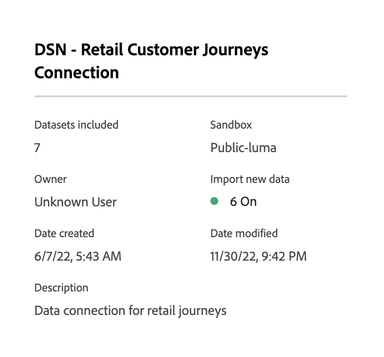
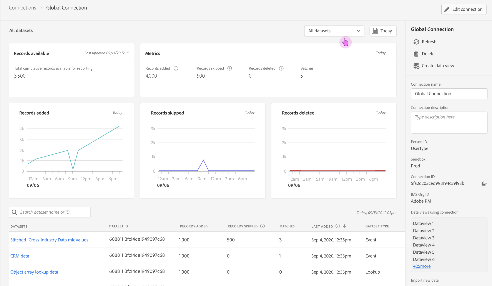
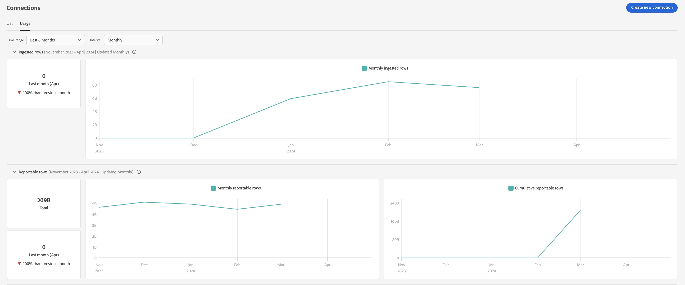

# Verbindingen beheren

Als u eenmaal [een of meer verbindingen hebben gemaakt of bewerkt](/help/connections/create-connection.md), kunt u deze beheren in **[!UICONTROL Connections]**. Via verbindingen kunt u:

* Bekijk al uw verbindingen bij een blik, met inbegrip van de eigenaar, de zandbak, en wanneer de verbindingen werden gecreeerd en werden gewijzigd.
* Bewerk een verbinding.
* Een verbinding verwijderen.
* Maak een gegevensweergave via een verbinding.
* Alle gegevenssets weergeven in een verbinding.
* Controleer de status van de datasets van uw verbinding en de status van het innameproces. Wanneer zijn bijvoorbeeld uw gegevens beschikbaar, zodat u in Analysis Workspace kunt beginnen met rapporteren en analyseren.
* Identificeer om het even welke gegevensdiscrepanties toe te schrijven aan misconfiguration. Ontbreekt u rijen? Zo ja, welke rijen ontbreken en waarom? Hebt u verbindingen verkeerd gevormd en ontbrekende gegevens in Customer Journey Analytics veroorzaakt?
* Krijg inzicht in het gebruik van ingeklapte en te melden rijen over al uw verbindingen.

[!UICONTROL Connections] heeft twee interfaces: [[!UICONTROL List]](#list) en [[!UICONTROL Usage]](#usage).

## Lijst

De [!UICONTROL List] interface is de standaardinterface voor Verbindingen. Als deze optie niet is geselecteerd, selecteert u **[!UICONTROL List]** om de interface te openen.

De [!UICONTROL List] de interface toont een lijst van alle beschikbare verbindingen. U kunt snel naar een verbinding zoeken met de zoekfunctie  doos.

De volgende kolommen of pictogrammen zijn beschikbaar in de tabel.

| Kolom of pictogram | Beschrijving |
| --- | --- |
| [!UICONTROL Name] | De vriendelijke naam van de verbinding. Als u de details van de verbinding wilt zien, selecteert u de naam van de hyperlink. Zie [Verbindingsgegevens](#connection-details). |
|  | Informatie weergeven over [!UICONTROL Datasets included], [!UICONTROL Sandbox], [!UICONTROL Owner]en meer selecteert u  naast de verbindingsnaam.
Een popup venster toont details. 
 |
|  | Naar [een gegevensweergave maken](#create-a-data-view) voor de verbinding selecteert u . Dit pictogram wordt alleen weergegeven wanneer er al geen gegevensweergave is gekoppeld aan de verbinding. |
|  | Selecteren  tot: 
 [Bewerken](#edit-a-connection) een verbinding.
 [Verwijderen](#delete-a-connection) een verbinding.
 [Nieuwe gegevensweergave maken](#create-a-data-view). Aanvullende gegevensweergaven maken voor de verbinding. |
| [!UICONTROL Datasets] | Toont één of meerdere verbindingen aan de datasets die deel van de verbinding uitmaken. U kunt de datasethyperlink selecteren om de dataset in de verbinding te bekijken. Als meer datasets deel van de geselecteerde verbinding uitmaken, selecteer **[!UICONTROL +*x *meer]**om een **[!UICONTROL Datasets included]**deelvenster. Dit paneel toont verbindingen aan alle datasets en een optie om naar een specifieke dataset te zoeken die deel van de verbinding uitmaakt.

Het selecteren van een datasetnaam opent de dataset in Experience Platform UI in een nieuw lusje. |
| [!UICONTROL Sandbox] | Hiermee wordt het dialoogvenster [Experience Platform sandbox](https://experienceleague.adobe.com/docs/experience-platform/sandbox/home.html?lang=nl) waarvan deze verbinding zijn datasets trekt. Deze sandbox werd geselecteerd toen u de verbinding voor het eerst maakte. Het kan niet worden gewijzigd. |
| [!UICONTROL Owner] | De persoon die de verbinding heeft gemaakt. |
| [!UICONTROL Import new data] | Toont het statuut van het invoeren van nieuwe gegevens voor datasets: 
)    **[!UICONTROL _x _Aan]**voor datasets die worden gevormd om nieuwe gegevens in te voeren, en
   **[!UICONTROL _x uit_]** voor datasets niet gevormd om nieuwe gegevens in te voeren. |
| [!UICONTROL Date created] | De tijdstempel op het moment dat de verbinding werd gemaakt. |
| [!UICONTROL Last modified] | De tijdstempel wanneer de verbinding voor het laatst is bijgewerkt. |
| [!UICONTROL Backfill data] | Toont de status voor backfill gegevens over datasets.
   **[!UICONTROL _x _backfills mislukt]**voor het aantal mislukte backfills in verschillende gegevensreeksen,
   **[!UICONTROL _x _backfills-verwerking]**voor het aantal verwerkingsbackfills over gegevensreeksen,
   **[!UICONTROL _x _terugvullingen voltooid]**voor het aantal voltooide terugvullingen voor datasets, en
   **[!UICONTROL _Uit_]** als er geen backfills zijn gedefinieerd voor de gegevenssets in de verbinding. |

Om te vormen welke kolommen om te tonen selecteren , die de **Tabel aanpassen** kunt u kolommen in de tabel in- of uitschakelen.

### Een verbinding bewerken

1. Selecteren  naast de verbindingsnaam
1. Selecteren  **[!UICONTROL Edit]** in het contextmenu.

U kunt ook:

1. Selecteer de verbindingsrij.

1. Selecteren  **[!UICONTROL Edit]** in de blauwe balk.

Wanneer u een verbinding bewerkt, kunt u:

* Nieuwe gegevens beginnen en stoppen.
* Wijzig de naam van een verbinding.
* Vernieuw de gegevensset(s).
* Verwijder dataset/s uit de verbindingen.

Zie [Verbinding maken of bewerken](create-connection.md) voor meer informatie .

### Een verbinding verwijderen {#connections-delete}

1. Selecteren  naast de verbindingsnaam.
1. Selecteren  **[!UICONTROL Delete]**.

U kunt ook:

1. Selecteer de verbindingsrij.

1. Selecteren  **[!UICONTROL Delete]** in de blauwe balk.

Wanneer u een verbinding verwijdert, wordt een **[!UICONTROL Delete connection]** geeft aan welke gegevensweergaven worden verwijderd en welke werkruimteprojecten worden beïnvloed.

Selecteren **[!UICONTROL Continue]** om de verbinding te verwijderen.

Zie [Gevolgen van verwijdering](/help/technotes/deletion.md) voor meer informatie over het verwijderen van een verbinding.

### Een gegevensweergave voor een verbinding maken

* Als er geen gegevensweergave is gekoppeld aan de verbinding:

   1. Selecteren  naast de verbindingsnaam.

* Als er al een of meer gegevensweergaven zijn gemaakt voor de verbinding:

   1. Selecteren  naast de verbindingsnaam.
   1. Selecteren  **[!UICONTROL Create new data view]**.

U kunt ook:

1. Selecteer de verbindingsrij.

1. Selecteren  **[!UICONTROL Create data view]** in de blauwe knopbalk.

Zie [Een gegevensweergave maken of bewerken](/help/data-views/create-dataview.md) voor meer informatie .

### Verbindingsgegevens {#connection-detail}

Als u naar de gegevens voor een verbinding wilt gaan, selecteert u een verbindingsnaam in de tabel met verbindingen.

De interface van de Details van Verbindingen verstrekt een gedetailleerde mening van de status van een verbinding. U kunt:

* Controleer de status van de datasets van uw verbinding en van het innameproces.
* Identificeer configuratieproblemen die overgeslagen of geschrapte verslagen kunnen veroorzaken.
* Zie wanneer de gegevens beschikbaar zijn voor rapportage.

| Gebruikersinterface | Beschrijving |
| --- | --- |
|  [!UICONTROL Edit Connection] | Als u de gegevens van een verbinding wilt bewerken, selecteert u  **[!UICONTROL Edit Connection]**. Zie [Verbinding maken of bewerken](create-connection.md) voor meer informatie . |
| Gegevensset selecteren | Hiermee kunt u een of alle gegevenssets in de verbinding kiezen. U kunt geen datasets selecteren. Standaardwaarden: [!UICONTROL All datasets]. |
| Selector datumbereik | Begindatum, einddatum bewerken of  om de gegevensbereikkiezer te openen. Selecteer in de datumbereikkiezer een datumbereik met een van de vooraf gedefinieerde punten (bijvoorbeeld **[!UICONTROL Last 6 months]**) of gebruik de kalender om de begin- en einddatum te selecteren. Selecteren **[!UICONTROL Apply]** om het nieuwe gegevensbereik toe te passen. |
| [!UICONTROL Records of event data available] | Het totale aantal rijen van de gebeurtenisdataset beschikbaar voor rapportering, **voor de volledige verbinding**. Deze telling is onafhankelijk van enige kalendermontages. De telling verandert als u een dataset van de datasetselecteur selecteert of door een dataset in de lijst te selecteren. Als er gegevens zijn toegevoegd, is er een vertraging van 1-2 uur om de gegevens in de rapportage weer te geven. |
| [!UICONTROL Metrics] | Vat de gebeurtenis, raadpleging en de verslagen van de profieldataset samen die worden toegevoegd, overgeslagen, en geschrapt, en het aantal toegevoegde partijen, **voor de dataset en de datumwaaier u hebt geselecteerd**.
Selecteren **[!UICONTROL Check detail]** om de **[!UICONTROL Check skipped detail]** popup. popup maakt een lijst van het aantal overgeslagen verslagen en de reden voor alle gebeurtenisdatasets of geselecteerde dataset.

Selecteren  popup met meer informatie. Om sommige overgeslagen redenen, zoals [!UICONTROL Empty visitor ID], toont popup Steekproef PSQL voor EQS (Experience Platform voor de Dienst van de Vraag) u kunt gebruiken binnen [Query-service](https://experienceleague.adobe.com/docs/experience-platform/query/home.html?lang=nl) om voor de overgeslagen verslagen in de dataset te vragen. Selecteren  **[!UICONTROL Copy sample PSQL for EQS]** om de SQL te kopiëren. |
| [!UICONTROL Records added] | Geeft aan hoeveel rijen zijn toegevoegd in de geselecteerde tijdsperiode. **voor de dataset en de datumwaaier u hebt geselecteerd**. Om de 10 minuten bijgewerkt. |
| [!UICONTROL Records skipped] | Geeft aan hoeveel rijen zijn overgeslagen in de geselecteerde tijdsperiode. **voor de dataset en de datumwaaier u hebt geselecteerd**. Redenen voor het overslaan van records zijn onder andere: ontbrekende tijdstempels, ontbrekende of ongeldige personen-id enzovoort. Om de 10 minuten bijgewerkt. 
Ongeldige personen-id&#39;s (zoals `undefined`, of `00000000`of een combinatie van cijfers en letters in een [!UICONTROL Person ID] die in een gebeurtenis meer dan 1 miljoen keer in een bepaalde maand voorkomt) zijn id&#39;s die niet aan een specifieke gebruiker of persoon kunnen worden toegewezen. Deze rijen kunnen niet in het systeem worden opgenomen en in fout-prone opname en rapportering resulteren. U kunt ongeldige personen-id&#39;s corrigeren aan de hand van drie opties:<ul><li>Gebruiken [Stiksel](/help/stitching/overview.md) om de ongedefinieerde of helemaal geen gebruikers-id te vullen met geldige gebruikers-id&#39;s.</li><li>Maak de gebruikersnaam leeg. Deze wordt overgeslagen tijdens het invoeren (voorkeur aan ongeldige of geen gebruikers-id&#39;s).</li><li>Corrigeer eventuele ongeldige gebruikers-id&#39;s in uw systeem voordat u de gegevens opneemt.</li></ul> |
| [!UICONTROL Records] verwijderd | Geeft aan hoeveel rijen zijn verwijderd in de geselecteerde tijdsperiode. **voor de dataset en de datumwaaier u hebt geselecteerd**. Iemand heeft mogelijk een gegevensset verwijderd in [!DNL Experience Platform], bijvoorbeeld. Om de 10 minuten bijgewerkt.
In sommige scenario&#39;s, kan deze waarde ook verslagen omvatten die, zoals met het stitching of sommige updates van de raadplegingsdataset worden vervangen. Bekijk dit voorbeeld:
<ul><li>U uploadt één verslag aan een individuele dataset van het Profiel XDM, die CJA wordt gevormd om als gegevens van de profielraadpleging in te voeren. In de verbindingsdetails, zou deze dataset 1 toegevoegde verslag tonen.</li><li>U uploadt een duplicaat van de oorspronkelijke record naar dezelfde AEP-gegevensset, die nu twee records bevat. CJA neemt het extra verslag van de dataset van de profielraadpleging op. Aangezien CJA al een profielrecord heeft opgenomen in de verbinding voor die persoon-id, verwijdert CJA zijn eerdere versie en voegt CJA de nieuwe profielgegevens toe. In de verbindingsdetails, zou deze actie 1 toegevoegde verslag en 1 schrapte verslag vertegenwoordigen, omdat CJA slechts de meest recente gegevens van de profielraadpleging voor om het even welke opgenomen persoonsidentiteitskaart behoudt.</li><li>In totaal bevat de AEP-gegevensset twee records die identiek zijn. De CJA-verbindingsdetails geven afzonderlijk de status van de opgenomen gegevens weer: 2 records toegevoegd en 1 record verwijderd voor deze profielgegevensset. </li></ul> |
|  _Naam of id van gegevensset zoeken_ | Veld voor het zoeken naar gegevenssets. U kunt de datasetlijst door datasetnaam zoeken of [!UICONTROL Dataset ID]. |
| [!UICONTROL Datasets table] | Toont de datasets die deel van de verbinding uitmaken. |
| [!UICONTROL Datasets] | Toont de naam van de dataset die deel van de verbinding uitmaakt. U kunt de hyperlink selecteren om de dataset in Experience Platform UI op een nieuw lusje te openen. U kunt de rij of checkbox selecteren om details voor de geselecteerde dataset slechts te tonen. |
| [!UICONTROL Dataset ID] | Automatisch gegenereerd door Experience Platform. |
| [!UICONTROL Records added] | Het aantal datasetverslagen (rijen) die aan een verbinding tijdens het geselecteerde tijdinterval worden toegevoegd. |
| [!UICONTROL Records skipped] | Het aantal datasetverslagen (rijen) die tijdens gegevensoverdracht voor een verbinding tijdens het geselecteerde tijdinterval worden overgeslagen. |
| [!UICONTROL Records deleted] | Het aantal datasetverslagen (rijen) die uit een verbinding tijdens het geselecteerde tijdinterval worden verwijderd. |
| [!UICONTROL Batches added] | Het aantal gegevenssetpartijen is toegevoegd aan een verbinding. |
| [!UICONTROL Last added] | De tijdstempel van de laatste batch uit de dataset die is toegevoegd aan een verbinding. |
| [!UICONTROL Data source type] | Het brontype van de dataset. U definieert het brontype wanneer u een verbinding maakt. |
| [!UICONTROL Dataset type] | Het gegevenstype van de dataset voor deze dataset. Type kan [!UICONTROL Event], [!UICONTROL Lookup], of [!UICONTROL Profile]. [Meer informatie](https://experienceleague.adobe.com/docs/analytics-platform/using/cja-connections/create-connection.html#configure-dataset) |
| Schema | Het schema van het Experience Platform waarop de dataset is gebaseerd. |
| [!UICONTROL Import new data] | Toont het statuut van het invoeren van nieuwe gegevens voor de dataset: 
   **[!UICONTROL _x _Aan]**als de dataset wordt gevormd om nieuwe gegevens in te voeren, en
   **[!UICONTROL _x uit_]** als de dataset wordt gevormd om nieuwe gegevensimport niet in te voeren. |
| [!UICONTROL Transform data] | Toont de transformatiestatus van toepasselijke B2B raadplegingsdatasets. Zie [Gegevenssets transformeren voor B2B-zoekopdrachten](transform-datasets-b2b-lookups.md) voor meer informatie .
   **[!UICONTROL _x _Aan]**voor toepasselijke gegevensreeksen die voor omzetting zijn ingeschakeld, 
   **[!UICONTROL _x uit_]** voor de toepasselijke gegevensreeksen die niet voor omzetting zijn ingeschakeld, en
**[!UICONTROL N/A]** voor alle andere gegevensreeksen, niet van toepassing voor omzetting. |
| [!UICONTROL Backfill data] | Toont het statuut van backfill gegevens voor de dataset.
   **[!UICONTROL _x _backfills mislukt]**voor het aantal mislukte backfills,
   **[!UICONTROL _x _backfills-verwerking]**voor het aantal backfills-verwerkingen,
   **[!UICONTROL _x _terugvullingen voltooid]**voor het aantal voltooide backfills, en
   **[!UICONTROL _Uit_]** als er geen backfills zijn geconfigureerd. |
| [!UICONTROL Import new data] | Toont het statuut van het invoeren van nieuwe gegevens voor de dataset: 
   **[!UICONTROL _x _Aan]**als de dataset wordt gevormd om nieuwe gegevens in te voeren, en
   **[!UICONTROL _x uit_]** als de dataset wordt gevormd om nieuwe gegevens niet in te voeren. |
| [!UICONTROL Backfill data] | Toont het statuut van backfill gegevens voor de dataset.
   **[!UICONTROL _x _backfills mislukt]**voor het aantal mislukte backfills,
   **[!UICONTROL _x _backfills-verwerking]**voor het aantal backfills-verwerkingen,
   **[!UICONTROL _x _terugvullingen voltooid]**voor het aantal voltooide backfills, en
   **[!UICONTROL _Uit_]** als er geen backfills zijn geconfigureerd. |

>[!IMPORTANT]
>
>Gegevens die vóór 13 augustus 2021 zijn ingevoerd, worden niet weergegeven in de [!UICONTROL Connections] interface.

#### Deelvenster Verbinding

Wanneer geen dataset in de datasetlijst wordt geselecteerd, toont een paneel op de rechterkant van de interface van Verbindingen verbindingsopties en details.

| Opties/details | Beschrijving |
| --- | --- |
|  [!UICONTROL Refresh] | Als u de verbinding wilt vernieuwen en wilt toestaan dat recent toegevoegde records worden gereflecteerd, selecteert u  **[!UICONTROL Refresh]**. |
|  **[!UICONTROL Delete]** | [Verwijderen](#delete-a-connection) deze verbinding. |
|  **[!UICONTROL Create data view]** | [Een gegevensweergave maken](#create-a-data-view) op basis van deze verbinding. Zie [Gegevensweergaven](https://experienceleague.adobe.com/docs/analytics-platform/using/cja-dataviews/data-views.html) voor meer informatie . |
| [!UICONTROL Connection name] | Toont de vriendschappelijke naam van de verbinding. |
| [!UICONTROL Connection description] | Toont een meer gedetailleerde beschrijving die het doel van deze verbinding beschrijft. |
| [!UICONTROL Sandbox] | De [Experience Platform sandbox](https://experienceleague.adobe.com/docs/experience-platform/sandbox/home.html?lang=nl) van waaruit deze verbinding zijn dataset(s) trekt. Deze sandbox werd geselecteerd toen u de verbinding voor het eerst maakte. Het kan niet worden gewijzigd. |
| [!UICONTROL Connection ID] | Deze id wordt gegenereerd in Experience Platform. U kunt  om de id te kopiëren. |
| [!UICONTROL Data views using connection] | Hier worden alle gegevensweergaven weergegeven die deze verbinding gebruiken. |
| [!UICONTROL Import new data] | Toont het statuut van het invoeren van nieuwe gegevens voor datasets: 
   **[!UICONTROL _x _Aan]**voor hoeveel datasets worden gevormd om nieuwe gegevens in te voeren, en
   **[!UICONTROL _x uit_]** voor hoeveel datasets de nieuwe gegevensimport wordt uitgezet. |
| [!UICONTROL Backfill data] | Toont het statuut van backfill gegevens voor datasets.
   **[!UICONTROL _x _backfills mislukt]**voor het aantal mislukte backfills in verschillende gegevensreeksen,
   **[!UICONTROL _x _backfills-verwerking]**voor het aantal verwerkingsbackfills over gegevensreeksen,
   **[!UICONTROL _x _terugvullingen voltooid]**voor het aantal voltooide terugvullingen voor datasets, en
   **[!UICONTROL _Uit_]** als er geen backfills zijn gedefinieerd voor de gegevenssets in de verbinding. |
| Transformatiegegevens | Toont de transformatiestatus van toepasselijke B2B raadplegingsdatasets. Zie [Gegevenssets transformeren voor B2B-zoekopdrachten](transform-datasets-b2b-lookups.md) voor meer informatie .
   **[!UICONTROL _x _Aan]**voor het aantal gegevenssets dat voor transformatie is ingeschakeld. |
| [!UICONTROL Created by] | Hiermee wordt de naam weergegeven van de persoon die de verbinding heeft gemaakt. |
| [!UICONTROL Last modified] | Hier wordt het tijdstempel van de laatste wijziging in de verbinding weergegeven. |
| [!UICONTROL Last modified by] | Toont de persoon die de verbinding het laatst heeft gewijzigd. |

#### Deelvenster Gegevensset

Wanneer een dataset in de datasetlijst wordt geselecteerd, toont een paneel op de rechterkant van de interface van Verbindingen details voor de geselecteerde dataset.

| Details | Beschrijving |
| --- | --- |
| [!UICONTROL Person ID] | Toont een identiteit die in het datasetschema in het Experience Platform werd bepaald. Dit is de persoon-id die u hebt geselecteerd tijdens het maken van de verbinding. Als u een verbinding creeert die datasets met verschillende IDs omvat, weerspiegelt het melden dat. Om datasets samen te voegen, moet u zelfde identiteitskaart van de Persoon over datasets gebruiken. |
| [!UICONTROL Key] | Toont de sleutel die u voor een raadplegingsdataset hebt gespecificeerd. |
| [!UICONTROL Matching Key] | Toont de passende sleutel die u voor een raadplegingsdataset hebt gespecificeerd. |
| [!UICONTROL Timestamp] | Toont timestamp die voor een gebeurtenisdataset wordt bepaald. |
| [!UICONTROL Records available] | Toont het totale aantal rijen die voor deze dataset, voor de bepaalde tijdspanne worden opgenomen die door de kalender wordt geselecteerd. Er is geen latentie in termen van het krijgen van de gegevens om in rapportering te verschijnen, zodra het wordt toegevoegd. Wanneer u echter een gloednieuwe verbinding maakt, is er [latentie](https://experienceleague.adobe.com/docs/analytics-platform/using/cja-overview/cja-faq.html#3.-getting-data-into-customer-trip-analytics). |
| [!UICONTROL Records added] | Hiermee kunt u zien hoeveel rijen zijn toegevoegd in de geselecteerde tijdsperiode. |
| [!UICONTROL Records deleted] | Toont hoeveel verslagen tijdens de geselecteerde tijdspanne werden geschrapt. |
| [!UICONTROL Batches added] | Toont hoeveel gegevensbatches in deze dataset werden toegevoegd. |
| [!UICONTROL Records skipped] | Hiermee kunt u zien hoeveel rijen tijdens de opname zijn overgeslagen in de geselecteerde tijdsperiode.
Redenen voor het overslaan van records zijn onder andere: ontbrekende tijdstempels, ontbrekende of ongeldige personen-id enzovoort. Om de 10 minuten bijgewerkt.
Ongeldige personen-id&#39;s (zoals `undefined`, of `00000000`of een combinatie van cijfers en letters in een [!UICONTROL Person ID] die in een gebeurtenis meer dan 1 miljoen keer in een bepaalde maand voorkomt) zijn id&#39;s die niet aan een specifieke gebruiker of persoon kunnen worden toegewezen. Deze rijen kunnen niet in het systeem worden opgenomen en in fout-prone opname en rapportering resulteren. U kunt ongeldige personen-id&#39;s corrigeren aan de hand van drie opties:<ul><li>Gebruiken [Stiksel](/help/stitching/overview.md) om de ongedefinieerde of helemaal geen gebruikers-id te vullen met geldige gebruikers-id&#39;s.</li><li>Maak de gebruikersnaam leeg, die vervolgens tijdens de inname wordt overgeslagen (bij voorkeur aan ongeldige of helemaal geen gebruikers-id&#39;s).</li><li>Corrigeer eventuele ongeldige gebruikers-id&#39;s in uw systeem voordat u de gegevens opneemt.</li></ul> |
| [!UICONTROL Last added] | Toont wanneer de laatste partij werd toegevoegd. |
| [!UICONTROL Import new data] | Toont het statuut van het invoeren van nieuwe gegevens voor de dataset: 
   **[!UICONTROL _x _Aan]**als de dataset wordt gevormd om nieuwe gegevens in te voeren, en
   **[!UICONTROL _x uit_]** als de dataset wordt gevormd om nieuwe gegevens niet in te voeren. |
| [!UICONTROL Backfill data] | Toont het statuut van backfill gegevens voor de dataset.
   **[!UICONTROL _x _backfills mislukt]**voor het aantal mislukte backfills,
   **[!UICONTROL _x _backfills-verwerking]**voor het aantal backfills-verwerkingen,
   **[!UICONTROL _x _terugvullingen voltooid]**voor het aantal voltooide backfills, en
   **[!UICONTROL _Uit_]** als er geen backfills zijn geconfigureerd.
Om een dialoog met een overzicht van de vroegere backfills voor de dataset te tonen, selecteer  **[!UICONTROL Past backfills]**. |
| [!UICONTROL Data source type] | Het type van gegevensbron zoals bepaald toen het toevoegen van de dataset aan de verbinding. |
| [!UICONTROL Dataset type] | Willekeurig [!UICONTROL Event], [!UICONTROL Lookup], of [!UICONTROL Profile]. [Meer informatie](https://experienceleague.adobe.com/docs/analytics-platform/using/cja-connections/create-connection.html#configure-dataset) |
| [!UICONTROL Schema] | Toont het schema van het Experience Platform dat deze dataset op gebaseerd is. |
| [!UICONTROL Dataset ID] | Deze dataset-id wordt gegenereerd in Experience Platform. |

## Gebruik

De [!UICONTROL Usage] de interface toont het gebruik van ingeklapte en te melden rijen over alle verbindingen. Deze interface ondersteunt u om te bepalen of uw gebruik van de Customer Journey Analytics voldoet aan wat contractueel is overeengekomen.

Selecteer de **[!UICONTROL Usage]** om de interface te openen.

### Rapport over gebruik

1. Selecteer een **[!UICONTROL Time range]**. U kunt kiezen tussen **[!UICONTROL Last 6 months]**, **[!UICONTROL Year to date]**, of **[!UICONTROL Last 2 Years]**.
1. Selecteer een **[!UICONTROL Interval]**. U kunt kiezen tussen **[!UICONTROL Monthly]** of **[!UICONTROL Quarterly]**.

Voor [!UICONTROL Ingested rows]:

* In een deelvenster worden de totaal opgenomen rijen weergegeven die alle gebeurtenisgegevens bevatten voor alle verbindingen die op elke 2de dag van een maand worden bijgewerkt. In het deelvenster:
   * in een vak wordt het aantal rijen aangegeven dat de laatste maand is ingevoerd en de wijziging in % (aangegeven door middel van cijfers of ▼) van de vorige maand.
   * een lijngrafiek geeft de ◼︎ weer [!UICONTROL Monthly ingested rows]. Als u een pop-up wilt zien die het aantal per maand ingenomen rijen voor een maand weergeeft, plaatst u de muisaanwijzer boven een willekeurig gegevenspunt in de lijngrafiek.

Voor [!UICONTROL Reportable rows]:

* In een deelvenster worden de totale aantal te rapporteren rijen weergegeven, die alle gebeurtenisgegevens bevatten voor alle verbindingen die op elke tweede dag van een maand worden bijgewerkt. In het deelvenster:
   * in een vak wordt het cumulatieve totale aantal te rapporteren rijen weergegeven.
   * in een vak wordt het totale aantal te rapporteren rijen voor de laatste maand en de wijziging in % (aangegeven door middel van cijfers of ▼) van de vorige maand vermeld.
   * een lijngrafiek geeft de ◼︎ weer [!UICONTROL Monthly reportable rows]. Als u een pop-up wilt weergeven die het aantal cumulatieve te rapporteren rijen voor een bepaalde maand weergeeft, plaatst u de muisaanwijzer boven een willekeurig gegevenspunt in de lijngrafiek.
   * een lijngrafiek geeft de ◼︎ weer [!UICONTROL Cumulative reportable rows]. Als u een pop-up wilt weergeven die het aantal maandelijkse te rapporteren rijen voor een maand weergeeft, plaatst u de muisaanwijzer boven een willekeurig gegevenspunt in de lijngrafiek.

>[!MORELIKETHIS]
>
>[Verbindingsinstellingen weergeven, problemen oplossen en wijzigen](https://experienceleague.adobe.com/docs/customer-journey-analytics-learn/tutorials/connections/connections-details-experience-in-cja.html) zelfstudie.
