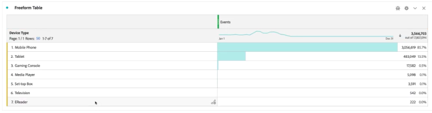

# Standaardraadplegingen toevoegen aan uw datasets

>[!IMPORTANT]
>
>De standaard Lookups zijn slechts beschikbaar voor de gegevensbronnen van de bron van de Analyse schakelaar in Customer Journey Analytics. U kunt hen met standaardAdobe Analytics implementaties, of het [ Web SDK van Adobe Experience Platform ](https://experienceleague.adobe.com/docs/experience-platform/edge/home.html), of de de gegevensinzameling APIs van Experience Platform gebruiken.
>

De standaardraadplegingen (ook genoemd als Adobe-Geleide raadplegingen) verbeteren de capaciteit van Customer Journey Analytics om op sommige dimensies/attributen te melden die niet nuttig door zich zijn maar wanneer zich bij andere gegevens gevoegd. Voorbeelden zijn kenmerken van mobiele apparaten en kenmerken van de afmetingen van het besturingssysteem en de browser, zoals versienummers van de browser. Een &quot;StandaardOpzoeken&quot;is gelijkaardig aan een raadplegingsdataset. Standaardzoekopdrachten zijn van toepassing op alle Experience Cloud-organisaties. Zij worden automatisch toegepast op alle gebeurtenisdatasets die bepaalde XDM schemagebieden (zie hieronder voor de specifieke gebieden.) bevatten een standaardraadplegingsdataset bestaat voor elke schemaplaats die Adobe classificeert.

In traditionele Adobe Analytics worden deze dimensies op zichzelf weergegeven, terwijl in Customer Journey Analytics deze dimensies actief moeten worden opgenomen wanneer u gegevensweergaven maakt. In het werkschema van Verbindingen, selecteert u een dataset die als met een sleutel voor standaardraadpleging wordt gemarkeerd. De interface voor gegevensweergaven weet automatisch dat alle standaardopzoekafmetingen moeten worden opgenomen, zoals beschikbaar is voor rapportage. De opzoekbestanden worden automatisch bijgewerkt en beschikbaar gehouden in alle regio&#39;s en voor alle accounts. Zij worden opgeslagen in regio-specifieke organisaties verbonden aan de klant.

## Standaardraadplegingen gebruiken met de gegevenssets van de bronconnector van Analytics

De standaard raadplegingsdatasets worden automatisch toegepast op rapporttijd. Als u de bronschakelaar van de Analyse gebruikt en u in een afmeting brengt waarvoor Adobe een standaardraadpleging verstrekt, passen wij automatisch deze standaardraadpleging toe. Als een gebeurtenisdataset XDM gebieden bevat, kunnen wij standaardraadplegingen op het toepassen.

<!--
### Specific IDs that need to be populated

The following IDs need to be populated in the specific XDM mixins for this functionality to work:

* Environment Details Mixin – device/typeID value populated - Must match Device Atlas IDs and will populate device data.
* Adobe Analytics ExperienceEvent Template Mixin or Adobe Analytics ExperienceEvent Full Extension Mixin with analytics/environment/browserIDStr and analytics/environment/operatingSystemIDStr. Both must match the Adobe IDs and  populate browser and OS data, respectively.

You need these mixins with the three IDs populated (device/typeID, environment/browserIDStr, and environment/operatingSystemIDStr). The lookup dimensions will then be pulled automatically by Customer Journey Analytics and will be available in the Data View.

The catch here is that they can only populate those IDs today if they have a direct relationship with Device Atlas. They are Device Atlas IDs, and they provide an API to allow a customer to look them up. This is a significant hurdle, and we may just want to take the reference to this capability out of the product documentation until we have a productized way to expose the Device Atlas ID lookup functionality.
-->

### Beschikbare standaardopzoekvelden

* `browser`
   * `browser`, `group_id`, `id`
* `browser_group`
   * `browser_group`, `id`
* `os`
   * `os`, `group_id`, `id`
* `os_group`
   * `os_group`, `id`
* `mobile_audio_support - multi`
* `mobile_color_depth`
* `mobile_cookie_support`
* `mobile_device_name`
* `mobile_device_number_transmit`
* `mobile_device_type`
* `mobile_drm - multi`
* `mobile_image_support - multi`
* `mobile_information_services`
* `mobile_java_vm - multi`
* `mobile_mail_decoration`
* `mobile_manufacturer`
* `mobile_max_bookmark_url_length`
* `mobile_max_browser_url_length`
* `mobile_max_mail_url_length`
* `mobile_net_protocols - multi`
* `mobile_os`
* `mobile_push_to_talk`
* `mobile_screen_height`
* `mobile_screen_size`
* `mobile_screen_width`
* `mobile_video_support - multi`

## Rapport over standaardopzoekafmetingen

Om op de standaardraadplegingsdimensies van Adobe te rapporteren, moet u één of meer van deze dimensies toevoegen wanneer u a [ gegevensmening ](/help/data-views/data-views.md) in Customer Journey Analytics creeert. In **[!UICONTROL Data view]** > **[!UICONTROL Components]** :

1. Selecteer **[!UICONTROL Schema fields]** in het vervolgkeuzemenu in de linkertrack.
1. Selecteer **[!UICONTROL Adobe lookups]** in de lijst met containers voor schemavelden.
1. Blader omlaag naar **[!UICONTROL Browser]** , **[!UICONTROL Mobile]** of **[!UICONTROL Operating System]** totdat u de dimensie vindt die u wilt toevoegen.
1. Sleep de dimensie naar de **[!UICONTROL Metrics]** - of **[!UICONTROL Dimensions]** -tabel in **[!UICONTROL Included components]** .

   

Vervolgens kunt u de opzoekgegevens in Workspace gebruiken:

 tonen
