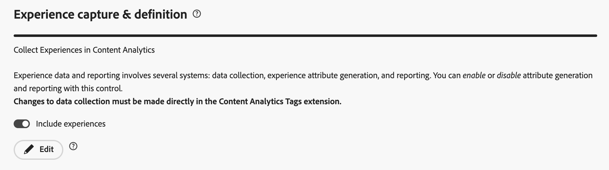
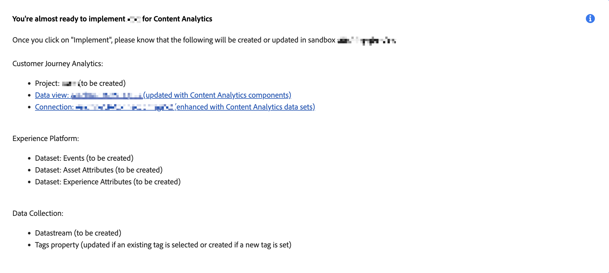

# Configuratie met instructies voor inhoudsanalyse

>[!WARNING]
>
>Dit artikel is een voorlopige niet-officiële ontwerpversie van een toekomstige definitieve versie en maakt deel uit van de documentatie van Content Analytics. Alle inhoud kan worden gewijzigd en er kunnen geen wettelijke verplichtingen uit de huidige versie van dit artikel worden afgeleid.
>

{{release-limited-testing}}

De geleide configuratie helpt u om Inhoud Analytics snel en gemakkelijk te vormen. De configuratie met instructies gebruikt een wizard om de vereisten in te stellen voor het automatisch configureren van Content Analytics voor uw organisatie. In het **[!UICONTROL Configuration]** scherm, kunt u of een nieuwe configuratie tot stand brengen of een bestaande configuratie uitgeven.

>[!IMPORTANT]
>
>Per sandbox in uw organisatie kunt u slechts één configuratie voor Content Analytics-gegevens gebruiken.

De configuratie voor inhoudanalyse openen

* Selecteer **[!UICONTROL Data Management]** > **[!UICONTROL Content Analytics]** in het hoofdmenu in Customer Journey Analytics.

In het scherm van de Configuratie van de Analyse van de Inhoud, ziet u een lijst van bestaande configuraties van de Analytics van de Inhoud.

{de configuraties van de Analytics van 0} Inhoud ](../assets/aca-configuration-table.png)
Voor elke configuratie zijn de volgende details beschikbaar:![

| Kolom | Beschrijving |
|---|---|
| **[!UICONTROL Name]** | De naam van de configuratie. |
| **[!UICONTROL Created by]** | De technische rekening die de configuratie creeerde. |
| **[!UICONTROL Created on]** | De tijdstempel op het moment dat de configuratie werd gemaakt. |
| **[!UICONTROL Modified on]** | De tijdstempel wanneer de configuratie voor het laatst is gewijzigd. |
| **[!UICONTROL Sandbox]** | De sandbox binnen de organisatie waarin Content Analytics is (gepland) geconfigureerd en geïmplementeerd. |
| **[!UICONTROL Status]** | De status van de configuratie. De status kan zijn:  **[!UICONTROL Draft]**: De configuratie wordt bewaard voor later, en niet opgesteld.  **[!UICONTROL Failed]**: De configuratie heeft ontbroken. U moet de configuratie bewerken en de benodigde wijzigingen aanbrengen.  **[!UICONTROL Complete]**: de configuratie is voltooid en met succes uitgevoerd. |

U kunt  om de lijst aan te passen. Selecteer welke kolommen u wilt weergeven in het dialoogvenster **[!UICONTROL Customize table]** en selecteer **[!UICONTROL Apply]** om de wijzigingen toe te passen.

Via het scherm Content Analytics **[!UICONTROL Configuration]** kunt u een nieuwe configuratie maken of een bestaande configuratie bewerken.

Een nieuwe configuratie maken:

* Selecteer **[!UICONTROL Create configuration]** . Met deze handeling opent u de wizard voor configuratie met instructies.

Een bestaande configuratie bewerken:

* Selecteer  en dan  **[!UICONTROL Edit]** voor een bestaande configuratie van de Analyse van de Inhoud uit. Met deze handeling opent u de wizard voor configuratie met instructies.

## Wizard Begeleide configuratie

De geleide configuratietovenaar bestaat uit vier secties ([ Details ](#details), [ mening van Gegevens ](#data-view), [ Vangst &amp; definitie van de Ervaring ](#experience-capture-and-definition), en [ de inzameling van Gegevens ](#data-collection)), elk die u voor details vragen die aan opstelling behoorlijk worden vereist en Inhoud Analytics vormen. Voltooi elke sectie voordat u naar de volgende sectie gaat, omdat bepaalde instellingen in een sectie mogelijk afhankelijk zijn van configuratiewaarden in eerdere secties.

### Details {#onboarding-details}

<!-- markdownlint-disable MD034 -->

>[!CONTEXTUALHELP]
>id="aca_onboarding_details_button"
>title="Details"
>abstract="Geef een naam op voor de verbinding. In de secties **[!UICONTROL Data view]** , **[!UICONTROL Experience capture and definition]** en **[!UICONTROL Data collection]** geeft u meer informatie om ervoor te zorgen dat Content Analytics correct kan worden geconfigureerd."

>[!CONTEXTUALHELP]
>id="aca_onboarding_details_name_header"
>title="Details"
>abstract="Deze handleiding stelt de vereisten in die nodig zijn om Content Analytics te configureren. Geef een naam op voor deze configuratie"

<!-- markdownlint-enable MD034 -->

Voor elke configuratie is een unieke naam vereist. Bijvoorbeeld `Example Content Analytics configuration` .

### Gegevens, weergave {#onboarding-data-view}

<!-- markdownlint-disable MD034 -->

>[!CONTEXTUALHELP]
>id="ac_onboarding_dataview_button"
>title="Gegevens, weergave"
>abstract="Voor de configuratie van Content Analytics moet u een bestaande gegevensweergave selecteren. U kunt de analysegegevens van de inhoud dus samenvoegen met andere gegevens."

>[!CONTEXTUALHELP]
>id="aca_onboarding_dataview_header"
>title="Gegevens, weergave"
>abstract="Selecteer in Customer Journey Analytics een bestaande gegevensweergave waarin u de analysegegevens voor de inhoud wilt samenvoegen."

>[!CONTEXTUALHELP]
>id="aca_onboarding_dataview_header_alt"
>title="Gegevens, weergave"
>abstract="Selecteer een bestaande gegevensweergave in Customer Journey Analytics waarmee u de analysegegevens van de inhoud wilt samenvoegen. "

<!-- markdownlint-enable MD034 -->

Uw configuratie vereist de selectie van de mening van a [ Gegevens ](/help/data-views/data-views.md).

Een gegevensweergave selecteren:

1. Gebruik  **[!UICONTROL Select Data view]**. U ziet een dialoogvenster **[!UICONTROL Data view]** waarin u een gegevensweergave voor uw configuratie kunt selecteren.

   Als u een nieuwe configuratie creeert, toont de lijst slechts de meningen van Gegevens die met zandbakken worden geassocieerd die geen actieve configuratie hebben.
Als u een bestaande configuratie bewerkt, worden in de lijst alleen de gegevensweergaven weergegeven die beschikbaar zijn in de sandbox die al is gekoppeld aan de bestaande configuratie.

   * Om de lijst van beschikbare meningen van Gegevens te filtreren, selecteer . U kunt de lijst filteren op Verbinding, Eigenaar en Sandbox. **[!UICONTROL Hide filters]** om de filterruit te verbergen. 
   * Om te bepalen welke kolommen in de lijst te tonen, selecteer . Selecteer welke kolommen u wilt weergeven in het dialoogvenster **[!UICONTROL Customize table]** en selecteer **[!UICONTROL Apply]** om de wijzigingen toe te passen.
1. Selecteer **[!UICONTROL Save]** om de geselecteerde gegevensweergave te bevestigen. Selecteer **[!UICONTROL Cancel]** om te annuleren.

Een mening van Gegevens is gebonden aan een Verbinding van Customer Journey Analytics . En een Verbinding is gebaseerd op een zandbak binnen uw organisatie. Nadat u de configuratie hebt opgeslagen, wordt **[!UICONTROL Sandbox]** automatisch gevuld met de juiste naam van de sandbox op basis van de geselecteerde gegevensweergave.

### Vastleggen en definiëren van ervaring {#onboarding-experiences}

<!-- markdownlint-disable MD034 -->

>[!CONTEXTUALHELP]
>id="aca_onboarding_experiences_button"
>title="Vastleggen en definiëren van ervaring"
>abstract="U kunt Ervaringen opnemen in de gegevens die u verzamelt met Content Analytics. Wanneer geselecteerd, moet u één of meerdere combinaties regex en vraagparameters bepalen om te bepalen waarvoor URLs u ervaringen wilt omvatten."

>[!CONTEXTUALHELP]
>id="aca_onboarding_experiences_header"
>title="Vastleggen en definiëren van ervaring"
>abstract="Ervaringen verzamelen in Content Analytics"

>[!CONTEXTUALHELP]
>id="aca_onboarding_experiences_url_header"
>title="Vastleggen en definiëren van ervaring"
>abstract="URL&#39;s opgeven waarop de onderstaande parameters van toepassing zijn"

>[!CONTEXTUALHELP]
>id="aca_onboarding_experiences_edit_button"
>title="Vastleggen en definiëren van ervaring"
>abstract="U kunt de instellingen in de extensie Adobe Content Analytics bewerken in de eigenschap Tag die is gekoppeld aan de geselecteerde configuratie."

<!-- markdownlint-enable MD034 -->

In deze sectie kunt u Ervaringen opnemen in de gegevens die u verzamelt met Content Analytics.  Een ervaring is alle tekst op een webpagina die reproduceerbaar is met de URL die wordt gebruikt door de eerste gebruiker die die webpagina bezoekt.

Standaard is **[!UICONTROL Include experiences]** uitgeschakeld. Als deze optie is geselecteerd, moet u definiëren voor welke URL&#39;s u ervaringen wilt opnemen.

Ervaringen opnemen in een nieuwe of niet geïmplementeerde configuratie:

1. Schakel **[!UICONTROL Include experiences]** in.
1. Geef de parameters op die bepalen hoe inhoud op uw website wordt weergegeven. De parameters zijn nul of meer combinaties van a **[!UICONTROL Domain regular expression]** en **[!UICONTROL Query parameters]**.
   1. Voer een **[!UICONTROL Domain regular expression]** in, bijvoorbeeld `(?!.*\b(store|help|admin)\b)` .
   1. Geef een door komma&#39;s gescheiden lijst op van **[!UICONTROL Query parameters,]** bijvoorbeeld `outdoors, patio, kitchen` .
1. Selecteer **[!UICONTROL Remove]** als u een combinatie van de reguliere expressie van het domein en queryparameters wilt verwijderen.
1. Selecteer **[!UICONTROL Add another]** als u een andere combinatie van een reguliere expressie en queryparameters wilt toevoegen.

Bestaande bewerkingen uitvoeren of nieuwe ervaringen opnemen in een geïmplementeerde configuratie:

* Selecteer  uitgeeft om de parameters in de uitbreiding van de Analyse van de Inhoud van Adobe in het bezit van de Markering uit te geven, verbonden aan de geselecteerde configuratie.

### Dataverzameling {#onboarding-data-collection}

<!-- markdownlint-disable MD034 -->

>[!CONTEXTUALHELP]
>id="aca_onboarding_datacollection_button"
>title="Dataverzameling"
>abstract="Bepaal welke eigenschap Tag u wilt gebruiken of maak een nieuwe eigenschap. Definieer met behulp van reguliere expressies de pagina&#39;s en elementen die u wilt opnemen of uitsluiten."

>[!CONTEXTUALHELP]
>id="aca_onboarding_datacollection_tag_header"
>title="Dataverzameling"
>abstract="Een eigenschap voor een tag opgeven"

>[!CONTEXTUALHELP]
>id="aca_onboarding_datacollection_pages_excluded_boldheader"
>title="Dataverzameling"
>abstract="**Pagina&#39;s om te omvatten/uit te sluiten**"

>[!CONTEXTUALHELP]
>id="aca_onboarding_datacollection_pages_excluded_header"
>title="Dataverzameling"
>abstract="Wijs op welke pagina&#39;s **** of **uitgesloten** zouden moeten zijn wanneer het verzamelen van gegevens voor Analytics van de Inhoud"

>[!CONTEXTUALHELP]
>id="aca_onboarding_datacollection_assets_excluded_boldheader"
>title="Dataverzameling"
>abstract="**Assets om te omvatten/uit te sluiten**"

>[!CONTEXTUALHELP]
>id="aca_onboarding_datacollection_assets_excluded_header"
>title="Dataverzameling"
>abstract="Wijs op welke activa **** of **uitgesloten** zouden moeten zijn wanneer het verzamelen van gegevens voor Analytics van de Inhoud"

>[!CONTEXTUALHELP]
>id="aca_onboarding_datacollection_experiences_edit_button"
>title="Dataverzameling"
>abstract="U kunt de instellingen voor pagina&#39;s in de extensie Adobe Content Analytics bewerken in de eigenschap Tag die is gekoppeld aan de geselecteerde configuratie."

>[!CONTEXTUALHELP]
>id="aca_onboarding_datacollection_assets_edit_button"
>title="Dataverzameling"
>abstract="U kunt de instellingen voor elementen bewerken in de extensie Adobe Content Analytics in de eigenschap Tag die is gekoppeld aan de geselecteerde configuratie."

<!-- markdownlint-enable MD034 -->

#### Nieuwe configuratie

In een nieuwe configuratie, moet u bepalen welk bezit van de Markering u wilt gebruiken, of een nieuw bezit van de Markering creëren. En u moet de pagina&#39;s en de activa bepalen u wilt omvatten of uitsluiten, gebruikend regelmatige uitdrukkingen.

* Een bestaande eigenschap voor tags gebruiken:

  

   * Selecteer **[!UICONTROL Existing]** .
   * Selecteer een bestaande eigenschap in het vervolgkeuzemenu **[!UICONTROL Tag property]** .

* Een nieuwe eigenschap voor tags maken:

  

   1. Selecteer **[!UICONTROL Create new]** .
   2. Geef een **[!UICONTROL Tag name]** op, bijvoorbeeld `ACA Test` .
   3. Geef **[!UICONTROL Domains]** op, bijvoorbeeld `example.com` .

* Als u ervoor hebt gekozen om ervaringen op te nemen, geeft u aan welke pagina&#39;s moeten worden opgenomen of uitgesloten bij het verzamelen van gegevens voor Content Analytics.

   * Geef een reguliere expressie op voor **[!UICONTROL Experience]** . Bijvoorbeeld: `(?!.*\b(store|help|admin)\b)` .

* Geef aan welke elementen moeten worden opgenomen of uitgesloten bij het verzamelen van gegevens voor Content Analytics.

   * Geef een reguliere expressie op voor **[!UICONTROL Asset]** . Bijvoorbeeld: `(?!.*\b(store|help|admin)\b)` .

#### Bestaande configuratie

Voor een bestaande configuratie kunt u de eigenschap Tag niet bewerken. U kunt de pagina&#39;s en elementen echter wel bewerken om deze in of uit te sluiten.

* Om uit te geven welke pagina&#39;s zouden moeten worden omvat of worden uitgesloten wanneer het verzamelen van gegevens voor Analytics van de Inhoud, uitgezocht  **[!UICONTROL Edit]** onderaan **[!UICONTROL Experience]** uitgeven.

* Om uit te geven welke activa zouden moeten worden omvat of worden uitgesloten wanneer het verzamelen van gegevens voor Analytics van de Inhoud, uitgezocht  **[!UICONTROL Edit]** onderaan **[!UICONTROL Asset]** uitgeven.

### Samenvatting {#summary}

Zodra u alle noodzakelijke details hebt verstrekt, verstrekt een samenvatting details over de artefacten die worden gecreeerd of gewijzigd.

* U ziet a **[!UICONTROL You're almost ready to implement _configuratienaam _voor de Samenvatting van de Analyse van de Inhoud]**wanneer u een nieuwe configuratie uitvoert.

* Voor bestaande uitgevoerde configuraties, ziet u de naam van de a **[!UICONTROL You have implemented _configuratie _voor de Samenvatting van de Analyse van de Inhoud]**.

### Handelingen {#actions}

<!-- markdownlint-disable MD034 -->

>[!CONTEXTUALHELP]
>id="aca_onboarding_implementation_warning"
>title="Waarschuwing bij onboarding-implementatie"
>abstract="Hiermee configureert u de inhoudanalyse gedeeltelijk op basis van de invoer die u in deze workflow hebt opgegeven. Verschillende andere instellingen worden automatisch gekozen op basis van wat doorgaans nuttig is voor Content Analytics. U wordt aangeraden de instellingen van elk artefact te controleren om te controleren of deze aan uw vereisten en richtlijnen voldoen.   Merk op dat geen gegevens zullen worden verzameld tot de bibliotheek van Markeringen verbonden aan deze configuratie manueel wordt gepubliceerd.  ook merk op dat om attributen van beelden en tekst af te leiden, Adobe deze attributen zal terugwinnen gebruikend url die op het tijdstip van het gebruikersbezoek wordt gevangen per de montages van de gegevensinzameling u hebt uitgevoerd."

<!-- markdownlint-enable MD034 -->

Wanneer u een configuratie hebt gemaakt of bewerkt, zijn de volgende acties beschikbaar.

* **[!UICONTROL Discard]**: alle wijzigingen die zijn aangebracht als onderdeel van het maken van een nieuwe configuratie of het bewerken van een bestaande configuratie, worden genegeerd.
* **[!UICONTROL Save for later]**: Wijzigingen die in een nieuwe configuratie of een bestaande, nog niet geïmplementeerde configuratie zijn aangebracht, worden opgeslagen. U kunt de configuratie in een later stadium herzien om verdere veranderingen aan te brengen, of de configuratie uit te voeren.
* **[!UICONTROL Implement]**: Wijzigingen die in een nieuwe configuratie of in een bestaande, nog niet geïmplementeerde configuratie zijn aangebracht, worden opgeslagen en geïmplementeerd. De uitvoering bestaat uit:
   * **[!UICONTROL Adobe Experience Platform]** configuratie:
      1. Het maken van schema&#39;s om gebeurtenissen voor Content Analytics, elementkenmerken en (indien geconfigureerd) ervaringskenmerken te modelleren.
      1. Het creëren van datasets om de gebeurtenissen van de Analytics van de Inhoud, activa attributen en (indien gevormd) ervaringsattributen te verzamelen.
   * **[!UICONTROL Content Analytics]** configuratie:
      * Opstelling van een proces van de kenmerkassembleur die op de configuratie wordt gebaseerd.
   * **[!UICONTROL Customer Journey Analytics]** configuratie:
      1. De geselecteerde gegevensweergave wordt bijgewerkt met de dimensie Content Analytics en metriek.
      1. De verbinding die aan de geselecteerde mening van Gegevens wordt gebonden wordt gewijzigd om de gebeurtenis van de Analyse van de Inhoud en attributendatasets te omvatten.
      1. Rapportsjablonen voor Content Analytics worden toegevoegd aan Workspace.
   * **[!UICONTROL Data collection]** configuratie:
      1. Het nieuwe of bestaande bezit van de Markering wordt gevormd om de gegevensinzameling van de Analyse van de Inhoud te steunen. Deze configuratie houdt in dat de extensie Adobe Content Analytics voor tags wordt opgenomen.
      1. Er wordt een gegevensstroom gemaakt voor gebeurtenissen van Content Analytics.
      1. De extensie Adobe Content Analytics is geconfigureerd om ervoor te zorgen dat gebeurtenissen Content Analytics naar de gegevensstroom worden verzonden voor Content Analytics.
      1. Als het Web SDK niet voor het bezit van Markeringen wordt gevormd, wordt een nieuwe configuratie van SDK van het Web gecreeerd om slechts de gebeurtenissen van de Analyse van de Inhoud te verzenden.
      1. Als het Web SDK voor dit bezit van de Markering wordt gevormd, worden geen veranderingen aangebracht in de bestaande configuratie van SDK van het Web.
* **[!UICONTROL Save]**: wijzigingen die in een geïmplementeerde configuratie zijn aangebracht, worden opgeslagen en de implementatie wordt bijgewerkt.
* **[!UICONTROL Exit]**. Sluit de configuratie met instructies af. Alle wijzigingen die in een geïmplementeerde configuratie zijn aangebracht, worden genegeerd.

>[!MORELIKETHIS]
>
>[ Handmatige configuratie van de Analytics van de Inhoud ](manual.md)
>
