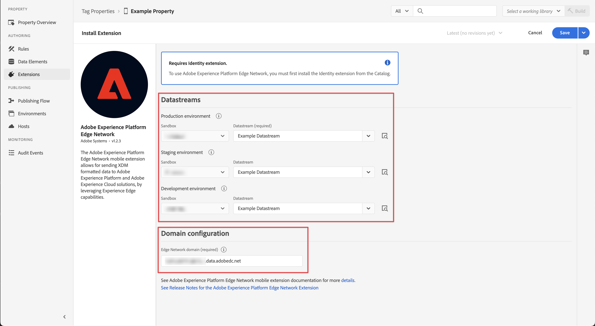
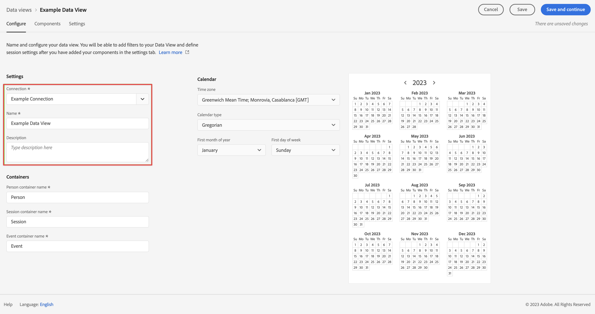

# Gegevens verzamelen via de Adobe Experience Platform Mobile SDK

In deze snelstartgids wordt uitgelegd hoe u gegevens voor het bijhouden van mobiele apps rechtstreeks in Adobe Experience Platform kunt opnemen met de Adobe Experience Platform Mobile SDK en Edge Network. Gebruik die gegevens vervolgens in Customer Journey Analytics.

Hiervoor moet u:

- **Een schema en gegevensset instellen** in Adobe Experience Platform om het model (schema) te bepalen van de gegevens die u wilt verzamelen en waar te om de gegevens (dataset) daadwerkelijk te verzamelen.

- **Een gegevensstroom instellen** om het Adobe Experience Platform Edge Network te configureren om de verzamelde gegevens te routeren naar de gegevensset die u in Adobe Experience Platform hebt geconfigureerd.

- **Tags gebruiken** om regels en gegevenselementen eenvoudig te configureren op basis van de gegevens in uw mobiele toepassing. Vervolgens zorgt u ervoor dat de gegevens worden verzonden naar de gegevensstroom die op het Adobe Experience Platform Edge-netwerk is geconfigureerd.

- **Implementeren en valideren**. Zorg voor een omgeving waarin u de ontwikkeling van tags kunt doorlopen en publiceer deze live in uw productieomgeving als alles is gevalideerd.

- **Een verbinding instellen** in de Customer Journey Analytics. Deze verbinding zou (minstens) uw dataset van Adobe Experience Platform moeten omvatten.

- **Een gegevensweergave instellen** in Customer Journey Analytics om metriek en afmeting te bepalen die u in Analysis Workspace wilt gebruiken.

- **Een project instellen** in Customer Journey Analytics om uw rapporten en visualisaties te bouwen.

>[!NOTE]
>
>Deze handleiding voor snel starten is een vereenvoudigde gids voor het invoeren van gegevens die zijn verzameld van uw toepassing in Adobe Experience Platform en voor gebruik in Customer Journey Analytics. Het wordt ten zeerste aanbevolen de aanvullende informatie te bestuderen wanneer deze wordt vermeld.

## Een schema en gegevensset instellen

Als u gegevens in Adobe Experience Platform wilt invoeren, moet u eerst definiëren welke gegevens u wilt verzamelen. Alle gegevens die in Adobe Experience Platform worden ingevoerd, moeten voldoen aan een standaard, gedenormaliseerde structuur, zodat deze kan worden herkend en kan worden toegepast door de mogelijkheden en functies op de downstreammarkt. Het Model van Gegevens van de ervaring (XDM) is het standaardkader dat een structuur in de vorm van schema&#39;s verstrekt.

Zodra u een schema hebt bepaald, gebruikt u één of meerdere datasets om de inzameling van gegevens op te slaan en te beheren. Een dataset is een opslag en beheersconstructie voor een inzameling van gegevens (typisch een lijst) die een schema (kolommen) en gebieden (rijen) bevat.

Alle gegevens die in Adobe Experience Platform worden opgenomen moeten met een vooraf gedefinieerd schema in overeenstemming zijn alvorens het als dataset kan worden voortgeduurd.

### Een schema instellen

U wilt enkele minimale gegevens van profielen bijhouden met uw mobiele app, bijvoorbeeld scènenaam en -identificatie.
U moet eerst een schema bepalen dat deze gegevens modelleert.

Uw schema instellen:

1. Selecteer in de gebruikersinterface van Adobe Experience Platform de optie **[!UICONTROL Schemas]** binnen [!UICONTROL DATA MANAGEMENT].

1. Selecteren **[!UICONTROL Create schema]**. .
1. Selecteer in de stap Een klasse selecteren van de wizard Schema maken de optie **[!UICONTROL Experience Event]**.

   

   >[!INFO]
   >
   >    Een schema van de Gebeurtenis van de Ervaring wordt gebruikt om het _gedrag_ van een profiel (zoals scènenaam, drukknop om aan winkelwagentje toe te voegen). Een afzonderlijk profielschema wordt gebruikt om het profiel te modelleren _attributes_ (zoals naam, e-mail, geslacht).

   Selecteren **[!UICONTROL Next]**.

1. In de [!UICONTROL Name and review step] van de [!UICONTROL Create schema] wizard:

   1. Voer een **[!UICONTROL Schema display name]** voor uw schema en (optioneel) a **[!UICONTROL Description]**.

      

   1. Selecteren **[!UICONTROL Finish]**.

1. Op het tabblad Structuur van het voorbeeldschema:

   1. Selecteren **[!UICONTROL + Add]** in [!UICONTROL Field groups].

      

      Veldgroepen zijn herbruikbare verzamelingen van objecten en kenmerken waarmee u het schema eenvoudig kunt uitbreiden.

   1. In de [!UICONTROL Add fields groups] selecteert u de **[!UICONTROL AEP Mobile SDK ExperienceEvent]** veldgroep in de lijst.

      

      U kunt de voorvertoningsknop selecteren om een voorvertoning weer te geven van de velden die deel uitmaken van deze veldgroep, zoals `application > name`.

      

      Selecteren **[!UICONTROL Back]** om de voorvertoning te sluiten.

   1. Selecteren **[!UICONTROL Add field groups]**.

1. Selecteren **[!UICONTROL +]** naast de naam van het schema in het dialoogvenster [!UICONTROL Structure] deelvenster.

   

1. In de [!UICONTROL Field Properties] paneel, enter `identification` als de [!UICONTROL Field name], **[!UICONTROL Identification]** als de [!UICONTROL Display name], selecteert u **[!UICONTROL Object]** als de [!UICONTROL Type] en selecteert u **[!UICONTROL ExperienceEvent Core v2.1]** als de [!UICONTROL Field Group].

   

   Het identificatieobject voegt id-mogelijkheden toe aan uw schema. In uw geval wilt u profielen identificeren aan de hand van uw mobiele app met de Experience Cloud-id en het e-mailadres. Er zijn vele andere eigenschappen beschikbaar om de identificatie van uw persoon te volgen (bijvoorbeeld klant identiteitskaart, loyalty identiteitskaart).

   Selecteren **[!UICONTROL Apply]** om dit object aan uw schema toe te voegen.

1. Selecteer de **[!UICONTROL ecid]** veld in het identificatieobject dat u zojuist hebt toegevoegd, en selecteer **[!UICONTROL Identity]** en **[!UICONTROL Primary Identity]** en **[!UICONTROL ECID]** van de [!UICONTROL Identity namespace] in het rechterdeelvenster.

   

   U geeft de Experience Cloud Identity op als de primaire identiteit die de Adobe Experience Platform Identity-service kan gebruiken om het gedrag van profielen te combineren (aan te sluiten) met dezelfde ECID.

   Selecteren **[!UICONTROL Apply]**. U ziet dat er een vingerafdrukpictogram wordt weergegeven in het ecid-kenmerk.

1. Selecteer de **[!UICONTROL email]** veld in het identificatieobject dat u zojuist hebt toegevoegd, en selecteer **[!UICONTROL Identity]** en **[!UICONTROL Email]** van de [!UICONTROL Identity namespace] in de lijst [!UICONTROL Field Properties] deelvenster.

   

   U geeft het e-mailadres op als een andere identiteit die de Adobe Experience Platform Identity-service kan gebruiken om het gedrag van profielen te combineren (naaien).

   Selecteren **[!UICONTROL Apply]**. U ziet dat er een vingerafdrukpictogram wordt weergegeven in het e-mailkenmerk.

   Selecteren **[!UICONTROL Save]**.

1. Selecteer het basiselement van uw schema dat de naam van het schema toont, dan selecteer **[!UICONTROL Profile]** switch.

   U wordt gevraagd het schema in te schakelen voor het profiel. Zodra toegelaten, wanneer het gegeven in datasets wordt opgenomen die op dit schema worden gebaseerd, worden die gegevens samengevoegd in het Real-Time Profiel van de Klant.

   Zie [Het schema inschakelen voor gebruik in Real-Time Klantprofiel](https://experienceleague.adobe.com/docs/experience-platform/xdm/tutorials/create-schema-ui.html?lang=en#profile) voor meer informatie .

   >[!IMPORTANT]
   >
   >    Nadat u een schema hebt opgeslagen dat is ingeschakeld voor profiel, kan het niet meer worden uitgeschakeld voor profiel.

   

1. Selecteren **[!UICONTROL Save]** om uw schema op te slaan.

U hebt een minimumschema gemaakt dat de gegevens modelleert die u van uw mobiele toepassing kunt vangen. Met het schema kunnen profielen worden geïdentificeerd aan de hand van de identiteit en het e-mailadres van het Experience Cloud. Door het schema voor profiel in te schakelen, zorgt u ervoor dat gegevens die zijn vastgelegd vanuit uw mobiele toepassing, worden toegevoegd aan het realtime-klantprofiel.

Naast gedragsgegevens kunt u ook profielkenmerkgegevens vastleggen vanuit uw mobiele toepassing (bijvoorbeeld gegevens over profielen die zijn geabonneerd op een nieuwsbrief).

Als u profielgegevens wilt vastleggen, doet u het volgende:

- Maak een schema op basis van de klasse Individueel profiel XDM.

- Voeg de het gebiedsgroep van de Kern van het Profiel v2 aan het schema toe.

- Voeg een identificatieobject toe op basis van de veldgroep Profile Core v2.

- Experience Cloud-id definiëren als primaire id en e-mailadres als id.

- Het schema inschakelen voor profiel

Zie [Schema&#39;s maken en bewerken in de gebruikersinterface](https://experienceleague.adobe.com/docs/experience-platform/xdm/ui/resources/schemas.html) voor meer informatie over het toevoegen en verwijderen van veldgroepen en afzonderlijke velden aan een schema.

### Een gegevensset instellen

Met uw schema, hebt u uw gegevensmodel bepaald. U moet nu de constructie bepalen om die gegevens op te slaan en te beheren door datasets te gebruiken.

Uw gegevensset instellen:

1. Selecteer in de gebruikersinterface van Adobe Experience Platform de optie **[!UICONTROL Datasets]** binnen [!UICONTROL DATA MANAGEMENT].

2. Selecteren **[!UICONTROL Create dataset]**.

   

3. Selecteren **[!UICONTROL Create dataset from schema]**.

   

4. Selecteer het eerder gemaakte schema en selecteer **[!UICONTROL Next]**.

5. Geef uw gegevensset een naam en (optioneel) geef een beschrijving op.

   

6. Selecteren **[!UICONTROL Finish]**.

7. Selecteer de **[!UICONTROL Profile]** switch.

   U wordt ertoe aangezet om de dataset voor profiel toe te laten. Zodra toegelaten, verrijkt de dataset klantenprofielen in real time met zijn opgenomen gegevens.

   >[!IMPORTANT]
   >
   >    U kunt een dataset voor profiel slechts toelaten wanneer het schema, waaraan de dataset voldoet, ook voor profiel wordt toegelaten.

   

Zie [UI-gids voor gegevensbestanden](https://experienceleague.adobe.com/docs/experience-platform/catalog/datasets/user-guide.html?lang=nl) voor veel meer informatie over hoe te om, voorproef te bekijken, creeer, schrapt een dataset. En hoe te om een dataset voor het Profiel van de Klant in real time toe te laten.

## Een gegevensstroom instellen

Een gegevensstroom vertegenwoordigt de server-zijconfiguratie wanneer het uitvoeren van het Web van Adobe Experience Platform en Mobiele SDKs. Bij het verzamelen van gegevens met de SDK&#39;s van Adobe Experience Platform worden gegevens verzonden naar het Adobe Experience Platform Edge Network. Het is de gegevensstroom die bepaalt aan welke diensten dat de gegevens door:sturen.

In uw opstelling, wilt u de gegevens die u van mobiele app verzamelt worden verzonden naar uw dataset in Adobe Experience Platform.

Uw gegevensstroom instellen:

1. Selecteer in de gebruikersinterface van Adobe Experience Platform **[!UICONTROL Datastreams]** van [!UICONTROL DATA COLLECTION] in het linkerspoor.

2. Selecteren **[!UICONTROL New Datastream]**.

3. Geef een naam en beschrijf de gegevensstroom. Selecteer uw schema in het menu [!UICONTROL Event Schema] lijst.

   

4. Selecteren **[!UICONTROL Save]**.

5. Selecteren **[!UICONTROL Add Service]**.

6. In de [!UICONTROL Add Service screen]:

   1. Selecteren **[!UICONTROL Adobe Experience Platform]** van de [!UICONTROL Service] lijst.

   2. Zorgen **[!UICONTROL Enabled]** is geselecteerd.

   3. Selecteer uw gegevensset in het menu [!UICONTROL Event Dataset] lijst.

      

   4. Laat de andere instellingen staan en selecteer **[!UICONTROL Save]** om de gegevensstroom op te slaan.

Uw gegevensstroom is nu geconfigureerd om de gegevens die zijn verzameld in uw mobiele app door te sturen naar uw gegevensset in Adobe Experience Platform.

Zie [Overzicht gegevensstromen](https://experienceleague.adobe.com/docs/experience-platform/edge/datastreams/overview.html?lang=en) voor meer informatie over hoe te om een gegevensstroom te vormen en hoe te om gevoelige gegevens te behandelen.

## Tags gebruiken

Als u code op uw site wilt implementeren om gegevens te verzamelen, gebruikt u de functie Codes in Adobe Experience Platform. Met deze oplossing voor tagbeheer kunt u code naast andere coderingsvereisten implementeren. Tags bieden naadloze integratie met Adobe Experience Platform met de Adobe Experience Platform Mobile SDK-extensie.

### Uw tag maken

1. Selecteer in de gebruikersinterface van Adobe Experience Platform de optie **[!UICONTROL Tags]** binnen [!UICONTROL DATA COLLECTION].

2. Selecteren **[!UICONTROL New Property]**.

   Geef de tag een naam, selecteer **[!UICONTROL Mobile]**. Selecteren **[!UICONTROL Save]** om door te gaan.

   

### Uw tag configureren

Nadat u de tag hebt gemaakt, moet u deze configureren met de juiste extensies en gegevenselementen en -regels configureren op basis van de manier waarop u uw site wilt bijhouden en gegevens naar Adobe Experience Platform wilt verzenden.

Als u de nieuwe tag wilt configureren, selecteert u deze in de lijst met [!UICONTROL Tag Properties].

#### **Extensies**

Voeg de Adobe Platform Edge Network-extensie toe aan uw tag om ervoor te zorgen dat u gegevens naar Adobe Experience Platform kunt verzenden (via uw gegevensstroom).

U kunt als volgt de extensie Adobe Experience Platform Mobile SDK maken en configureren:

1. Selecteren **[!UICONTROL Extensions]** in het linkerspoor. U ziet dat de extensies Mobiele kern en Profiel al beschikbaar zijn.

1. Selecteren **[!UICONTROL Catalog]** in de bovenste balk.

1. Zoeken naar of schuiven naar **[!UICONTROL Adobe Experience Platform Edge Network]** extensie en selecteren **[!UICONTROL Install]** in het rechterdeelvenster om het te installeren.

1. Selecteer uw sandbox en uw eerder gemaakte datastream voor uw [!UICONTROL Production Environment] en (optioneel) [!UICONTROL Staging Environment] en [!UICONTROL Development Environment].

   

1. Voer uw **[!UICONTROL Edge Network domain]** ondergronds [!UICONTROL Domain configuration]. Doorgaans gebruiken `<organizationName>.data.adobedc.net`.

1. Selecteren **[!UICONTROL Save]**.

Zie [De extensie Adobe Experience Platform Edge Network configureren](https://developer.adobe.com/client-sdks/documentation/edge-network) voor meer informatie .

U wilt ook de volgende extra extensies instellen vanuit de catalogus:

- Identiteit.
- AEP-betrouwbaarheid.
- Toestemming.

Zie [Een eigenschap voor een tag configureren](https://experienceleague.adobe.com/docs/platform-learn/implement-mobile-sdk/initial-configuration/configure-tags.html?lang=en) in de Mobile App Tutorial for Experience-platform voor veel meer informatie over extensies en hun configuratie.

#### **Gegevenselementen**

Gegevenselementen zijn de bouwstenen voor uw gegevenswoordenboek (of gegevenskaart). Gebruik gegevenselementen om gegevens te verzamelen, te organiseren en te leveren over marketing- en advertentietechnologie. U stelt gegevenselementen in uw tag in die gegevens of gebeurtenissen van mobiele apps lezen en die kunnen worden gebruikt om gegevens naar Adobe Experience Platform te verzenden.

U wilt bijvoorbeeld de naam van de provider verzamelen van de mobiele app.

Een gegevenselement met de naam van een drager definiëren:

1. Selecteren **[!UICONTROL Data Elements]** in het linkerspoor.

2. Selecteren **[!UICONTROL Add Data Element]**.

3. In de [!UICONTROL Create Data Element] dialoogvenster:

   - Geef uw gegevenselement bijvoorbeeld een naam `Carrier Name`.

   - Selecteren **[!UICONTROL Mobile Core]** van de [!UICONTROL Extension] lijst.

   - Selecteren **[!UICONTROL Carrier Name]** van de [!UICONTROL Data Element Type] lijst.

     

   - Selecteren **[!UICONTROL Save]**.

U kunt zoveel gegevenselementen maken als u wilt en deze gebruiken in regels.

#### **Regels**

Tags in Adobe Experience Platform volgen een op regels gebaseerd systeem. Zij zoeken gebruikersinteractie en bijbehorende gegevens. Wanneer aan de criteria die in uw regels worden geschetst wordt voldaan, teweegbrengt de regel de uitbreiding, het manuscript, of cliënt-zijcode in werking u identificeerde. U kunt regels gebruiken om gegevens (zoals een XDM-object) naar Adobe Experience Platform te verzenden met de Adobe Experience Platform Edge Network-extensie.

U wilt bijvoorbeeld gebeurtenisgegevens verzenden wanneer de mobiele app wordt gebruikt (op de voorgrond) en wanneer de mobiele app niet wordt gebruikt (teruggeduwd naar de achtergrond).

Een regel definiëren:

1. Selecteren **[!UICONTROL Rules]** in het linkerspoor.

2. Selecteren **[!UICONTROL Create New Rule]**.

3. In de [!UICONTROL Create Rule] dialoogvenster:

   - Geef de regel een naam, bijvoorbeeld `Application Status`.

   - Selecteren **[!UICONTROL + Add]** ondergronds [!UICONTROL Events].

   - In de [!UICONTROL Event Configuration] dialoogvenster:

      - Selecteren **[!UICONTROL Mobile Core]** van de [!UICONTROL Extension] lijst.

      - Selecteren **[!UICONTROL Foreground]** van de [!UICONTROL Event Type] lijst.

      - Selecteren **[!UICONTROL Keep Changes]**.

   - Klikken  naast [!UICONTROL Mobile Core - Foreground].

      - Selecteren **[!UICONTROL Mobile Core]** van de [!UICONTROL Extension] lijst.

      - Selecteren **[!UICONTROL Background]** van de [!UICONTROL Event Type] lijst.

      - Selecteren **[!UICONTROL Keep Changes]**.

   - Klikken  Onder toevoegen [!UICONTROL ACTIONS]. In de [!UICONTROL Action Configuration] dialoogvenster:

      - Selecteren **[!UICONTROL Adobe Experience Platform Edge Network]** van de [!UICONTROL Extension] lijst.

      - Selecteren **[!UICONTROL Forward event to Edge Network]** van de [!UICONTROL Action Type] lijst.

      - Selecteren **[!UICONTROL Keep Changes]**.

   - Uw regel moet er als volgt uitzien:

     

   - Selecteren **[!UICONTROL Save]**.

Het bovenstaande is slechts een voorbeeld van het definiëren van een regel die XDM-gegevens met toepassingsstatus naar het Adobe Edge-netwerk en naar Adobe Experience Platform verzendt.

U kunt regels op verschillende manieren in uw tag gebruiken om variabelen te bewerken (met behulp van uw gegevenselementen).

Zie [Regels](https://developer.adobe.com/client-sdks/documentation/lifecycle-for-edge-network/#configure-a-rule-to-forward-lifecycle-metrics-to-platform) voor meer informatie .

### Uw tag maken en publiceren

Nadat u gegevenselementen en regels hebt gedefinieerd, moet u de tag maken en publiceren. Wanneer u een bibliotheek maakt, moet u deze toewijzen aan een omgeving. De uitbreidingen, de regels, en de gegevenselementen van de bouwstijl worden dan gecompileerd en in het toegewezen milieu geplaatst. Elke omgeving bevat een unieke insluitcode waarmee u de toegewezen build in uw site kunt integreren.

Om uw markering te bouwen en te publiceren:

1. Selecteren **[!UICONTROL Publishing Flow]** van de linkerspoorstaaf.

2. Selecteren **[!UICONTROL Select a working library]**, gevolgd door **[!UICONTROL Add Library…]**.

3. In de [!UICONTROL Create Library] dialoogvenster:

   - Geef de bibliotheek een naam.

   - Selecteren **[!UICONTROL Development (development)]** van de [!UICONTROL Environment] lijst.

   - Selecteren **[!UICONTROL + Add All Changed Resources]**.

     

   - Selecteren **[!UICONTROL Save & Build to Development]**.

   Uw tag wordt opgeslagen en gebouwd voor uw ontwikkelomgeving. Een groene stip geeft aan dat uw tag met succes is opgebouwd in uw ontwikkelomgeving.

4. U kunt **[!UICONTROL ...]** om de bibliotheek opnieuw op te bouwen of de bibliotheek naar een testomgeving of productieomgeving te verplaatsen.

Adobe Experience Platform-tags bieden ondersteuning voor eenvoudige tot complexe publicatieworkflows die geschikt zijn voor uw implementatie van het Adobe Experience Platform Edge Network.

Zie [Overzicht van publicatie](https://developer.adobe.com/client-sdks/documentation/getting-started/create-a-mobile-property/#publish-the-configuration) voor meer informatie .

### De tagcode ophalen

Tot slot moet u uw tag gebruiken in de mobiele app die u wilt bijhouden.

U kunt als volgt code-instructies opvragen waarin wordt uitgelegd hoe u uw mobiele app instelt en uw tag in de app gebruikt:

1. Selecteren **[!UICONTROL Environments]** in het linkerspoor.

2. Selecteer de juiste installatie in de lijst met omgevingen  knop.

   In de [!UICONTROL Mobile Install Instructions] selecteert u het juiste platform ([!UICONTROL iOS], [!UICONTROL Android]). Gebruik vervolgens de kopie  naast elk relevant codefragment dat u wilt gebruiken voor het instellen en initialiseren van uw mobiele app:

   

3. Selecteren **[!UICONTROL Close]**.

In plaats van de code voor de ontwikkelomgeving, had u een andere omgeving (staging, productie) kunnen selecteren op basis van waar u bezig bent met het implementeren van de Adobe Experience Platform Mobile SDK.

Zie [Omgevingen](https://experienceleague.adobe.com/docs/experience-platform/tags/publish/environments/environments.html?) voor meer informatie .

## Implementeren en valideren

U kunt de code nu implementeren in uw mobiele app. Wanneer deze wordt geïmplementeerd, begint uw mobiele app gegevens te verzamelen in Adobe Experience Platform.

Valideer uw implementatie, verbeter het waar nodig, en zodra correct, stel het in uw het opvoeren en productiemilieu gebruikend de het publiceren werkschemafunctie van Markeringen op.

Zie [Zelfstudie Adobe Experience Cloud implementeren in mobiele apps](https://experienceleague.adobe.com/docs/platform-learn/implement-mobile-sdk/overview.html) voor veel gedetailleerdere informatie.

## Een verbinding instellen

Om de gegevens van Adobe Experience Platform in Customer Journey Analytics te gebruiken, creeert u een verbinding die de gegevens omvat die uit vestiging uw schema, dataset, en werkschema voortvloeien.

Met een verbinding kunt u gegevenssets van Adobe Experience Platform integreren in Workspace. Om over deze datasets te rapporteren, moet u eerst een verband tussen datasets in Adobe Experience Platform en Werkruimte vestigen.

Om uw verbinding tot stand te brengen:

1. Selecteer in de gebruikersinterface van de Customer Journey Analytics de optie **[!UICONTROL Connections]** in de bovenste navigatie.

2. Selecteren **[!UICONTROL Create new connection]**.

3. In de [!UICONTROL Untitled connection] scherm:

   Geef een naam en beschrijf de verbinding in [!UICONTROL Connection Settings].

   Selecteer de juiste sandbox in het menu [!UICONTROL Sandbox] lijst in [!UICONTROL Data settings] en selecteert u het aantal dagelijkse gebeurtenissen in het menu [!UICONTROL Average number of daily events] lijst.

   

   Selecteren **[!UICONTROL Add datasets]**.

   In de [!UICONTROL Select datasets] stap in [!UICONTROL Add datasets]:

   - Selecteer datasets die u eerder hebt gemaakt en/of andere relevante datasets die u wilt opnemen in uw verbinding (bijvoorbeeld Gegevens van gebeurtenissen voor het bijhouden van push-ervaringen en gegevens van het pushprofiel uit Adobe Journey Optimizer)

     

   - Selecteren **[!UICONTROL Next]**.

   In de [!UICONTROL Datasets settings] stap in [!UICONTROL Add datasets]:

   - Voor elke gegevensset:

      - Selecteer een [!UICONTROL Person ID] uit de beschikbare identiteiten die zijn gedefinieerd in de gegevenssetschema&#39;s in Adobe Experience Platform.

      - Selecteer de juiste gegevensbron in het menu [!UICONTROL Data source type] lijst. Als u **[!UICONTROL Other]** Voeg vervolgens een beschrijving voor uw gegevensbron toe.

      - Set **[!UICONTROL Import all new data]** en **[!UICONTROL Dataset backfill existing data]** volgens uw voorkeuren.

     

   - Selecteren **[!UICONTROL Add datasets]**.

   Selecteren **[!UICONTROL Save]**.

Zie [Overzicht van verbindingen](../connections/overview.md) voor meer informatie over om een verbinding tot stand te brengen en te beheren en datasets te selecteren en te combineren.

## Een gegevensweergave instellen

Een gegevensmening is een container specifiek voor Customer Journey Analytics die u laat bepalen hoe te om gegevens van een verbinding te interpreteren. Hiermee worden alle afmetingen en metriek opgegeven die beschikbaar zijn in Analysis Workspace en de kolommen waarvan die dimensies en metriek hun gegevens verkrijgen. Gegevensweergaven worden gedefinieerd ter voorbereiding op rapportage in Analysis Workspace.

Uw gegevensweergave maken:

1. Selecteer in de gebruikersinterface van de Customer Journey Analytics de optie **[!UICONTROL Data views]** in de bovenste navigatie.

2. Selecteren **[!UICONTROL Create new data view]**.

3. In de [!UICONTROL Configure] stap:

   Selecteer uw verbinding van [!UICONTROL Connection] lijst.

   Naam en (optioneel) beschrijf uw verbinding.

   

   Selecteren **[!UICONTROL Save and continue]**.

4. In de [!UICONTROL Components] stap:

   Voeg schemagebieden en/of standaardcomponent toe die u aan wilt omvatten [!UICONTROL METRICS] of [!UICONTROL DIMENSIONS] deelvakken.

   

   Selecteren **[!UICONTROL Save and continue]**.

5. In de [!UICONTROL Settings] stap:

   

   De instellingen ongewijzigd laten en selecteren **[!UICONTROL Save and finish]**.

Zie [Overzicht van gegevensweergaven](../data-views/data-views.md) voor meer informatie over het maken en bewerken van een gegevensweergave, welke componenten beschikbaar zijn voor u in de gegevensweergave en hoe u filter- en sessieinstellingen kunt gebruiken.

## Een project instellen

Analysis Workspace is een flexibel browserprogramma waarmee u snel analyses kunt maken en inzichten kunt delen op basis van uw gegevens. U gebruikt de projecten van de Werkruimte om gegevenscomponenten, lijsten, en visualisaties te combineren om uw analyse te bundelen en met iedereen in uw organisatie te delen.

Uw project maken:

1. Selecteer in de gebruikersinterface van de Customer Journey Analytics de optie **[!UICONTROL Projects]** in de bovenste navigatie.

2. Selecteren **[!UICONTROL Projects]** in de linkernavigatie.

3. Selecteren **[!UICONTROL Create project]**.

   

   Selecteren **[!UICONTROL Blank project]**.

   

4. Selecteer de gegevensweergave in de lijst.

   .

5. Als u uw eerste rapport wilt maken, sleept u de afmetingen en metriek naar het [!UICONTROL Freeform table] in de [!UICONTROL Panel] . Als voorbeeld sleept u `Events` als metriek en `Push Title` als dimensie, uitgesplitst naar `Event Type` voor een overzicht van uw pushberichten voor uw mobiele app en wat er met hen is gebeurd.

   

Zie [Analysis Workspace-overzicht](../analysis-workspace/home.md) voor meer informatie over hoe te om projecten tot stand te brengen en uw analyse te bouwen gebruikend componenten, visualisaties, en panelen.

>[!SUCCESS]
>
>U hebt alle stappen uitgevoerd. Beginnend door te bepalen welke gegevens u (schema) wilt verzamelen en waar om het (dataset) in Adobe Experience Platform op te slaan, vormde u een gegevensstroom op het Netwerk van de Rand om ervoor te zorgen dat de gegevens aan die dataset kunnen door:sturen. Vervolgens hebt u de tag gedefinieerd en geïmplementeerd die de extensies (Adobe Experience Platform Edge Network en andere), gegevenselementen en regels bevat voor het vastleggen van gegevens van uw mobiele app en het verzenden van die gegevens naar uw gegevensstroom. U hebt een verbinding in Customer Journey Analytics gedefinieerd om gegevens voor het bijhouden van pushmeldingen voor uw mobiele app en andere gegevens te gebruiken. Met de definitie van uw gegevensweergave kunt u opgeven welke dimensie en metriek u wilt gebruiken. Ten slotte hebt u uw eerste project gemaakt waarmee u uw gegevens van uw mobiele app kunt visualiseren en analyseren.
