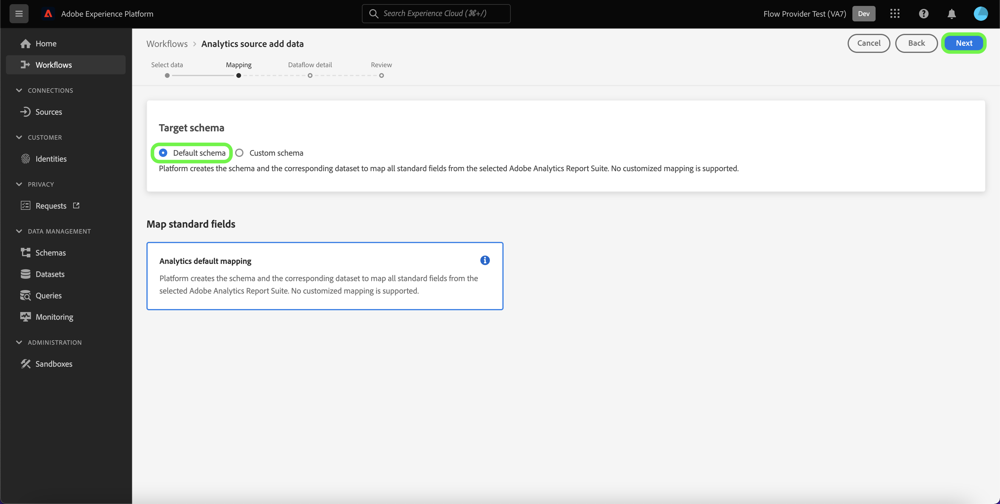

# Gegevens van traditionele Adobe Analytics verzamelen en gebruiken

In deze handleiding voor snel starten wordt uitgelegd hoe u de gegevens die door Adobe Analytics in Customer Journey Analytics zijn verzameld, kunt gebruiken.

>[!PREREQUISITES]
>
>U hebt een Adobe Analytics-licentie en -implementatie op een of meer van uw websites, waarbij u een van de gedocumenteerde implementatiemethoden gebruikt:
>
>- [Analyses implementeren met gebruik van Experience Platform Edge](https://experienceleague.adobe.com/docs/analytics/implementation/aep-edge/overview.html?lang=en)
>
>- [Analyse implementeren met Adobe Analytics-extensie](https://experienceleague.adobe.com/docs/analytics/implementation/launch/overview.html?lang=en)
>
>- [Analytics implementeren met JavaScript](https://experienceleague.adobe.com/docs/analytics/implementation/js/overview.html?lang=en)

Hiervoor moet u:

- **Een Adobe Analytics-bronaansluiting instellen** in Adobe Experience Platform. Hierdoor worden uw huidige Adobe Analytics-gegevens opgenomen in een gegevensset in Adobe Experience Platform.

- **Een verbinding instellen** in Customer Journey Analytics. Deze verbinding zou (minstens) uw dataset van Adobe Experience Platform moeten omvatten.

- **Een gegevensweergave instellen** in Customer Journey Analytics om de metriek en de afmeting te bepalen die u in Analysis Workspace wilt gebruiken.

- **Een project instellen** in Customer Journey Analytics om uw rapporten en visualisaties samen te stellen.

>[!NOTE]
>
>Dit is een vereenvoudigde gids over hoe te om gegevens in te voeren, gebruikend de bron van Adobe Analytics schakelaar, en gebruik die gegevens in Customer Journey Analytics. Het wordt ten zeerste aanbevolen de aanvullende informatie te bestuderen wanneer deze wordt vermeld.

## Een Adobe Analytics-bronaansluiting instellen

Met de Adobe Analytics-bronaansluiting kunt u Adobe Analytics-rapportsuite-gegevens naar Adobe Experience Platform overbrengen.

Een Adobe Analytics-bronaansluiting maken:

1. Selecteer in de gebruikersinterface van het Platform de optie **[!UICONTROL Sources]**, van de linkerspoorlijn.

2. Selecteren **[!UICONTROL Adobe applications]** van de lijst van [!UICONTROL CATEGORIES].

3. Selecteren **[!UICONTROL Set up]** of **[!UICONTROL Add data]** in de tegel van Adobe Analytics.

   

4. Selecteren **[!UICONTROL Report suite]**. Selecteer in de lijst met rapportsuites de versie die u wilt gebruiken.

   

   Selecteren **[!UICONTROL Next]**.

5. Selecteren **[!UICONTROL Default schema]** als de [!UICONTROL Target schema]. Adobe Experience Platform leidt automatisch tot het schema en de overeenkomstige dataset om alle standaardgebieden van de geselecteerde het rapportreeks van Adobe Analytics in kaart te brengen.

   

   Selecteren **[!UICONTROL Next]**.

6. Geef de gegevensstroom een naam en (optioneel) geef een beschrijving op.

   

   Selecteren **[!UICONTROL Next]**.

7. Controleer de verbinding en selecteer **[!UICONTROL Finish]**.

   

Zodra de verbinding wordt gecreeerd, wordt de dataflow automatisch gecreeerd om een dataset met de gegevens van Adobe Analytics van uw rapportreeks, met inbegrip van het opnemen van tot 13 maanden historische gegevens te bevolken.

Wanneer de eerste opname is voltooid, zijn de gegevens van uw Adobe Analytics-rapportenpakket klaar om door Customer Journey Analytics te worden gebruikt.

Zie [Een Adobe Analytics-bronverbinding maken in de gebruikersinterface](https://experienceleague.adobe.com/docs/experience-platform/sources/ui-tutorials/create/adobe-applications/analytics.html?lang=en) voor een veel uitgebreidere zelfstudie.

## Een verbinding instellen

Om de gegevens van Adobe Experience Platform in Customer Journey Analytics te gebruiken, creeert u een verbinding die de gegevens omvat die uit vestiging uw schema, dataset, en werkschema voortvloeien.

Met een verbinding kunt u gegevenssets van Adobe Experience Platform integreren in Workspace. Om over deze datasets te rapporteren, moet u eerst een verband tussen datasets in Adobe Experience Platform en Werkruimte vestigen.

Om uw verbinding tot stand te brengen:

1. Selecteer in de gebruikersinterface van Customer Journey Analytics de optie **[!UICONTROL Connections]** in de bovenste navigatie.

2. Selecteren **[!UICONTROL Create new connection]**.

3. In de [!UICONTROL Untitled connection] scherm:

   Geef een naam en beschrijf de verbinding in [!UICONTROL Connection Settings].

   Selecteer de juiste sandbox in het menu [!UICONTROL Sandbox] lijst in [!UICONTROL Data settings] en selecteert u het aantal dagelijkse gebeurtenissen in het [!UICONTROL Average number of daily events] lijst.

   

   Selecteren **[!UICONTROL Add datasets]**.

   In de [!UICONTROL Select datasets] stap in [!UICONTROL Add datasets]:

   - Selecteer automatisch de dataset die door de Adobe Analytics bronschakelaar en een andere dataset wordt gecreeerd die u in uw verbinding wilt omvatten.

      

   - Selecteren **[!UICONTROL Next]**.
   In de [!UICONTROL Datasets settings] stap in [!UICONTROL Add datasets]:

   - Voor elke gegevensset:

      - Selecteer een [!UICONTROL Person ID] uit de beschikbare identiteiten die zijn gedefinieerd in de gegevenssetschema&#39;s in Adobe Experience Platform.

      - Selecteer de juiste gegevensbron in het menu [!UICONTROL Data source type] lijst. Als u **[!UICONTROL Other]** Voeg vervolgens een beschrijving voor uw gegevensbron toe.

      - Set **[!UICONTROL Import all new data]** en **[!UICONTROL Dataset backfill existing data]** op basis van uw voorkeuren.

      

   - Selecteren **[!UICONTROL Add datasets]**.
   Selecteren **[!UICONTROL Save]**.

Zie [Overzicht van verbindingen](../connections/overview.md) voor meer informatie over om een verbinding tot stand te brengen en te beheren en datasets te selecteren en te combineren.

## Een gegevensweergave instellen

Een gegevensweergave is een container specifiek voor Customer Journey Analytics waarmee u kunt bepalen hoe gegevens van een verbinding moeten worden geïnterpreteerd. Hiermee worden alle afmetingen en metriek opgegeven die beschikbaar zijn in Analysis Workspace en de kolommen waarvan die dimensies en metriek hun gegevens verkrijgen. Gegevensweergaven worden gedefinieerd ter voorbereiding op rapportage in Analysis Workspace.

Uw gegevensweergave maken:

1. Selecteer in de gebruikersinterface van Customer Journey Analytics de optie **[!UICONTROL Data views]** in de bovenste navigatie.

2. Selecteren **[!UICONTROL Create new data view]**.

3. In de [!UICONTROL Configure] stap:

   Selecteer uw verbinding in het menu [!UICONTROL Connection] lijst.

   Naam en (optioneel) beschrijf uw verbinding.

   

   Selecteren **[!UICONTROL Save and continue]**.

4. In de [!UICONTROL Components] stap:

   Voeg schemagebieden en/of standaardcomponent toe die u aan wilt omvatten [!UICONTROL METRICS] of [!UICONTROL DIMENSIONS] deelvakken.

   

   Selecteren **[!UICONTROL Save and continue]**.

5. In de [!UICONTROL Settings] stap:

   

   De instellingen ongewijzigd laten en selecteren **[!UICONTROL Save and finish]**.

Zie [Overzicht van gegevensweergaven](../data-views/data-views.md) voor meer informatie over het maken en bewerken van een gegevensweergave, welke componenten beschikbaar zijn voor u in de gegevensweergave en hoe u filter- en sessieinstellingen kunt gebruiken.

## Een project instellen

Analysis Workspace is een flexibel browserprogramma waarmee u snel analyses kunt maken en inzichten kunt delen op basis van uw gegevens. U gebruikt de projecten van de Werkruimte om gegevenscomponenten, lijsten, en visualisaties te combineren om uw analyse te bundelen en met iedereen in uw organisatie te delen.

Uw project maken:

1. Selecteer in de gebruikersinterface van Customer Journey Analytics de optie **[!UICONTROL Projects]** in de bovenste navigatie.

2. Selecteren **[!UICONTROL Projects]** in de linkernavigatie.

3. Selecteren **[!UICONTROL Create project]**.

   

   Selecteren **[!UICONTROL Blank project]**.

   

4. Selecteer de gegevensweergave in de lijst.

   .

5. Begin met slepen en zet afmetingen en metriek neer op het [!UICONTROL Freeform table] in de [!UICONTROL Panel] om uw eerste rapport te maken. Als voorbeeld sleept u `Program Points Balance` en `Page View` als metriek en `email` als dimensie voor een snel overzicht van profielen die uw website hebben bezocht en deel uitmaken van het loyaliteitsprogramma dat loyaliteitspunten verzamelt.

   

Zie [Analysis Workspace-overzicht](../analysis-workspace/home.md) voor meer informatie over hoe te om projecten tot stand te brengen en uw analyse te bouwen gebruikend componenten, visualisaties, en panelen.

>[!SUCCESS]
>
>U hebt alle stappen uitgevoerd. Om te beginnen wordt de Adobe Analytics-gegevensbronaansluiting ingesteld en de aansluiting voor uw rapportsuite geconfigureerd, worden uw Adobe Analytics-gegevens automatisch geüpload naar Adobe Experience Platform. U hebt een verbinding in Customer Journey Analytics gedefinieerd om de opgenomen Adobe Analytics-gegevens en andere gegevens te gebruiken. Met de definitie van uw gegevensweergave kunt u opgeven welke dimensie en metriek u wilt gebruiken en ten slotte hebt u uw eerste project gemaakt waarin uw gegevens worden gevisualiseerd en geanalyseerd.

