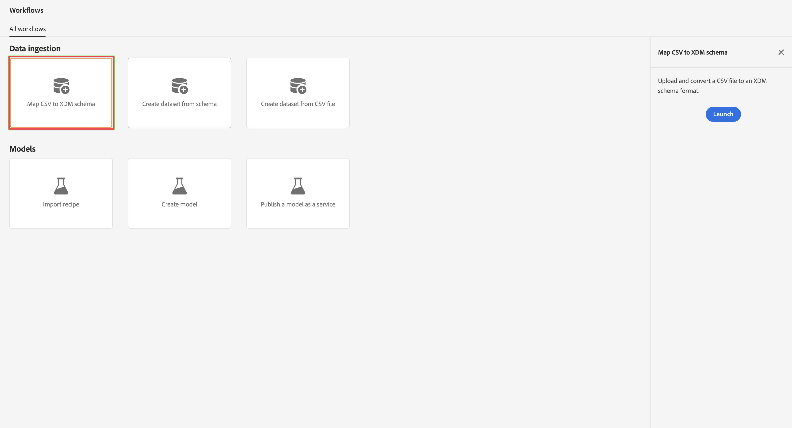

# Batchgegevens invoegen en gebruiken

In deze snelstartgids wordt uitgelegd hoe u batchgegevens kunt invoeren in Adobe Experience Platform en deze gegevens vervolgens kunt gebruiken in Customer Journey Analytics.

Hiervoor moet u:

- **opstelling een schema en dataset** in Adobe Experience Platform om het model (schema) van de gegevens te bepalen die u wilt verzamelen en waar te om de gegevens (dataset) eigenlijk te verzamelen.

- **werkschema&#39;s van het Gebruik** om uw partijgegevens aan de dataset gemakkelijk te uploaden die in Adobe Experience Platform wordt gevormd.

- **opstelling een verbinding** in Customer Journey Analytics. Deze verbinding zou (minstens) uw dataset van Adobe Experience Platform moeten omvatten.

- **opstelling een gegevensmening** in Customer Journey Analytics om metriek en afmeting te bepalen die u in Analysis Workspace wilt gebruiken.

- **opstelling een project** in Customer Journey Analytics om uw rapporten en visualisaties te bouwen.

>[!NOTE]
>
>Deze handleiding voor snel starten is een vereenvoudigde handleiding voor het invoeren van batchgegevens in Adobe Experience Platform en het gebruik in Customer Journey Analytics. Het wordt ten zeerste aanbevolen de aanvullende informatie te bestuderen wanneer deze wordt vermeld.

## Een schema en gegevensset instellen

Als u gegevens in Adobe Experience Platform wilt invoeren, moet u eerst definiëren welke gegevens u wilt verzamelen. Alle gegevens die in Adobe Experience Platform worden ingevoerd, moeten voldoen aan een standaard, gedenormaliseerde structuur, zodat deze kan worden herkend en kan worden toegepast door de mogelijkheden en functies op de downstreammarkt. Het Model van Gegevens van de ervaring (XDM) is het standaardkader dat deze structuur in de vorm van schema&#39;s verstrekt.

Zodra u een schema hebt bepaald, gebruikt u één of meerdere datasets om de inzameling van gegevens op te slaan en te beheren. Een dataset is een opslag en beheersconstructie voor een inzameling van gegevens (typisch een lijst) die een schema (kolommen) en gebieden (rijen) bevat.

Alle gegevens die in Adobe Experience Platform worden opgenomen moeten met een vooraf gedefinieerd schema in overeenstemming zijn alvorens het als dataset kan worden voortgeduurd.

### Een schema instellen

Voor deze snelle start wilt u gegevens verzamelen over loyaliteit, zoals loyaliteit-id, loyaliteitspunten en loyaliteitsstatus.
U moet eerst een schema definiëren dat deze gegevens modelleert.

Uw schema instellen:

1. Selecteer in de gebruikersinterface van Adobe Experience Platform de optie **[!UICONTROL Schemas]** within [!UICONTROL DATA MANAGEMENT] in het linkerspoor.

1. Selecteer **[!UICONTROL Create schema]** .
.
1. In Uitgezocht een klassenstap van de Create schematovenaar:

   1. Selecteer **[!UICONTROL Individual Profile]** .

      

      >[!INFO]
      >
      >    Een schema van de Gebeurtenis van de Ervaring wordt gebruikt om het _gedrag_ van een profiel (als scènenaam, drukknop te modelleren om aan wagentje toe te voegen). Een individueel schema van het Profiel wordt gebruikt om de profiel _attributen_ (zoals naam, e-mail, geslacht) te modelleren.

   1. Selecteer **[!UICONTROL Next]** .


1. In het gedeelte [!UICONTROL Name and review step] van de wizard [!UICONTROL Create schema] :

   1. Voer een **[!UICONTROL Schema display name]** in voor uw schema en (optioneel) een **[!UICONTROL Description]** .

      

   1. Selecteer **[!UICONTROL Finish]** .

1. Op het tabblad Structuur van het voorbeeldschema:

   1. Selecteer **[!UICONTROL + Add]** in [!UICONTROL Field groups] .

       toe

      Veldgroepen zijn herbruikbare verzamelingen van objecten en kenmerken waarmee u het schema eenvoudig kunt uitbreiden.

   1. Selecteer in het dialoogvenster [!UICONTROL Add fields groups] de veldgroep **[!UICONTROL Loyalty Details]** in de lijst.

      

      U kunt de voorvertoningsknop selecteren om een voorvertoning weer te geven van de velden die deel uitmaken van deze veldgroep.

      

      Selecteer **[!UICONTROL Back]** om de voorvertoning te sluiten.

   1. Selecteer **[!UICONTROL Add field groups]** .

1. Selecteer **[!UICONTROL +]** naast de naam van het schema in het deelvenster [!UICONTROL Structure] .

   

1. Typ in het deelvenster [!UICONTROL Field Properties] `Identification` als de naam, **[!UICONTROL Identification]** als de [!UICONTROL Display name] , selecteer **[!UICONTROL Object]** als de [!UICONTROL Type] en selecteer **[!UICONTROL Profile Core v2]** als de [!UICONTROL Field Group] .

   

   Het identificatieobject voegt id-mogelijkheden toe aan uw schema. In uw geval, wilt u loyaliteitsinformatie identificeren gebruikend het e-mailadres van uw partijgegevens.

   Selecteer **[!UICONTROL Apply]** om dit object aan uw schema toe te voegen.

1. Selecteer het veld **[!UICONTROL email]** in het identificatieobject dat u net hebt toegevoegd en selecteer **[!UICONTROL Identity]** en **[!UICONTROL Email]** in het deelvenster [!UICONTROL Identity namespace] in het deelvenster [!UICONTROL Field Properties] .

   

   U geeft het e-mailadres op als de identiteit die de Adobe Experience Platform Identity-service kan gebruiken om (stitch)profielen te combineren.

   Selecteer **[!UICONTROL Apply]** . U ziet dat er een vingerafdrukpictogram wordt weergegeven in het e-mailkenmerk.

   Selecteer **[!UICONTROL Save]** .

1. Selecteer het basisniveau van uw schema (met de schemanaam), dan selecteer de **[!UICONTROL Profile]** schakelaar.

   U wordt gevraagd het schema in te schakelen voor het profiel. Zodra toegelaten, wanneer het gegeven in datasets wordt opgenomen die op dit schema worden gebaseerd, worden die gegevens samengevoegd in het Real-Time Profiel van de Klant.

   Zie [ het schema voor gebruik in het Profiel van de Klant in real time ](https://experienceleague.adobe.com/docs/experience-platform/xdm/tutorials/create-schema-ui.html#profile) voor meer informatie toelaten.

   >[!IMPORTANT]
   >
   >    Nadat u een schema hebt opgeslagen dat is ingeschakeld voor profiel, kan het niet meer worden uitgeschakeld voor profiel.

    toe

1. Selecteer **[!UICONTROL Save]** om het schema op te slaan.

U hebt een minimaal schema gemaakt dat de loyaliteitsgegevens modelleert die u in Adobe Experience Platform kunt invoeren. Met het schema kunnen profielen worden geïdentificeerd aan de hand van het e-mailadres. Door het schema voor profiel in te schakelen, zorgt u ervoor dat de gegevens van uw batchbestand worden toegevoegd aan het Real-Time Klantprofiel.

Zie [ schema&#39;s in UI ](https://experienceleague.adobe.com/docs/experience-platform/xdm/ui/resources/schemas.html) voor meer informatie creëren en uitgeven bij het toevoegen van en het verwijderen van gebiedsgroepen en individuele gebieden aan een schema.

### Een gegevensset instellen

Met uw schema, hebt u uw gegevensmodel bepaald. U moet nu de constructie bepalen om die gegevens op te slaan en te beheren, die door datasets wordt gedaan.

Uw gegevensset instellen:

1. Selecteer in de gebruikersinterface van Adobe Experience Platform de optie **[!UICONTROL Datasets]** within [!UICONTROL DATA MANAGEMENT] in het linkerspoor.

2. Selecteer **[!UICONTROL Create dataset]** .

   

3. Selecteer **[!UICONTROL Create dataset from schema]** .

   

4. Selecteer het schema dat u eerder hebt gemaakt en selecteer **[!UICONTROL Next]** .

5. Geef uw gegevensset een naam en (optioneel) geef een beschrijving op.

   

6. Selecteer **[!UICONTROL Finish]** .

7. Selecteer de **[!UICONTROL Profile]** schakelaar.

   U wordt ertoe aangezet om de dataset voor profiel toe te laten. Zodra toegelaten, verrijkt de dataset klantenprofielen in real time met zijn opgenomen gegevens.

   >[!IMPORTANT]
   >
   >U kunt een dataset voor profiel slechts toelaten wanneer het schema, waaraan de dataset voldoet, ook voor profiel wordt toegelaten.

    toe

Zie {de gids UI van de Datasets van 0} [&#128279;](https://experienceleague.adobe.com/docs/experience-platform/catalog/datasets/user-guide.html?lang=nl) voor veel meer informatie over hoe te bekijken, voorproef, tot stand brengen, een dataset schrappen.  En hoe te om een dataset voor het Profiel van de Klant in real time toe te laten.


## Workflows gebruiken

U gebruikt de workflowfunctionaliteit om uw batchgegevens te uploaden naar Adobe Experience Platform. Het voorbeeldbatchbestand dat u gebruikt, is een CSV-bestand met de volgende inhoud:

```
email,loyaltyID,points,status
abrocking0@blog.com,793406,82.16,Silver
wnichol1@ycombinator.com,988654,40.39,Gold
paisbett2@slideshare.net,444897,91.25,Bronze
bdiamant3@xinhuanet.com,239658,57.87,Gold
ppales4@nsw.gov.au,365384,82.71,Silver
...
```

Workflows gebruiken:

1. Selecteer in de interface Platform de optie **[!UICONTROL Workflows]** in de linkertrack.

2. Selecteer **[!UICONTROL Map CSV to XDM schema]** . Selecteer **[!UICONTROL Launch]** .

   

3. In het [!UICONTROL Map CSV to XDM schema] -scherm voert u in de stap [!UICONTROL Dataflow detail] de volgende handelingen uit:

   Selecteer **[!UICONTROL Existing dataset]**, selecteer uw dataset in de lijst van datasets, en noem uw [!UICONTROL Dataflow name].

   

   Selecteer **[!UICONTROL Next]** .

4. In de stap [!UICONTROL Select data] :

   Sleep of selecteer **[!UICONTROL Choose files]** om uw CSV-bestand met loyaliteitsgegevens te selecteren. U ziet een voorvertoning van uw loyaliteitsgegevens.

   

   Selecteer **[!UICONTROL Next]** .

5. In de stap [!UICONTROL Mapping] :

   Wijs uw gegevens van het Csv- dossier aan de gegevens in uw schema toe. Met behulp van AI probeert de workflowfunctionaliteit automatisch de velden met batchgegevens toe te wijzen aan de schemavelden.

   

   Met **[!UICONTROL Preview data]** kunt u een voorvertoning van de toegewezen gegevens weergeven.

   

6. Selecteer **[!UICONTROL Finish]** om uw batchgegevens in Adobe Experience Platform in te voeren.

Zie [ een Csv- dossier bovenop een bestaand schema XDM ](https://experienceleague.adobe.com/docs/experience-platform/ingestion/tutorials/map-csv/existing-schema.html) voor meer informatie over in kaart brengen:

- hoe te om gegevens in kaart te brengen wanneer uw inkomende gegevens niet compatibel met uw schema XDM zijn.
- gebruik mappingsjablonen;
- gebruik berekende velden om ervoor te zorgen dat de batchgegevens overeenstemmen met wat het schema verwacht,
- en meer.


## Een verbinding instellen

Als u de Adobe Experience Platform-gegevens in Customer Journey Analytics wilt gebruiken, maakt u een verbinding die de gegevens bevat die het resultaat zijn van het instellen van het schema, de gegevensset en de workflow.

Met een verbinding kunt u gegevenssets van Adobe Experience Platform integreren in Workspace. Om over deze datasets te rapporteren, moet u eerst een verband tussen datasets in Adobe Experience Platform en Workspace vestigen.

Om uw verbinding tot stand te brengen:

1. Selecteer in de gebruikersinterface van Customer Journey Analytics de optie **[!UICONTROL Connections]** (optioneel in **[!UICONTROL Data management]** ) in het bovenste menu.

2. Selecteer **[!UICONTROL Create new connection]** .

3. In het [!UICONTROL Untitled connection] -scherm:

   Geef een naam en beschrijf de verbinding in [!UICONTROL Connection Settings] .

   Selecteer de juiste sandbox in de lijst [!UICONTROL Sandbox] in [!UICONTROL Data settings] en selecteer het aantal dagelijkse gebeurtenissen in de lijst [!UICONTROL Average number of daily events] .

   

   Selecteer **[!UICONTROL Add datasets]** .

   In de stap [!UICONTROL Select datasets] in [!UICONTROL Add datasets] :

   - Selecteer de dataset die u vroeger (`Example Loyalty Dataset`) creeerde en om het even welke andere dataset u in uw verbinding wilt omvatten.

      toe

   - Selecteer **[!UICONTROL Next]** .

   In de stap [!UICONTROL Datasets settings] in [!UICONTROL Add datasets] :

   - Voor elke gegevensset:

      - Selecteer een [!UICONTROL Person ID] van de beschikbare identiteiten die in de datasetschema&#39;s in Adobe Experience Platform worden bepaald.

      - Selecteer de juiste gegevensbron in de lijst [!UICONTROL Data source type] . Als u **[!UICONTROL Other]** opgeeft, voegt u een beschrijving voor de gegevensbron toe.

      - Stel **[!UICONTROL Import all new data]** en **[!UICONTROL Dataset backfill existing data]** in op basis van uw voorkeuren.

     

   - Selecteer **[!UICONTROL Add datasets]** .

   Selecteer **[!UICONTROL Save]** .

Zie [ Overzicht van Verbindingen ](../connections/overview.md) voor meer informatie over om een verbinding tot stand te brengen en te beheren en datasets te selecteren en te combineren.

## Een gegevensweergave instellen

Een gegevensweergave is een container specifiek voor Customer Journey Analytics waarmee u kunt bepalen hoe gegevens van een verbinding moeten worden geïnterpreteerd. Hiermee worden alle afmetingen en metriek opgegeven die beschikbaar zijn in Analysis Workspace en de kolommen waarvan die dimensies en metriek hun gegevens verkrijgen. Gegevensweergaven worden gedefinieerd ter voorbereiding op rapportage in Analysis Workspace.

Uw gegevensweergave maken:

1. Selecteer in de gebruikersinterface van Customer Journey Analytics de optie **[!UICONTROL Data views]** (optioneel in **[!UICONTROL Data management]** ) in het bovenste menu.

2. Selecteer **[!UICONTROL Create new data view]** .

3. In de stap [!UICONTROL Configure] :

   Selecteer de verbinding in de lijst [!UICONTROL Connection] .

   Naam en (optioneel) beschrijf uw verbinding.

   

   Selecteer **[!UICONTROL Save and continue]** .

4. In de stap [!UICONTROL Components] :

   Voeg schemagebieden en/of standaardcomponent toe die u aan de [!UICONTROL METRICS] of [!UICONTROL DIMENSIONS] componentenvakjes wilt omvatten.

   

   Selecteer **[!UICONTROL Save and continue]** .

5. In de stap [!UICONTROL Settings] :

   

   Laat de instellingen ongewijzigd en selecteer **[!UICONTROL Save and finish]** .

Zie [ overzicht van de meningen van Gegevens ](../data-views/data-views.md) voor meer informatie over om een gegevensmening tot stand te brengen en uit te geven, welke componenten voor u aan gebruik in uw gegevensmening en hoe te segment en zittingsmontages te gebruiken beschikbaar zijn.


## Een project instellen

Analysis Workspace is een flexibel browserprogramma waarmee u snel analyses kunt maken en inzichten kunt delen op basis van uw gegevens. U gebruikt de projecten van Workspace om gegevenscomponenten, lijsten, en visualisaties te combineren om uw analyse te bundelen en met iedereen in uw organisatie te delen.

Uw project maken:

1. Selecteer in de gebruikersinterface van Customer Journey Analytics de optie **[!UICONTROL Projects]** in het bovenste menu.

2. Selecteer **[!UICONTROL Projects]** in de linkernavigatie.

3. Selecteer **[!UICONTROL Create project]** .

   

   Selecteer **[!UICONTROL Blank project]** .

   

4. Selecteer de gegevensweergave in de lijst.

   .

5. Als u uw eerste rapport wilt maken, sleept u de afmetingen en metriek op de [!UICONTROL Freeform table] in de [!UICONTROL Panel] . Sleep bijvoorbeeld `Program Points Balance` en `Page View` als metriek en `email` als dimensie om een snel overzicht te krijgen van profielen die uw website hebben bezocht en deel uitmaken van het loyaliteitsprogramma dat loyaliteitspunten verzamelt.

   

Zie [ overzicht van Analysis Workspace ](../analysis-workspace/home.md) voor meer informatie over hoe te om projecten tot stand te brengen en uw analyse te bouwen gebruikend componenten, visualisaties, en panelen.

>[!SUCCESS]
>
>U hebt alle stappen uitgevoerd. Beginnend door te bepalen welke loyaliteitsgegevens u (schema) wilt verzamelen en waar om het (dataset) in Adobe Experience Platform op te slaan, vormde u een werkschema om loyaliteitsgegevens in een dataset in batch te uploaden. U hebt een verbinding in Customer Journey Analytics gedefinieerd om de opgenomen loyaliteitsgegevens en andere gegevens te gebruiken. Met de definitie van uw gegevensweergave kunt u opgeven welke dimensie en metriek u wilt gebruiken en ten slotte hebt u uw eerste project gemaakt waarin uw gegevens worden gevisualiseerd en geanalyseerd.
