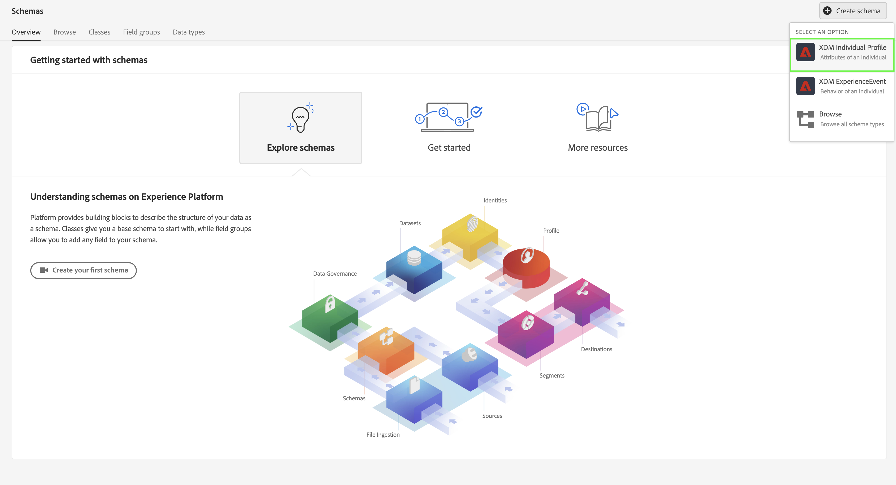
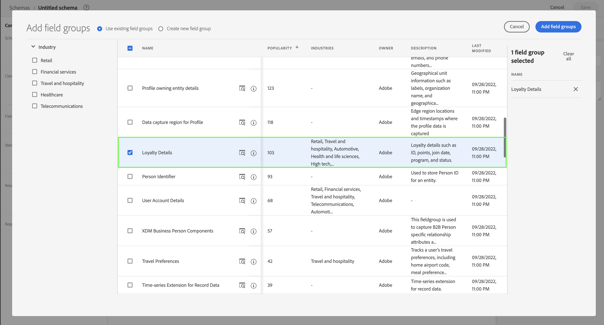
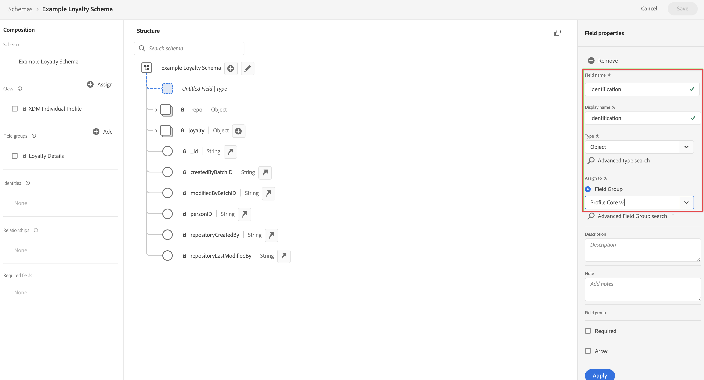

# Samenstellen en gegevens gebruiken met behulp van bronconnectors.

Deze snelle begingids verklaart hoe u gegevens in Adobe Experience Platform kunt opnemen gebruikend een bronschakelaar aan een gegevensleverancier en dan die gegevens in Customer Journey Analytics gebruiken.

Hiervoor moet u:

- **Een schema en gegevensset instellen** in Adobe Experience Platform om het model (schema) te bepalen van de gegevens die u wilt verzamelen en waar te om de gegevens (dataset) daadwerkelijk te verzamelen.

- **Een bronaansluiting gebruiken** in Adobe Experience Platform om uw gegevens in de gevormde dataset te krijgen.

- **Een verbinding instellen** in Customer Journey Analytics. Deze verbinding zou (minstens) uw dataset van Adobe Experience Platform moeten omvatten.

- **Een gegevensweergave instellen** in Customer Journey Analytics om de metriek en de afmeting te bepalen die u in Analysis Workspace wilt gebruiken.

- **Een project instellen** in Customer Journey Analytics om uw rapporten en visualisaties samen te stellen.

>[!NOTE]
>
>Deze snelstartgids is een vereenvoudigde gids over hoe te om gegevens in te voeren gebruikend een bronschakelaar in Adobe Experience Platform en het te gebruiken in Customer Journey Analytics. Het wordt ten zeerste aanbevolen de aanvullende informatie te bestuderen wanneer deze wordt vermeld.

## Een schema en gegevensset instellen

Als u gegevens in Adobe Experience Platform wilt invoeren, moet u eerst definiëren welke gegevens u wilt verzamelen. Alle gegevens die in Adobe Experience Platform worden ingevoerd, moeten voldoen aan een standaard, gedenormaliseerde structuur, zodat deze kan worden herkend en kan worden toegepast door de mogelijkheden en functies op de downstreammarkt. Het Model van Gegevens van de ervaring (XDM) is het standaardkader dat de structuur in de vorm van schema&#39;s verstrekt.

Zodra u een schema hebt bepaald, gebruikt u één of meerdere datasets om de inzameling van gegevens op te slaan en te beheren. Een dataset is een opslag en beheersconstructie voor een inzameling van gegevens (typisch een lijst) die een schema (kolommen) en gebieden (rijen) bevat.

Alle gegevens die in Adobe Experience Platform worden opgenomen moeten met een vooraf gedefinieerd schema in overeenstemming zijn alvorens het als dataset kan worden voortgeduurd.

### Een schema instellen

Voor dit snelle begin, wilt u sommige loyaliteitsgegevens, bijvoorbeeld loyaliteitsidentiteitskaart, loyaliteitspunten, en loyaliteitsstatus verzamelen.
U moet eerst een schema definiëren dat deze gegevens modelleert.

Uw schema instellen:

1. Selecteer in de gebruikersinterface van Adobe Experience Platform de optie **[!UICONTROL Schemas]** binnen [!UICONTROL DATA MANAGEMENT].

2. Selecteren **[!UICONTROL Create schema]**. Selecteren **[!UICONTROL XDM Individual Profile]** in de lijst met opties.

   

   >[!INFO]
   >
   >    Een afzonderlijk profielschema wordt gebruikt om het profiel te modelleren _attributes_ (zoals naam, e-mail, geslacht). Een schema van de Gebeurtenis van de Ervaring wordt gebruikt om het _gedrag_ van een profiel (zoals paginaweergave, toevoegen aan winkelwagentje).

3. In de [!UICONTROL Untitled schema] scherm:

   1. Voer een weergavenaam voor het schema in en (optioneel) een beschrijving.

      

   2. Selecteren **[!UICONTROL + Add]** in [!UICONTROL Field groups].

      

      Veldgroepen zijn herbruikbare verzameling objecten en kenmerken waarmee u uw schema&#39;s eenvoudig kunt uitbreiden.

   3. In de [!UICONTROL Add fields groups] selecteert u de **[!UICONTROL Loyalty Details]** veldgroep in de lijst.

      

      U kunt de voorvertoningsknop selecteren om een voorvertoning weer te geven van de velden die deel uitmaken van deze veldgroep.

      

      Selecteren **[!UICONTROL Back]** om de voorvertoning te sluiten.

   4. Selecteren **[!UICONTROL Add field groups]**.

4. Selecteren **[!UICONTROL +]** naast de naam van het schema in het dialoogvenster [!UICONTROL Structure] deelvenster.

   

5. In de [!UICONTROL Field Properties] paneel, enter `Identification` als naam, **[!UICONTROL Identification]** als de [!UICONTROL Display name], selecteert u **[!UICONTROL Object]** als de [!UICONTROL Type] en selecteert u **[!UICONTROL Profile Core v2]** als de [!UICONTROL Field Group].

   

   Dit identificatieobject voegt id-mogelijkheden toe aan uw schema. In uw geval, wilt u loyaliteitsinformatie identificeren gebruikend het e-mailadres in uw partijgegevens.

   Selecteren **[!UICONTROL Apply]** om dit object aan uw schema toe te voegen.

6. Selecteer de **[!UICONTROL email]** veld in het identificatieobject dat u zojuist hebt toegevoegd, en selecteer **[!UICONTROL Identity]** en **[!UICONTROL Email]** van de [!UICONTROL Identity namespace] in de [!UICONTROL Field Properties] deelvenster.

   

   U geeft het e-mailadres op als de identiteit die de Adobe Experience Platform Identity-service kan gebruiken om het gedrag van profielen te combineren (naaien).

   Selecteren **[!UICONTROL Apply]**. U ziet dat er een vingerafdrukpictogram wordt weergegeven in het e-mailkenmerk.

7. Selecteer het basisniveau van het schema (met de schemanaam), dan selecteer **[!UICONTROL Profile]** switch.

   U wordt gevraagd het schema in te schakelen voor het profiel. Zodra toegelaten, wanneer het gegeven in datasets wordt opgenomen die op dit schema worden gebaseerd, worden die gegevens samengevoegd in het Real-Time Profiel van de Klant.

   Zie [Het schema inschakelen voor gebruik in Real-Time Klantprofiel](https://experienceleague.adobe.com/docs/experience-platform/xdm/tutorials/create-schema-ui.html?lang=en#profile) voor meer informatie .

   >[!IMPORTANT]
   >
   >    Nadat u een schema hebt opgeslagen dat is ingeschakeld voor profiel, kan het niet meer worden uitgeschakeld voor profiel.

   

8. Selecteren **[!UICONTROL Save]** om uw schema op te slaan.

U hebt een minimaal schema gemaakt dat de loyaliteitsgegevens modelleert die u in Adobe Experience Platform kunt invoeren. Met het schema kunnen profielen worden geïdentificeerd aan de hand van het e-mailadres. Door het schema voor profiel toe te laten, zorgt u ervoor dat de gegevens van uw het stromen bron aan het Profiel van de Klant in real time worden toegevoegd.

Zie [Schema&#39;s maken en bewerken in de gebruikersinterface](https://experienceleague.adobe.com/docs/experience-platform/xdm/ui/resources/schemas.html) voor meer informatie over het toevoegen en verwijderen van veldgroepen en afzonderlijke velden aan een schema.

### Een gegevensset instellen

Met uw schema, hebt u uw gegevensmodel bepaald. U moet nu de constructie bepalen om die gegevens op te slaan en te beheren, die door datasets wordt gedaan.

Uw gegevensset instellen:

1. Selecteer in de gebruikersinterface van Adobe Experience Platform de optie **[!UICONTROL Datasets]** binnen [!UICONTROL DATA MANAGEMENT].

2. Selecteren **[!UICONTROL Create dataset]**.

   

3. Selecteren **[!UICONTROL Create dataset from schema]**.

   

4. Selecteer het eerder gemaakte schema en selecteer **[!UICONTROL Next]**.

5. Geef uw gegevensset een naam en (optioneel) geef een beschrijving op.

   

6. Selecteren **[!UICONTROL Finish]**.

7. Selecteer de **[!UICONTROL Profile]** switch.

   U wordt ertoe aangezet om de dataset voor profiel toe te laten. Zodra toegelaten, verrijkt de dataset klantenprofielen in real time met zijn opgenomen gegevens.

   >[!IMPORTANT]
   >
   >    U kunt een dataset voor profiel slechts toelaten wanneer het schema, waaraan de dataset voldoet, ook voor profiel wordt toegelaten.

   

Zie [UI-gids voor gegevensbestanden](https://experienceleague.adobe.com/docs/experience-platform/catalog/datasets/user-guide.html?lang=nl) voor veel meer informatie over hoe te om, voorproef te bekijken, creeer, schrapt een dataset. En hoe te om een dataset voor het Profiel van de Klant in real time toe te laten.

## Een bronaansluiting gebruiken

Afhankelijk van waar u de loyaliteitsgegevens van ontvangt, kiest u de relevante bronschakelaar beschikbaar binnen Adobe Experience Platform.

Een bronaansluiting instellen:

1. Selecteer in de gebruikersinterface van Adobe Experience Platform **[!UICONTROL Sources]** van [!UICONTROL CONNECTIONS] in het linkerspoor.

2. Selecteer uw bronschakelaar van de lijst van beschikbare bronschakelaars. Elke connector volgt een vergelijkbare workflow:

   - **[!UICONTROL Authentication]**. U verstrekt authentificatiedetails om tot de bron van gegevens toegang te hebben.

   - **[!UICONTROL Select data]**: U selecteert de brongegevens die u wilt invoeren.

   - **[!UICONTROL Dataflow detail]**: U verstrekt extra details op dataflow, bijvoorbeeld naam en welke dataset aan gebruik.

   - **[!UICONTROL Mapping]**: U wijst de inkomende brongegevensgebieden aan attributen in het schema toe verbonden aan de dataset die u selecteerde.

   - **[!UICONTROL Scheduling]**: Indien beschikbaar, kunt u de opname van gegevens plannen.

   - **[!UICONTROL Review]**: U ziet een overzicht van de definitie van de bronschakelaar.

   Elke schakelaar verstrekt gedetailleerde documentatie.

   Voor toegang tot deze documentatie:

   - Selecteer op de connectortegel de optie **[!UICONTROL ...]** naast [!UICONTROL Set up] of [!UICONTROL Add data].

     

   - Selecteren **[!UICONTROL View documentation]**.

Zie [Gegevens van traditionele Adobe Analytics verzamelen en gebruiken](./analytics.md) hoe u de Adobe Analytics-bronconnector kunt gebruiken.

Zie [Streaming gegevens invoegen en gebruiken](./streaming.md) hoe u de HTTP API-bronconnector kunt gebruiken.

Zie [Overzicht van Source Connectors](https://experienceleague.adobe.com/docs/experience-platform/sources/home.html?lang=en#terms-and-conditions) voor een overzicht van bronschakelaars met inbegrip van verbindingen aan meer informatie voor elke schakelaar.

## Een verbinding instellen

Om de gegevens van Adobe Experience Platform in Customer Journey Analytics te gebruiken, creeert u een verbinding die de gegevens omvat die uit vestiging uw schema, dataset, en werkschema voortvloeien.

Met een verbinding kunt u gegevenssets van Adobe Experience Platform integreren in Workspace. Om over deze datasets te rapporteren, moet u eerst een verband tussen datasets in Adobe Experience Platform en Werkruimte vestigen.

Om uw verbinding tot stand te brengen:

1. Selecteer in de interface Customer Journey Analytics de optie **[!UICONTROL Connections]** in de bovenste navigatie.

2. Selecteren **[!UICONTROL Create new connection]**.

3. In de [!UICONTROL Untitled connection] scherm:

   Geef een naam en beschrijf de verbinding in [!UICONTROL Connection Settings].

   Selecteer de juiste sandbox in het menu [!UICONTROL Sandbox] lijst in [!UICONTROL Data settings] en selecteert u het aantal dagelijkse gebeurtenissen in het menu [!UICONTROL Average number of daily events] lijst.

   

   Selecteren **[!UICONTROL Add datasets]**.

   In de [!UICONTROL Select datasets] stap in [!UICONTROL Add datasets]:

   - Selecteer de gegevensset die u eerder hebt gemaakt (`Example Loyalty Dataset`) en een andere gegevensset die u wilt opnemen in de verbinding.

     

   - Selecteren **[!UICONTROL Next]**.

   In de [!UICONTROL Datasets settings] stap in [!UICONTROL Add datasets]:

   - Voor elke gegevensset:

      - Selecteer een [!UICONTROL Person ID] uit de beschikbare identiteiten die zijn gedefinieerd in de gegevenssetschema&#39;s in Adobe Experience Platform.

      - Selecteer de juiste gegevensbron in het menu [!UICONTROL Data source type] lijst. Als u **[!UICONTROL Other]** Voeg vervolgens een beschrijving voor uw gegevensbron toe.

      - Set **[!UICONTROL Import all new data]** en **[!UICONTROL Dataset backfill existing data]** volgens uw voorkeuren.

     

   - Selecteren **[!UICONTROL Add datasets]**.

   Selecteren **[!UICONTROL Save]**.

Zie [Overzicht van verbindingen](../connections/overview.md) voor meer informatie over om een verbinding tot stand te brengen en te beheren en datasets te selecteren en te combineren.

## Een gegevensweergave instellen

Een gegevensweergave is een container specifiek voor Customer Journey Analytics waarmee u kunt bepalen hoe gegevens van een verbinding moeten worden geïnterpreteerd. Hiermee worden alle afmetingen en metriek opgegeven die beschikbaar zijn in Analysis Workspace en de kolommen waarvan die dimensies en metriek hun gegevens verkrijgen. Gegevensweergaven worden gedefinieerd ter voorbereiding op rapportage in Analysis Workspace.

Uw gegevensweergave maken:

1. Selecteer in de interface Customer Journey Analytics de optie **[!UICONTROL Data views]** in de bovenste navigatie.

2. Selecteren **[!UICONTROL Create new data view]**.

3. In de [!UICONTROL Configure] stap:

   Selecteer uw verbinding van [!UICONTROL Connection] lijst.

   Naam en (optioneel) beschrijf uw verbinding.

   

   Selecteren **[!UICONTROL Save and continue]**.

4. In de [!UICONTROL Components] stap:

   Voeg schemagebieden en/of standaardcomponent toe die u aan wilt omvatten [!UICONTROL METRICS] of [!UICONTROL DIMENSIONS] deelvakken.

   

   Selecteren **[!UICONTROL Save and continue]**.

5. In de [!UICONTROL Settings] stap:

   

   De instellingen ongewijzigd laten en selecteren **[!UICONTROL Save and finish]**.

Zie [Overzicht van gegevensweergaven](../data-views/data-views.md) voor meer informatie over het maken en bewerken van een gegevensweergave, welke componenten beschikbaar zijn voor u in de gegevensweergave en hoe u filter- en sessieinstellingen kunt gebruiken.

## Een project instellen

Analysis Workspace is een flexibel browserprogramma waarmee u snel analyses kunt maken en inzichten kunt delen op basis van uw gegevens. U gebruikt de projecten van de Werkruimte om gegevenscomponenten, lijsten, en visualisaties te combineren om uw analyse te bundelen en met iedereen in uw organisatie te delen.

Uw project maken:

1. Selecteer in de interface Customer Journey Analytics de optie **[!UICONTROL Projects]** in de bovenste navigatie.

2. Selecteren **[!UICONTROL Projects]** in de linkernavigatie.

3. Selecteren **[!UICONTROL Create project]**.

   

   Selecteren **[!UICONTROL Blank project]**.

   

4. Selecteer de gegevensweergave in de lijst.

   .

5. Als u uw eerste rapport wilt maken, sleept u de afmetingen en metriek naar het [!UICONTROL Freeform table] in de [!UICONTROL Panel] . Als voorbeeld sleept u `Program Points Balance` en `Page View` als metriek en `email` als dimensie voor een snel overzicht van profielen die uw website hebben bezocht en deel uitmaken van het loyaliteitsprogramma dat loyaliteitspunten verzamelt.

   

Zie [Analysis Workspace-overzicht](../analysis-workspace/home.md) voor meer informatie over hoe te om projecten tot stand te brengen en uw analyse te bouwen gebruikend componenten, visualisaties, en panelen.

>[!SUCCESS]
>
>U hebt alle stappen uitgevoerd. Beginnend door te bepalen welke loyaliteitsgegevens u (schema) wilt verzamelen en waar om het (dataset) in Adobe Experience Platform op te slaan, vormde u de aangewezen bronschakelaar om u van de loyaliteitsgegevens te voorzien. U bepaalde een verbinding in Customer Journey Analytics om de ingebedde loyaliteitsgegevens en andere gegevens te gebruiken. Met de definitie van uw gegevensweergave kunt u opgeven welke dimensie en metriek u wilt gebruiken en ten slotte hebt u uw eerste project gemaakt waarin uw gegevens worden gevisualiseerd en geanalyseerd.
