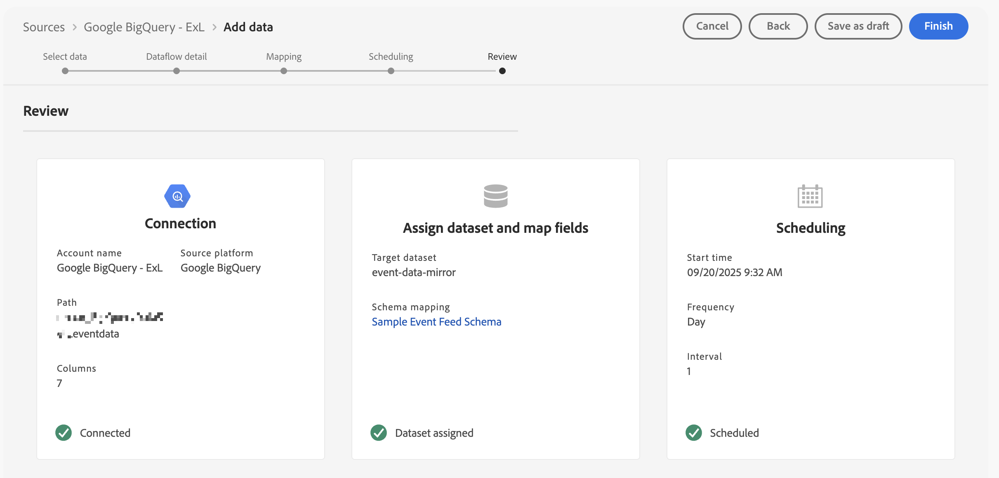

# Relationele gegevens spiegelen en gebruiken

{{release-limited-testing}}

Deze snelle begingids verklaart hoe te om [&#x200B; Experience Platform Data Mirror voor Customer Journey Analytics &#x200B;](data-mirror.md) te gebruiken om relationele gegevens van een inheemse oplossing van het gegevenspakhuis in Adobe Experience Platform te weerspiegelen. Gebruik die gegevens in Customer Journey Analytics.

Voor dit gebruiksgeval moet u:

* **Gebruik een inheemse oplossing van het gegevenspakhuis** om gegevens op te slaan die u in Experience Platform wilt weerspiegelen. Gebruik die gegevens in Customer Journey Analytics om te rapporteren en te analyseren.

* **opstelling een schema** in Experience Platform om het model (schema) van de gegevens te bepalen die u wilt spiegelen.

* **gebruik een bronschakelaar** in Experience Platform om uw weerspiegelde gegevens in een dataset te krijgen.

* **opstelling een verbinding** in Customer Journey Analytics. Deze verbinding zou (minstens) uw relationele dataset van Experience Platform moeten omvatten.

* **opstelling een gegevensmening** in Customer Journey Analytics om metriek en afmeting te bepalen die u in Analysis Workspace wilt gebruiken.

* **opstelling een project** in Customer Journey Analytics om uw rapporten en visualisaties te bouwen.

Experience Platform Data Mirror for Customer Journey Analytics vereist relationele schema&#39;s.


>[!NOTE]
>
>Deze snelstartgids is een vereenvoudigde gids voor het spiegelen van relationele gegevens in Adobe Experience Platform en het gebruik van die gegevens in Customer Journey Analytics. Het wordt ten zeerste aanbevolen de aanvullende informatie te bestuderen wanneer deze wordt vermeld.

{{relational-model-based}}

## Een native oplossing voor een gegevensopslagsysteem gebruiken

Deze snelle handleiding gebruikt [[!DNL Google BigQuery]](datawarehouse.md#google-bigquery) als de native oplossing voor het gegevensentrepot. Andere [&#x200B; gesteunde oplossingen &#x200B;](datawarehouse.md) zijn [[!DNL Snowflake]](datawarehouse.md#snowflake) en [[!DNL Azure Databricks]](datawarehouse.md#azure-databricks).

Binnen [!DNL Google BigQuery] worden de volgende voorbeeldgegevens opgeslagen en regelmatig bijgewerkt in een tabel met de naam **[!UICONTROL eventdata]** .

+++ Details van voorbeeldgebeurtenisgegevens

| tijdstempel | id | paginanaam | persoonlijk | trackingcode | orders | inkomstenbedrag |
| :---                      |  ---: | :---              | :---            | :---          |   ---: | :---           |
| 2025-03-06T19 :15: 39+00 :00 | 10001 | homepage | person-1abc123 | abc123 |        |                |
| 2025-03-06T19 :15: 39+00 :00 | 10002 | bevestigingspagina | person-1abc123 |               | 1 | 174,25 |
| 2025-03-06T19 :15: 39+00 :00 | 10003 | homepage | person-2def123 | def123 |        |                |
| 2025-03-06T19 :15: 39+00 :00 | 10004 | homepage | person-3ghi123 | ghi123 |        |                |
| 2025-03-06T19 :15: 39+00 :00 | 10005 | bevestigingspagina | person-3ghi123 |               | 1 | 149,25 |
| 2025-03-06T19 :15: 39+00 :00 | 10006 | homepage | person-4abc456 | abc456 |        |                |
| 2025-03-06T19 :15: 39+00 :00 | 10007 | homepage | person-5def456 | def456 |        |                |
| 2025-03-06T19 :15: 39+00 :00 | 10008 | homepage | person-6ghi456 | ghi456 |        |                |
| 2025-03-06T19 :15: 39+00 :00 | 10009 | bevestigingspagina | person-6ghi456 |               | 1 | 159,25 |
| 2025-03-06T19 :15: 39+00 :00 | 10010 | homepage | person-7abc789 | abc789 |        |                |
| 2025-03-06T19 :15: 39+00 :00 | 10011 | homepage | person-8def789 | def789 |        |                |
| 2025-03-06T19 :15: 39+00 :00 | 10012 | homepage | person-9ghi789 | ghi789 |        |                |
| 2025-03-06T19 :15: 39+00 :00 | 10013 | bevestigingspagina | person-9ghi789 |               | 1 | 124,25 |
| 2025-03-06T19 :15: 39+00 :00 | 10014 | homepage | person-10abc987 | abc987 |        |                |
| 2025-03-06T19 :15: 39+00 :00 | 10015 | homepage | person-11def987 | def987 |        |                |
| 2025-03-06T19 :15: 39+00 :00 | 10016 | homepage | person-12ghi987 | ghi987 |        |                |
| 2025-03-06T19 :15: 39+00 :00 | 10017 | homepage | person-13abc654 | abc654 |        |                |
| 2025-03-06T19 :15: 39+00 :00 | 10018 | homepage | person-14def654 | def654 |        |                |
| 2025-03-06T19 :15: 39+00 :00 | 10019 | homepage | person-15ghi654 | ghi654 |        |                |
| 2025-03-06T19 :15: 39+00 :00 | 10020 | bevestigingspagina | person-15ghi654 |               | 1 | 174,25 |

+++

De gegevens worden opgeslagen in een gegevensbestandlijst met een bijbehorend schema. De databasetabel inspecteren:

1. Meld u aan bij Google BigQuery.
1. Selecteer **[!UICONTROL BigQuery]** > **[!UICONTROL Studio]** .
1. Selecteer uw project, dataset en lijst. Op het tabblad **[!UICONTROL Schema]** ziet u een overzicht van het schema voor de gebeurtenisgegevens.

   

De gegevens inspecteren:

1. Selecteer **[!UICONTROL Query]**.
1. Voer een voorbeeldquery uit in de query-editor, waarbij `project` de naam van uw project is en `datasets` de naam van uw datasets:

   ```sql
   SELECT * FROM `project.datasets.eventdata` LIMIT 100
   ```

   

Voor Experience Platform Data Mirror for Customer Journey Analytics, moeten de lijsten in uw gegevenspakhuis inheemse oplossing voor veranderingsgeschiedenis worden toegelaten. Om te controleren dat de lijst voor veranderingsgeschiedenis wordt toegelaten:

1. Voer de volgende SQL-instructie in de query-editor uit om de instelling te controleren, waarbij `project` de naam van uw project is en `datasets` de naam van uw datasets.

   ```sql
   SELECT
      table_name,
      MAX(CASE WHEN option_name = 'enable_change_history' THEN option_value END) AS enable_change_history
   FROM `project.datasets.INFORMATION_SCHEMA.TABLE_OPTIONS`
   WHERE table_name = 'eventdata'
   GROUP BY table_name
   ORDER BY table_name;
   ```

1. Als het resultaat niet **[!UICONTROL TRUE]** is, gebruikt u de volgende SQL-instructie om de wijzigingshistorie in te schakelen, waarbij `project` de naam van uw project is en `datasets` de naam van uw datasets.

   ```sql
   ALTER TABLE `project.datasets.eventdata` 
   SET OPTIONS (enable_change_history = TRUE);
   ```

De gegevens in de lijst in uw gegevenspakhuis inheemse oplossing zijn klaar voor Experience Platform Data Mirror voor Customer Journey Analytics.


## Een schema instellen

Als u gegevens in Experience Platform wilt spiegelen, moet u eerst het schema voor de gegevens definiëren. Alle gegevens die u in Experience Platform wilt spiegelen en die Experience Platform Data Mirror voor Customer Journey Analytics gebruiken, moeten aan een relationeel schema voldoen.

Definieer een schema dat deze gegevens modelleert. Uw schema instellen:

1. Selecteer in de gebruikersinterface van Adobe Experience Platform de optie **[!UICONTROL Schemas]** within **[!UICONTROL Data Management]** in het linkerspoor.

1. Selecteer **[!UICONTROL Create schema]**.
1. Selecteer **[!UICONTROL Relational]** in het keuzemenu.
1. Als u een pop-up met de optie ziet tussen **[!UICONTROL Create manually]** of **[!UICONTROL Upload a DDL file]** te selecteren:
   1. Selecteer **[!UICONTROL select Create manually]**.

      

   1. Selecteer **[!UICONTROL Next]**.
1. In de interface **[!UICONTROL Schemas]** > **[!UICONTROL Create relational schema]** :
   1. Voer een **[!UICONTROL Schema display name]** in. Bijvoorbeeld: `Sample Event Feed Schema` .
   1. Voer een **[!UICONTROL Description]** in. Bijvoorbeeld: `Sample event feed schema for a relational schema` .
   1. Selecteer **[!UICONTROL Time series]** als de **[!UICONTROL Schema behavior]** . U selecteert **[!UICONTROL Time series]** voor op tijdreeksen gebaseerde gegevens en **[!UICONTROL Record]** voor op records gebaseerde gegevens. Het gedrag bepaalt de structuur van het schema en de eigenschappen die inbegrepen zijn.

      Experience Platform Data Mirror for Customer Journey Analytics wordt meestal gebruikt voor tijdreeksgegevens (bijvoorbeeld gebeurtenisgegevens).

      

   1. Selecteer **[!UICONTROL Finish]**.

1. In de interface **[!UICONTROL Schemas]** > **[!UICONTROL Sample Event Feed Schema]** ziet u een waarschuwing dat relationele schema&#39;s inname als veranderingsrijen ondersteunen.

   

   Ingestie als veranderingsrijen is ook genoemd geworden verandering gegevensvangst (CDC). Voor ondersteuning van het vastleggen van wijzigingsgegevens is het schema vereist:

   * Primaire sleutel.
   * Versiebeschrijving.
   * Tijdstempelbeschrijving voor tijdreeksgegevens.

1. Selecteer  naast **[!UICONTROL Sample Event Feed Schema]** beginnen om gebieden aan het schema toe te voegen. Voeg de volgende velden met het gegevenstype en aanvullende kenmerken toe aan het schema.

   | Veldnaam | Weergavenaam | Type | Aanvullende kenmerken |
   |---|---|---|---|
   | `id` | `Id` | **[!UICONTROL Integer]** |  de beschrijver van de Versie |
   | `orders` | `Orders` | **[!UICONTROL Integer]** | |
   | `pagename` | `Page Name` | **[!UICONTROL String]** | |
   | `personid` | `Person Id` | **[!UICONTROL String]** |  SelectBox <br/> Uitgezochte CRMID voor Identiteitsnaamruimte.<br/> |
   | `revenueamount` | `Revenue Amount` | **[!UICONTROL Double]** | |
   | `timestamp` | `Timestamp` | **[!UICONTROL DateTime]** |  de beschrijver van de tijdstempel |
   | `trackingcode` | `Tracking Code` | **[!UICONTROL String]** | |


   * Het veld **[!UICONTROL id]** is geconfigureerd als **[!UICONTROL Version descriptor]** .

     

   * Het veld **[!UICONTROL personid]** wordt geconfigureerd, samen met **[!UICONTROL timestamp]** als **[!UICONTROL Primary key]** . Selecteer  **[!UICONTROL Create composite primary key]** om een samengestelde sleutel tot stand te brengen.

     

     Het veld **[!UICONTROL personid]** wordt ook geconfigureerd als een **[!UICONTROL Identity]** , met **[!UICONTROL CRMID]** als de **[!UICONTROL Identity namespace]** .

     

   * Het veld **[!UICONTROL timestamp]** wordt geconfigureerd, samen met het veld **[!UICONTROL personid]** als **[!UICONTROL Primary key]** . Het veld **[!UICONTROL timestamp]** wordt ook geconfigureerd als **[!UICONTROL Timestamp descriptor]** . U hoeft een veld alleen als **[!UICONTROL Timestamp descriptor]** te definiëren voor relationele gegevens van tijdreeksen.

     


   Als u **[!UICONTROL Primary key]** , **[!UICONTROL Version descriptor]** en **[!UICONTROL Timestamp descriptor]** correct hebt gedefinieerd, verdwijnt de waarschuwing boven op de schemadefinitie.

1. Selecteer **[!UICONTROL Save]** om het schema op te slaan.


## Een bronaansluiting gebruiken

U gebruikt een bronschakelaar om de gegevens pakhuis inheemse oplossing aan Experience Platform aan te sluiten.

In de Experience Platform-interface:

1. Selecteer **[!UICONTROL Sources]**.
1. Selecteer of zoek naar **[!UICONTROL Google BigQuery]** .
1. Selecteer **[!UICONTROL Add data]**.

De wizard Gegevens toevoegen begeleidt u door de volgende stappen om de gegevens van de tabel in [!DNL Google BigQuery] te verbinden met Experience Platform.

### Verificatie

Selecteer in de stap **[!UICONTROL Authentication]** :

* **[!UICONTROL Existing account]** als u al een account hebt ingesteld voor Google BigQuery. Ga aan de [&#x200B; Uitgezochte gegevens &#x200B;](#select-data) stap verder.
* **[!UICONTROL New account]** wanneer u verbinding moet maken met Google BigQuery.
   1. Geef een **[!UICONTROL Account name]** en (optioneel) **[!UICONTROL Description]** op.
   1. Selecteer uw **[!UICONTROL Authentication type]**: **[!UICONTROL Basic Authentication]** of **[!UICONTROL Service Authentication]** . Geef de vereiste invoer op op basis van uw selectie.
   1. Selecteren **[!UICONTROL Connect to source]**

      

      Uw verbinding is geverifieerd. A  **[!UICONTROL Connected]** wees op een succesvolle verbinding.

   1. Selecteer **[!UICONTROL Next]**.

  Zie de documentatie van Experience Platform voor details op om te verbinden en voor authentiek te verklaren wanneer u [&#x200B; Azure Databricks &#x200B;](https://experienceleague.adobe.com/en/docs/experience-platform/sources/connectors/databases/databricks) of [&#x200B; Snowflake &#x200B;](https://experienceleague.adobe.com/en/docs/experience-platform/sources/connectors/databases/snowflake) schakelaar gebruikt.


### Gegevens selecteren

In de stap **[!UICONTROL Select data]** :

1. Selecteer de tabel in de lijst met tabellen. Bijvoorbeeld: **[!UICONTROL eventdata]** .

   

   U ziet een voorbeeld van de gegevens die ter verificatie worden weergegeven.

1. Selecteer **[!UICONTROL Next]** om door te gaan.


### Gegevens

In de stap **[!UICONTROL Dataflow detail]** :

1. Selecteer **[!UICONTROL Enable change data capture]** . Er wordt een informatievak van het type **[!UICONTROL Change data capture requirement]** weergegeven met meer informatie.
1. Selecteer **[!UICONTROL New dataset]** voor **[!UICONTROL Target dataset]** om een nieuwe dataset te maken die de gespiegelde gegevens bevat.
1. Voer een **[!UICONTROL Output dataset name]** in. Bijvoorbeeld: `event-data-mirror` .
1. Selecteer het relationele schema dat u eerder van het **[!UICONTROL Schema]** drop-down menu creeerde. Bijvoorbeeld: **[!UICONTROL Sample Event Feed Schema]** .

   

1. Geef andere details op.
1. Selecteer **[!UICONTROL Next]**.


### Toewijzing

In de stap **[!UICONTROL Mapping]** :

1. Wijs de velden toe. Van het schema in Google BigQuery (**[!UICONTROL Source data]**) aan de gebieden in het schema die u in Experience Platform (**[!UICONTROL Target fields]**) hebt bepaald.

   

1. Als alle velden correct zijn toegewezen, selecteert u **[!UICONTROL Next]** om door te gaan.


### Planning

In de stap **[!UICONTROL Scheduling]** :

1. Geef op **[!UICONTROL Frequency]** en **[!UICONTROL Interval]** om de synchronisatie van de gespiegelde gegevens te plannen.
1. Geef de **[!UICONTROL Start time]** voor het schema op.

   

1. Selecteer **[!UICONTROL Next]** om door te gaan.


### Controleren

In de stap **[!UICONTROL Review]** .

1. Herzie de configuratie voor de bronschakelaar.

   

1. Selecteer **[!UICONTROL Finish]** . U wordt geleid aan gevormde dataflow.

   


## Een verbinding instellen

In deze handleiding voor snel starten maakt u een nieuwe verbinding om de gespiegelde gegevens van Experience Platform te gebruiken. U kunt ook de gespiegelde gegevens toevoegen aan een bestaande verbinding.

In de Customer Journey Analytics-interface:

1. Selecteer **[!UICONTROL Connections]** in het menu **[!UICONTROL Data Management]** .
1. Selecteer **[!UICONTROL Create new connection]**.
1. Geef de vereiste **[!UICONTROL Connection name]** -, **[!UICONTROL Sandbox]** - **[!UICONTROL Average number of daily evens]** en andere optionele parameters op.
1. Selecteer **[!UICONTROL Add datasets]**.

   1. In de **[!UICONTROL Select datasets]** -stap van **[!UICONTROL Add datasets]** :

      1. Selecteer de dataset die de gespiegelde gegevens bevat. Bijvoorbeeld: **[!UICONTROL event-data-mirror]** . De dataset heeft **[!UICONTROL Relational]** als **[!UICONTROL Dataset type]**.

          toe

      1. Voeg om het even welke extra datasets toe die voor de verbinding relevant zijn.
      1. Selecteer **[!UICONTROL Next]**.

   1. In de **[!UICONTROL Dataset settings]** -stap van **[!UICONTROL Add datasets]** :

      Voor de **[!UICONTROL event-data-mirror]** relationele dataset

      1. Selecteer **[!UICONTROL Event]** als de **[!UICONTROL Dataset type]** .
      1. Selecteer het veld **[!UICONTROL PersonId]** als **[!UICONTROL Person ID]** .
      1. **[!UICONTROL Timestamp]** wordt automatisch ingevuld als de **[!UICONTROL Timestamp]** .
      1. Selecteer **[!UICONTROL Other]** als de **[!UICONTROL Data source type]** .
      1. Voer `Google BigQuery Event Data` in als de **[!UICONTROL Data source description]** .
      1. Geef andere details op, zoals **[!UICONTROL Import all new data]** en **[!UICONTROL Backfill all existing data]** .

         

      Naar keuze, specificeer details voor andere datasets.

   1. Selecteer **[!UICONTROL Add datasets]**.
1. Selecteer **[!UICONTROL Save]**.

Nadat u a [&#x200B; verbinding &#x200B;](/help/connections/overview.md) creeert, kunt u diverse beheerstaken uitvoeren. Zoals [&#x200B; het selecteren en het combineren van datasets &#x200B;](/help/connections/combined-dataset.md), [&#x200B; het controleren van het statuut van de datasets van een verbinding en het statuut van gegevensopname &#x200B;](/help/connections/manage-connections.md), en meer.


## Een gegevensweergave instellen

Uw gegevensweergave maken:

1. Selecteer in de Customer Journey Analytics-interface **[!UICONTROL Data views]** (optioneel in **[!UICONTROL Data management]** ) in het bovenste menu.

2. Selecteer **[!UICONTROL Create new data view]**.

3. In de stap **[!UICONTROL Configure]** :

   1. Selecteer de verbinding in de lijst **[!UICONTROL Connection]** .

   1. Naam en (optioneel) beschrijf uw verbinding.

   1. Selecteer **[!UICONTROL Save and continue]**.

4. In de stap **[!UICONTROL Components]** :

   1. Voeg schemagebieden en/of standaardcomponent toe die u aan de **[!UICONTROL METRICS]** of **[!UICONTROL DIMENSIONS]** componentenvakjes wilt omvatten. Zorg ervoor dat u relevante velden uit de gegevensset toevoegt die de gespiegelde gegevens bevat. U kunt als volgt toegang krijgen tot deze velden:

      1. Selecteer **[!UICONTROL Event datasets]**.
      1. Selecteer **[!UICONTROL Adhoc & Relational fields]**.
      1. Sleep velden van de relationele schema&#39;s naar **[!UICONTROL METRICS]** of **[!UICONTROL DIMENSIONS]** .

          toe

   1. Definieer afgeleide velden voor velden die niet het juiste type hebben, die niet de juiste indeling hebben of die u om andere redenen wilt wijzigen. Bijvoorbeeld voor **[!UICONTROL Revenue Amount]** .

      1. Selecteren **[!UICONTROL Create derived field.]**
      1. In de afgeleide gebiedsredacteur:
         1. Definieer een nieuw `Revenue Amount (Numeric)` veld, zoals hieronder.

            

         1. Selecteer **[!UICONTROL Save]**.
      1. Sleep het nieuwe, van **[!UICONTROL Revenue Amount (Numeric)]** afgeleide veld en zet het veld neer in **[!UICONTROL METRICS]** .

         

   1. Selecteer **[!UICONTROL Save and continue]**.

5. In de stap **[!UICONTROL Settings]** :

   Laat de instellingen ongewijzigd en selecteer **[!UICONTROL Save and finish]** .

Zie [&#x200B; overzicht van de meningen van Gegevens &#x200B;](../data-views/data-views.md) voor meer informatie over om een gegevensmening tot stand te brengen en uit te geven. En welke componenten beschikbaar voor u in uw gegevensmening en hoe te om segment en zittingsmontages te gebruiken zijn.


## Een project instellen

Analysis Workspace is een flexibel browserprogramma waarmee u snel analyses kunt maken en inzichten kunt delen op basis van uw gegevens. U gebruikt de projecten van Workspace om gegevenscomponenten, lijsten, en visualisaties te combineren om uw analyse te bundelen en met iedereen in uw organisatie te delen.

Uw project maken:

1. Selecteer in de Customer Journey Analytics-interface **[!UICONTROL Workspace]** in het bovenste menu.

2. Selecteer **[!UICONTROL Projects]** in de linkernavigatie.

3. Selecteer **[!UICONTROL Create project]** . In de pop-up:


   1. Selecteer **[!UICONTROL Blank Workspace project]**.

   1. Selecteer **[!UICONTROL Create]**.


4. In de **[!UICONTROL New project]** werkruimte, zorg ervoor dat uw [&#x200B; gegevensmening &#x200B;](#set-up-a-data-view) wordt geselecteerd. Die gegevensmening verbindt met de [&#x200B; verbinding &#x200B;](#set-up-a-connection) die de weerspiegelde gegevens bevat.

5. Als u het eerste rapport wilt maken, sleept u de afmetingen en maatstaven naar het deelvenster **[!UICONTROL Freeform table]** in het deelvenster **[!UICONTROL Freeform]** . Bijvoorbeeld, sleep **[!UICONTROL Revenue Amount (Numeric)]** op **[!UICONTROL _Sleep metrisch hier_]**. En sleep **[!UICONTROL PersonId]** en zet het veld neer op de eerste kolomkop. Breng desgewenst nog andere aanpassingen aan.

   Het uiteindelijke resultaat is een overzicht van profielen en hun opbrengsten op basis van gespiegelde gegevens die afkomstig zijn uit een Google BigQuery-tabel.

   

Zie [&#x200B; overzicht van Analysis Workspace &#x200B;](../analysis-workspace/home.md) voor meer informatie over hoe te om projecten tot stand te brengen en uw analyse te bouwen gebruikend componenten, visualisaties, en panelen.

>[!SUCCESS]
>
>U hebt alle stappen uitgevoerd. U begon door te bepalen welke weerspiegelde gegevens u (schema) van een gegevenspakhuis inheemse oplossing wilde verzamelen. En waar te om die gegevens (dataset) in Experience Platform op te slaan. U vormde de aangewezen bronschakelaar om u van de weerspiegelde gegevens in Experience Platform te voorzien. U hebt een verbinding in Customer Journey Analytics gedefinieerd voor het gebruik van de gespiegelde gebeurtenisgegevens en (optioneel) andere gegevens. Met de definitie van de gegevensweergave kunt u opgeven welke afmetingen en metriek u wilt gebruiken voor de gespiegelde gegevens. En tenslotte creeerde u uw eerste project visualiserend en analyserend uw weerspiegelde gegevens.
